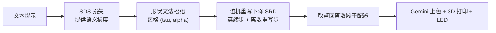

## 一句话总结

Diceplay 用一格格相同的"骰子"拼出低分辨率的抽象图案，并提出一套基于形状文法的连续松弛方法，让文本提示能通过 SDS 损失梯度优化出可辨认、可实体制作的图像。

## 研究背景

- 领域现状：艺术与设计中常用"受限的视觉词汇 + 网格化模块组合"来做抽象表达（如包豪斯风格）。计算设计与制造领域也有大量把目标形状约束到乐高、Zometool、激光切割件等预定义模块的工作，但它们大多追求"尽量逼近目标形状"，而非在刻意抽象的媒介里重新诠释一个高层概念。
- 核心痛点：作者提出把这种模块化画布实体化为一组相同的骰子（每个骰子六面各一个几何图元，共 15 种带旋转的图案）。这种媒介可复用、可重构，但设计极难——图像要在极低分辨率、极受限词汇下表达，手工翻单个骰子会带来突兀的全局变化。要自动化，则面临两大难题:(1) 目标函数难定义,像素误差抓不住可辨认的显著特征,CLIP 分数又和人的抽象质量感知不一致;(2) 设计空间纯离散,5×5 网格就有约 $$2.5 \times 10^{29}$$ 种配置,标准梯度优化无从下手。
- 本文 idea：用 Score Distillation Sampling（SDS）损失提供朝向文本的梯度，并把离散的 Diceplay 空间松弛成一个连续可微的形状文法。关键在于插值发生在"图案边界"而非像素值上，且相邻格子之间通过文法的产生式规则协调过渡，从而把优化地形塑造得接近矢量图形那样平滑。

## 方法

整体框架：给定文本提示，系统在一个 $$N \times M$$ 网格（默认 5×5）上为每个格子选一个骰子图案，目标是让整体与提示的语义距离最小。做法是把纯离散的配置空间用一套参数化形状文法松弛成连续的 $$(\tau, \alpha)$$ 表示，再用 SDS 损失和随机重写下降（SRD）交替做连续梯度步与离散重写步，最后把参数取整回合法的离散骰子配置。

关键设计：

- 瓦片家族（Tile Families）：不像 DeepSDF 那样在全部 15 个图案间同时插值，而是定义一组单参数家族，每个家族只在至多三个"兼容"的图案子集之间做插值。每个家族 $$\tau$$ 是映射 $$\tau: \Theta_\tau \to S$$，在 $$\alpha = 0$$ 时恢复原始瓦片，$$\alpha$$ 趋向 $$-1$$ 或 $$1$$ 时平滑过渡到邻近瓦片（例如 TR0 家族在 $$\alpha=-1,0,1$$ 处分别是 ip0、tr0、pi0）。这保证收敛在整数边界时能映射回合法的离散配置。插值是对边界（形状轮廓）做平滑同伦，而非像素值混合，从而避免了软混合产生的不连贯中间态。

- 边界感知的产生式规则：把设计空间写成参数化形状文法 $$G = (T, P, S, \Theta)$$。当某家族参数 $$\alpha$$ 逼近边界值（阈值 $$\delta = 0.15$$）时，产生式规则把当前家族改写为邻近家族并重置 $$\alpha$$，保持视觉连续。对 IP、TR、PI、H 家族，规则只依赖局部 $$\alpha$$；而纯色的 W、B 家族需要特殊处理——是否能过渡取决于四个邻居格子的边界"黑白性"（共 $$2^4=16$$ 种边缘条件），为此引入 WL、BL、WI、BI、WH、BH 等过渡家族。整套字母表含 33 个瓦片家族。这套机制让文法只允许保持网格间边界一致的过渡，倾向保拓扑的改动。

- 优化与可微渲染：在文法下，松弛配置是映射 $$\tilde{C}: A \to T \times \Theta$$，为每格分配一个 $$(\tau, \alpha)$$。用 SDS 损失加上逐渐退火的 L1 正则项（推动参数趋向整数边界、促进稀疏）进行优化。SRD 在离散步会采样当前可用的产生式规则、按"改进量"（去噪分数差）排序，并贪心地一次性应用所有互不冲突的重写，比每步只用一条规则快得多。所谓"非冲突"，是指用于满足约束的那些边在所有规则应用后保持不变。为了对 $$\Theta$$ 可微，瓦片图案用有符号距离场（SDF）表示，家族实现为控制点随 $$\alpha$$ 插值的二次贝塞尔曲线，再用软光栅化生成图像。

- 制作与端到端系统：实体画布由 25 个相同立方骰子和一个 5×5 托盘组成，均可 3D 打印（负空间用白色 PLA、正空间用半透明 PETG），托盘内衬可编程 RGB LED 灯带即可加入颜色。因为 b 和 pi 图元会挡光，每格至少需要两个对置 LED，且骰子上图元排布要让 b、pi 与 w、ip 相对。黑白配置优化完后，用 Gemini（flash-3-preview）在只改颜色的约束下上色，并配有基于同一文法抽象的交互式编辑界面，整套成本约 50 美元。

## 实验结果

作者在 33 个文本提示（取自儿童抽象视觉游戏常见主题）上评估，固定 5×5 网格，A100 上优化，每个提示跑 9 次随机运行取最佳。主要对比是一项 32 人的感知用户研究：每个提示让参与者从 27 个候选（9 次运行 × 3 方法）中选出最能代表提示的 3 张。

| 方法 | 总得票占比 | 至少入选一次的提示占比 (5×5) |
|------|------|------|
| 本文（文法 + SDS） | 73% | 91% |
| 模拟退火 + CLIP | 18% | 33% |
| Gumbel-Softmax | 9% | 22% |

其余结论用文字补充：Softmax / Gumbel-Softmax 这类标准连续松弛在高分辨率下可行，但在 5×5 的极粗网格里陷入噪声局部极小、无法收敛出可辨认形状；DeepSDF 插值比像素混合好、能看出轮廓，但因各格独立优化而背景噪声多。用户研究还通过 OLS 回归发现 CLIP 分数与人类投票几乎无关（$$R^2 = 0.013$$），佐证了 CLIP 不适合当本问题的目标。实体方面，一名 4 岁儿童能在 4-8 分钟内照卡片拼出目标形状。

## 亮点与局限

- 亮点：
  - 提出一种新颖的实体抽象媒介（骰子网格 + LED），可复用、可重构、成本低（约 50 美元），并首次做出针对它的计算设计系统。
  - 核心方法有普适价值：通过精心设计的形状文法，把高度离散的组合设计空间变得适合梯度优化，在极低分辨率这一标准松弛全面失效的区间里依然有效。
  - 边界级插值 + 边界感知产生式规则的组合，兼顾了单格平滑与跨格一致性；用户研究数据支撑度较强。

- 局限：
  - 当有高质量图像初始化时，Gumbel-Softmax 有时反而更强，因为本文方法会刻意"跳出"初始图像去探索；对目标只占部分网格的情况尤其明显。
  - 对本身就很几何、有明显拼法的形状（如"房子""圣诞树"）不易收敛，此时直接用 LLM 提示反而更好。
  - 计算开销大：SDS 优化需数百次扩散模型评估，单个设计在 A100 上约 15-20 分钟，难以做到实时交互。

## 延伸思考

方法层面把"离散组合设计 → 可微形状文法松弛"这条路走通了，思路可迁移到其他清晰可插值的几何图元集，但目前文法是为这套图元手工设计的，推广需要手动扩展或自动化构造。作者设想的几个方向都挺有意思：允许多种不同图元的骰子来扩充视觉词汇（需引入唯一性与分配约束）；为特定应用（如已知目标集合的策展/氛围显示）联合优化图元与内容；以及给骰子各面加磁铁做三维体积组装，进而优化 3D 稀疏结构（会带来多视角与 3D 抽象评估的新挑战）。另一个务实的追问是如何把这套慢优化蒸馏成前馈网络或快速搜索策略，以支持"移动一个骰子、系统即时补全"的实时交互体验。
