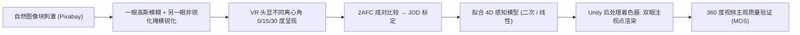

## 一句话总结

给左右眼分别施加"模糊"与"锐化"的非对称处理，利用大脑双眼融合时"更清晰的一眼主导"的特性，在几乎不损失感知质量的前提下把 VR 注视点渲染的采样量再砍掉约一半。

## 研究背景

- 领域现状：立体显示（如 VR 头显）给两眼分别送图。视觉心理物理学早已发现，当两眼收到的图像清晰度不一致时，融合后的感知往往由更清晰的那只眼主导（即"双眼模糊抑制"）；也有工作通过双眼差异来提升对比度或深度感。注视点渲染（foveated rendering）则利用视觉敏锐度随离心角衰减的特性，越往视野外围渲染得越粗来省算力。
- 核心痛点：以往的双眼差异研究和双眼渲染都没有系统考察"模糊与锐化在两眼间的交互如何随视野位置（离心角）变化"。也就是说，缺一个能把"模糊量、锐化量、离心角"映射到"感知质量"的定量模型，无法指导实际渲染。
- 本文 idea：提出 dichoptic foveation（双眼注视点化）——一只眼加高斯模糊、另一只眼同时加锐化，并研究这种非对称处理的可容忍程度如何随离心角变化。通过大规模心理物理实验拟合出一个 4D 感知模型，再用它去优化注视点渲染。

## 方法

整体框架：先用心理物理实验采集"双眼模糊-锐化"刺激在不同离心角下的感知质量数据，把成对比较结果标定到 JOD（just-objectionable-difference，恰可觉察差异）尺度上；然后拟合一个以模糊量、锐化量、离心角为输入、以感知质量为输出的解析模型；最后把模型接进 Unity 的后处理着色器，驱动一套双眼注视点渲染系统并做主观质量验证。

关键设计：

1. 模糊与锐化的参数化。模糊用标准差为 $$\sigma$$ 的高斯核卷积：$$I_{\text{blur}} = G_\sigma * I$$；锐化用非锐化掩模，把高频残差按增益 $$\phi$$ 加回原图：$$I_{\text{sharp}} = I + \phi \cdot (I - G_\sigma * I)$$。两个操作刻意共用同一个 $$\sigma$$，使锐化恰好补偿被模糊抑制掉的频段（因非锐化掩模并非模糊的严格逆运算，这种"抵消"只是近似）。

2. 心理物理实验设计。刺激为 12 个不同频率内容的自然图像块，呈现在 Meta Quest Pro 上、离心角为 0°/15°/30° 三档。两次预实验先用"调整法"框定合理参数范围（$$\sigma, \phi \in [0, 2.5]$$），再用 2AFC 确定五档在感知上近似等距的模糊/锐化取值。正式实验 31 名被试、每人 419 个 trial、共 12,989 个 trial，用 ASAP 主动采样策略压缩比较次数，把成对偏好用 Thurstone Case V 标定成 JOD。方差分析显示模糊、锐化、离心角三者主效应都显著，且离心角与模糊/锐化存在显著交互——印证了敏感度随离心角衰减。

3. 4D 感知模型。以 $$\sigma, \phi, \theta$$（离心角）为输入拟合 JOD，比较了线性、带交互线性、指数、二次四种形式。二次模型拟合最好（$$R^2 = 0.82$$），用于插值；线性模型（$$R^2 = 0.65$$）虽然拟合略差，但外推更稳、且目标面是平面无局部极小，便于解析求解，因此实际渲染时用它。

4. 应用于注视点渲染。核心策略是"尽量放大模糊 $$\sigma$$"（模糊直接决定采样量的下降，而锐化是 $$O(1)$$ 常数开销可忽略）。中央凹处敏锐度高、且要防止双眼竞争，因此给最高锐化增益（$$\phi = 0.89$$）来把所需模糊压到最低；外围则可降低锐化、换取更大模糊。锐化只作用在经典注视点渲染保留下来的低通信息上，因此双眼渲染的开销永远不超过普通注视点渲染。

## 实验结果

主验证实验：14 名被试对 10 段 7680×3840 的 360° 立体视频自由探索观看，用 5 点 Likert 量表评分并标定成 MOS（越高越好）。对比参考全分辨率、标准注视点渲染、以及双眼注视点渲染的恒定/动态锐化两种配置。重复测量 ANOVA 显著（$$p < 0.0001$$），事后配对检验（Bonferroni 校正）表明：只有"恒定锐化"这一档与参考有显著差异，动态锐化和标准注视点渲染都与参考无显著差异。

| 渲染方式 | MOS↑ | 与参考差异 | 算力收益 |
|------|------|------|------|
| 参考（全分辨率） | 3.66 | — | 基准 |
| 标准注视点渲染 | 3.26 | 不显著 | 基准注视点 |
| 双眼注视点（动态锐化） | 3.26 | 不显著 | 约为注视点渲染的一半采样 |
| 双眼注视点（恒定锐化） | 3.16 | 显著 ($$p = 0.015$$) | 约为注视点渲染的一半采样 |

算力收益方面，作者用与硬件无关的采样密度框架估算：由模糊核推出采样间距 $$\Delta x = \pi\sigma$$、二维采样密度 $$\rho = 1 / (\pi\sigma)^2$$，再沿视野球面积分聚合。对实验所用 VR 头显，双眼注视点相对标准注视点渲染的采样比约为 1.9，即只需约一半采样即可维持同等感知质量；对 FOV 更小的 AR 显示，理论收益可达约 11×。此外还做了"无眼动追踪"消融：把中央凹参数均匀铺满全画面，理论采样量相对原生分辨率降低约 97%，并且当模糊施加在左眼时其质量与参考无显著差异（右眼被模糊时则显著变差，疑与约 70% 人群右眼主导有关）。

## 亮点与局限

- 亮点：
  - 提出并形式化了 dichoptic foveation 这一新范式，把"双眼模糊抑制"从定性观察推进到可参数化的 4D 感知模型，且模型简洁可解释、可解析求解。
  - 数据规模扎实（12,989 个 trial），并从图像块刺激泛化到全屏动态 360° 视频，验证了模型的实用性。
  - 与现有注视点渲染框架互补而非替代，锐化仅作用于低通残差、开销可忽略，落地成本低；在 AR 等小 FOV 场景潜在收益更大。

- 局限：
  - 模型基于全体被试的平均 JOD，未针对个体差异或眼主导性做校准，敏感个体可能出现质量下降甚至双眼竞争。
  - 算力收益是系统无关的理论估算，未在真实光追系统上实测；双眼融合只在两眼视野重叠区有效，超高 FOV 头显的单眼外围区享受不到收益。
  - 未评估长期使用的眼疲劳、竞争等舒适度问题；实验受商用头显的眼动延迟、分辨率、光学畸变等因素制约。

## 延伸思考

这项工作把"感知冗余"从单眼注视点渲染延伸到双眼维度，思路上与差异化压缩/差异化色调映射等"给两眼送不同信息"的方向一脉相承。消融中暴露的眼主导性效应值得深挖：一个眼主导感知的渲染策略（把清晰信号固定送给主导眼）可能进一步提升质量或收益。此外，模型目前只覆盖模糊、锐化、离心角三个维度，若纳入对比度、颜色、时域（如变化盲视）等交互，或结合实时立体传输的带宽压缩，双眼注视点化在 AR/VR 的能耗与算力优化上还有可观空间。
