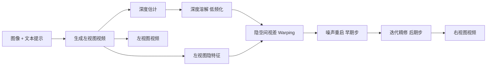

## 一句话总结

DissolveStereo 借助预训练视频扩散模型的先验，在无需成对立体数据训练的前提下，从单张图像加文本提示零样本生成时空一致的立体（左右视图）视频。

## 研究背景

- 领域现状：VR 头显普及催生了对立体视频的旺盛需求，但真实立体视频稀缺。图像/视频扩散模型的发展让"生成"成为可能，此前 StereoDiffusion 展示了零样本立体图像生成的潜力。
- 核心痛点：把立体图像转换技术扩展到视频时，既要在左右视图间维持视差与深度一致（视图间一致性），又要保证跨帧的时间连贯。已有视频深度估计虽能提供时间一致的深度，却缺乏在扩散过程中动态调整深度的机制；而"先生成视频再逐帧转立体"的两段式做法在像素级 warping 中易产生鬼影、锯齿、遮挡填充瑕疵，且难以保证时间连贯。零样本立体视频生成此前几乎无人涉足。
- 本文 idea：不做像素级的"生成 + 转换"两段拼接，而是在视频扩散模型的**隐空间**里做更强耦合的一致性精修。关键洞察是：隐空间 warping 更依赖粗略几何而非精细深度，因此提出"溶解深度图"只保留低频结构深度，再配合噪声重启与迭代精修，让左右视图隐空间逐步协调。

## 方法

整体框架分两步：先用视频扩散模型生成源（左）视图视频，并用深度估计模型得到其深度图；随后把深度图"溶解"为低频表示，据此在隐空间做视差 warping，把左视图隐特征扭曲成目标（右）视图，遮挡区域再通过噪声重启（早期采样步）与迭代精修（后期采样步）逐步补齐并协调，全程用跨视图注意力对齐两视图。

关键设计：

1. **溶解深度图（Dissolved Depth）**：作者发现扩散隐空间主要承载低频结构信息（约 $$t=25$$ 之前几乎看不到显著结构），高频深度细节（尤其深度图里的锐利边缘）在隐空间 warping 时反而破坏时间连贯、引入鬼影与阶梯状伪影。于是借助扩散式深度估计模型充当低通滤波器：取最终扩散步的深度隐 $$x_T$$，只做**单步**反向扩散近似初始态 $$\hat{x}_{t\to 0} = \sqrt{\tfrac{1}{\bar{\alpha}_t}}\, x - \sqrt{\tfrac{1}{\bar{\alpha}_t}-1}\, \epsilon_\theta(x,t)$$ ，从而抑制高频、只保留全局结构。溶解强度可调（$$t$$ 越大越强），简单场景用强溶解、复杂细纹理场景用弱溶解。

2. **噪声重启（Noisy Restart）**：在早期若干采样步（实现中 $$K=\{49,\dots,45\}$$）迭代 $$L$$ 次（用 $$L=7$$），把右视图采样替换为 warp 过来的左视图隐特征，遮挡/去遮挡空洞用加噪的非 warp 左视图隐特征填充。为保证跨迭代一致，预先固定噪声张量 $$\epsilon'_t$$ 并复用同一随机种子，按 $$x_{t-1} = x_t\,(1-\alpha_t) + \sigma_t \epsilon'_t \alpha_t$$ 加权注入噪声。迭代越多立体效果越强。此外用边界清理函数 $$L_{r,\text{refined}} = L_r(1-M_{\text{border}}) + L_l M_{\text{border}}$$ 把右视图右侧空白列用左视图内容填补，去掉边缘突兀伪影。

3. **迭代精修（Iterative Refinement）**：把噪声重启限制在最影响立体效果的早期步以省算力；后期在特定扩散步对遮挡区域重复去噪 $$N$$ 次（用 $$N=4$$），按 $$x^{j}_t = (1-M)\,x^{(j-1)}_t + M\,\epsilon_\theta(x^{(j-1)}_t)$$ 更新（$$M$$ 为遮挡掩码），利用视频扩散先验补齐遮挡细节。跨视图注意力用左视图 query 去关注右视图的 key/value：$$F_{R\to L} = \mathrm{softmax}\!\left(\tfrac{Q_L K_R^\top}{\sqrt{d}}\right) V_R$$ 。

实现基于 DynamiCrafter，深度用 DepthCrafter 推断；相比逐步都要 warping 的并发工作 SVG，本方法约快 3 倍。

## 实验结果

由于立体生成任务没有真值右视图，无法直接算视差/深度误差，评测聚焦语义一致性（CLIP-F，源视图与生成视图一致性）与多视图极线一致性（MEt3R）。主基准在 40 段 DynamiCrafter 生成的多样视频上对比：

| 方法 | CLIP-F ↑ | MEt3R ↓ |
|------|----------|---------|
| Ours | 97.16 | 4.95 |
| TrajectoryCrafter* | 97.43 | 6.21 |
| ImmersePro | 96.99 | 5.69 |
| StereoCrafter | 93.59 | 5.61 |
| SVG | 96.76 | 5.96 |
| StereoDiffusion | 91.09 | 6.09 |
| ProPainter | 96.45 | 8.82 |

本方法在极线一致性 MEt3R 上取得最佳，较此前最优约提升 $$11.7\%$$ ，且在不降低视频分辨率的情况下达成（低分辨率转换方法虽 MEt3R 尚可，但丢失细节）。29 人单盲用户研究（Meta Quest 3 头显、5 分制）中，本方法在画面质量（4.05）、时间连贯（3.96）、整体舒适度（3.98）三项均居首，立体效果（3.79）与 TrajectoryCrafter 并列领先；相较此前方法感知画面质量高约 8.0%、时间连贯高约 10.9%。消融显示：溶解深度显著减少鬼影与锯齿，且相比单纯下采样深度能在保留分辨率的同时获得可比甚至更好的一致性。

## 亮点与局限

- 亮点：
  - 首个面向零样本立体视频生成的框架，无需成对立体数据训练或微调，直接复用视频扩散先验。
  - "溶解深度图"的洞察新颖且实用——隐空间 warping 要粗几何不要精深度，用扩散模型自身当低通滤波器优雅地实现低频化。
  - 噪声重启 + 迭代精修分阶段处理遮挡，兼顾立体强度与算力，比逐步 warping 的方案快约 3 倍。

- 局限：
  - 面向极线约束的立体（左右视图）生成，并非任意视角合成，适用范围相对受限。
  - 溶解强度需按场景复杂度手工调节，缺乏自动选择机制。
  - 缺少真值右视图，评测只能依赖 CLIP-F / MEt3R 等间接指标与主观用户研究；用户研究中仍有个别参与者报告轻微 3D 眩晕。

## 延伸思考

- 方法高度依赖底层视频扩散模型（DynamiCrafter）与深度估计（DepthCrafter）的质量与先验，随着更强视频生成模型出现，该隐空间精修范式或可即插即用地升级。
- "低频几何足以驱动隐空间 warping"的观察，可能对其他隐空间几何编辑任务（如可控相机运动、3D 感知编辑）有借鉴意义。
- 溶解强度与场景复杂度的关系若能自适应估计（例如按深度频谱或纹理密度自动选 $$t$$），有望进一步减少人工调参并提升鲁棒性。
