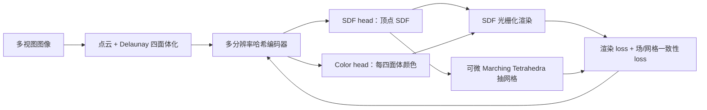

## 一句话总结

SDFRaster 把"可光栅化的符号距离场"建立在 Delaunay 四面体网格上，用光栅化的速度优化一个连续 SDF，并在训练中直接用可微 Marching Tetrahedra 抽网格，实现了端到端、免后处理的多视图三维网格重建。

## 研究背景

- 领域现状：从多视图图像重建网格的主流路线分两支。一支是隐式神经表面（NeuS、VolSDF、Neuralangelo 等），用 SDF 定义清晰的表面，质量高但要沿光线密集采样、反复查询网络，训练昂贵；另一支是光栅化的体素/基元方法（3DGS 及其表面重建变体、稀疏体素、辐射网格等），渲染和优化都快。
- 核心痛点：光栅化这一支依赖体积基元，本身**不提供一个良定义、全局一致的表面表示**，网格往往要靠深度融合（TSDF）之类的后处理才能抽出来，容易带来噪声、孔洞、精度下降；而且几何一致性只能靠多视图正则、结构先验或双分支互监督间接促成，优化目标和最终表面质量之间耦合很弱。隐式 SDF 那一支表面干净但优化太慢。
- 本文 idea：造一个既有 SDF 良定义表面几何、又有光栅化效率的表示。在 Delaunay 四面体网格上参数化一个连续分段线性 SDF，把 SDF 映射成不透明度后用光栅化 + alpha 合成来可微渲染，同时把可微 Marching Tetrahedra 塞进优化循环，让网格在训练中"就地"抽取，从而端到端重建、无需后处理抽网格。

## 方法

整体框架：从场景包围盒出发建立 Delaunay 四面体化作为几何栅格，用一个共享的多分辨率哈希编码器在四面体顶点上预测 SDF、在每个四面体上预测外观；渲染时光栅化四面体、把 SDF 转成不透明度做前到后 alpha 合成；训练过程中用可微 Marching Tetrahedra 抽出零等值面网格，并让场和网格互相约束。

关键设计分四点：

1. **四面体上的连续分段线性 SDF**。维护一组顶点并对其做 Delaunay 四面体化，把空间切成互不重叠的四面体。SDF 只在顶点处由网络（哈希编码特征拼上原始坐标，经 SDF head）预测，四面体内部用重心坐标线性插值：
$$f(x) = \sum_{k=0}^{3} \lambda_k(x)\, f_{i_k}$$
这样得到一个全局定义、分段线性的 SDF，零等值面直接就是表面。因为网络只在顶点处求值、内部靠插值，SDF 查询次数远少于在每个采样点跑 MLP 的方法（如 NeuS）；顶点 SDF 一旦查好，几何可当作纯显式表示存储处理。外观则挂在每个四面体的质心处（在 Delaunay 拓扑变化下比挂顶点更稳定），预测视角相关基色加一个逐四面体线性颜色梯度。

2. **光栅化的 SDF 可微渲染**。沿相机光线对每个被穿过的四面体算出精确进入/离开距离，在端点处评估分段线性 SDF，再用 NeuS 的 logistic CDF 把 SDF 转成区间不透明度：
$$\alpha_k = \max\!\left( \frac{\Phi_s(f_{\text{prev}}) - \Phi_s(f_{\text{next}})}{\Phi_s(f_{\text{prev}})},\, 0 \right)$$
颜色取段内两端平均，按深度顺序做标准 alpha 合成。深度取段中点、法向利用"线性插值 SDF 的梯度在四面体内为常数"直接得到，都复用同一套合成权重。这套流程免去了光线步进里的逐光线密集采样，能在 GPU 上快速、可扩展地优化。

3. **场与网格的双向一致性约束**。每次迭代都用可微 Marching Tetrahedra 抽出三角网格：对顶点 SDF 异号的边，交点位置
$$v_n = \frac{f_i v_j - f_j v_i}{f_i - f_j}$$
对 SDF 值和顶点位置都可微，梯度能从网格 loss 回流到 SDF。然后分别从 SDF 场和抽出的网格渲染深度、法向，用 $$\mathcal{L}_{MD}$$（深度对数差）和 $$\mathcal{L}_{MN}$$（法向内积）拉齐两者，再加上场自身的深度-法向一致性 $$\mathcal{L}_{ND}$$，把"外观拟合"和"表面保真"紧紧绑在一起。SDF 还用数值梯度（有限差分，比高阶自动微分更稳）做 Eikonal 正则和曲率正则。

4. **面向表面的自适应分辨率策略**。为把表示能力集中到表面附近：**加密**时挑顶点 SDF 异号的"穿面"四面体，按外接圆半径排序取前 5% 在质心插点后重新四面体化，并辅以辐射网格式的误差驱动加密；**剔除**（非破坏性，只在渲染时跳过）用一个保守的不透明度上界，把远离零等值面、贡献低的四面体略过，随着可学习的锐度参数 s 增大，保留带会向零等值面收缩；**修剪**（破坏性）按逐四面体的峰值合成权重聚合到顶点，把既低贡献又远离表面带的内部顶点删掉再重划分，保持网格紧凑。

## 实验结果

在 DTU（15 个标准场景，报 Chamfer 距离，越低越好）上，SDFRaster 在**显式方法里取得最低的平均 CD**，优于所有依赖后处理抽网格的泼溅类基线，也逼近昂贵的隐式 SDF 方法，同时训练比隐式基线快 6 倍以上（隐式方法普遍需 12 小时以上，本文约 98 分钟/场景）。

| 方法 | 类型 | DTU 平均 CD ↓ | 训练时间 |
|------|------|--------------|---------|
| NeuS | 隐式 | 0.84 | 大于 12h |
| Neuralangelo | 隐式 | 0.61 | 大于 12h |
| 2DGS | 显式 | 0.98 | 9m |
| GOF | 显式 | 0.88 | 55m |
| MILo | 显式 | 0.71 | 61m |
| Radiance Meshes | 显式 | 2.91 | 79m |
| 本文 SDFRaster | 显式 | 0.68 | 98m |

在 Tanks and Temples（六场景，报 F1 与网格大小）上，本文平均 F1 约 0.43，在显式方法中有竞争力，且网格紧凑（186.2 MB，远小于 2DGS 的 658.2 MB、约为 TSDF 融合网格的三分之一），在细长结构和细节恢复上明显更好。Mip-NeRF 360 上给出无 GT 几何的定性网格对比，并在新视角合成指标（PSNR/SSIM/LPIPS）上与既有方法持平——说明以表面重建为主目标的同时并未牺牲渲染质量。

消融表明：法向-深度一致性 $$\mathcal{L}_{ND}$$ 带来的 F1 提升最大，网格一致性项与之互补；在有界物体场景（DTU）Eikonal 项有益，但在无界复杂场景（TnT）它会严重拖慢收敛，故 TnT 上关闭；加密、修剪对重建质量重要，剔除主要提升渲染效率。此外用同一份优化好的 SDF，在均匀网格上跑 Marching Cubes 会产生更多噪声、孔洞和漂浮物，而在自适应四面体网格上跑 Marching Tetrahedra 网格更干净更紧凑，说明 SDF 优化与四面体网格是紧耦合的。

## 亮点与局限

- 亮点：
  - 用"可光栅化的四面体 SDF"把隐式表面的良定义几何和光栅化的速度统一起来，避开了逐光线密集采样，也避开了泼溅方法的深度融合后处理。
  - 把可微 Marching Tetrahedra 放进优化循环，网格与场双向一致性约束让优化目标直接对齐最终表面质量，真正做到端到端、免后处理抽网格。
  - 面向表面的自适应加密/剔除/修剪把容量集中到零等值面附近，在保证细节的同时把网格做得很紧凑，可扩展到无界大场景。
- 局限：
  - SDF 用哈希编码 MLP 参数化而非逐顶点显式存储：MLP 带来平滑先验的同时也引入了额外的表示偏置（原文将此列为局限）。
  - Eikonal 正则在无界场景反而有害、需手动关闭，说明严格的符号距离约束与复杂场景收敛之间仍有张力，超参需要按数据集调整。
  - TnT 上 F1 只是"有竞争力"而非最优，训练时间（TnT 约 6 小时/场景）相对纯泼溅方法仍偏长。

## 延伸思考

这篇可以看作 Radiance Meshes 这类"多面体/四面体单元光栅化"路线与隐式 SDF 表面重建的交汇点：它借用了四面体网格的显式栅格与光栅化渲染管线，却把承载内容从辐射改成了 SDF，从而拿到零等值面这一天然表面。相比 GOF、MILo 等"在训练中抽网格"的 3DGS 后继工作，它更彻底地把表面表示前置到了几何栅格本身。值得追问的方向包括：能否用显式逐顶点 SDF（而非 MLP）去掉平滑偏置并进一步提速；自适应四面体化的重划分成本在更大场景下如何摊薄；以及这种可光栅化 SDF 能否反过来服务于实时表面渲染或动态场景重建。
