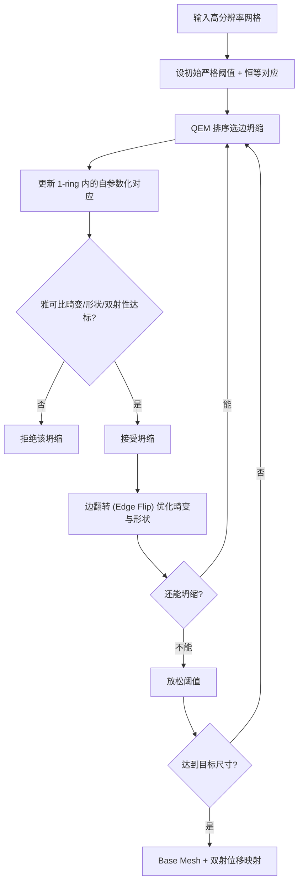

## 一句话总结

DJM 提出用"位移映射的雅可比行列式"作为畸变度量，在 QEM 网格简化过程中同时构造超粗糙的 base mesh 与一个双射、低畸变的位移映射，从而在同等尺寸下比现有方法更精确地重建高分辨率几何。

## 研究背景

- 领域现状：把复杂几何表示成"一个粗糙 base mesh + 一张位移图（displacement map）"能大幅压缩存储、加速渲染，是 NVIDIA micromesh 等现代表示的基础。近期方法多用 QEM 简化生成 base mesh，再想办法在其上优化位移。
- 核心痛点：表示精度取决于映射的**双射性**与**低畸变**——映射不双射会漏掉输入表面，畸变高则重建失真。base mesh 越粗，这两点越难满足。而 QEM 和 Maggiordomo 等方法都**没有显式优化双射性与低畸变**，在粗糙分辨率下产生明显伪影。更糟的是，它们在 base mesh 构造完成后才用**光线投射（ray-casting）**去算位移，当 base 偏离输入较远、法线接近切向时投射极不稳定，出现尖刺和重建失败。
- 本文 idea：观察到位移映射的**逐点雅可比行列式**可直接度量位移畸变（行列式越接近 1 畸变越小）。于是在 QEM 边坍缩框架里加入基于雅可比的畸变约束与双射约束，并在整个简化过程中**显式追踪 base 与输入网格的对应关系**，彻底用前向/后向映射求解器替代光线投射。

## 方法

整体框架：以 QEM 边坍缩简化为骨架，但每次坍缩都受"雅可比畸变阈值 + 三角形形状阈值 + 双射性"三重约束；从严格阈值出发逐步放松（progressive relaxation），直到达到目标面数或再坍缩就会突破硬阈值。全程维护一个从输入到 base 的自参数化对应关系（self-parameterization），初始化为恒等映射，每次坍缩/翻转后局部更新。

关键设计：

1. **雅可比畸变度量（DJM 的核心）**。位移映射把 base 面上的点 $$\boldsymbol{q}=\alpha \boldsymbol{v}_1+\beta \boldsymbol{v}_2+\gamma \boldsymbol{v}_3$$ 沿插值方向偏移得到 $$\boldsymbol{p}$$。作者对其推导出闭式雅可比 $$\boldsymbol{J}(\boldsymbol{q})=\boldsymbol{I}+t\,\boldsymbol{A}(\boldsymbol{B}^\top \boldsymbol{B})^{-1}\boldsymbol{B}^\top$$，其中 $$\boldsymbol{A}=[\boldsymbol{d}_1-\boldsymbol{d}_3,\ \boldsymbol{d}_2-\boldsymbol{d}_3]$$、$$\boldsymbol{B}=[\boldsymbol{v}_1-\boldsymbol{v}_3,\ \boldsymbol{v}_2-\boldsymbol{v}_3]$$。只需看行列式 $$\det(\boldsymbol{J})$$ 与 1 的偏离即可度量畸变，无需采样近似。

2. **渐进式松弛的简化调度**。直接"跑 QEM 再拒绝超阈值坍缩"会留下大量刚好卡在阈值边缘的劣质面；把畸变项硬塞进 QEM 度量又难以平衡量纲。作者改为"先紧后松"：以极严阈值起步、用标准 QEM 度量排序，坍缩到无路可走时才略微放松阈值继续，反复直到达标。这样保证优先消除的都是安全坍缩。

3. **显式对应追踪 + 无光线投射的映射求解**。每次坍缩只需更新被坍缩边 1-ring 邻域内的对应。**后向映射**：对输入点 $$\boldsymbol{p}$$ 求它落在哪个 base 面及其非负重心坐标 $$\{\alpha,\beta,\gamma\}$$ 与位移 $$h$$；用重心坐标是否越界、重建误差是否超过 $$10^{-4}$$、方向与法线夹角是否超 $$90^\circ$$ 来判定归属与双射性。**逆重心位移求解**：把方程写成二次型 $$\boldsymbol{f}(\boldsymbol{x})=0$$（$$\boldsymbol{x}=(\alpha,\beta,t)^\top$$），用 Gauss-Newton 迭代求解（LU 分解，近奇异时退回 QR），比解三次方程的闭式解稳定得多。**前向/base→input 映射**：把输入网格投影到 base，再用迭代最近点在射线与网格间反复求最近点直到收敛，替代不稳定的光线投射。

4. **边翻转与方向计算**。按两侧面雅可比行列式的最差值维护优先队列做边翻转，用顶点 valence 作为三角形形状代理；顶点位移方向由输入区域所有面法线构成的 normal cone 中心向量给出，并检查方向与邻域面法线夹角（阈值从 $$45^\circ$$ 逐步放松到 $$80^\circ$$）以防非双射。

## 实验结果

在 Maggiordomo 数据集的 89 个高分辨率形状上做 micromesh 重建对比（QEM、Maggiordomo 的 MicroMesh、DJM 用相同 base 面数），并在每 base 三角形 256/64/16 三档细分目标下测 RMS Hausdorff 距离。DJM 在所有指标上都更优，尤其最大误差与均值显著更低，体现其稳定性。下表为各方法在不同细分档位的 RMS 中位数（$$\times 10^{-3}$$，越低越好）：

| 方法 | RMS@256 ↓ | RMS@64 ↓ | RMS@16 ↓ |
|------|-----------|----------|----------|
| DJM（本文） | 0.108 | 0.252 | 0.622 |
| MicroMesh | 0.130 | 0.284 | 0.675 |
| QEM | 1.169 | 2.277 | 2.233 |

DJM 不仅 RMS 更低，输出面数与文件大小也普遍更小。神经编码方面，在 NESI 数据集 20 个形状上与 NGF 对比：DJM 用更少参数（22247 vs 28944）拿到更低的 Chamfer（$$0.252$$ vs $$0.609$$，$$\times 10^{-3}$$）与 RMS；对比 Pentapati 等的 60k 配置，DJM 用不到 20k 参数把平均 Chamfer 从 $$0.327$$ 降到 $$0.237$$。构造 base 平均约 15 分钟、算位移图约 28 分钟。

## 亮点与局限

- 亮点：
  - 用闭式雅可比行列式直接量化位移畸变，把"双射 + 低畸变"变成可在边坍缩里逐次检查的硬约束，理论清晰。
  - 全流程摒弃光线投射，改用可收敛的迭代求解，从根源上消除了 grazing、尖刺等 ray-casting 失败伪影。
  - 渐进式松弛策略优雅地绕开了"硬拒绝留劣质面"和"多项度量难配比"两个陷阱。
  - 同一套 base mesh 与对应关系同时服务于 micromesh 渲染和神经压缩，且都优于 SOTA。

- 局限：
  - 当前实现只处理封闭网格（沿用默认 QEM），边界处理需额外工程。
  - 双射约束可能把输入网格自带的伪影（非流形/翻折/剧烈法线变化）"固化"进结果。
  - 双射性只在每次坍缩/翻转局部成立，受数值影响并非全局严格保证。
  - 构造耗时较长（分钟级），且未做 base 顶点位置的后优化与 sliver 三角形修复。

## 延伸思考

DJM 把"位移映射质量"从渲染 loss 或几何距离，收敛到一个更本质的微分几何量（雅可比行列式），这与逆参数化/几何多重网格里 successive self-parameterization 的思路一脉相承，但目标换成了显示压缩友好的单值位移。值得追问的是：Dou 等的可微渲染优化被作者视为可叠加的后处理，若把 DJM 的雅可比约束直接嵌入可微优化，能否兼得全局最优与硬双射保证？此外，前向映射的迭代最近点收敛性依赖 base 与输入足够接近，对拓扑复杂或薄壳结构是否仍稳健，以及方法能否推广到带边界、带纹理接缝的资产，都是落地到生产管线时的关键问题。
