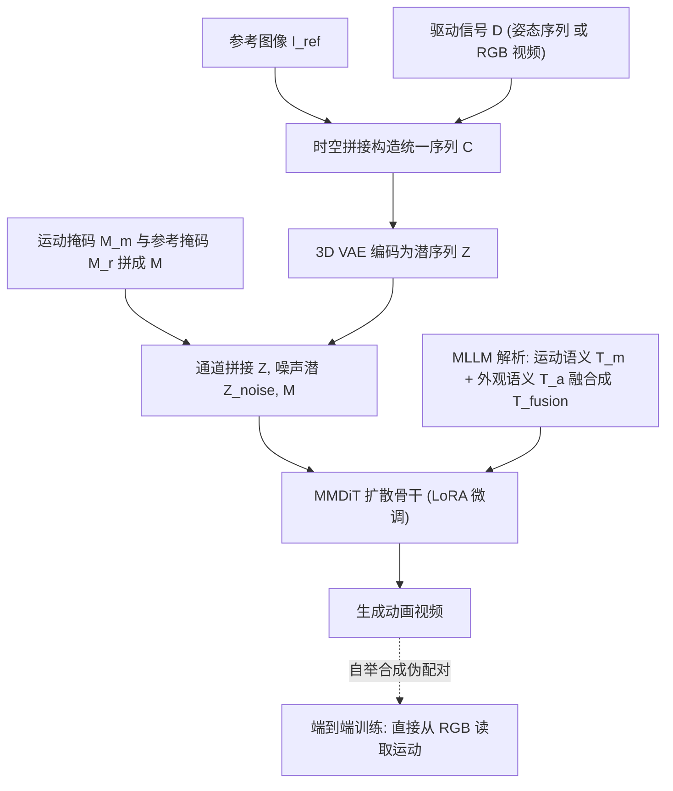

## 一句话总结

DreamActor-M2 把角色图像动画的"运动注入"重新定义为一个上下文学习问题：把参考图像与驱动信号在空间和时间维度上直接拼接成统一输入序列，交给预训练视频扩散模型去"看图学样"，从而在保持身份一致的同时精确迁移运动，并进一步走向无需显式姿态先验的端到端 RGB 驱动。

## 研究背景

角色图像动画的目标是把一段驱动视频里的运动迁移到一张静态参考图像上，合成高保真视频，在数字娱乐领域应用广泛。近年的基础视频扩散模型（如 Wan2.1、Seedance 1.0）提供了强大的生成先验，但如何在不破坏其内在生成能力的前提下适配到动画任务，仍是难题。作者指出现有框架有两个根本缺陷：

- 运动注入策略存在"跷跷板"式的内在权衡。姿态对齐的通道拼接类方法会发生"形状泄漏"（shape leakage），驱动信号里的结构先验会扭曲参考身份；而交叉注意力类方法又过度压缩运动表示，丢失细粒度的时序动态，导致运动不连贯。二者难以同时兼顾高保真动画与稳定身份保持。
- 过度依赖显式姿态先验（如骨架）。姿态估计器在复杂人体动态下本身就容易出错，更关键的是它天然无法泛化到任意非人形角色（卡通、动物等）。已有的隐式运动表示要么训练时仍依赖姿态监督，要么需要对每段视频做昂贵的微调。

作者主张回避复杂的运动注入模块，转而用一个简单而有效的设计：把运动控制信号在时空上与参考图像拼接，构造统一输入，让预训练视频骨干把运动线索当作"视觉上下文"自然地解读。

## 方法

### 整体框架

DreamActor-M2 建立在潜空间扩散模型（LDM）之上，骨干采用 Seedance 1.0 的 MMDiT 架构。整个框架分两阶段演进：先做基于姿态的 Pose-based DreamActor-M2（用增广 2D 骨架作为运动上下文，并引入 MLLM 的目标导向文本引导），再借助自举数据合成流水线过渡到 End-to-End DreamActor-M2（直接从原始 RGB 序列读取运动，摆脱外部姿态估计器）。

### 核心：时空上下文注入

作者先回顾了三种代表性替代方案，再引出自己的方法：

- 姿态对齐注入：把 2D 姿态编码后通道拼接进噪声潜，强制空间对齐保证运动一致，但会带来身份泄漏与失真。
- 交叉注意力注入：用辅助姿态编码器把运动压成潜表示再注入，缓解了身份泄漏，但压缩会丢掉细粒度运动细节。
- 时序级上下文注入：把条件帧与目标帧沿时间维拼接，靠骨干的时序建模学全局运动，但缺乏逐帧空间对应，细节退化、重建质量欠佳。

DreamActor-M2 提出时空上下文注入（Spatiotemporal ICL）：构造统一序列的三步是——(1) 把参考图像与第 0 个运动帧沿宽度轴空间拼接成"混合锚点"，(2) 后续运动帧与一个参考尺寸的空白掩码对齐，(3) 把所有帧沿时间维堆叠。这样既避免了有损压缩，又弥合了外观与运动的模态鸿沟。形式化地，给定参考 $$I_{ref} \in \mathbb{R}^{H \times W \times 3}$$ 与驱动信号 $$D \in \mathbb{R}^{T \times H \times W \times 3}$$，构造复合输入 $$C \in \mathbb{R}^{T \times H \times 2W \times 3}$$：

$$C[t] = \begin{cases} I_{ref} \oplus D[t], & t = 0 \\ \boldsymbol{0} \oplus D[t], & t > 0 \end{cases}$$

其中 $$\oplus$$ 表示沿宽度轴的空间拼接，$$\boldsymbol{0}$$ 是与 $$I_{ref}$$ 同尺寸的零图。再构造运动掩码 $$M_m$$（元素全为 1，用于高亮运动区域）与参考掩码 $$M_r$$（首帧为 1，其余为 0，用于标识身份来源），二者空间拼接得 $$M = M_r \oplus M_m$$。复合视频 $$C$$ 经 3D VAE 投影为潜序列 $$Z$$，最后把 $$Z$$、噪声潜 $$Z_{noise}$$ 与掩码 $$M$$ 沿通道拼接，作为扩散变换器的完整输入。扩散优化目标为标准的去噪目标：

$$L = \mathbb{E}_{z_t, c, \boldsymbol{\epsilon}, t} \left[ \lVert \boldsymbol{\epsilon} - \boldsymbol{\epsilon}_\theta(z_t, c, t) \rVert_2^2 \right]$$

### 基于姿态的阶段：姿态增广与文本引导

Pose-based 变体用 2D 骨架作为运动信号，自监督训练：给定视频 $$V$$，抽取姿态序列 $$P$$ 作驱动信号，首帧 $$I_{ref} = V[0]$$ 作参考，训练模型重建原视频。为缓解骨架自带的"身体形状"线索导致的身份泄漏，用两种姿态增广：(1) 随机骨长缩放（按解剖段分组随机缩放，扰动肢体比例但保持关节连接与时序运动）；(2) 基于包围盒的归一化（用一段内所有关节的包围盒归一化坐标，去除绝对空间依赖，得到尺度不变表示）。

姿态增广可能削弱细粒度运动语义（如祈祷手势里的合掌），因此引入目标导向文本引导：先用 MLLM 把驱动视频解析为运动语义 $$T_m$$（如"一个人在挥双手"），把参考图像解析为外观语义 $$T_a$$（如"一只有彩色羽毛的灰鸟"），再用 LLM 融合成目标导向提示 $$T_{fusion}$$（如"一只有彩色羽毛的灰鸟在挥动翅膀"），作为高层语义先验补充低层姿态信号。适配上采用轻量 LoRA 微调，冻结骨干、只在前馈层插入 LoRA 模块，且文本分支不参与适配以保持语义对齐稳健。

### 端到端阶段：自举数据合成

Pose-based 依赖显式姿态估计，限制了在复杂或非人场景的适用性。端到端变体的关键障碍是缺乏"同时具备运动一致性与跨身份多样性"的大规模配对数据。作者提出自举数据合成：用已训练好的 Pose-based 模型 $$M_{pose}$$，给定驱动视频 $$V_{src}$$ 抽取姿态 $$P_{src}$$，配上参考图像 $$I_o$$ 合成新视频：

$$V_o = M_{pose}(P_{src}, I_o)$$

$$V_o$$ 保留了 $$V_{src}$$ 的运动、却换上了新身份，从而形成伪配对 $$(V_{src}, V_o)$$。再用双阶段质量过滤（先用 Video-Bench 自动打分，再人工核验身份保真与运动一致），只保留高质量语义一致的配对。端到端训练时把 $$V_o$$ 当驱动视频、$$I_{ref} = V_{src}[0]$$ 当参考，构成数据集：

$$D = \{(V_o, I_{ref}, V_{src})\}$$

每个三元组监督模型从 $$(V_o, I_{ref})$$ 重建 $$V_{src}$$，从而学会直接从原始 RGB 序列迁移运动。训练用 Pose-based 模型热启动，加速收敛并继承其运动先验。作者称这是该领域首个完全端到端的方案。

## 实验结果

评测用作者新构建的 AW Bench（Animate in the Wild），含 100 段驱动视频与 200 张参考图像，覆盖人类（不同身体区域、年龄段、活动类别、动/静镜头）与非人（动物、卡通角色）及多主体（many-to-many、one-to-many）场景。由于跨身份任务缺乏真值，FID-FVD / FVD / CD-FVD 等依赖真值的指标失效，作者改用 Video-Bench 的人类对齐自动评测协议，聚焦四个感知维度：成像质量、运动流畅度、时序一致性、外观一致性；并做了 12 人参与的用户研究，均用 1–5 分制。测试集含 60 组人到人、40 组人到卡通动画对。

| 方法 | 成像质量(自动)↑ | 运动流畅度(自动)↑ | 时序一致性(自动)↑ | 外观一致性(自动)↑ | 成像质量(人评)↑ | 运动一致性(人评)↑ | 外观一致性(人评)↑ |
| --- | --- | --- | --- | --- | --- | --- | --- |
| Animate-X++ | 3.45 | 3.42 | 4.15 | 3.21 | 3.18±0.23 | 2.95±0.29 | 2.86±0.34 |
| MTVCrafter | 3.71 | 3.81 | 4.02 | 3.53 | 3.35±0.26 | 3.26±0.28 | 3.07±0.36 |
| DreamActor-M1 | 4.17 | 3.92 | 4.21 | 4.06 | 3.96±0.21 | 3.72±0.26 | 3.54±0.31 |
| Wan2.2-Animate | 4.05 | 4.06 | 4.17 | 3.92 | 3.91±0.20 | 3.83±0.25 | 3.51±0.30 |
| Ours (Pose-based) | 4.68 | 4.53 | 4.61 | 4.28 | 4.23±0.19 | 4.18±0.24 | 4.12±0.28 |
| Ours (End-to-End) | **4.72** | **4.56** | **4.69** | **4.35** | **4.27±0.18** | **4.24±0.23** | **4.20±0.29** |

两个变体在所有自动与人评维度上都超越了竞争方法，且端到端版整体略优于基于姿态版。在与主流平台级产品的 GSB 主观对比中，DreamActor-M2 与 Kling 2.6 整体持平（+9.66% GSB 领先），并大幅领先 Kling-O1（+43.66%）、Wan2.2-Animate（+51.43%）与前作 DreamActor-M1（+57.04%）。

消融实验（人评，Pose-based 框架）表明各核心组件都有效：

| 变体 | 成像质量↑ | 运动一致性↑ | 外观一致性↑ |
| --- | --- | --- | --- |
| Temp-IC（仅时序注入） | 4.12 | 3.98 | 4.06 |
| w/o-PoseAug（去姿态增广） | 4.15 | 3.80 | 3.92 |
| w/o-TOTG（去目标导向文本引导） | 4.21 | 3.85 | 4.08 |
| Ours (Pose-based) | 4.23 | 4.18 | 4.12 |

时空注入相比纯时序注入能更好保留手势等精细结构；姿态增广对维持参考主体的原始体形至关重要；目标导向文本引导能更好重建语义特定的运动并保持身份。端到端模型在 2D 关键点检测困难的场景（方向歧义、手部重叠）中优于基于姿态版。

## 亮点与局限

亮点：

- 把运动注入重新表述为时空上下文学习：用简单的时空拼接构造统一输入，不改动骨干架构、充分利用预训练视频模型的生成先验，同时化解身份保持与运动一致的"跷跷板"权衡。
- 自举合成加训练的流水线：用基于姿态的模型自动合成跨身份伪配对数据，实现向端到端、无姿态动画的平滑过渡，被作者称为该领域首个完全端到端方案，显著提升对多样角色域的泛化。
- 目标导向文本引导：用 MLLM 融合运动语义与外观语义，补偿姿态增广造成的语义损失，提升运动可控性与表现力。
- 构建了覆盖多样运动模式与角色类别（含多主体、非人角色）的 AW Bench，为社区提供更具挑战性的评测平台；泛化实验覆盖多种镜头类型、参考/驱动角色类型与多人场景。

局限：

- 对复杂交互仍偶有困难，例如两个角色相互绕转，主要归因于训练数据中运动轨迹交叉的样本稀缺。作者计划后续构建更多含复杂多人交互的数据集。
- 端到端训练依赖基于姿态模型合成的伪配对数据质量，需要自动加人工的双阶段过滤才能保证可靠监督。
- 人体图像动画存在被滥用制作假视频的社会风险，作者表示将严格限制核心模型与代码的访问。

## 延伸思考

这篇工作最值得玩味的是"把控制信号当上下文而非当模块"的思路转变。以往做可控生成总倾向于设计专门的注入模块（ControlNet、交叉注意力、通道拼接），而这里直接把驱动信号和参考图拼进输入序列，让基础模型用它本来就擅长的"看上下文补全"能力去完成运动迁移。这与 LLM/VLM 里 in-context learning 的哲学一脉相承，也提示随着视频基础模型越来越强，许多"控制"任务或许都能退化成"如何把条件排布进上下文"的问题。

另一个有价值的点是自举数据合成：用弱一些但可控的姿态模型去"制造"端到端模型缺失的跨身份配对数据，本质是一种能力自蒸馏——先用结构先验换来可控性，再用可控性换来数据，最后用数据摆脱结构先验。这个"先立后破"的两阶段范式对其他缺配对数据的迁移任务很有借鉴意义。当然，合成数据的偏差与过滤成本、以及对复杂多主体交互的覆盖不足，仍是这类自举方案需要正视的隐忧。
