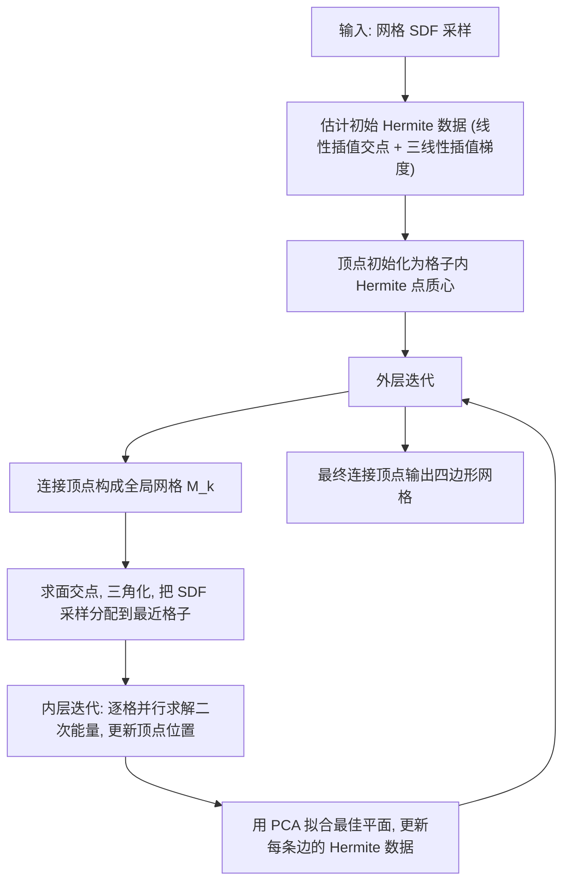

## 一句话总结

仅凭规则网格上离散采样的有符号距离（SDF）值，不借助梯度信息、任意查询能力或大规模数据训练，通过一套"局部逐格二次能量优化 + 全局迭代修正 Hermite 数据"的对偶轮廓（Dual Contouring）策略，重建出能忠实保留尖锐特征的显式多边形网格。

## 研究背景

有符号距离函数把空间中任一点到形状表面的距离连同内外符号一起编码，能以任意精度表达带复杂尖锐特征的形状，并支持高效的布尔运算，因此在图形学、工程、工业设计与增材制造中被广泛用作建模阶段的几何表示。但下游任务（有限元仿真、纹理映射、实时渲染）往往需要显式网格，于是"从离散 SDF 采样重建保特征网格"成为关键问题。

已有方法各有软肋：

- 经典 Dual Contouring（Ju 等 2002）依赖精确的 Hermite 数据（表面与网格边的交点位置及该处法向）。这类数据只有在能任意查询 SDF 时才可精确获取；当只有离散采样时，靠有限差分估计得到的 Hermite 数据在尖锐处最不准，导致尖锐特征丢失。
- 近期利用全局 SDF 信息的点云类方法（Reach for the Arcs 等）与行进四面体类方法，要么继承点云重建的平滑先验、磨圆边角并合并缝隙，要么受体离散化的轴对齐偏置影响，在与网格不对齐的尖锐特征处产生倒角伪影。
- 数据驱动方法（Neural Dual Contouring、PoNQ 等）依赖大规模训练，结果受训练分布制约。

本文的核心洞察是：不必事先拿到精确 Hermite 数据，而是先粗略估计、再用离散 SDF 采样本身迭代修正它，从而在无梯度、无训练的前提下逼近经典 Dual Contouring 用真值 Hermite 数据才能达到的重建质量。

## 方法

输入是规则网格顶点上的 SDF 值 $\{s_i\}$，目标是输出四边形网格 $M=(V,Q)$。沿用 Dual Contouring 思路：先找出两端符号相反的"有趣边"（必与真实表面相交）以及包含它们的"有趣格子"，然后为每个有趣格子优化放置一个顶点，最后把共享同一有趣边的四个格子顶点连成四边形。

整体是一个外层迭代循环套内层迭代循环的 local-global 优化。

初始化。对每条有趣边 $e_i=[\boldsymbol{u}_{ia},\boldsymbol{u}_{ib}]$，用两端 SDF 值线性插值估交点，再用三线性插值梯度估法向：

$$\boldsymbol{h}^0_i=(1-t)\boldsymbol{u}_{ia}+t\,\boldsymbol{u}_{ib},\qquad t=\frac{|s_{ia}|}{|s_{ia}|-|s_{ib}|}.$$

每个格子的初始顶点取其各边 Hermite 点的质心，避免直接套用估计 Hermite 数据时产生的自交、不规则初值困住迭代。

外层循环的局部能量。给定上一轮顶点，连成全局网格并三角化，把每个网格节点 $\boldsymbol{u}_j$ 按最近点分配到某个格子。为衡量候选顶点与格子内 SDF 数据的吻合度，构造局部三角网 $M^k_i$（由面交点、其对应 Hermite 点、格子顶点 $\boldsymbol{x}$ 拼成），定义距离能量：

$$E^{k,i}_d(\boldsymbol{x})=\sum_{(\boldsymbol{u}_j,s_j)\in A(c_i)}\Big(|s_j|-d\big(\boldsymbol{u}_j,M^k_i(\boldsymbol{x})\big)\Big)^2,$$

其中 $d$ 是点到三角网的欧氏距离。因为规则网格的局部更新在构造上就把正负 SDF 数据分到表面两侧，所以这里可以忽略符号，比全局流方法省去了符号一致性的额外处理。为抑制局部网格的非物理弯折、并复现尖锐边恢复行为，再加 Hermite 能量：

$$E^{k,i}_H(\boldsymbol{x})=\sum_{e_j\in c_i}\big((\boldsymbol{x}-\boldsymbol{h}^k_j)\cdot\boldsymbol{n}^k_j\big)^2,$$

总能量为 $E^{k,i}(\boldsymbol{x})=E^{k,i}_d(\boldsymbol{x})+w_H^2\,E^{k,i}_H(\boldsymbol{x})$。

内层线性化与二次求解。距离能量高度非凸，把每个 SDF 采样视作以 $\boldsymbol{u}_j$ 为心、半径 $|s_j|$ 的球，局部网需与之相切。直接的一阶展开会因惩罚切向滑动而卡住顶点，因此只沿指向球心方向的分量度量距离（记 $\boldsymbol{d}_j$ 为 $\boldsymbol{u}_j$ 到球面最近点 $\boldsymbol{q}_j$ 的单位向量，$\boldsymbol{t}_j$ 为 $\boldsymbol{u}_j$ 在局部网的最近点）：

$$\big(|s_j|-d(\boldsymbol{u}_j,M_i)\big)^2\approx\big((\boldsymbol{t}_j-\boldsymbol{q}_j)\cdot\boldsymbol{d}_j\big)^2.$$

将 $\boldsymbol{t}_j$ 写成局部三角网的重心坐标后，距离项化为关于 $\boldsymbol{x}$ 的二次能量 $\tilde{E}_d(\boldsymbol{x})=\lVert A_d\boldsymbol{x}-b_d\rVert^2$。加上 Hermite 能量与一个 $L_2$ 正则项后，每步内层迭代求解：

$$\boldsymbol{x}^{k,r+1}=\arg\min_{\boldsymbol{x}}\ \tilde{E}^{k,r}_d(\boldsymbol{x})+w_H^2\,E^k_H(\boldsymbol{x})+\mu\lVert\boldsymbol{x}-\boldsymbol{x}^{k,r}\rVert^2.$$

这是标准的最小二乘二次问题，可堆叠成 $\lVert Q\boldsymbol{x}-c\rVert^2$ 形式按 Ju 等 2002 的方式求解，且允许顶点越出格子边界以更好恢复极尖锐特征。

Hermite 数据更新。每条边由共享它的四个格子顶点做主成分分析（PCA）拟合最佳平面，得到法向 $\boldsymbol{n}$ 与其与该边交点 $\boldsymbol{y}$，再以更新权重 $w_u$ 线性插值：

$$\boldsymbol{h}^{k+1}_j=\boldsymbol{h}^k_j+w_u(\boldsymbol{y}-\boldsymbol{h}^k_j),\qquad \boldsymbol{n}^{k+1}_j=\frac{\boldsymbol{n}+w_u\boldsymbol{n}^k_j}{\lVert\boldsymbol{n}+w_u\boldsymbol{n}^k_j\rVert}.$$

各格子内层优化相互独立，可用 OpenMP 并行；对高分辨率可用窄带或随机批处理（批上限设为 200000）控制线性复杂度。默认参数：$w_H=0.02$、$w_u=0.2$、$\mu=0.1$，内外层各约 100 次迭代收益趋于饱和。

## 实验结果

在 ABC 数据集（55 个随机 CAD 形状，含大量尖锐特征）上，与 Marching Cubes、估计 Hermite 数据的经典 Dual Contouring、Reach for the Arcs、以及 Kohlbrenner & Alexa 的两种方法比较，指标含 Chamfer 误差、Hausdorff 误差、边 Chamfer 误差与 SDF 能量。下表为分辨率 $100^3$ 的结果（越低越好）：

| 方法 | Chamfer 误差 (×10⁻³) | Hausdorff 误差 (×10⁻²) | 边 Chamfer 误差 | SDF 能量 (×10⁻⁵) | 顶点数 |
| --- | --- | --- | --- | --- | --- |
| Marching Cubes | 2.62 | 1.81 | 0.4171 | 3.061 | 14k |
| Ju 等 2002（估计 Hermite） | 1.589 | 1.372 | 0.3502 | 1.866 | 14k |
| Reach for the Arcs | 30.8 | 6.284 | 0.1143 | 130.8 | 274k |
| Kohlbrenner & Alexa 2025a | 1.843 | 1.492 | 0.274 | 1.812 | 123k |
| Kohlbrenner & Alexa 2025b | 7.242 | 2.216 | 0.4466 | 2.321 | 163k |
| 本文方法 | **0.7788** | **1.221** | **0.02622** | **0.05776** | 14k |

本文方法在几乎所有分辨率与指标上都最优，且用极少的顶点数（与 Marching Cubes 同量级，远少于点云类方法）达成。尖锐特征指标（边 Chamfer 误差）领先尤为明显，约为次优方法的十分之一。有趣的是，次优往往是估计 Hermite 数据的经典 Dual Contouring，说明此前点云类方法在光滑有机形状上的高精度未必迁移到带尖锐特征的 CAD 几何。在无尖锐特征的 10 个光滑形状上，本文方法则与最好的现有方法基本持平。噪声实验显示本文方法继承了经典 Dual Contouring 对噪声的敏感性：低噪声下仍最优，噪声增大时优势收窄。此外，在扫掠体（sweep）等难以估计精确梯度的场景中，本文方法能显著加速已有的扫掠体计算流程。

## 亮点与局限

亮点：

- 只用离散 SDF 采样即可恢复尖锐特征，无需梯度、无需任意查询 SDF、无需训练，摆脱了经典 Dual Contouring 对精确 Hermite 数据的硬性依赖。
- 把重建拆成逐格独立的局部优化，可并行、无中间点云表示，因而避免人为平滑，也不受体离散化的轴对齐偏置影响；对输入数据量不敏感，可按算力选择用全网格、窄带或随机批。
- 在中高分辨率、带尖锐梯度不连续的 CAD 几何上刷新精度上界，且顶点数极省。

局限：

- 继承经典 Dual Contouring 的问题：允许顶点越格虽利于尖锐特征，却可能引入自交与翻面；对噪声较敏感。
- 高度非凸能量只能数值近似求解，困难情形下特征曲线上会出现孤立凹陷。
- 目前假设采样落在规则网格上，且外层循环用了任意（取第一条对角线）的三角化策略。

## 延伸思考

方法把"估计—修正 Hermite 数据"变成迭代闭环，本质上是让离散 SDF 场自己纠正一份不完美的一阶几何信息，这个思路对其他依赖法向/切平面估计的重建任务（如点云定向、隐式场提取）可能同样适用。作者也点出几条自然的延伸：借鉴 Manifold Dual Contouring 强制输出流形网格以消除自交；用 SDF 数据来优化三角化的选择而非取任意对角线；以及把方法从规则网格推广到八叉树等自适应结构，以在保持精度的同时进一步压缩高分辨率下的存储与计算。更宏观地看，论文呼吁社区为"从离散 SDF 重建"建立数据集、基线与公开挑战，尖锐特征恢复的评测（边 Chamfer 误差）正是推动这一方向走向成熟的抓手。
