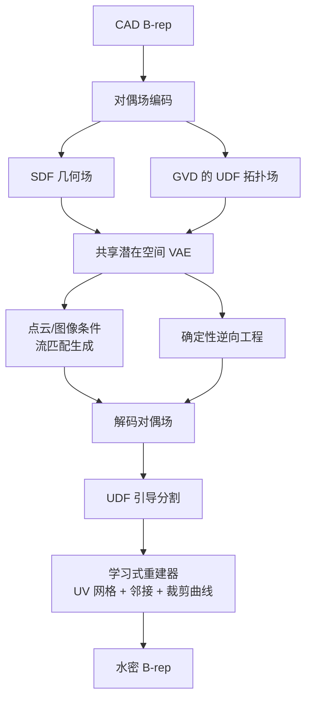

## 一句话总结

DualBrep 把 CAD 的边界表示（B-rep）从"连续几何 + 离散拓扑图"的异构结构，重写成两个空间对齐的连续标量场——用符号距离场（SDF）编码整体形状、用广义 Voronoi 图（GVD）的无符号距离场（UDF）隐式编码拓扑分割，两场压进同一潜在空间，从而让点云逆向工程与条件生成共用一个连续、可微的骨干网络。

## 研究背景

B-rep 是 CAD 的事实标准格式，它把实体建模为一组参数曲面，再用离散拓扑图（面-边-点的连接关系）裁剪拼接。这种"连续参数几何 + 离散组合拓扑"的异构结构对深度学习极不友好：

- **不可微的组合拓扑**：离散的拓扑选择无法端到端梯度优化，网络难以直接最小化几何不一致或改善水密性。
- **变长基元的处理困境**：现有方法要么用固定尺寸 padding，要么用序列化 token 来应付面/边数量不定的问题；随着形状复杂度上升，组合复杂度爆炸。
- **误差累积**：序列化或自回归的 B-rep 预测器随依赖链增长而误差累积，水密性快速崩溃，常产出工程上不可用的破损模型。

与此对照，网格/曲面生成领域因为转向连续隐式表示（SDF、占用场）而突飞猛进——连续场可微、分辨率无关，天然契合梯度优化。作者据此提出：把 B-rep 学习的表示域从离散图切换到连续场。

## 方法

核心洞见：一个 B-rep 本质上是"一个水密的几何外壳 + 把它切分成若干面的分割结构"。于是用两个互补的标量场来表达：

- **几何场（Shape Field）**：标准 SDF $$\mathcal{S}: \mathbb{R}^3 \rightarrow \mathbb{R}$$，其零水平集 $$\mathcal{S}(\boldsymbol{p}) = 0$$ 定义连续、水密的物体外壳，忽略面的内部分割。
- **拓扑场（GVD Field）**：把 B-rep 的各个面当作 Voronoi 的"站点"，广义 Voronoi 图把空间划分为"离每个面最近"的元胞，元胞之间的边界形成连续的中轴片（medial sheet）。用 UDF $$\mathcal{U}: \mathbb{R}^3 \rightarrow \mathbb{R}$$ 编码任意点到该 GVD 表面的距离。

两场叠加即完整定义了 B-rep：$$\mathcal{S}(\boldsymbol{p}) \approx 0$$ 表示点在物体表面上，$$\mathcal{U}(\boldsymbol{p}) \approx 0$$ 表示点到多个面等距（即落在边界/棱边上）。SDF 恢复几何，GVD 隐式地把几何"切"成正确的拓扑面片，无需预测离散邻接矩阵，也无需处理面的变长基数。

整个框架由三部分组成：

- **对偶场 VAE**：Perceiver 风格编码器用交叉注意力融合曲面点、边点、Voronoi 点三组输入（各 32768 点），投影到潜在码 $$Z \in \mathbb{R}^{K \times D}$$（$$K=2048$$，$$D=32$$）。解码器作为隐式神经函数，对查询坐标做交叉注意力后，用两个 MLP 头分别回归 SDF 与 UDF 值。约 250M 参数，$$L_1$$ 重建损失加权重 0.001 的 KL 正则。逆向工程时改为确定性自编码器，屏蔽边点与 Voronoi 点输入、KL 权重设 0，强迫编码器仅凭曲面几何推断出完整对偶场。
- **潜在流匹配生成**：在潜在空间上训练条件 Flow Matching（DiT 骨干，约 300M 参数），单个潜在码联合解码出几何与拓扑两场，避免序列式预测的误差累积。条件可以是点云或单视图图像（DINOv2 特征）。推理用 Euler 法解 ODE（50 步）。
- **学习式重建器（Rebuilder）**：从解码场经 Marching Cubes 抽表面网格、再用 UDF 引导的分层区域生长做分割；重建器对每个面片预测参数化 UV 网格、邻接矩阵、以及 UV 空间内的裁剪曲线（在 UV 域而非 3D 空间预测曲线，保证与曲面参数化一致），最后拟合 B 样条曲面、用 CAD 内核确定性地拼装成水密 B-rep。

## 实验结果

在 ABC 数据集（过滤后约 80k 模型，4k 测试，面数 10 到 100）上评测点云到 B-rep 的逆向工程任务。

| 方法 | 曲面 CD $$\downarrow$$ | 边 CD $$\downarrow$$ | 曲面 F1 $$\uparrow$$ | 边 F1 $$\uparrow$$ | 面-边拓扑 F1 $$\uparrow$$ | 有效率 $$\uparrow$$ |
| --- | --- | --- | --- | --- | --- | --- |
| SEDNet+Point2CAD | 0.0259 | 0.0336 | 48.68% | 45.01% | 40.87% | / |
| NVDNet | 0.0142 | 0.0059 | 83.70% | 78.48% | 80.84% | 12% |
| HoLa-BRep | 0.0211 | 0.0329 | 79.33% | 71.65% | 68.81% | 73.98% |
| Ours（生成） | 0.0157 | 0.0133 | 77.18% | 86.68% | 70.31% | 69.49% |
| Ours（重建） | 0.0156 | 0.0129 | 81.98% | 89.87% | 76.36% | 76.34% |

DualBrep 在绝大多数指标上领先，有效率达到 76.34%。NVDNet 的原始 Chamfer 距离略低，但它只优化点到面距离、缺乏 UV 参数化、依赖 alpha-shape 裁剪的启发式，经同等 B-rep 参数化与内核拼装后有效率仅 12%、曲面 CD 升到 0.0367，几何优势在强制结构完整性后基本消失。随面数增长，HoLa 这类离散方法因组合爆炸迅速退化，而 DualBrep 凭连续场表示保持稳定，且比 NVDNet 更具全局一致性。生成变体因 ODE 求解的随机扰动被重建器放大，指标略低于确定性版本，但边/点级指标仍全面领先 HoLa。

## 亮点与局限

亮点：

- **首个把 B-rep 表示学习放进统一连续域的框架**，用对偶标量场同时表达几何与拓扑，绕开离散图预测的不可微与组合复杂度。
- **推迟离散化**：先在连续域把全局几何与拓扑确定好，再把最终 B-rep 抽取降级为一个良定义的重建任务，避免让模型从噪声中"幻想"拓扑。
- **一骨干双用**：同一潜在空间既支撑确定性逆向工程，又支撑点云/图像条件的生成，且随形状复杂度优雅扩展。
- **UV 域裁剪曲线**：曲线在对应曲面的 UV 域内预测，强制边严格贴合曲面，边/点级精度显著优于在 3D 空间自由回归的做法。

局限：

- 作为体积方法受潜在场网格分辨率限制，极薄结构或高频细节可能在 GVD 分割中被混叠或丢失，导致有效性失败。
- 最终抽取依赖神经重建器，复杂交叉处偶尔拼接不完美，产生轻微非水密瑕疵。
- 当前重建器把所有曲面都拟合成 B 样条，不预测解析曲面/曲线类型（平面、圆柱、圆等），无法恢复精确基元类型。

## 延伸思考

把 B-rep 重铸成连续可微场，最大的想象空间不在生成本身，而在于它能与基于物理的目标（有限元分析、计算流体力学、应力仿真）耦合，实现几何、可制造性与结构性能的联合优化——指向一种"同时推理形态、功能与性能"的 CAD 系统。技术层面，作者提出的自适应八叉树采样或显隐混合表示，是解决薄壁细节与全局分辨率矛盾的自然方向；而补上解析基元类型分类，则是让输出真正"工程可编辑"的关键一步。此外，用 GVD 的 UDF 把"曲面身份变化"编码为空间信号，这一思路或可迁移到其他需要"连续几何 + 离散分区"联合建模的场景。
