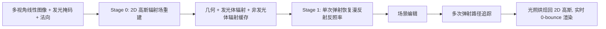

## 一句话总结

EAG-PT 用统一的 2D 高斯表示重建室内场景，显式地把发光体和非发光体分开、恢复漫反射材质，并在编辑后用多次弹射路径追踪重算漫反射全局光照，从而得到物理一致、可编辑的照片级渲染。

## 研究背景

- 领域现状：NeRF、3DGS 等辐射场重建方法能对室内场景做到高保真的新视角合成，显式高斯基元还便于交互式编辑；另一端是基于网格的逆向路径追踪，物理上正确但依赖高精度几何。
- 核心痛点：辐射场方法把整个场景当成"自发光"的，光照被烘焙进外观里，一旦改光源、改材质或挪动物体，光照和阴影不会跟着变；加一两次弹射的反射建模仍然依赖拍摄时缓存的辐射、不重建真实光源。而网格逆向路径追踪对几何精度要求极高，真实室内场景杂乱、细结构多，网格误差会通过可见性、着色和多次弹射直接污染最终渲染。
- 本文 idea：既要辐射场/高斯那种忠实的几何表达，又要网格路径追踪那种正确的光传输。于是提出用 2D 高斯作为"传输友好"的几何代理，显式分离发光与非发光成分，并把重建阶段（单次弹射）与最终渲染阶段（多次弹射路径追踪）解耦。

## 方法

整体框架分两个阶段加一次编辑后渲染。Stage 0 把多视角线性辐射观测提升为一组 2D 高斯，重建出辐射场、分离发光体、导出几何；Stage 1 在固定辐射缓存的前提下，用单次弹射的可微渲染恢复非发光体的漫反射反照率。编辑之后丢弃过时的非发光体辐射缓存、只保留发光体的真实辐射，用多次弹射路径追踪重算全局光照。

关键设计：

1. **统一的 2D 高斯光线追踪与弹射**。把 2D 高斯直接当作可被追踪的基元（嵌在 3D 空间中的椭圆面元）。给定光线，沿途与若干高斯求交，用 alpha 混合累积法向、距离、辐射、发光项、反照率等各类量。求交后用累积距离定义有效交点作为新起点，从法向定义的上半球采样新方向继续弹射。弹射次数按阶段区分：重建辐射场时不弹射，材质恢复时单次弹射，路径追踪时多次弹射。这让"求交、传输、漫反射材质、辐射缓存"都收敛到同一套 2D 高斯表示上。

2. **发光感知的场景分解**。用 2D 发光掩码显式区分物理光源与反射表面。重建时在辐射损失、几何损失（用 StableNormal 估计的单目法向监督法向与距离梯度，作者发现单目深度估计跨视角一致性不够，法向监督更稳）之外，加一项发光损失 $$L_e = \lVert E - M \rVert_1$$ 监督发光成分。总损失是四项的加权和，联合优化所有 2D 高斯的位置、尺度、旋转、不透明度、辐射与发光。这样重建完就得到分离好的发光体真实辐射、非发光体辐射缓存和可用于弹射的几何。

3. **借助辐射缓存的单次弹射材质恢复**。渲染方程中假设发光面不反射入射光，从而干净地分离发光与反射：当 $$E(\hat{\omega}_o) > \tau_E$$ 时取发光辐射，否则取反射辐射（$$\tau_E=0.1$$ 保证平滑过渡）。材质恢复时用 Stage 0 得到的累积辐射 $$R(\hat{\omega}_i)$$ 近似入射辐射，避免迭代多次弹射，用蒙特卡洛积分估计反射辐射。本文只用漫反射 BRDF $$f = P/\pi$$，仅优化反照率 $$\rho$$，而辐射 $$r$$ 保持 Stage 0 固定不动，以规避漫反射-发光的歧义。

4. **编辑后的路径追踪与光照烘焙**。编辑（改光色、插入物体等）会改变辐射分布，因此丢弃过时的辐射缓存，改用路径追踪：每条光线从相机出发，与 2D 高斯反复求交弹射，直到打到发光体或超过弹射上限 $$\tau_b$$ 才终止，有效路径求平均降噪，结果再送入去噪器。由于路径追踪每帧要几百秒，作者借鉴商业游戏引擎的思路，把路径追踪的辐射重新烘焙回 2D 高斯的逐高斯辐射里，之后用 0-bounce 实时渲染编辑后的场景，既保住质量又能实时导航。

## 实验结果

在有重光照真值的合成场景上（插入一个发光球），对比不同渲染策略。编辑前 0-bounce 直接复原拍摄时辐射最好，但编辑后只有 emission-aware 的多次弹射路径追踪能给出物理一致的重光照；光照烘焙在几乎不损失质量的前提下把渲染时间从上百秒降到与 0-bounce 相当。

| 配置 | PSNR↑ | LPIPS↓ | FLIP↓ | Time↓ |
|------|-------|--------|-------|-------|
| 0-Bounce（重光照后） | 16.22 | 0.1098 | 0.3593 | 0.015 |
| 1-Bounce（重光照后） | 19.78 | 0.0896 | 0.3176 | 27.9 |
| 本文 路径追踪（重光照后） | 28.70 | 0.0825 | 0.1839 | 188 |
| 本文 光照烘焙（重光照后） | 28.97 | 0.0977 | 0.1823 | 0.015 |

上表为合成场景 b-kitchen 重光照后的数值。可以看到路径追踪与烘焙在 FLIP、PSNR 上大幅优于 0/1-bounce，而烘焙把渲染时间压回实时级别。

真实场景方面，在自采的 lectureroom 上关掉一半灯做重光照，路径追踪能贴近真值重现空间变化的室内光照；在 f-classroom 与 Eyeful Tower 场景上演示了改光、改材质、插入发光球、导入非发光物体等多种编辑，均得到自然的反射、阴影与互反射。与网格逆向路径追踪 SOTA 方法 FIPT 对比，本文在 f-classroom、f-conference 上的新视角路径追踪质量全面更高（如 f-conference PSNR 26.44 对 FIPT MonoSDF 的 22.29），且能保住椅子腿、灯臂这类细结构、避免网格三角化伪影。存储上本文只需单个 33 MB 的 ply（约为 FIPT 的 5%），显存全程低于 2.5 GB。消融显示：法向监督、准确的发光掩码、足够的弹射上限（7）与采样数（1024）、以及去噪器都是达到最终质量的必要条件；在固定优化预算下，提高 $$n_{spp}$$ 比增加迭代次数更能降噪、恢复材质。

## 亮点与局限

- 亮点：
  - 用一套 2D 高斯统一承载求交、光传输、漫反射材质和辐射缓存，比 FIPT"网格 + 体素网格 + MLP 材质 + 图像着色"的组合简单得多，存储和显存开销都很小。
  - 显式分离发光体/非发光体并重建真实光源辐射，编辑后能算出物理正确的漫反射全局光照，而不是复用过时缓存。
  - 重建（单次弹射）与渲染（多次弹射）解耦，加上把路径追踪结果烘焙回高斯，兼顾了物理正确性与实时交互。
- 局限：
  - 发光掩码在复杂真实场景里依赖人工标注，缺少自动获取方式。
  - 材质模型只支持漫反射，未覆盖高光/一般 BRDF。
  - 未用多重重要性采样与光源重要性采样，优化与渲染的方差和收敛还有提升空间。

## 延伸思考

这篇的核心洞见是：辐射场表示的几何忠实度和路径追踪的物理正确性并非只能二选一，2D 高斯恰好是一个"传输友好"的中间代理。沿着局限往下看，自动发光体分割（结合分割或多视角一致性）、扩展到镜面/金属等更一般 BRDF、以及引入重要性采样降方差，都是自然的下一步。把它与实时全局光照、LOD 技术结合，面向室内设计、XR 内容创作乃至具身智能的 real-to-sim 资产准备，可能是更有价值的落地方向。
