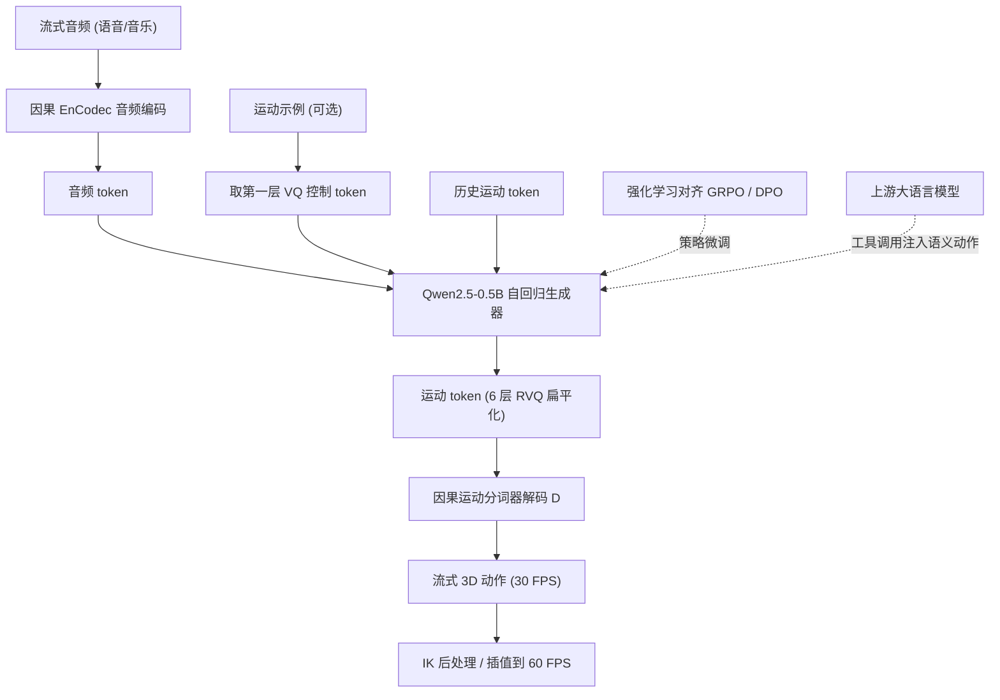

## 一句话总结

EchoAvatar 用一个基于注意力的因果运动分词器加上被改造成运动生成器的预训练大语言模型，实现了从流式音频（语音与音乐通吃）低延迟自回归生成连贯全身动作，并用分层 token 破坏策略解决"条件坍塌"、用强化学习对齐人类偏好，最终成为可插进语音智能体的实时数字人驱动方案。

## 研究背景

大语言模型和语音智能体已经能产出接近真人的对话音频，但对应的可视化身体表现却跟不上交互的实时性，因此需要直接从流式音频以低延迟生成高保真 3D 动作。现有音频驱动动作合成方法主要有两个短板。

其一是离线处理：多数先进方法要求拿到完整音频序列才能生成动作，这种架构在实时交互场景下会引入无法接受的延迟。很多号称"实时"的工作其实只是在假设完整音频上下文已知的前提下，做到了比播放速度更快的生成，并非真正的流式（音频增量到达、动作渐进产出）。

其二是领域割裂：现有方法通常只处理语音（对话手势）或只处理音乐（节奏舞蹈），很少两者兼顾。这迫使系统做复杂的模型切换，限制了它在需要统一处理多样声学输入的通用语音智能体上的适用性。

作者的目标是一个统一的实时流式化身动画框架：接收现场音频流，实时产出动作，既能做对话手势也能做节奏舞蹈，无需显式领域标签或模式切换，还能被上游大语言模型通过工具调用注入显式语义控制。

## 方法

整个框架分三大组件：把连续运动流形离散化且不破坏时序因果性的因果注意力运动分词器；被三阶段课程改造用来对齐音频-运动模态并支持语义控制的预训练大语言模型生成器；以及在零重试流式场景下把策略对齐到人类感知标准的强化学习阶段。

**因果注意力运动分词器。** 运动 $$\boldsymbol{m}_{1:N}$$ 被参数化为一串姿态状态（根速度、高度、6D 关节旋转）。标准离散运动分词器依赖非因果结构、需要看未来帧，延迟无法接受；而已有的因果卷积方案受限于卷积网络的表达力，重建常有可见瑕疵。本文改用堆叠的注意力块并施加因果掩码，把感受野严格限制在前 $$p$$ 帧内。为在时序重采样时不丢信息，借鉴 DC-AE 的双路策略：下采样把时序池化分支与经 MLP 处理的特征拼接分支聚合，上采样则用时序复制加通道扩展 MLP 恢复分辨率。为抑制脚部滑动等物理瑕疵，把前向运动学显式塞进优化环，对全局关节位置、速度、加速度和脚部接触一致性施加辅助损失。

编码后的连续隐轨迹用残差矢量量化（RVQ）离散化：隐向量近似为 $$Q$$ 个量化残差之和 $$\hat{\boldsymbol{z}} = \sum_{q=0}^{Q-1} \hat{\boldsymbol{z}}_q$$，每一层量化上一层部分和的残差。分词器的复合目标平衡重建保真度与码本承诺：

$$\mathcal{L}_{rec} = \| \hat{\boldsymbol{m}}_{1:N} - \boldsymbol{m}_{1:N} \|_1 + \eta \sum_{q=0}^{Q-1} \| \boldsymbol{z}^q_{1:n} - \mathrm{sg}[\hat{\boldsymbol{z}}^q_{1:n}] \|_2^2 + \Phi\big(\mathrm{FK}(\hat{\boldsymbol{m}}_{1:N}), \mathrm{FK}(\boldsymbol{m}_{1:N})\big)$$

其中 $$\Phi$$ 封装前向运动学辅助损失，$$\mathrm{sg}[\cdot]$$ 是停止梯度。作者还做了按解剖部位分区的分词，对上半身、下半身、手部各维护独立码本。

**音频驱动运动生成。** 沿用 MECo 的渐进学习范式，用三阶段课程把预训练大语言模型改造成运动生成器：先做嵌入空间对齐（把离散音频/运动码本投影到语言模型的连续隐流形），再做声学-运动学对齐（让骨干从流式音频合成动作），最后做示例驱动控制（接受参考动作作为显式风格指令）。音频侧用因果版 EnCodec 提供一致的离散接口。不同于 MECo 优先主量化层，本文认为高保真重建需要显式建模完整残差层级，因此采用 MusicGen 的扁平交织策略把多层 RVQ 索引串成单一自回归流，并用分层损失缩放（对更深 RVQ 层的交叉熵施加单调递减权重）先保结构后修细节。

**分层 token 破坏（核心）。** 作者发现，在共享运动 token 空间里统一多种音频到动作任务会诱发灾难性的"条件坍塌"：自回归运动先验在学习信号里过强，会"短路"较弱的音频条件，模型学会只看最近的运动历史来预测下一 token 而忽略声学输入，任务稀疏时尤甚。对策是分层 token 破坏——训练时随机扰动上下文运动 token，惩罚对自回归历史的过度依赖，迫使模型利用音频条件与目标动作之间的互信息。扰动尊重 RVQ 的层级结构：每个被选中的时间步采样层深 $$\ell_t \sim \mathrm{Uniform}(1, L)$$，随机化第 $$\ell_t$$ 到 $$L$$ 层的 token，保留更粗的基础层不变。这既模拟了"细节先于全局结构退化"的真实生成瑕疵（相当于稳健的数据增强），又赋予模型纠错能力，让长程自回归推理能从采样错误中优雅恢复。

**强化学习对齐。** 探索两种范式把策略对齐到人类感知。其一是基于组相对策略优化（GRPO）的奖励引导优化，用自监督代理奖励：

$$\mathcal{L}_{GRPO} = -\frac{1}{G} \sum_{i=1}^{G} \rho_i \hat{A}_i + \beta_G D_{KL}(\pi_\theta \,\|\, \pi_{ref})$$

其中 $$\rho_i$$ 是重要性比、$$\hat{A}_i = (r_i - \mu_G)/\sigma_G$$ 是组归一化优势。代理奖励由两部分构成：一个自监督运动质量奖励（人工按已知程度破坏真值动作，用 FID 校准出破坏强度与质量的单调映射，训练一个用双向注意力、去掉量化层输出连续质量标量的奖励模型），以及一个音频-运动对齐奖励（用 InfoNCE 学联合嵌入，BEATs 编码音频，衡量同步音频与运动嵌入的余弦相似度）。其二是有人类反馈时用的直接偏好优化（DPO），绕过代理奖励直接对偏好对建模：

$$\mathcal{L}_{DPO} = -\mathbb{E}\left[ \log \sigma\left( \beta_D \log \frac{\pi_\theta(y_w \mid x)}{\pi_{ref}(y_w \mid x)} - \beta_D \log \frac{\pi_\theta(y_l \mid x)}{\pi_{ref}(y_l \mid x)} \right) \right]$$

偏好对通过 Best-of-N 采样构造：每段音频生成 8 个候选，由标注者挑出最优 $$y_w$$ 与最差 $$y_l$$，并过滤掉质量差距不明显的对。

**部署。** 系统采用滑动窗口把定长上下文训练的模型变成连续自回归流式生成，每步生成 0.266 秒（8 帧），用 CUDA Graph 降低核调度开销；还提供工具调用接口，让上游大语言模型把显式语义动作与隐式音频驱动动作交织，桥接纯被动的音频驱动与意图驱动的可控行为。

## 实验结果

数据用 ZeroEGGS（约 2 小时、单说话人 19 种风格的语音手势）和 Motorica（约 6 小时、5 位表演者 8 种流派的舞蹈），统一重定向到同一数字角色；另收集约 1 小时对话语音与 100 首音乐作 RL 语料。基础生成器为 Qwen2.5-0.5B-Instruct，运动 30 FPS 原生合成后插值到 60 FPS，推理吞吐约 300 tokens/s，总计算延迟在 H200 与 RTX 4090 上都远低于 266ms 的音频块时长。下表为统一测试集上的定量对比（"Ours"为无 RL 模型）：

| Method | FID ↓ | Diversity ↑ | BAG ↑ | BAD ↑ |
|---|---|---|---|---|
| GT | 0 | 21.52 | 7.775 | 2.619 |
| MECo | 14.73 | 23.13 | 7.507 | 2.622 |
| EDGE | 18.06 | 19.71 | 8.190 | 2.668 |
| Ours (w/o corrupt) | 25.92 | 29.58 | 8.464 | 2.541 |
| Ours | 9.465 | 20.70 | 8.277 | 2.603 |
| Ours (DPO) | 12.39 | 19.67 | 8.283 | 2.607 |
| Ours (GRPO) | 24.13 | 20.89 | 8.239 | 2.618 |

要点：统一模型在 FID 上大幅超过针对语音的 MECo 和针对舞蹈的 EDGE 两个专用基线；去掉分层 token 破坏后模型发生条件坍塌，即使在静音或中性语音时也持续生成无意义的类舞蹈动作，反而把 Diversity 和 BAG 刷到虚高（29.58 / 8.464），印证这些指标在失控时会被夸大。分词器消融显示，加入双路重采样、辅助运动学损失、回看机制和分部位码本后，重建 FID 从注意力基础版的 4.183 降到 1.306、MPJPE 从 411.6 降到 184.1，全面优于因果卷积基线。在 BEAT2 基准上本文取得 FID 2.874 的新最优。RL 方面存在对齐-保真权衡：GRPO 会把 FID 从 9.465 推高到 24.13、DPO 推到 12.39（模式寻求导致分布覆盖下降），但两者都提升了主观偏好；且领域各有所长——GRPO 在舞蹈上偏好增益更大，DPO 在对话手势上更优。联合训练还带来跨模态协同：舞蹈数据显著增强了手势生成的节拍匹配能力，甚至出现零样本风格迁移（高能量"开心"语音偶尔触发原语音数据中没有的活泼节奏手势）。

## 亮点与局限

亮点：

- 真正的流式统一框架，语音手势与音乐舞蹈无需领域标签或模式切换即可在同一模型里低延迟自回归生成，且总延迟稳定低于音频块时长。
- 提出基于注意力的因果运动分词器，配合双路重采样与前向运动学辅助损失，重建质量和下游生成质量都明显优于因果卷积方案。
- 分层 token 破坏精准诊断并解决了统一运动 token 空间中的条件坍塌，是统一训练能成立的关键，还顺带成为纠错型数据增强。
- 系统化探索了 GRPO 与 DPO 在在线自回归运动生成上的应用，给出对齐-保真权衡与领域适配策略的清晰分析，并做成可插拔、支持工具调用语义控制的可部署系统。

局限：

- 面部与身体动力学解耦，缺乏注视等细粒度非言语交互建模，整体协同性受限。
- 依赖声学特征且训练说话人多样性有限，可能出现领域混淆（把男声误判为音乐人声进而错误生成舞蹈）。
- 缺少针对声音突然终止的专门过渡策略，音乐骤停时动作会不自然。
- 只建模说话者角色，忽略了双向交流的相互性，尚不支持主动倾听、非言语回应等反应式行为。

## 延伸思考

这篇工作最有意思的洞见是把"条件坍塌"作为统一多任务运动生成的核心障碍，并用结构感知的 token 破坏来重新校准自回归先验与音频条件之间的竞争关系。这其实是一个可迁移的思路：任何把强自回归先验与较弱外部条件塞进共享离散空间的多模态生成（文本到语音、文本到动作、甚至代码补全里的上下文依赖）都可能遭遇类似的"短路"，而分层扰动提供了一种比均匀加噪更精细的解药。

另一个值得玩味的点是"用大语言模型骨干做运动生成"的范式正在成熟——把运动、音频都当作离散 token 串接进自回归流，直接复用 LLM 的训练与推理基础设施（含 GRPO/DPO 这套对齐工具链）。本文对 RL 的诚实分析尤其可贵：奖励优化几乎必然以牺牲分布覆盖（FID 变差）换取偏好对齐，而 FID 本身在失控高方差生成下又会被虚高，说明单一指标在生成式动作评估里并不可靠，主观评测与多维度指标缺一不可。跨模态协同带来的零样本风格迁移则暗示，把差异很大的运动领域混合训练可能不是干扰而是互相强化的机会，这对未来构建覆盖更广行为谱系的通用运动基础模型是一个乐观信号。最后，作者点出的主动倾听与双向交互，是把"单向音频驱动"推向"真正具身对话"的自然下一步，也是这条技术路线通往可信数字人交互必须跨过的门槛。
