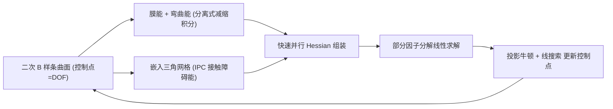

## 一句话总结

用二次 B 样条基函数做布料的高阶有限元离散，配上一整套针对样条结构定制的加速方案（分离式减缩积分、并行 Hessian 组装、部分因子分解求解器），首次让全局 $$C^1$$ 连续的高阶布料仿真在实测中比标准线性 FEM 还快约 2×，同时精度和褶皱细节更好。

## 研究背景

- 领域现状：布料仿真长期以"三角网格 + 线性 FEM"为主流空间离散方案，简单易用、生态成熟。近年为提升精度，出现了若干高阶方案：Le 等人（2023，下称 SFEM）用二次三角单元，Ni 等人（2024，下称 BHEM）用双三次 Hermite 单元强制单元间 $$C^1$$ 连续。
- 核心痛点：线性 FEM 的位移场只有 $$C^0$$ 连续，带来三个顽疾。其一，曲面表达差，要靠加密网格才能刻画光滑或高频褶皱；其二，**膜锁（membrane locking）**——即便是等距变形，单元局部畸变也会产生虚假抗力、把弯曲行为人为变硬，通常得靠软化膜刚度、加应变限制能量甚至重网格来缓解；其三，分片线性网格上二阶导要么为 0 要么无定义，弯曲能只能借助二面角等特殊处理，计算复杂、易出奇异、还带来网格依赖。而已有高阶方法各有代价：SFEM 仍是 $$C^0$$、弯曲能仍需特殊处理；BHEM 要在每个节点存导数作为额外自由度，导致 Hessian 更稠密、每单元要 $$4\times 4$$ 个积分点，计算开销大。
- 本文 idea：改用**二次 B 样条基**做位移插值。它天然提供全局 $$C^1$$ 连续，同时相比 Hermite 只带来适度增大的模板尺寸和积分点数——在效率与精度间取得独特平衡。全局光滑的位移场让膜能和弯曲能都能一致、准确地离散，从根本上缓解锁死与网格依赖；再用一套性能优化把高阶方法一贯的"慢"补回来，最终反超线性 FEM。

## 方法

整体框架：把每片布料在材料空间和世界空间都离散成二次 B 样条曲面，控制点即自由度（DOF）。时间积分沿用 IPC 的优化式隐式欧拉框架，把每一时间步化为最小化一个增量势能 $$E(C^{n+1}) = \frac{1}{2\Delta t^2}\lVert C^{n+1}-\hat{C}^n\rVert_M^2 + \int_{\Omega_0}\Psi\, \mathrm{d}\boldsymbol{X}$$，用投影牛顿法 + 线搜索求解。能量含膜、弯曲、接触三部分，接触则在嵌入 B 样条曲面里的代理三角网格上用 IPC 障碍能处理。真正让方法跑得快的，是围绕 B 样条结构定制的三项优化。

关键设计：

- **分离式减缩积分**：这是全文效率的核心。二次 B 样条每个积分点最多受 $$3\times 3=9$$ 个控制点影响，直接用会让全局 Hessian 远比线性 FEM 稠密。作者按控制点构成的"对偶网格"划分曲面，膜能上在每个格子内交替使用 $$1\times 2$$ 和 $$2\times 1$$ 积分模式，使每个积分点在某一方向只关联 2 个基函数，把局部模板压到 $$2\times 3=6$$，同时相比常规 $$2\times 2$$ 把积分点数减半（不用单点是为了避免沙漏模态这类零能模式）。弯曲能因为量级通常比膜力小一个数量级，进一步用**每格单点积分**，让每个点只受该格 4 个控制点影响；边界处基函数不对称，则加密到 $$3\times 3$$（角）与 $$3\times 2/2\times 3$$（边）以保稳定。
- **弯曲能的一致离散**：因为 B 样条一二阶导处处良定义，弯曲能直接用简单的二次弯曲模型 $$\Psi_{bd}=\frac{1}{2}\mu_{bd}H^2$$，其中平均曲率经诱导的 Laplace-Beltrami 算子 $$H^2=\langle\Delta\boldsymbol{\phi},\Delta\boldsymbol{\phi}\rangle$$ 求得，彻底摆脱线性 FEM 那套基于二面角的边计算，也消除了网格依赖。参数空间对材料空间的各阶偏导只依赖静止形状，可预计算。
- **快速并行 Hessian 组装**：绕开 Eigen 单线程的 `setFromTriplets`，手工按几何/接触对隐含的稀疏结构直接构造 CSC 矩阵。弹性 Hessian 的稀疏模式只取决于固定的模板结构，可在初始化时预计算控制点到积分点的映射并固定索引；接触 Hessian 的稀疏模式随激活接触对变化，且从线性网格经链式法则传到 B 样条曲面时，一个三角网格 triplet 会膨胀成 $$9\times 9=81$$ 个 B 样条 triplet。作者用哈希表做中间表示，并按空间块划分把同一块内顶点分给同一线程，使写冲突只出现在块边界，显著降低并行组装开销。
- **部分因子分解求解**：接触 Hessian 稀疏模式逐步变化会带来昂贵的矩阵合并与符号重分析。作者把障碍 Hessian 拆成对角与非对角项，用 Woodbury 公式把系统写成 $$(\boldsymbol{D}+\boldsymbol{B})^{-1}=\sum_{k=0}^{\infty}(-1)^k(\boldsymbol{D}^{-1}\boldsymbol{B})^k\boldsymbol{D}^{-1}$$，只需因子分解 $$\boldsymbol{D}$$（惯性 + 弹性 + 障碍对角）。当算子范数 $$\lVert\boldsymbol{D}^{-1}\boldsymbol{B}\rVert_{op}$$ 足够小（用 Gershgorin 圆盘定理低成本估上界）时收敛快，从而复用弹性 Hessian 的符号分析、避开昂贵的重分析。

## 实验结果

主实验取"接触无关"的对比基准（Upright Hanging Cloth / Drape / Shear），在产生视觉可比的褶皱配置下比较各方法的平均每步运行时间。B 样条 FEM 用更少的 DOF 达到相当质量，全面领先线性 FEM 和两种高阶方法：

| 方法 | 每步耗时 (s) | DOF | 相对本文 |
|------|------|------|------|
| B-spline（本文） | 5.125 | 47K | 1× |
| Linear FEM | 12.017 | 120K | ~2× 慢 |
| SFEM [Le 2023] | 27.261 | 47K | ~4–5× 慢 |
| BHEM [Ni 2024] | 116.67 | 8K | 且 100 次牛顿迭代仍未收敛 |

（上表为 Upright Hanging Cloth 的一组配对；BHEM 在 8K DOF、限 400 迭代时耗时 503.9 s 仍不收敛。）其余实验用文字概述：跨全部配对，本文平均比线性 FEM 快约 2×，比 SFEM 快约 4–5×，比 BHEM 快 2×–20×；在追求同等精度时更是快数个数量级。弯曲收敛基准中，$$1\times 1$$ 减缩积分即可收敛到解析解，且相比线性 FEM 有约 50× 加速；线性 FEM 在交替对角右三角网格上甚至不收敛。膜锁基准（布落球）里，同样 DOF 下本文得到光滑褶皱、线性 FEM 出现明显尖锐折痕。消融显示减缩积分不损害牛顿收敛、并行空间分块显著降低接触 Hessian 组装的写冲突、部分因子分解在低接触帧带来约 2× 的每迭代求解加速（约 40% 迭代被触发）。方法还在旋转球摩擦、直升机密集接触、armadillo 长条带、角色服装动画、布料入篮堆叠等大规模含接触场景中保持稳健。

## 亮点与局限

- 亮点：
  - 首次把 B 样条 FEM 从静态问题推进到动态布料仿真，并真正做到"高阶还更快"——全局 $$C^1$$ 连续带来一致的膜/弯曲能离散，从源头缓解膜锁与网格依赖。
  - 分离式减缩积分是点睛之笔：针对膜能与弯曲能各自设计积分模式，既压小模板与积分点数，又通过避免单点积分躲开沙漏模态，效率与精度兼得。
  - 工程层面完整：并行 Hessian 组装 + 部分因子分解求解，把高阶方法一贯的性能瓶颈补齐，可扩展到含接触的大规模场景。
- 局限：
  - 仍非完全无锁——只是消除了线性 FEM 那类可见折痕伪影，作者也建议结合应变限制进一步改进。
  - 假设静止形状是平的、面内近等距变形，因此不适用于圆锥裙、带褶皱/压痕等非平坦静止形状的服装。
  - 张量积结构限制复杂拓扑表达；B 样条边界一般不插值控制点，高曲率下施加 Dirichlet 边界条件较麻烦；网格转换拟合偏离矩形太多时积分精度会下降、可能病态。
  - 每个基支撑三个 knot span，天然偏好低频变形模式，可能压制细小几何细节。
  - 接触与渲染共用嵌入三角网格，仍有额外线性系统构造成本；直接在 B 样条曲面上处理接触是待探索方向。

## 延伸思考

- 从各向同性网格无关性看，这套思路与等几何分析（IGA）、细分曲面 FEM 一脉相承，但作者刻意选择结构化 B 样条以换取模板小、积分点少的性价比；文中也提到扩展到 NURBS 只需引入每控制点权重，是很自然的下一步，可支持更灵活的静止形状建模。
- "分离式减缩积分 + 针对稀疏结构手工组装 CSC + Woodbury 部分因子分解"这组优化其实相当通用，值得迁移到其它高阶或壳体仿真中——它们的共同痛点都是"高阶带来稠密 Hessian 与昂贵求解"。
- 把接触直接放到 B 样条曲面上（而非嵌入三角网格）若能实现，将省去 $$9\times 9$$ 膨胀与网格间转换开销，可能是进一步拉开与线性 FEM 差距的关键。
- 非平坦静止形状的限制若能通过引入参考曲率、放开等距假设来解除，这套高效光滑离散有望覆盖更广的真实服装类型。
