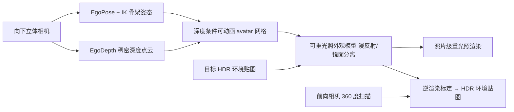

## 一句话总结

EgoRelight 只用一台头戴显示器（HMD）上的自我中心（egocentric）相机，就能同时完成全身人体动作捕捉、可重光照（relightable）的照片级真实感 avatar 渲染，以及周围环境的 HDR 光照估计，从而把远端用户"无缝插入"到本地真实环境中实现混合现实的临场感（telepresence）。

## 研究背景

- 领域现状：AR/VR 临场感是热门应用，已有工作要么专注于从 egocentric 视角驱动 avatar（如 EgoAvatar），但外观自带"烘焙好"的固定光照；要么依赖复杂的 lightstage 影棚做人体重光照，但需要固定相机阵列、无法便携。
- 核心痛点：这两条路互相割裂。egocentric 驱动的高保真 avatar 无法适配新环境光照；而重光照方法又离不开受控影棚，且"用便携设备估计环境 HDR 光照"这一环几乎无人探索。因此没有任何方法能仅靠 egocentric 相机同时做到全身捕捉 + 环境光照采集 + 新光照下重光照。
- 本文 idea：提出一个统一的 egocentric 临场感框架，把三件事拼成闭环——用向下的立体相机做几何/动作捕捉，用数据驱动的神经外观模型做重光照，再用"把 avatar 反渲染到 egocentric 视图"的测试时逆渲染反推出 HDR 环境贴图。训练阶段借助 lightstage 多视角数据，测试阶段只需一台 HMD。

## 方法

整体框架分三大块串联：先由自我中心感知模块从向下立体相机恢复骨架姿态和稠密深度，驱动一个网格 avatar；再把带姿态的网格喂给可重光照外观模型，在给定目标光照下渲染出照片级真实感图像；最后在测试时用前向相机扫描环境、并借 avatar 自身作为标定物反推 HDR 环境贴图。

关键设计：

1. **自我中心几何感知（几何控制信号）**：以 FRAME 为骨干做每人微调的姿态估计器，从立体向下相机 + 头部轨迹回归 57 个 3D 关键点，再用带 PCA 手部先验和时序项的逆运动学（IK）解出稳定的全身+手部动作。同时把 DepthAnythingV2 扩展成"每人微调的度量深度预测器"，用 NeuS2 重建的真值深度做监督，得到稠密点云。训练数据虽在均匀白光下采集，但用强烈的亮度/对比度/色调抖动增强，让感知模块能泛化到未见光照。

2. **深度条件的可动画 avatar**：不做费时的测试时网格配准（既把带噪点云当真值、又拖慢速度），而是把深度点云编码成模板网格顶点上的"点到面距离"特征（等价于 L2 点到面损失的梯度，并用法向/距离阈值过滤错误对应），再在 UV 空间用一个 UNet（AnimationNet）一次性回归嵌入图形变参数和逐顶点偏移，前馈得到贴合 egocentric 观测的正面几何。

3. **漫反射/镜面分离的神经外观模型**：外观用铺在网格 UV 空间上的一层 3D Gaussian 表示，并直接预测视相关颜色而非用球谐。核心是把渲染方程拆成视角无关的漫反射项和视相关的镜面项分别学：GeoLiftingNet 先从时序法向栈提升出高频法向图和 flat-lit albedo（用 NeuS2 的 3D 一致法向 + Sapiens 的细节法向做感知监督平衡一致性与细节）；DiffuseNet 用 CNN 在纹理空间回归漫反射着色和 Gaussian 参数；SpecularNet 则针对镜面项——由于每条入射光独立贡献且对采样光线顺序无关，用 Blinn-Phong 重要性打分挑出 top-$$r$$ 条可能落在镜面瓣内的光线，把它们的 6D 角度编码用交叉注意力（one-to-many attention）融合。这种端到端学习绕开了解析 BRDF 的归纳偏置，泛化到未见光照且更真实。

4. **可负担的 egocentric HDR 环境贴图捕捉**：用前向相机做约 10 秒 360 度原地扫描，采样 20 张图重建场景、拼成 LDR 全景，并用扩散模型补全未观测区域。由于 LDR 全景与训练用的 HDR 光照色彩空间不匹配，作者巧妙地把 avatar 本身当作颜色标定靶——通过把预训练 avatar 反渲染到向下 egocentric 图像，优化颜色校正参数 $$\boldsymbol{A}$$ 和 gamma 参数，并配合光流校正跟踪误差、用部位分割掩膜防止过拟合上半身肤色，最终得到色彩正确的 HDR 环境贴图。

## 实验结果

数据集自采 4 名受试者，lightstage 含 331 个可控 RGB 光源和 40 台 4K HDR 相机（37 训 3 测）。重光照主实验将本方法与逆渲染类和扩散类基线在测试序列上对比（下表为受试者 #1 的四项指标；SSIM/LPIPS 已换算为小数）：

| 方法 | PSNR↑ | SSIM↑ | LPIPS↓ | FID↓ |
|------|-------|-------|--------|------|
| Relighting4D | 32.39 | 0.920 | 0.100 | 153.33 |
| MeshAvatar | 33.45 | 0.890 | 0.099 | 41.66 |
| EgoAvatar（非重光照） | 20.93 | 0.825 | 0.165 | 62.64 |
| EgoAvatar + Neural Gaffer | 28.77 | 0.901 | 0.101 | 65.11 |
| 本文 | 34.81 | 0.925 | 0.086 | 31.90 |

本文在全部 4 名受试者上都取得最优 PSNR/LPIPS/FID，SSIM 在其中 3 人上最高。几何重建方面，深度条件 avatar 的点到面距离（可见表面从约 75cm 降到与优化式 EgoAvatar 相当的 46cm 附近）显著优于纯动作驱动的前馈方法，同时保持约 46 FPS，比优化式 EgoAvatar（0.006 FPS）快几个数量级。消融显示：数据增强把全身 MPJPE 从 12.20cm 降到 4.11cm；镜面项采样 32 条光线时 LPIPS/FID 最优；去掉 GeoLiftingNet/DiffuseNet/SpecularNet 分别丢失皱褶、无法收敛、肩部高光欠拟合。光照估计上也优于 IC-Light、Photoshop Harmonize 等零样本谐调方法。

## 亮点与局限

- 亮点：
  - 首个仅用单台 HMD 就把 egocentric 全身捕捉、可重光照照片级 avatar、环境 HDR 光照恢复三者打通的完整系统。
  - 漫反射/镜面分离 + 光线重要性采样 + 交叉注意力的神经外观模型，摆脱解析 BRDF 归纳偏置，重光照更真实且能泛化到未见光照。
  - 用 avatar 自身作颜色标定靶反推 HDR 环境贴图，把"便携设备估计光照"这个空白落到实处，思路巧妙。
  - 深度条件前馈避免了测试时优化，几何精度接近优化式方法却快数个量级。

- 局限：
  - 尚未做到实时，主要瓶颈是迭代式 IK 求解器。
  - 头戴相机固定曝光、LDR 传感器，在极亮/极暗场景失效，多组相机间颜色同步困难。
  - 户外强日光重光照受限于影棚训练设置（需把环境光强裁剪到 1.0），对比度和阴影被软化。
  - 属于 person-specific 方案，仍需 lightstage 影棚采集训练数据，泛化到任意新用户成本高。

## 延伸思考

这项工作是 EgoAvatar 谱系（egocentric 驱动全身 avatar）向"可重光照"方向的自然延伸，把 lightstage 重光照（如 TotalRelighting、Relightable Gaussian Codec Avatars）从人脸/头部推广到动态全身，并首次闭环了"设备端光照采集"。值得追问的点：一是能否用二阶求解器或前馈网络替换 IK 以奔向实时；二是 person-specific + 影棚依赖是限制普及的最大门槛，未来若能结合大规模先验或少样本泛化会更有价值；三是把 avatar 当颜色标定靶的逆渲染思路，或许能推广到更一般的"用已知外观物体反推场景光照"的移动端应用。
