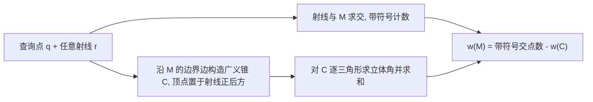

## 一句话总结

本文把三维广义缠绕数（Generalized Winding Number, GWN）的曲面积分解析地化简为"一次射线-网格求交 + 沿边界边的初等求和"，得到对三角网格**精确且比现有方法快数量级**的缠绕数评估算法。

## 研究背景

- 领域现状：广义缠绕数由 Jacobson 等人 2013 年引入，用于判断一个点相对于三角网格是"内/外/被缠绕几次"，即便网格存在自交、孔洞、非流形、开放边界也能给出稳健的内外判定，是几何处理里做符号距离、网格修复、布尔运算等任务的基础工具。
- 核心痛点：现有方法各有取舍。逐三角形累加立体角（Jacobson 2013）精确但开销大；Barnes-Hut 近似（Barill 等 2018 的 FWN）快但牺牲精度且**没有严格误差界**，需要反复调参；OneShot（Martens & Bessmeltsev 2025）把问题转到球面线段两两求交，复杂度 $$O(\lvert B \rvert^2)$$ 且实现困难；Spainhour 等的工作要么局限二维，要么面向参数曲面且依赖数值积分，难以对三角网格给出闭式解。
- 本文 idea：利用缠绕数的可加性，给开放网格 $$\mathcal{M}$$ 补一个共享边界、朝向一致的"封盖网格" $$\mathcal{C}$$，使 $$\mathcal{M}+\mathcal{C}$$ 闭合；那么 $$w_{\mathcal{M}} = w_{\mathcal{M}+\mathcal{C}} - w_{\mathcal{C}}$$。前者是闭合网格，用一次射线求交即得整数缠绕数；后者把封盖设计成"顶点在射线正后方的广义锥"，其贡献只需沿边界边求一遍立体角。

## 方法

整体框架：算法核心是一条等式
$$w_{\mathcal{M}}(q) = w_{\mathcal{M}+\mathcal{C}}(q) - w_{\mathcal{C}}(q) = \sum_i \operatorname{sgn}(r \cdot n_i) - \frac{1}{4\pi}\sum_j \Omega_j.$$
第一项是从查询点 $$q$$ 沿任意方向 $$r$$ 发出射线、对与 $$\mathcal{M}$$ 的交点做带符号计数；第二项是封盖锥 $$\mathcal{C}$$ 各三角形在 $$q$$ 处所张立体角 $$\Omega_j$$ 之和。

关键设计：

1. **可加性 + 封盖，把开放网格变闭合**：广义缠绕数满足 $$w_{\mathcal{M}+\mathcal{C}} = w_{\mathcal{M}} + w_{\mathcal{C}}$$（严格说是两个 2-链相加，反向面相消）。选任意封盖 $$\mathcal{C}$$ 与 $$\mathcal{M}$$ 同边界、同朝向即可让组合网格闭合，于是闭合网格的整数缠绕数可用射线求交高效得到。

2. **把封盖设计成"射线后方的广义锥"**：锥的锥顶取在射线的反方向上。这带来两个好处——其一，锥按构造**保证与射线不相交**，因此对 $$\mathcal{M}+\mathcal{C}$$ 投射射线就等价于只对原始 $$\mathcal{M}$$ 投射，不需要为 $$\mathcal{C}$$ 建加速结构；其二，评估 $$w_{\mathcal{C}}$$ 的代价只随**边界边数** $$\lvert B \rvert$$ 线性增长，而非随总面数增长，实际模型里边界边通常远少于三角形。单个三角形的立体角用 Van Oosterom-Strackee 的反正切闭式公式算，精确无近似。

3. **显式处理退化，保证精确性**：高性能射线库（如 Embree）在射线恰好穿过边或顶点时可能漏计或重复计数。作者不靠扰动"碰运气"，而是标记所有"不明确落在面内部"的交点，把这些交点邻接的三角形边界连到锥顶，形成一个很小的闭合辅助网格，用立体角公式精确算出该局部的带符号交点数来替换射线器的不可靠结果。此类退化极少，几乎不影响整体性能。

4. **与 Stokes 定理的关系**：GWN 可写成散度为零的向量场 $$v(x) = (x-q)/\lVert x-q \rVert^3$$ 在 $$\mathcal{M}$$ 上的通量。Stokes 定理不能直接用，因为 $$v$$ 的定义域 $$\mathbb{R}^3 \setminus \{q\}$$ 不可缩。文中把射线 $$R$$ 解读为定义可缩域 $$\mathbb{R}^3 \setminus R$$ 的工具——可缩性保证能找到与 $$\mathcal{M}$$ 同边界、且完全落在该域内的曲面，而锥正是这样一个特别简单的例子。相比之下并发工作 Spainhour & Weiss 用的是"去掉一条直线"的域，不可缩，因而难以化成三角形 GWN 之和的闭式。

## 实验结果

作者用 C++（Eigen、libigl、Embree）实现，单线程跑在 MacBook Air M2 上，在 Thingi10K 全数据集上评测。主实验是**精度对比**：以精确的层次法（Jacobson 2013）为真值，比较近似方法 FWN 与本文方法的缠绕数场误差（排除距表面 $$10^{-14}$$ 以内、本身有跳变不适定的查询点）。

| 方法 | Max $$L_\infty$$ 误差 | Avg $$L_\infty$$ 误差 | Avg $$L_1$$ 误差 |
|------|------|------|------|
| FWN ($$\beta=2$$) | $$1.15\times10^{0}$$ | $$6.95\times10^{-3}$$ | $$4.95\times10^{1}$$ |
| FWN ($$\beta=15$$) | $$1.15\times10^{0}$$ | $$2.95\times10^{-3}$$ | $$2.82\times10^{-1}$$ |
| 本文 | $$1.46\times10^{-7}$$ | $$2.31\times10^{-11}$$ | $$4.40\times10^{-10}$$ |

本文误差仅是浮点级，比 FWN 小若干数量级；且提高 FWN 的精度参数 $$\beta$$ 并不能可靠压低最大误差（因为它按到 BVH 单元质心的距离而非到最近三角形来划分远近场）。性能方面：渐进复杂度为 $$O(\lvert B \rvert)$$，优于 OneShot 的 $$O(\lvert B \rvert^2)$$；在 Thingi10K 固定网格查询上，逐样本评估比层次法和 FWN 快约 100×（中位数）；预计算时间与 FWN 相当。作者还统计到 85% 的模型根本没有边界边，其余 15% 也普遍边界很简单，经验拟合出 $$\lvert B \rvert = O(\lvert F \rvert^{0.28})$$，说明以边界为中心的算法很契合真实几何。

## 亮点与局限

- 亮点：
  - 对三角网格给出**精确闭式解**，除浮点误差外无任何近似，免去 FWN 那种需要调参且无误差界的困扰。
  - 概念简单、易实现易调试：一次射线求交 + 一圈边界边求和；且在极端情形自动退化到已知最优渐进复杂度（闭合网格只需一次射线，三角汤退化为逐三角形）。
  - 对极端噪声、随机化顶点、射线恰好切边/切点等对抗性输入都稳健，靠显式退化回退而非启发式扰动。

- 局限：
  - 性能优势依赖良好的网格连通性；对三角汤这类高度非结构化数据，本文与层次法一样没有相对朴素评估的加速优势，此时只有 FWN 等近似法能高性能求解。
  - 推导与实现只针对三角网格；虽然思路原则上可推广到参数/隐式曲面，但对这类曲面构造锥后"锥的缠绕数如何评估"仍非平凡，属未来工作。

## 延伸思考

- 本文与并发的 Spainhour & Weiss（2026，参数/NURBS 曲面）以及 OneShot（2025）同属"边界中心"这一新兴思路——把整张曲面的积分降维到边界操作。差别在推导路径：本文借"去掉射线得到可缩域"这一几何直觉，直接得到三角网格的闭式解，避免了球面线段两两求交或数值积分。
- "把边界补成一个与射线不交的锥，从而复用射线结果"是很漂亮的构造技巧，思路上可迁移到其它需要在开放几何上做通量/内外判定的问题。
- 把方法推广到参数曲面是明确的开放问题：射线求交已有成熟算法，难点集中在参数曲面锥的立体角评估，值得后续追问。
