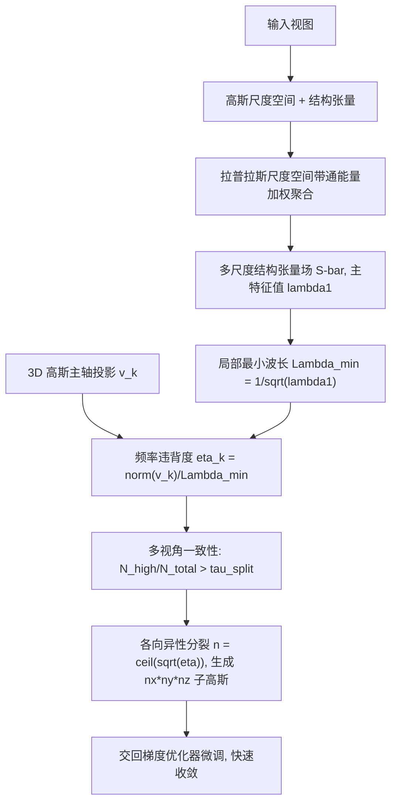

## 一句话总结

本文指出 3D Gaussian Splatting 训练慢的关键瓶颈在于"稠密化"而非优化器本身：标准方法靠屏幕空间位置梯度被动地把一个高斯反复分裂成两个，需要多轮迭代才能达到所需分辨率。作者提出用图像的多尺度频率分析（结构张量 + 拉普拉斯尺度空间）显式估计每个像素的主导频率，据此定义"频率违背度" $$\boldsymbol{\eta}$$，一次性、各向异性地把欠分辨的高斯沿每个轴解析地分裂成足够多的子高斯，从而跳过漫长的渐进稠密化，在 Mip-NeRF360 上 53 秒完成训练（比原版快约 18 倍），并取得最佳感知质量。

## 研究背景

- 领域现状：3DGS 用一组各向异性高斯显式表达场景，配合基于瓦片的光栅化实现实时高保真新视角合成。但训练一个场景通常要 30000 次迭代、在现代 GPU 上仍需 10 到 20 分钟。
- 常见假设与本文反驳：以往加速工作多认为瓶颈在优化过程本身（学习率调度、梯度计算、优化器收敛性，如把 Adam 换成 Levenberg-Marquardt 或近二阶更新）。本文主张主要瓶颈其实是稠密化。
- 核心痛点：标准自适应密度控制是"被动的"——只有当渲染误差累积到位置梯度足够大时才触发分裂，且每次只把一个高斯裂成两个（各向同性、均匀收缩）。要让一个高斯达到 16 倍采样密度，需要至少 4 轮"分裂—训练"循环（$$2^4=16$$），每轮又要几百次迭代积累梯度统计。
- 梯度判据的根本缺陷：位置梯度分不清"几何错位"（高斯该移动）和"分辨率不足"（高斯该分裂）。一个已经盖住纹理区域但太大、无法解析细节的高斯，中心已摆对、位置梯度很小，却会产生模糊重建。为细结构调阈值又容易在别处过度稠密化。
- 本文 idea：既然能解析地算出"需要多高分辨率"，就该一步到位地稠密化，把控制权尽早交给梯度优化器去微调，从而绕开冗长的渐进稠密化阶段。

## 方法

### 整体框架

对每张输入图像预计算一个多尺度结构张量场，估计每个像素的主导频率（最小可分辨波长 $$\Lambda_{\min}$$）。训练中对可见高斯，把其三个主轴投影到屏幕空间，与局部纹理波长比较得到逐轴的频率违背度 $$\boldsymbol{\eta}=(\eta_x,\eta_y,\eta_z)$$；跨多视角聚合以保证判据鲁棒；当足够多视角一致报告 $$\eta>1$$ 时，按 $$\lceil\sqrt{\eta}\rceil$$ 各向异性地把高斯裂成规则网格状的子高斯，一次到位。

### 关键设计

多尺度结构张量分析：结构张量 $$S_\sigma=G_\rho * (\nabla I_\sigma \nabla I_\sigma^{\top})$$ 概括局部梯度分布，其迹 $$\mathrm{tr}(S)$$ 反映带限梯度能量（频率越高贡献越大，直到平滑核 $$G_\sigma$$ 的截止频率）。单一尺度无法区分不同频率结构，作者构建高斯尺度空间 $$\sigma_l=1.5^l$$（$$l=0,\dots,L$$，取 $$L=4$$），各层保持全分辨率以保留像素对应关系。先对张量归一化 $$\hat{S}_l = S_l/(\mathrm{tr}(S_l)+\epsilon)$$ 去除幅度影响，再用相邻层差作带通滤波估计每尺度纹理能量 $$E_l=\lVert I_{l-1}-I_l\rVert^2$$，最后按能量与频率平方加权聚合：

$$\bar{S}=\frac{\sum_{l=0}^{L} E_l^{\gamma}\,\omega_l^2\,\hat{S}_l}{\sum_{l=0}^{L} E_l^{\gamma}+\epsilon}$$

其中 $$\gamma$$ 控制加权锐度、经验取 3.0。聚合后的 $$\bar{S}$$ 给出尺度自适应的结构指导。

频率违背度：把场景高斯映射到训练图像上，在其像素足迹内均匀采样 $$\bar{S}$$ 取平均并求主特征值 $$\lambda_1$$，得最小可分辨波长 $$\Lambda_{\min}=1/(\sqrt{\lambda_1}+\epsilon)$$。逐轴违背度定义为投影主轴长度与波长之比：

$$\eta_k=\frac{\lVert \boldsymbol{v}_k\rVert_2}{\Lambda_{\min}}$$

当 $$\eta>1$$ 说明高斯投影尺寸超过局部纹理波长、可能欠分辨。作者也给出更严格的投影式各向异性判据 $$\eta_k^{(\text{proj})}$$，但实验发现因分裂时旋转尚未优化好、轴向对齐不准，反而不如用统一标量波长的 $$\eta$$。

多视角一致性：单视角 $$\eta$$ 因遮挡或视依赖效果可能有噪声。作者跨视角维护逐轴的高响应（$$\eta>1$$）与低响应（$$\eta<0.1$$）计数及最大响应 $$\eta_{\max}$$，仅当 $$N_{\text{high}}/N_{\text{total}}>\tau_{\text{split}}$$ 时才触发分裂；对一致低响应且低不透明度的高斯（$$N_{\text{low}}/N_{\text{total}}>\tau_{\text{prune}}$$ 且 $$\alpha<\tau_\alpha$$）则剪枝。实验取 $$\tau_{\text{split}}=\tau_{\text{prune}}=0.8$$、$$\tau_\alpha=0.1$$。

结构感知的各向异性分裂：不同于传统"裂成二、均匀收缩"，本文直接由 $$\eta_{\max}$$ 决定分裂因子。理想上应沿轴 $$k$$ 裂成约 $$\eta_k$$ 个子高斯，但直接取 $$\lceil\eta\rceil$$ 在 $$\eta$$ 大或有噪时会过度分裂，故用凹函数压缩高值区：

$$n=\lceil\sqrt{\eta}\rceil$$

逐维独立计算 $$n$$，生成 $$n_x\times n_y\times n_z$$ 个排列在规则网格上的子高斯，位置为 $$\boldsymbol{\mu}_{\text{child}}^{(i,j,k)}=\boldsymbol{\mu}_{\text{parent}}+R_{\text{parent}}\cdot(\boldsymbol{s}_{\text{parent}}\odot \boldsymbol{g}^{(i,j,k)})$$，子高斯缩放为 $$\boldsymbol{s}_{\text{child}}=\boldsymbol{s}_{\text{parent}}\oslash(n_x,n_y,n_z)$$。这样能在极少的稠密化轮次内达到所需分辨率，避免内存暴涨，并尽早把优化交给梯度下降。

训练整合：除 SfM 初始化外，额外在场景包围盒各面放置高斯以保证几何覆盖。$$\bar{S}$$ 用向量化 GPU 操作预计算，一次性开销约 0.7 秒。训练中复用前向渲染的 2D 协方差与中间缓冲在线累积 $$\eta$$，几乎无额外投影/采样开销。结构感知稠密化每 500 次迭代执行一次，并每 100 次迭代附加 AbsGS 的稠密化以先在空区域补充基元。

## 实验结果

在单张 Nvidia H100 上评测，覆盖 Mip-NeRF360、Deep Blending、Tanks & Temples 三个基准；报告 PSNR、SSIM、LPIPS、高斯数 $$N_{GS}$$ 与训练时间。采用数据相关设置：Mip-NeRF360/Deep Blending 训练 3k 次迭代，Tanks & Temples 因相机更多、分布更广训练 7k 次迭代；室内场景与 Deep Blending 用 batch size 2、室外用 1。

下表为 Mip-NeRF360 上与快速 3DGS 方法的主对比（数值忠于原文）：

| 方法 | 时间/秒↓ | PSNR↑ | SSIM↑ | LPIPS↓ | 高斯数↓ | 迭代↓ |
| --- | --- | --- | --- | --- | --- | --- |
| 3DGS | 972.9 | 27.54 | 0.813 | 0.221 | 2.63M | 30k |
| Mini-Splatting | 926.7 | 27.37 | 0.821 | 0.217 | 0.53M | 30k |
| Speedy-Splat | 704.8 | 26.89 | 0.781 | 0.295 | 0.30M | 30k |
| Taming-Budget | 277.1 | 27.37 | 0.793 | 0.263 | 0.67M | 30k |
| Taming-Big | 589.0 | 27.98 | 0.820 | 0.211 | 3.21M | 30k |
| DashGaussian-Base | 323.9 | 27.70 | 0.814 | 0.217 | 2.16M | 30k |
| FastGS-Base | 143.7 | 27.55 | 0.797 | 0.261 | 0.40M | 30k |
| FastGS-Big | 208.9 | 27.96 | 0.820 | 0.216 | 1.16M | 30k |
| 本文 | 52.96 | 27.25 | 0.821 | 0.197 | 4.05M | 3k |

本文在三个数据集上都取得最佳 SSIM 与 LPIPS、PSNR 具竞争力，同时训练最快：Mip-NeRF360 上 53 秒（比 3DGS 快 18 倍、比 FastGS-Base 快 2.7 倍），Deep Blending 上 41 秒（比 3DGS 快 23 倍），Tanks & Temples 上 84 秒（比 3DGS 快 6.8 倍）。相较取得次佳 LPIPS 的 FastGS-Big，本文在 Mip-NeRF360 上 LPIPS 改善 9% 且快 4 倍。收敛分析显示本文常在 1 到 2 次稠密化分裂后即可捕捉高频细节，30 秒即达可用质量；即便 FastGS-Big 跑满 30k 迭代仍达不到本文的 LPIPS。

消融（三数据集）要点：

- 用投影式判据 $$\eta^{(\text{proj})}$$ 替代标量波长 $$\eta$$：LPIPS 变差（如 Mip-NeRF360 从 0.197 到 0.203），因分裂时旋转尚未对齐。
- 用原版 30k 位置学习率调度替代加速调度：质量明显下降（Mip-NeRF360 PSNR 27.25 到 26.01、LPIPS 0.197 到 0.261），说明加速调度重要，但收敛加速的本质仍来自结构感知稠密化。
- 去掉多视角一致性：高斯数显著膨胀（Mip-NeRF360 4.05M 到 4.56M、Tanks & Temples 1.86M 到 2.84M），验证其抑制过度稠密化的作用。

## 亮点与局限

亮点：

- 重新定位了 3DGS 训练瓶颈：把矛头从优化器指向稠密化策略本身，主张"被动、各向同性、渐进"的分裂是收敛慢的根源。
- 引入图像空间的多尺度频率分析（结构张量 + 拉普拉斯尺度空间）作为显式监督信号，能跨纹理尺度稳健估计主导频率与方向。
- 用频率违背度 $$\boldsymbol{\eta}$$ 把"该不该分、沿哪个轴分、分成几份"变成解析可算，一次性各向异性分裂，跳过多轮迭代，尤其擅长细结构与高频纹理。
- 以极小开销嵌入标准训练循环（预计算 0.7 秒、复用前向缓冲），并配多视角一致性避免过度稠密化。

局限：

- 需要按数据集调参（迭代数、batch size、学习率调度、各类阈值），不是完全统一的即插即用配置。
- 依赖输入图像的频率分析，对高光/视依赖效果、遮挡等非表面区域可能给出噪声 $$\eta$$（虽由多视角一致性缓解）。
- 追求高频细节使高斯数偏多（Mip-NeRF360 达 4.05M，高于多数快速基线），在模型紧凑性上并非最优。
- 分裂因子用 $$\lceil\sqrt{\eta}\rceil$$ 的凹映射为经验选择，缺乏更强的理论最优性论证。

## 延伸思考

这项工作最有价值的一点是把"该多细"从被动的误差反馈变成主动的信号分析：既然目标信号（输入图像）的频率是可测的，就不必等误差累积再分裂，而可据奈奎斯特式的采样充分性一步到位。这与图形学里"按信号带宽决定采样率"的经典抗混叠思想一脉相承，只是把它从"抑制高频"（如 Mip-Splatting 的低通约束）反向用成"主动补足分辨率"。沿此思路，频率违背度可推广为更一般的表达充分性度量，用于点云、体素、面元等其他显式表示的自适应细分；也可与近二阶优化方法（如 3DGS²、3DGS-LM）正交叠加——前者解决"该有多少、该多细"的结构问题，后者解决"给定结构如何更快收敛"的优化问题。此外，把频率分析扩展到时序，或许能指导动态四维高斯在时空上的自适应稠密化。
