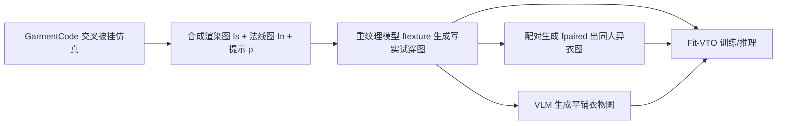

## 一句话总结

针对虚拟试穿只会"贴衣服纹理、不管尺码合身度"的通病，本文用物理仿真加生成式重纹理造出首个大规模、带精确身体/衣物尺寸标注的试穿数据集 FIT（113 万条三元组），并训练了一个能按尺码渲染出真实"松紧合身度"的基线模型 Fit-VTO。

## 研究背景

- 领域现状：得益于生成模型，近年虚拟试穿（VTO）在合成逼真试穿图上进步显著，能把衣物外观较好地迁移到人身上。
- 核心痛点：现有方法几乎只做外观迁移，忽略了试穿体验里最关键的一环——合身度（fit），也就是"这件衣服穿我身上到底是松是紧"。根源是缺少带精确身体与衣物尺寸标注的数据集，尤其缺"不合身"（ill-fit，衣服过大或过小）的样本。现有数据集多是爬电商目录图，天生只有"穿得正合适"的例子；同时也缺少配对训练数据（同一人同一姿势穿不同衣服）,导致方法只能退化为自监督重建或依赖有瑕疵的伪三元组。
- 本文 idea：既然真实数据难采集，就转向可控的合成管线。用 GarmentCode 程序化生成带真值尺寸的 3D 衣物并物理仿真披挂到各种体型上（天然覆盖各种松紧），再用保几何的生成式重纹理把合成渲染变成照片级真实图像，从而批量造出带精确尺寸标注、且天然配对的试穿三元组。

## 方法

整体分两部分：先造数据（FIT 数据集生成管线），再基于数据训练一个尺码感知的试穿模型 Fit-VTO。数据管线的主干是"3D 仿真 → 重纹理 → 配对生成 → 平铺衣物图"，模型部分则是在 Flux.1-dev 上用测量编码器替换文本条件。

关键设计：

1. **GarmentCode 交叉披挂（cross-draping）造不合身样本**：从一个衣物模板对多种体型生成缝纫样板，再把某尺码的样板披挂到另一尺码的身体上，从而制造出"紧身/宽松"甚至极端不合身（如 3XL 衣服套在 XS 身上）的场景。直接跨体型披挂会因初始 3D box-mesh 仍对齐原体型而严重错位、仿真崩溃，作者提出把 box-mesh 面板先显式对齐到目标体型再仿真来解决；并把上下装分两步披挂以获得自然的层叠与"衣摆外露"效果。整套流程能从 2D 样板直接程序化读出厘米级真值尺寸（衣长、胸围、袖长等 5 项衣物量，身高、胸、腰、臀 4 项身体量）。

2. **保几何的合成到写实重纹理**：合成渲染缺真实感（光头、赤脚、面料统一）。作者以表面法线图作为跨域桥梁，微调 Flux.1-dev 得到 $$\hat{I}_{\text{try-on}} = f_{\text{texture}}(I_n, p)$$，在严格保住衣物与身体几何的前提下生成写实纹理。为弥合域差，用 Nano Banana Pro 给合成图补画脸、头发、鞋子后重估法线并缝合回原法线图；靠文本提示补出口袋、纽扣、接缝等细节，并从 72 种面料里采样注入提示；训练时对法线图做随机模糊增广以模拟合成法线的平滑感。

3. **配对人物图生成（同人同姿势、异衣物）**：利用仿真的可控性，固定体型与姿势、披挂两件不同衣物，得到成对的渲染/法线/掩码/提示。用条件修复模型 $$I_p = f_{\text{paired}}(I_{id}, I'_n, p')$$ 生成配对图，其中身份图 $$I_{id} = I_{\text{try-on}} \odot (\neg m_g \cap \neg m'_g)$$ 保留皮肤与背景、遮掉两件衣物区域，让 $$f_{\text{paired}}$$ 充当几何引导的修复器。实际把 $$f_{\text{texture}}$$ 与 $$f_{\text{paired}}$$ 训成一个模型，随机丢弃 $$I_{id}$$。平铺衣物图 $$I_g$$ 则用现成 VLM（Nano Banana Pro）当"虚拟脱衣"模型从试穿图生成。

4. **Fit-VTO：测量条件化的试穿模型**：在 Flux.1-dev（120 亿参数、MMDiT 骨干、流匹配）上只微调 LoRA。人物图 $$I_p$$ 与噪声目标 latent 按通道拼接（像素对齐），平铺衣物 latent 按序列维拼接。关键是移除 CLIP/T5 文本条件，换成自定义测量编码器：把人体与衣物测量拼成 $$m = [m_p, m_g] \in R^7$$，做 8 频带 Fourier 特征映射到 $$R^{7 \times 16}$$，经 MLP 投影到隐藏维，再以带位置编码的 cross-attention 注入单/双流块，替代原文本条件。

## 实验结果

主实验为在真实 VITON-HD 与合成 FIT 两个测试集上，与相关方法及消融版本比较试穿质量与尺码保真度（IoU 衡量合成衣物掩码与真值的交并比，仅 FIT 集有尺寸条件）。

| 方法 | VITON-HD SSIM↑ | VITON-HD FID↓ | FIT SSIM↑ | FIT FID↓ | FIT IoU↑ |
|------|------|------|------|------|------|
| Any2AnyTryon | 0.758 | 14.186 | 0.819 | 25.059 | 0.783 |
| Nano Banana Pro | 0.552 | 11.344 | 0.785 | 19.926 | 0.792 |
| COTTON | 0.615 | 39.117 | 0.759 | 29.716 | 0.739 |
| IDM-VTON | 0.849 | 9.115 | 0.739 | 31.229 | 0.789 |
| Ours（无 FIT 数据） | 0.817 | 11.499 | 0.852 | 16.427 | 0.844 |
| Ours（文本编码器） | 0.763 | 11.367 | 0.911 | 11.624 | 0.932 |
| Ours（仅 FIT 数据） | 0.732 | 14.651 | 0.912 | 11.248 | 0.952 |
| Ours（完整） | 0.817 | 11.391 | 0.914 | 10.381 | 0.955 |

完整版 Fit-VTO 在 FIT 上几乎全指标最优，尤其尺码感知的 IoU 达 0.955，明显超过带尺寸条件的 COTTON。VITON-HD 上 IDM-VTON 因直接在该集训练略强，但本文再加 VITON-HD 微调后可追平。消融显示：仅用带 VLM 预测尺寸的真实数据（无 FIT）会导致 IoU 明显偏低，说明学不到准确合身度；用预训练文本编码器替代测量编码器同样 IoU 低，说明文本编码器不擅长表达结构化数值尺寸；只用 FIT 数据则在真实 VITON-HD 上泛化退化（过拟合到 FIT 的衣物与姿势）。三者结合才兼顾真实图鲁棒性与尺码敏感性。配对图生成上，本文的 Masked L1 身份保持指标 $$L_{id}$$ 为 1.61，优于 VLM 基线（4.45）、VTO 基线（2.29）与修复基线（3.91）。

## 亮点与局限

- 亮点：
  - 首个大规模、带精确厘米级身体/衣物尺寸标注、并覆盖极端不合身场景的试穿数据集（113 万训练三元组），并提供配对人物图，直接解决了 VTO 长期缺配对监督的痛点。
  - 用物理仿真提供真值几何、生成式重纹理弥合合成到真实域差，绕开了 2D 伪三元组的误差累积；交叉披挂 + box-mesh 重对齐是让极端不合身仿真不崩的关键工程点。
  - 用 Fourier 特征测量编码器替换文本条件，让扩散模型真正"读懂"结构化数值尺寸，尺码可控性显著。
- 局限：
  - 仅限上半身衣物、正面标准视角与随意姿势，回避了复杂碰撞动力学；结构多样性受 GarmentCode 能力上限约束，做不了多层复杂服装。
  - 难以表现"紧"的不同程度——很紧和非常紧在仿真外观上几乎都贴合皮肤、区分不开。
  - 模型对测量间相关性敏感，难以独立调节单一测量（如加宽常连带略微加长、加袖长）。

## 延伸思考

这篇本质是"用可控合成数据教会生成模型尊重物理量纲"的范式实证：当真实标注稀缺时，物理仿真提供几何真值、大生成模型负责补真实感，二者接力比纯 2D 伪标注更可靠。其"法线图作跨域桥梁 + 身份图引导修复造配对数据"的思路，对其他缺配对监督的编辑类任务（换装、换发、姿态编辑）都有借鉴意义。值得追问的是：合成分布与真实分布的差距是否会在更复杂服装/姿态下放大；以及测量条件从"独立可控"角度看仍受数据相关性拖累，未来能否通过解耦式的尺寸表征或更均衡的采样来缓解。下一步作者也指向下装、连衣裙与更丰富的姿态视角，这将真正检验该合成到真实范式能否 scale 到 in-the-wild 场景。
