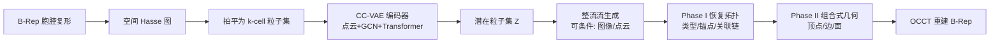

## 一句话总结

把 B-Rep（边界表示）从"顶点—边—面"的层级图结构"拍平"为一组无序、带空间锚点的 **k-cell 粒子集合**，再用流匹配统一生成几何与拓扑，从而在保证有效性的同时支持无条件生成、单图/点云重建、局部补全和非流形结构合成。

## 研究背景

B-Rep 是 CAD/CAM 的事实标准，它把连续参数曲面和离散拓扑关系严格绑在一起，形成一个异质的几何胞腔复形（geometric cell complex）。这种"几何与拓扑纠缠、不同阶胞腔（k-cell：顶点、边、面）交织"的结构，恰好和擅长处理同质、网格化或集合化数据的现代生成模型格格不入。

已有直接生成 B-Rep 的方法分两类，各有硬伤：

- **层级/级联方法**（BrepGen、SolidGen、DTGBrepGen 等）按自顶向下或逐元素的顺序生成实体。顺序依赖导致**误差累积**——早期几何偏差会向下游传播，造成断裂的环或无效面，且缺乏全局视野，局部编辑往往要重新生成整条序列。
- **整体式方法**（如 ComplexGen）试图并行重建整个复形以捕捉全局一致性，但它把拓扑实体当作**抽象图节点**加潜在属性，忽视了 B-Rep 的空间嵌入本质，只能靠软注意力去逼近边界约束，缺少精确几何对齐的结构性保证。

作者的关键观察是：B-Rep 不只是抽象拓扑图，它是**严格空间嵌入**的——拓扑连接性与欧氏邻近性高度相关。因此离散关系可以被压缩进连续、空间局部化的属性中。

## 方法

核心是把层级复形重新表述为无序粒子集合，再分两阶段实现：先用 VAE 学粒子潜空间，再用流匹配生成粒子。

### 组合式 k-Cell 粒子（KCP）

先把复形 $C = V \cup E \cup F$ 抽象为其 **空间 Hasse 图** $G=(N,I)$，节点是各胞腔、有向边是拓扑关联（包含关系），然后"拍平"成 $N$ 个异质粒子的无序集合 $P=\{p_i\}_{i=1}^{N}$。每个粒子定义为：

$$p_i = (x_i, c_i, \boldsymbol{h}_i)$$

其中 $x_i \in \mathbb{R}^3$ 是空间锚点（几何质心，对顶点即坐标，对边/面作为几何代理），$c_i \in \{0,1,2\}$ 是胞腔维度（点/边/面），$\boldsymbol{h}_i \in \mathbb{R}^D$ 是编码局部几何与拓扑上下文的潜在特征。

关键设计是**组合式解码**：高阶胞腔的几何不独立定义，而是结构性地复用其低阶邻居的特征。$k$-cell 的几何 $\Phi_i$ 依赖于其边界 $(k-1)$-cell：

$$\Phi_i = \mathcal{D}_\theta\left(z_i, \{\Phi_j \mid j \prec_I i\}\right)$$

相邻胞腔在共享界面上复用相同潜变量，从而为几何连续性注入强归纳偏置，天然促成边界的无缝对齐。

### CC-VAE（组合式胞腔 VAE）

- **拓扑感知编码器**：三级信息聚合。① 局部几何注入——以锚点 $x_i$ 为 query、稠密表面点云为 key/value 做交叉注意力，配傅里叶位置编码保留高频细节；② 拓扑上下文聚合——用 2 层 GCN 沿关联链 $I$ 传播特征，输入还含胞腔类型嵌入、拉普拉斯位置编码（区分空间相邻但拓扑不同的节点）和真值旋转矩阵；③ 变分编码——Transformer 编码器输出后验分布参数 $(\boldsymbol{\mu}_i, \boldsymbol{\sigma}_i)$，用 KL 散度正则化。
- **组合式几何解码器**（两阶段）：
  - Phase I 恢复空间 Hasse 图——预测粒子类型与锚点坐标，并用链路预测头（对 $[\tilde{z}_i,\tilde{z}_j]$ 做 MLP，配 Binary Masked Focal Loss）重建关联边集 $I$。
  - Phase II 组合式几何实现——顶点由锚点直接给出；边用相对有理三次贝塞尔曲线（由两端点顶点加内部控制点定义以保证连通性）；面用规范形变——在预测的局部坐标框架 $T_f$ 内形变 2D 模板，聚合边界粒子经 PointNet 得空间上下文，最终：

$$S(u,v) = T_f \cdot \mathrm{MLP}_{\mathrm{surf}}\left([u, v, \tilde{z}_f, \boldsymbol{h}_{\mathrm{spatial}}]\right)$$

### 整流流生成

把复杂流形映射到简洁集合 $Z$ 后，用整流流（Rectified Flow）学一条 ODE，把高斯先验 $\pi_0=\mathcal{N}(0,I)$ 沿直线路径 $z_t = t z_1 + (1-t) z_0$ 输运到数据分布。训练用固定粒子预算 $N=256$（不足者随机复制补齐），推理时按潜空间欧氏距离聚类去冗余以恢复真实粒子数。条件生成采用受 MM-DiT 启发的双流架构，图像用 DINOv2、点云用 Sonata 编码。

## 实验结果

在 DeepCAD 与 ABC 数据集上与 SOTA 直接生成方法对比。方法在 ABC 上取得最佳有效性与拓扑复杂度（Cyclomatic Complexity, CC），在质量与复杂度间取得平衡。

| Method | Dataset | 1-NNA↓ | MMD↓ | JSD↓ | COV↑ | Valid↑ | CC↑ |
| --- | --- | --- | --- | --- | --- | --- | --- |
| BRepGen | DeepCAD | 64.37 | 1.40 | 1.47 | 68.94 | 59.84 | 8.90 |
| DTG-BRepGen | DeepCAD | 57.46 | 1.38 | 0.76 | 70.41 | 87.23 | 9.04 |
| Ours | DeepCAD | 60.58 | 1.38 | 1.49 | 68.41 | 86.68 | 11.21 |
| BRepGen | ABC | 67.61 | 1.84 | 2.44 | 63.02 | 40.32 | 10.51 |
| DTG-BRepGen | ABC | 63.40 | 1.81 | 1.13 | 63.98 | 62.14 | 9.78 |
| Ours | ABC | 63.02 | 1.74 | 0.66 | 64.32 | 66.50 | 12.92 |

补充发现：用 min-$k$ 有效率（至少含 $k$ 个面的样本有效性）评估时，基线在 $k=7$ 处急剧下滑（暗示其平均有效率被 6 面立方体等平凡形状抬高），而本方法随 $k$ 增大持续领先。推理时缩放也很关键——训练上限 256 个粒子，但推理时增加初始粒子数（256→512→1024）可显著提升有效率（DeepCAD 68.64→86.68，ABC 51.32→66.50），呈现"无需重训即可用算力换保真度"的缩放规律。方法还能泛化到卫星屋顶开放曲面重建和无条件家具线框合成等非实体拓扑。

## 亮点与局限

亮点：

- **统一表示**把异质层级图变成可扩展的集合预测问题，解耦了刚性层级，实现几何与拓扑的全局联合生成。
- **组合式共享**在空间锚定的界面复用边界特征，为几何连续性提供结构性归纳偏置，而非依赖脆弱的软注意力。
- **空间可编辑性与泛化**：显式且局部化的粒子集天然支持局部补全（线框到实体的 in-painting）、多模态条件生成和非流形结构，无需改动架构。
- **推理时缩放**：集合式无序表述让模型可外推粒子数，学到的是连续几何场而非固定离散模板。

局限：

- 即使拓扑有效的样本，仍可能出现几何异常（褶皱面、边界越界）。
- 显式编码所有 $k$-cell 使潜空间比基于图元的方法更大，增加计算开销，可能限制稠密形状的可扩展性。
- 本文聚焦拓扑表达力，未集成可微解析求解器来施加严格几何约束——作者视其为独立的研究方向。

## 延伸思考

- 把 B-Rep 的"拓扑即空间邻近"直觉抽象为粒子场，本质上是用空间局部性替代显式图约束。这一思路是否能迁移到其他"几何+离散结构"纠缠的问题，如网格的半边结构、装配体的配合关系？
- "增加粒子数换保真度"的推理时缩放很有意思，它把生成有效性从架构容量问题转成了采样预算问题；但更大的潜空间与计算开销之间的权衡，可能是未来在稠密工业零件上落地的主要瓶颈。
- 缺少严格解析约束意味着输出仍需 OCCT 后处理拟合与装配。若能把可微解析曲面求解器接进流匹配框架，或许能直接产出可直接进入 CAM 流程的精确模型。
