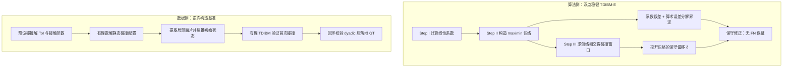

## 一句话总结

本文提出了首个针对参数曲面（张量积 Bézier 面片）的浮点稳健连续碰撞检测（CCD）框架：通过把误差拆解为"系数误差"与"算术误差"两路分别界定，在保证不漏检（无假阴性）的前提下控制开销；同时用"逆向构造 + 有理数精确算术"造出带精确真值的基准数据集，系统评测了各类参数曲面 CCD 方法的稳健性。

## 研究背景

- 领域现状：连续碰撞检测在仿真与建模中用于精确判断物体在一个时间步内的最早碰撞时刻与位置。针对三角网格的稳健 CCD 已相当成熟（要么用精确几何计算给出严格布尔判定，要么推导累积浮点误差上界做保守判断）。参数曲面上目前性能可用的方法是 Chen 等人 2024 年提出的时间相关包含法（TDIBM）。
- 核心痛点：参数曲面的稳健 CCD 仍是空白，原因有二。其一是表示复杂——参数曲面碰撞查询没有闭式解，难以符号化地算出真值或穷举测试用例；其二是算法敏感——先进方法依赖大量数值分支决策，微小浮点扰动就可能翻转分支、破坏几何拓扑，传统的"累积误差上界"分析在这里失效。漏检（假阴性 FN）会导致穿透和锁死，后果严重；误检（假阳性 FP）只影响性能，相对可接受。
- 本文 idea：一方面改造 TDIBM，用一套贴合其结构的误差分析——把误差分解为系数误差与算术误差两路，各自保守界定并做预处理式的保守修正，从而在有拓扑失效风险时仍能保证无 FN；另一方面"反着做 CCD"来造数据集——从预设的碰撞结果反解出满足条件的曲面配置，全程用有理数精确算术，得到零数值伪影的精确真值基准。

## 方法

整体框架分两条主线：一条是算法侧的浮点稳健化，围绕 TDIBM 求解 max/min 包络相交这一核心步骤做误差界定与保守修正；另一条是数据侧的基准构造，通过逆转 CCD 流程生成带精确真值的测试用例。

关键设计：

- **误差来源的解耦（核心思想）**：TDIBM 在精确算术下只会产生 FP、不会漏检；但浮点运算会引入误差，尤其 Step II/III 里大量基于浮点比较的分支决策一旦被误差污染，就可能改变包络的拓扑结构、产生非多边形的错误几何。作者的关键做法是把不可联合分析的误差解耦：在包络构造中把总误差写成 $$\epsilon_{\text{constr}} \le \epsilon_{\text{coeff}} + \epsilon_{\text{arith}}$$，其中一路假设凸包精确、只算系数不精确带来的误差，另一路假设系数精确、只算浮点算术带来的误差。这样即便存在潜在的拓扑失效，也能保守地界住总误差。

- **包络构造的保守修正**：基于 Wang 2014 的误差界定理（对仅含加减乘的函数 $$f$$ 有 $$\epsilon_f = \lvert f - \hat{f} \rvert \le B_f[(1+\epsilon)^{k_f} - 1]$$），作者对判断线段取舍的量 $$\Phi$$、$$\phi$$ 推出误差界，并把判据从"$$\Phi < 0$$、$$\phi < 0$$"收紧为"$$\Phi < -\epsilon_\Phi$$、$$\phi < -\epsilon_\phi$$"。这样宁可漏掉合法线段、也不错误地加入线段破坏凸性；漏线造成的最大偏差可被界住，最后把 max 包络整体上移 $$\epsilon_{\text{constr}}$$（min 包络对称下移）以保证保守性。

- **包络相交的"拉开"策略**：在求两条包络相交时，如果直接用误差界去扩展解区间，会遇到近平行线段处误差被放大的难题（$$c_\beta^{(2)} - c_{\alpha+1}^{(1)} \to 0$$ 时偏差剧增），既难分析又费算力。作者绕开它：给 max 包络上拉、min 包络下拉一个偏移 $$\delta = 2\Delta_d[(1+\epsilon)^4 - 1]$$，用拉开后的包络求交，从而不被误差放大影响，稳健地避免因误判交点而在下一次迭代中过早收缩解区间导致 FN。

- **逆向构造的精确真值数据集**：不像传统做法从随机配置正向算真值（Mathematica 对参数曲面因非孤立接触可能算一天），作者反转流程——先采样碰撞时刻与接触点参数，再用线性约束（含法向反平行/切向正交等条件）解出满足碰撞的控制点位置与速度，回溯初始状态，并用有理数 TDIBM 验证"这确实是首次碰撞"。为保证结果能无损写回 double，全程维持 dyadic 有理数（形如 $$p/2^k$$）：精选 dyadic 输入、用 Cramer 法则枚举 $$2\times 2$$ 子矩阵求解、最后做有理数到 double 再回有理数的回环校验（实现中丢弃率为 0%）。数据集覆盖常见的面-面（FF）碰撞与五类退化角落情形（EF/EE/VF/VE/VV），并为每类生成 near-hit 与 near-miss 的运动学退化变体。

## 实验结果

作者在自建基准（共 24246 个用例，全部用三角二次 Bézier 面片、有理数精确算术构造）上评测四类方法：传统包含法（Trad.）、原始 TDIBM、带启发式拉开的 TDIBM-H（拉开因子 $$10^{-16}/10^{-12}/10^{-8}$$）、以及本文的误差界增强版 TDIBM-E。由于局部提取使面片趋近共面（包含法的最坏情形之一），所有方法耗时都明显上升；Trad. 甚至在 FF 场景要分钟级、且内存开销大到只能跑子集。

核心结论是稳健性对比——TDIBM-E 在全部六类场景消除了所有假阴性，且运行时间与经验最优的 TDIBM-H（$$10^{-12}$$）相当。下表按场景列出各方法的假阴性数（FN，"漏检数/总数"）：

| 场景 | TDIBM | TDIBM-H (1e-16) | TDIBM-H (1e-12) | TDIBM-E（本文） |
|------|-------|-----------------|-----------------|-----------------|
| Face-Face | 0/6603 | 0/6603 | 0/6603 | 0/6603 |
| Edge-Face | 0/1120 | 0/1120 | 0/1120 | 0/1120 |
| Edge-Edge | 135/1100 | 20/1100 | 0/1100 | 0/1100 |
| Vert-Face | 212/1100 | 22/1100 | 0/1100 | 0/1100 |
| Vert-Edge | 452/1100 | 196/1100 | 0/1100 | 0/1100 |

可以看到，越退化的接触（顶点参与的 VF/VE）越容易触发漏检：原始 TDIBM 在 VE 场景漏检达 452 例，启发式 $$10^{-16}$$ 仍漏 196 例；而拉得过大的 $$10^{-8}$$ 虽压住 FN 却带来过度保守、更多 FP 与更长运行时。TDIBM-E 则同时做到理论可靠与实用稳健：FN 全清零，FP 数与 TDIBM/TDIBM-H 相当或更少，运行时开销仅有轻微增加（误差界计算不会在最坏情形下造成不成比例的拖慢）。

## 亮点与局限

- 亮点：
  - 首个对参数曲面 CCD 给出浮点稳健性保证的框架，且"系数误差 / 算术误差"分解的思路巧妙地绕开了传统累积误差分析在拓扑失效面前失效的困境。
  - 逆向构造 + dyadic 有理数的数据集方法既有理论上的精确真值保证，又能规模化生成（含精心设计的退化角落用例），填补了高阶表示 CCD 缺乏可靠基准的空白。
  - 稳健性提升几乎不以性能为代价，运行时与经验调参的启发式相当。

- 局限：
  - 数据集聚焦于孤立点接触，未覆盖流形/面接触等曲线或区域接触场景——作者指出这需要根本不同的代数设计。
  - 更具挑战性的角落用例的系统化构造仍是开放问题；基准的"压力测试"深度还有拓展空间。
  - 实验设置下面片趋近共面属于包含法的最坏情形，绝对运行时较高，实际多面片模型中的表现需结合具体场景看待。

## 延伸思考

这项工作把"几何算法在浮点下如何既稳健又可评测"做成了一个可复用的范式：算法侧用误差解耦 + 保守预处理换取无漏检保证，数据侧用"逆问题 + 精确算术"造真值。类似思路值得迁移到其他缺乏闭式真值的几何/仿真问题（如高阶曲面求交、布尔运算、隐式曲面接触）。此外，无 FN 保证对布料、薄壳等强接触仿真尤为关键——它直接决定了穿透与锁死能否被杜绝；后续若能把面接触/曲线接触也纳入精确基准，将让参数曲面 CCD 的稳健性评测更完整。代码与数据集据论文将于录用后公开。
