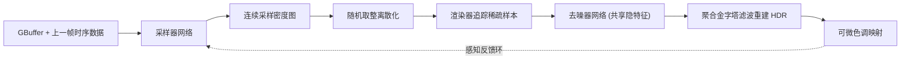

## 一句话总结

针对实时路径追踪普遍低于 1 spp 的极稀疏采样场景，本文提出首个端到端的"自适应采样 + 去噪"管线：用**随机取整**把离散采样决策变得可微，配合**色调映射感知的感知损失**与**聚合式金字塔滤波器**，让网络学会把有限采样预算投到人眼最在意的地方，全面超过超分辨率与已有自适应采样方法。

## 研究背景

- 领域现状：实时物理渲染受限于单位时间能算的光线数量。为了在高分辨率、高帧率下维持性能，工业界普遍用**超分辨率**（DLSS/FSR/XeSS 这类，低分辨率渲染再上采样）来省算力；路径追踪场景下常再叠一个去噪器。
- 核心痛点：超分辨率对全图**一刀切地牺牲空间细节**，无法根据噪声、重建难度、感知重要性的空间差异区别对待。自适应采样本来是更好的选择，但已有端到端方法依赖的梯度近似在稀疏区间（<2 spp）会崩，训练不稳定；同时它们的损失函数与人眼感知不对齐，导致该采的地方没采、不该采的地方过采。
- 本文 idea：既然全路径追踪允许把样本放到图像任意位置，就训练一个采样器 + 去噪器联合网络，专攻 sub-1-spp 区间。要做成需要闯三关：让离散采样可微、让优化目标对齐感知、让去噪器适配稀疏输入。

## 方法

整体框架：给定 GBuffer 特征（深度、法线、albedo）与上一帧的时序数据，**采样器网络**预测一张连续的采样密度图；经过随机离散化后，渲染器按需追踪样本，产出稀疏含噪图像；**去噪器网络**（与采样器共享隐特征）预测聚合金字塔滤波器的权重，重建 HDR 图像；输出经色调映射用于显示，并反馈回采样器，形成感知反馈环。采样器与去噪器均为 U-Net 编解码结构，采样器瓶颈处带一个全局摘要模块聚合全图统计量。

关键设计：

1. **随机取整实现可微稀疏采样（核心贡献）**。作者把采样分配重新理解为"探索—利用"问题：密度 0.3 spp 的像素不该和 0.0 spp 一样被四舍五入成 0。做法是把小数密度当概率——对每个像素总是分配整数部分 $$\lfloor \boldsymbol{s}_i \rfloor$$ 个样本，小数部分 $$\boldsymbol{p}_i = \boldsymbol{s}_i - \lfloor \boldsymbol{s}_i \rfloor$$ 作为再采一个样本的概率。关键在于噪声估计**用密度 $$\boldsymbol{s}_i$$ 而非实际样本数归一化**：
$$\boldsymbol{L}^{\text{noisy}}_i = \frac{\sum_{j=1}^{\lfloor \boldsymbol{s}_i \rfloor} \boldsymbol{S}_{i,j} + \boldsymbol{L}^{h}_i}{\boldsymbol{s}_i}$$
   这样估计对整个密度范围都无偏（$$\mathbb{E}[\boldsymbol{L}^{\text{noisy}}_i] = \mathbb{E}[\boldsymbol{S}_i]$$），且天然带逆方差加权，即使 $$\boldsymbol{s}_i \ll 1$$ 也良定义。

2. **松弛的随机取整估计器**。精确求梯度需要对每个不连续点做边缘采样，成本过高。作者不用 Gumbel-Softmax（其 sigmoid 尾部会让亮样本"漏光"，造成训练—测试不一致），而是设计一个**基座恰好落在采样阈值上的裁剪线性斜坡**，用温度参数 $$\lambda \ge 1$$ 控制斜率，并用系数 $$h = \frac{2\lambda}{2\lambda - 1}$$ 补偿使期望保持不变。$$\lambda \to \infty$$ 时退化为硬阶跃；实践取 $$\lambda = 10$$。与有限差分参考对比，该估计器最接近真实梯度、偏差最小，训练最稳（作者称数百次实验几乎不发散）。

3. **色调映射感知训练**。低预算下重建误差本身就大，线性 HDR 空间的逐像素损失（L1/L2/SMAPE）与人眼不符——暗区被严重高估导致过采，亮区又忽略视觉增益控制。作者把可微的参数化**电影胶片色调映射算子**（带 toe/shoulder 压缩、曝光/对比度/饱和度增广）作用到输出与参考上，再在 sRGB 域用最新感知度量 **MILO** 计算损失。训练时给采样器喂上一帧的色调映射结果，使其自动适应显示后的观感；推理时可换任意（甚至不可微的）色调映射算子。

4. **聚合金字塔滤波 + 学习式解调**。稀疏输入下，传统"散射式"核预测让大多数像素的核失效、任务分布极不均衡；作者改用**聚合式**核——每个输出像素主动去邻域收集稀疏样本，任务在全图均匀分布，稀疏时更稳定。金字塔用普通下采样构建、5 级各预测 5×5 聚合核，全分辨率再预测时序核。同时用**学习式解调**替代传统 albedo 解调：网络自己预测逐像素三通道解调图，不依赖渲染器给出数学上精确的 albedo 分解，从而能处理体积、测量 BRDF、神经材质以及含运动模糊/景深的带噪 GBuffer。

## 实验结果

在 9 个动画场景（1440p，参考图 6144 spp）上，与超分辨率（DLSS 4 Ray Reconstruction、JNDS）、稀疏均匀去噪（NPPD）、自适应采样（NTASD、SAUDC、RLSNAS）对比。下表为最常用的 50% 超分等效预算（即 0.25 spp）主对比：

| 类别 | 方法 | PSNR↑ | MS-SSIM↑ | HaarPSI↑ | MILO↑ | CVVDP↑ |
|------|------|-------|----------|----------|-------|--------|
| 超分辨率 | DLSS | 22.88 | 0.8950 | 0.6195 | 2.506 | 6.349 |
| 超分辨率 | JNDS | 21.92 | 0.8657 | 0.5370 | 2.276 | 5.621 |
| 稀疏均匀 | NPPD | 23.92 | 0.9062 | 0.6139 | 2.534 | 6.393 |
| 稀疏均匀 | 本文 Uniform | 24.64 | 0.9183 | 0.6532 | 2.640 | 6.753 |
| 自适应 | SAUDC | 23.09 | 0.8848 | 0.5645 | 2.250 | 5.965 |
| 自适应 | 本文 Adaptive | **25.41** | **0.9273** | **0.6815** | **2.677** | **7.056** |

本文自适应版在全部六项指标上都居首。几个补充结论：

- **预算缩放**：从 0.44 spp 一路降到 0.11 spp（平均约每 9 个像素才 1 个样本），本文都保持优雅退化。在 0.11 spp 时达到 24.26 dB PSNR，而 DLSS 仅 21.74、SAUDC 22.39。1 spp 以上同样持续领先，4 spp 时 28.51 dB。
- **稳定性对比**：NTASD 在 2 spp 训练 10 次都发散、1 spp 连一个 epoch 都跑不完；SAUDC 换用本文的随机取整公式后才能在全预算范围训练。
- **分辨率缩放**：分辨率越高，自适应相对均匀采样的优势稳定保持约 0.7 dB PSNR；样本增益随分辨率增大而增大。
- **稀疏 vs 超分**：把本文均匀版换成低分输入会掉到 24.16 dB 但仍是 SOTA；恢复高分 GBuffer 能补回大部分质量（24.40 dB），说明高分辨率法线/深度/albedo 对稀疏重建价值很大。
- **消融**：损失公式（换成 SMAPE）与循环特征影响最大；聚合金字塔优于散射式；本文梯度估计器在稳定性与精度间最平衡。
- **实时性**：换用 2.6M 参数的 JNDS 实时网络（Mini 版），仍超过用 15M 大网络的最强基线 NPPD，说明贡献对小网络也有效。渲染时间上，1 spp 均匀路径追踪约为 GBuffer 渲染的 20–30 倍，自适应带来的开销约 5%。

## 亮点与局限

- 亮点：
  - 随机取整这一形式化优雅地解决了"离散采样不可微"这个卡住整个方向的老问题，且保持无偏、天然带逆方差加权，把有效自适应采样从 >2 spp 推进到 0.11 spp。
  - 训练极其稳定（作者称数百次实验几乎不发散），而多个基线在低预算下频繁发散。
  - 把感知损失（MILO）+ 可微色调映射引入采样分配，真正让"把样本花在人眼在意处"变成可优化目标；鲁棒性分析显示自适应"输"的地方都是低对比平滑区、"赢"的地方都是感知关键细节。
  - 学习式解调摆脱了对渲染器精确 albedo 分解的依赖，对神经材质/体积/带噪 GBuffer 更友好。

- 局限：
  - 主评估用的是 15M 参数大网络，作者自己承认没深入研究实时架构，真正的实时落地仍待验证（虽给了 Mini 版佐证）。
  - 去噪器仍是 CNN，随分辨率提升，per-pixel 指标下降比 DLSS 的 transformer 架构更明显。
  - 时序项仍靠手工设计的 max 组合损失，作者预期未来会被视频版感知度量取代；采样器还要花不少容量去补偿镜面反射的不可靠运动向量和检测 disocclusion。
  - 学习式解调移除后聚合指标反而略升，说明该组件尚不完美，主要价值在饱和 albedo 区域的色彩伪影。

## 延伸思考

- 这条路线本质是"渲染预算的感知最优分配"，与神经材质、光传输重要性采样、ReSTIR 等方向天然互补——采样器学到的密度图其实是一张"感知误差预测图"，未来或可与更好的重投影/运动向量估计（如 GBuffer-free 帧外插）结合，让去噪器直接预测下一帧的采样需求，从而把采样器做得更轻。
- 随机取整这套"把离散决策当概率、用密度归一化保无偏"的思路，可能迁移到其他离散渲染决策上（如自适应光线深度、按需着色、可变率着色的学习版）。
- 论文标题喊出"忘掉超分辨率"，但实验也显示其贡献（聚合金字塔、学习解调、色调映射感知训练）能反哺超分管线；值得追问的是，在真正受限的消费级实时预算下，自适应采样相对超分的净收益能否覆盖采样器推理与非合并光线追踪带来的额外成本。
