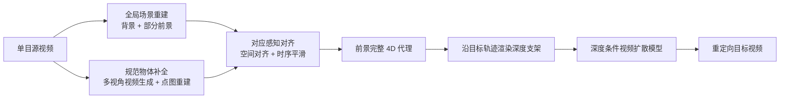

## 一句话总结

FreeOrbit4D 是一个免训练框架，从单目视频中重建出"前景完整"的 4D 代理几何，再把它渲染成深度线索去引导视频扩散模型，从而在大角度（甚至 120°/180° 环绕、子弹时间）相机轨迹下合成忠实且时序连贯的重定向视频。

## 研究背景

- 领域现状：相机重定向（camera redirection）希望从一段单目视频出发，沿用户指定的相机轨迹重放同一个动态场景。借助视频基础模型的生成能力，现有方法主要走两条路——隐式控制（把相机轨迹编码成 learned embedding 或文本提示注入扩散模型）和显式变形（估计深度后把可见像素 warp 到目标视角）。
- 核心痛点：单目视频只捕捉了 4D 世界的一个狭窄时空切片，大角度重定向本质上是欠定问题。隐式控制的可控性太"软"，难以精确跟随复杂轨迹，且依赖昂贵稀缺的配对 4D 训练数据；显式变形只有可见表面，被遮挡区域会留下空洞，只能交给下游生成器"脑补"，在大视角下遮挡区占主导时会崩坏，产生残缺前景（论文里的"半只骆驼"）和几何/语义漂移。两条路都无法同时做到精确相机控制与未见区域的完整可见性。
- 本文 idea：与其让生成器凭空幻想遮挡区，不如显式地把被遮挡的前景几何补全。把动态场景重建和物体几何补全当成两个本质不同的子任务，分别在两个坐标空间里解决，再通过稠密 3D–3D 对应把它们统一成一个前景完整的 4D 代理，用它渲染出的深度当作视频生成的结构支架。整个流程不需要任何训练。

## 方法

### 整体框架

给定单目源视频和目标相机轨迹，FreeOrbit4D 分三步走：先在"全局场景空间"重建静态背景和几何不完整的前景，同时在"规范物体空间"补全前景几何；再通过稠密像素同步的 3D–3D 对应把两者对齐，得到统一的前景完整 4D 代理；最后沿目标轨迹从代理渲染深度支架，喂给深度条件视频扩散模型生成输出。全流程复用现成预训练模型，不做任何针对性训练。

### 关键设计

1. 解耦式 4D 重建（两个坐标空间）。作者观察到"从单目视频重建动态场景"和"补全被遮挡的物体几何"是两类不同任务：前者要时序一致的场景级推理，后者要多视角的物体形状理解。于是分开处理。在全局场景空间，用一个动态感知的前馈网络（VGGT 的时序扩展 PAGE-4D）把整段视频反投影成时序一致的点图，再用 SAM2 分割掩码把背景点云 $$P_{bg}$$ 和部分前景点云 $$\tilde{P}^{fg}_t$$（只含可见表面）分开。在规范物体空间，把每帧抠出的前景序列送进一个物体中心的多视角视频扩散模型（SV4D2.0），合成四个间隔 90° 方位角的同步新视角视频，再用 VGGT 从"源视角 + 四个合成视角"共五个视角重建出完整前景点云 $$\hat{P}^{fg}_t$$。约定用波浪号表示几何不完整、帽子表示几何完整但未对齐。

2. 对应感知对齐（本文核心）。规范空间的 $$\hat{P}^{fg}_t$$ 几何完整但没有场景级定位，全局空间的 $$\tilde{P}^{fg}_t$$ 定位可靠但几何残缺。关键观察是：$$\tilde{P}_t$$ 和 $$\hat{P}_t$$ 都来自同一张源图，同一像素 u 对应同一表面点，因此天然存在稠密的 3D–3D 对应 $$C_t$$。作者不做逐点最小化距离（单目抬升定不准绝对深度尺度，逐点拟合会传播误差），而是只用 $$\tilde{P}^{fg}_t$$ 决定物体在场景中的整体摆放（位置与尺度），保留 $$\hat{P}^{fg}_t$$ 的几何。变换参数化为 $$s_t x + t_t$$，旋转固定（两套重建都以源视角为坐标基准），从对应集里估计每帧的尺度 $$s_t$$ 和平移 $$t_t$$。

3. 时序平滑。单目抬升带来的逐帧深度抖动会通过锚定传播到对齐后的前景轨迹。作者用一个双向卡尔曼滤波（常速运动模型，沿深度方向加更强正则）平滑对齐点云的质心轨迹，同时保留逐帧尺度以维持几何保真度，得到时序连贯的前景序列 $$\{P^{fg}_t\}$$。

4. 几何条件视频合成。拿到统一代理 $$P = P_{bg} \cup \{P^{fg}_t\}$$ 后，沿目标轨迹 $$\{\pi^{tgt}_t\}$$ 渲染深度图，连同源视频首帧（外观参考）和文本提示一起送入深度条件视频扩散模型（Wan2.2-VACE）。深度虽然不是完整几何，但紧凑地编码了目标视角下的度量布局和可见性线索，足以约束跨视角与时序一致性。

## 实验结果

主实验是在多样真实与合成视频（DAVIS、在线视频、VEO/Sora 生成片段）上，用极端偏航/俯仰旋转轨迹与五个 SOTA 方法（ReCamMaster、TrajectoryCrafter、EX-4D、GEN3C、CogNVS）做定量比较，指标含 VBench 感知质量、DINO/CLIP 语义相似度、FID-V/FVD-V 分布保真度，以及 20 人 × 10 序列的用户研究（1–5 分）。

下表摘取"方法 × 代表性指标"的核心对比（↑ 越大越好，↓ 越小越好）：

| 方法 | Subject Consis.↑ | DINO-SIM↑ | CLIP-SIM↑ | FID-V↓ | User Motion↑ |
|------|------|------|------|------|------|
| ReCamMaster | 0.84 | 0.37 | 0.75 | 2.6 | 2.5 |
| TrajectoryCrafter | 0.80 | 0.47 | 0.79 | 2.0 | 3.2 |
| EX-4D | 0.76 | 0.28 | 0.69 | 3.2 | 2.5 |
| GEN3C | 0.79 | 0.43 | 0.75 | 2.3 | 3.5 |
| CogNVS | 0.82 | 0.34 | 0.78 | 3.0 | 3.2 |
| 本文 | 0.88 | 0.65 | 0.84 | 1.7 | 4.5 |

FreeOrbit4D 在 VBench 六项里五项第一（仅运动平滑度 0.96 略输给倾向过度平滑的 ReCamMaster 0.98 和 CogNVS 0.97），并拿下最好的 DINO-SIM、CLIP-SIM 和 FID-V。用户研究里三个维度全面领先，相机运动准确度 4.5 对次优 3.5 拉开明显差距，总体偏好 4.6。作者也指出自动指标不能完全反映轨迹控制质量——有些基线分数不差却偏离了规定路径，这正是做用户研究的动机。

消融方面：从 Baseline 逐步加多视角生成（MVG）和卡尔曼滤波（KF），DINO-SIM 从 0.58 提到 0.65、FVD-V 从 4.1 降到 3.6，证明两个组件都有贡献。另一组"简单推理"消融显示，直接把多视角图与源视频塞进前馈重建网络会因跨帧外观相似而塌缩对应、产生 ghosting，凸显解耦策略的必要性。

## 亮点与局限

- 亮点：
  - 免训练、纯模块化组装现成模型（PAGE-4D、SAM2、SV4D2.0、VGGT、Wan2.2-VACE），不依赖昂贵稀缺的 4D 配对数据。
  - 抓住"场景重建"与"物体补全"是两类任务这一洞察，用两个坐标空间分而治之，再靠"同源同像素即同点"的稠密 3D–3D 对应巧妙缝合，避免了逐点拟合的尺度误差传播。
  - 显式且前景完整的 4D 代理不仅提升大角度重定向质量，还顺带打开外观编辑传播、4D 几何编辑（缩放/组合点云）、以及潜在 4D 数据生成等下游应用。
- 局限：
  - 假设单一主导前景物体 + 大体静态背景；重遮挡的多物体交互或动态背景仍是难点。
  - 模块化系统里上游（分割、多视角合成）的误差会向下游传播。
  - 多阶段流程以质量优先，运行代价高（单 A40 上 45 帧、832 × 480 片段端到端约 50 分钟）。

## 延伸思考

这篇工作代表了"重建接地的生成"（reconstruction-grounded generation）路线的一个务实样本：不追求端到端训一个大 4D 生成模型，而是用几何显式补全去消解欠定性，把生成器降级为"按支架填色"的角色，因此天然免训练、可解释、可编辑。值得追问的是：一，深度作为条件是否损失了太多几何信息，换成法线/可见性掩码或多通道 G-buffer 会不会更好；二，物体中心的多视角扩散（90° 四视角）对细长结构（如秋千绳）和强铰接运动的补全上限在哪；三，50 分钟/片段的代价主要压在哪一级，能否用前馈 4D 预测器替换多阶段重建来换取实用速度。对做动态场景重建或可控视频生成的读者，其"对应感知对齐 + 卡尔曼时序平滑"这套把两套异构重建拼接成时序连贯代理的做法尤其可复用。
