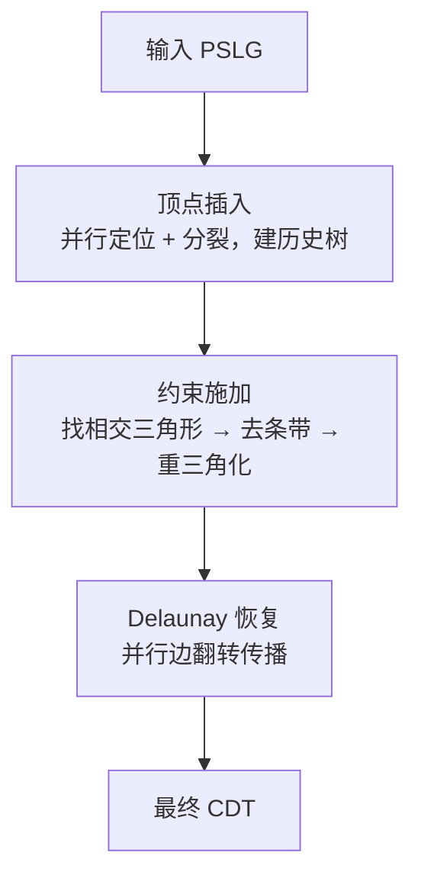

## 一句话总结

本文提出 gCDT，一个面向大规模二维约束 Delaunay 三角化（CDT）的高度并行 GPU 算法，把不规则的 CDT 流程拆解为顶点插入、约束施加、Delaunay 恢复三个可独立优化的批同步阶段，在 NVIDIA RTX 4090 上对上千万顶点输入约 0.1 秒完成，相比此前最优 GPU 方法有数倍加速、相比常用 CPU 实现快约一个数量级。

## 研究背景

- 领域现状：约束 Delaunay 三角化是平面网格生成与平面直线图（PSLG）处理的基础操作，它在保持给定约束线段的同时维持 Delaunay 质量，广泛出现在 CAD 草图/轮廓处理、地形与 GIS 断裂线、多材料界面等场景。理论上存在 $$O(n\log n)$$ 的最优构造，但实际性能常被常数因子、访存开销以及稳健几何判断的代价所主导。
- 核心痛点：GPU 有巨大的吞吐与带宽，但 CDT 难以高效映射——算法充满不规则控制流、动态拓扑更新，且约束施加必须避免竞态与非法中间状态。此前 GPU 方法（如 gDel2D、PCDT）多把约束恢复与边翻转耦合成迭代循环，面对长约束时会出现严重的负载不均与很长的翻转恢复链，导致性能对约束长度高度敏感。
- 本文思路：把约束施加当作一等公民的独立批同步阶段来处理，用"重三角化并缝合"（retriangulate-and-stitch）替代翻转驱动的恢复；同时把顶点插入与边翻转解耦，并用定点整数谓词保证 GPU 上判断的确定性与稳健性。

## 方法

整体框架把输入 PSLG 经三个阶段转成最终 CDT：顶点插入（构造包含所有顶点但尚无约束、无 Delaunay 保证的初始三角化）、约束施加（一趟高度并行地强制所有约束线段）、Delaunay 恢复（迭代翻转非 Delaunay 边）。关键设计是把顶点插入与边翻转解耦，从而简化同步、并留下可复用的插入历史树。

关键设计：

1. **算术基础（定点整数谓词）**：CDT 正确性依赖 $$Orient2D$$ 与 $$InCircle$$ 两个精确谓词。作者不走 GPU 上频繁回退到精确路径的自适应精度方案，而采用定点整数算术：把坐标归一化并量化为 $$b$$ 位有符号整数。位宽分析给出 $$Orient2D$$ 最多占 $$2b+3$$ 位、$$InCircle$$ 最多占 $$4b+4$$ 位；用 128 位求值时由 $$4b+4 \le 128$$ 得 $$b \le 31$$，故实现取 $$b=31$$。约束插入产生的分割点用整数三元组精确表示，谓词求值时统一到公共分母以避免舍入。

2. **并行顶点插入 + 历史树**：插入阶段刻意不做边翻转。每轮两个 kernel——Locate 把尚未插入的顶点定位到宿主三角形，Split 让每个三角形本轮至多插入一个顶点（用 4 字节的 choose 字段，last-writer-wins 即可保证进展）。因为不翻转，三角形被分裂后原先落入其中的点只会移动到至多三个子三角形之一，重定位期望只需常数次谓词测试。分裂后不删除父三角形而是保留并链接子节点，形成一棵三叉的插入历史树；在随机化插入顺序下期望深度对数级，为后续把约束线段映射到相交三角形提供 $$O(\log n)$$ 的快速下降查询。

3. **约束施加（核心）**：分四步。第一步并行找出所有被约束线段相交的三角形，针对"长约束导致单线程遍历三角形过多"的负载不均，作者把长约束切分为若干短段（切分点只用于逻辑分段，不作为新顶点插入），借助历史树独立定位每段起始三角形，再并行地对各段做标准的串行条带行走；线程按约束长度成比例从固定池分配，保证每条约束至少一个线程。第二步对单约束情形做多边形重三角化——约束把相交条带分成两个简单多边形，作者用与单调多边形相关的"距离序三角化"（distance-ordered triangulation），对多边形顶点 $$v_0,\dots,v_n$$（其中 $$(v_0,v_n)$$ 为约束）计算到支撑线的有符号距离

$$\tilde{d}_i = (v_n - v_0) \times (v_i - v_0)$$

再取

$$p_i = \max\{\, j \mid 0 \le j < i,\ \tilde{d}_j < \tilde{d}_i \,\}, \qquad q_i = \min\{\, j \mid i < j \le n,\ \tilde{d}_j \le \tilde{d}_i \,\}$$

则三角形集合 $$\triangle(v_{p_i}, v_i, v_{q_i})$$ 构成合法三角化，具有可预测的并行深度（对比并行耳切最坏退化到近串行）。第三步处理一个三角形被多条约束相交的一般情形，用"可见性剪枝"在单趟内消解冲突：对每个三角形顶点预计算最近/最远约束的小摘要，实现 $$O(1)$$ 的可见性判定，从而剪掉被其他约束遮挡的顶点，得到互不重叠、可并发处理的重三角化区域。第四步修补可见性剪枝在极少数配置下产生的洞——作者证明这些洞都是凸多边形，检测与三角化在并行下都很直接，实际数据上洞很罕见、修补开销可忽略。

4. **并行边翻转（逐线程传播）**：经典 GPU 方案每轮把每条边用 $$InCircle$$ 测试、通过原子操作争抢两个相邻面，仅当在两个面都胜出才翻转。作者观察到运行时主要受访存主导、且大多数翻转集中在前几轮。于是让成功翻转一条边的线程继续在同一局部区域翻转邻边：用逐面原子锁保证并发线程不会翻转共享同一面的边，把工作单元从"单条边"变成受面锁约束的"短翻转链"。为控制成本，每线程用固定容量（如 8）的局部工作表并丢弃溢出，实践中覆盖了绝大多数有利的传播机会。

此外两项优化在保持解耦的前提下提速：粗到细播种（先对小子集算 Delaunay 作为高质量种子网格，减少后续翻转量）与按 Morton 码预排序顶点及三角形以提升缓存一致性和访存合并。

## 实验结果

作者在 NVIDIA GeForce RTX 4090（24 GB，CUDA 12.9）上评测，CPU 基线用 Intel Core i9-13900K；对比对象为 GPU 上的 gDel2D、PCDT 与 CPU 上的 CGAL，运行时均不计预处理。测试涵盖合成集（无约束/带约束）与三个矢量化图像数据集。下表为真实数据集上的端到端运行时对比（单位毫秒，Letters 970K 为秒；"Sp." 为相对 gDel2D 的加速比，"/" 表示 PCDT 未能完成）：

| 数据集 (规模) | gCDT | gDel2D | PCDT | CGAL | Sp. |
|------|------|------|------|------|------|
| Leafs (1.7M) | 112.01 | 213.4 | 349.1 | 3673.64 | 1.91 |
| Leafs (3.4M) | 235.47 | 431.7 | / | 7602.22 | 1.83 |
| Airport (47K) | 36.58 | 211.7 | / | 95.00 | 2.60 |
| Airport (93K) | 88.71 | 533.3 | / | 197.38 | 2.23 |
| Letters (97K) | 129.06 | 1412.6 | / | 201.04 | 1.56 |
| Letters (970K) | 2.273s | 56.07s | / | 3.001s | 1.32 |

补充结论（数字忠于原文）：合成无约束的 Uniform 集上 gCDT 相对 gDel2D 加速 $$1.39\times$$ 到 $$2.82\times$$；Grid 集因谓词计算主导、gCDT 的定点整数谓词优势明显，加速达 $$4.26\times$$ 到 $$6.02\times$$。带约束的 Synthetic-cons 六个用例中 gCDT 运行时从 14.96 ms 稳定到 18.67 ms，几乎不随约束变长而恶化，而 gDel2D/PCDT 显著变慢（PCDT 在最难的 Case 6 需退回双精度）。在封面的 Letters 场景（约 90 万顶点），gCDT 整体较 gDel2D 约快 25 倍，其中约束处理模块快近三个数量级。总体上，gCDT 在约束长或分布稠密时相对 GPU 基线优势最大；相对 CGAL 的优势在大规模输入时最突出，而当 Delaunay 恢复主导运行时差距收窄。

## 亮点与局限

- 亮点：
  - 把约束施加提升为独立的批同步阶段，用"重三角化并缝合 + 负载均衡的分段条带行走"替代长翻转恢复链，使运行时对约束长度基本不敏感，直击此前并行 CDT 的主要瓶颈。
  - 距离序三角化给出可预测的并行深度，并配可见性剪枝在单趟内消解多约束冲突，还给出洞必为凸的证明与轻量修补，构成端到端稳健流程。
  - 解耦顶点插入与边翻转，留下 GPU 友好的插入历史树支持 $$O(\log n)$$ 定位；逐线程翻转传播把工作单元变成受面锁约束的短翻转链，摊薄访存与 kernel 启动开销。
  - 定点整数谓词在 $$b=31$$ 位内给出确定性的 $$Orient2D$$/$$InCircle$$，规避 GPU 上自适应精度频繁回退精确路径的低效，尤其利于长约束带来的近共线配置。

- 局限：
  - 定点流程需把坐标映射到整数网格，浮点输入的量化可能合并邻近顶点、改变近退化配置，结果可能与精确实数实现不同；对精度要求苛刻的应用需额外的预处理校验与后处理一致性检查，此时浮点或自适应精度变体或更合适。
  - 与其他基于翻转的并行恢复一样，对抗性分布会减少可独立翻转的边、增加迭代轮数。

## 延伸思考

- "把不规则恢复过程重写为批同步的重三角化 + 缝合"这一范式，或可迁移到其他需要在并行硬件上强制拓扑约束的几何操作，如平面排布（arrangements）与布尔运算中的重三角化子程序（作者也把这列为后续集成方向）。
- 种子三角化质量直接决定后续翻转工作量，作者当前只用简单的粗到细均匀采样；引入更聪明的种子（如基于密度或各向异性的自适应采样）有望改善最坏情况下的表现。
- 定点整数谓词的 $$b=31$$ 位上限来自 128 位求值预算，随着更宽整数或更高效的多肢仿真在 GPU 上普及，坐标动态范围可进一步放宽，或能覆盖更大尺度、更高精度需求的工业数据。
- 逐线程翻转传播的固定容量工作表（经验值 8）揭示了"局部 1-环传播收益最大、更深传播收益递减"的规律，这一 GPU 上局部性与工作聚合的权衡，或对其他基于局部拓扑操作的并行网格算法有借鉴意义。
