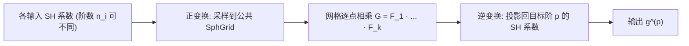

## 一句话总结

本文提出"广义球谐乘积"（Generalized SH Product）这一新表述——允许各输入函数使用不同的球谐阶数、输出阶数可任意截断——并借助**球面网格（Spherical Grid, SphGrid）**作为中间表示把乘积化简为网格点上的逐点相乘，在实时渲染常用的低阶场景下比现有最优方法（SHFFT）快 2.5–6.5 倍且误差更低。

## 研究背景

- 领域现状：球谐（SH）是图形学里紧凑表示低频球面信号的基础工具，广泛用于可见性、环境光照、BRDF 等。以预计算辐射传输（PRT）为代表的实时渲染，核心操作之一就是对多个球谐表示的函数求乘积或乘积积分（如光照 × BRDF × 可见性的三重积分）。
- 核心痛点：现有球谐乘积方法有两大局限。其一是效率不足：传统三重积法复杂度高达 $$O(n^5)$$，当前最优的 SHFFT 方法虽把三重积降到 $$O(n^3)$$，但依赖傅里叶级数和 FFT，在图形学常用的低阶（$$n \le 20$$）下 FFT 的常数开销反而拖慢速度。其二是缺乏灵活性：现有方法**强制所有输入函数共享同一球谐阶数**，可实际渲染中光照、漫反射/高光 BRDF、可见性的频率特性差异很大，只能把所有输入填充到最高阶（浪费算力）或统一压到低阶（引入误差）。
- 本文 idea：定义一个统一的广义乘积算子，输入可各带不同阶数 $$n_i$$、输出可截断到任意目标阶 $$p$$；再引入并扩展 SphGrid 作为中间表示——先把各输入球谐系数转成球面网格上的采样值，网格上逐点相乘，再逆变换回目标阶球谐系数。乘积在网格域退化成最简单的逐点乘法，从而绕开 FFT 的常数开销。

## 方法

整体框架：广义球谐乘积被拆成三步流水线——正变换（SH 系数 → SphGrid 采样值）、网格逐点相乘、逆变换（乘积网格 → 目标阶 SH 系数）。SphGrid 定义为极角 $$\theta$$ 取 Gauss–Legendre 节点、方位角 $$\phi$$ 均匀采样的 $$N_\theta \times N_\phi$$ 网格；关键在于对带限函数，只要网格分辨率选得当，SH 系数与网格采样值之间可以**精确且高效地双向转换**。

关键设计：

1. **广义乘积表述与统一性**。给定 $$k$$ 个带限函数，乘积函数 $$G = F_1 F_2 \cdots F_k$$ 的完整阶数为 $$n_G = \left(\sum_{i=1}^{k} n_i\right) - k + 1$$，输出可截断到任意 $$1 \le p \le n_G$$。这个单一表述统一了两类操作：取 $$p = n_G$$ 得到乘积的完整球谐展开；取 $$p = 1$$ 直接算出乘积积分 $$\int_{S^2} G\, d\Omega$$（很多渲染积分的核心）。传统"所有输入同阶、输出同阶或只取积分"只是它的特例。

2. **SphGrid 双向转换的可分离加速**。球谐基可分解为极角与方位角两个可分离分量 $$y_l^m(\theta,\phi) = C_l^m(\theta) R_m(\phi)$$。利用这一点，正变换先对每个 $$m$$ 预计算内层求和 $$s_m(\theta_i) = \sum_{l=\lvert m \rvert}^{n-1} f_l^m C_l^m(\theta_i)$$，再组合出网格值，复杂度 $$O(n^2 N_\theta + n N_\theta N_\phi)$$。逆变换则在 $$\theta$$ 上用 Gauss–Legendre 求积、在 $$\phi$$ 上用离散傅里叶求和，把网格值投影回 SH 系数，复杂度 $$O(p^2 N_\theta + p N_\theta N_\phi)$$。分离经纬坐标是效率的关键。

3. **精确计算的分辨率充分条件**。作者证明：只要网格分辨率满足 $$N_\theta \ge \lceil (n_G + p - 1)/2 \rceil$$ 且 $$N_\phi \ge n_G + p - 1$$，逆变换即为精确（无损）。为方便配置，用单参数 $$t$$ 控制分辨率：$$N_\theta = \lceil t/2 \rceil,\ N_\phi = t$$。设 $$t = n_G + p - 1$$ 得精确结果，取更小的 $$t$$ 则得到近似变体。

4. **精确/近似的可调权衡**。分辨率低于阈值时，高频分量因采样不足产生近似误差，但计算量与内存显著下降。作者发现对特化多重积近似，取 $$t = 3n - 2$$ 能在低误差与高性能间取得极佳平衡，复杂度降到 $$O(k n^3)$$。因此同一框架通过调 $$k$$、$$p$$、$$t$$ 三个参数即可覆盖三重积/多重积、精确/近似、乘积/积分等各种任务。

## 实验结果

实现于 CPU（C++17）与 GPU（CUDA 12.8），测试平台 AMD R9-9950X + RTX 4090，所测 SH 阶数 $$n \le 20$$ 均无数值问题。核心对比对象是当前最优的 SHFFT 方法。下表汇总两个实时渲染应用（PRT 光泽重光照的三重积积分、Shadow Fields 的多重积积分）中的帧率与相对最优先前方法的加速比：

| 应用 / 场景 | 参数 | 先前最优 (FPS) | 本文 (FPS) | 加速 |
|------|------|------|------|------|
| PRT 重光照 Bunny & Teapot | $$n=10$$ | 31.29 (SHFFT) | 108.29 (精确) | 3.46× |
| PRT 重光照 Dragon & Lucy | $$n=15$$ | 4.41 (SHFFT) | 15.83 (精确) | 3.59× |
| Shadow Fields DNA & Ring | $$k=4, n=10$$ | 25.35 (SHFFT 精确) | 101.68 (精确) | 4.01× |
| Shadow Fields Spider & Scorpion | $$k=6, n=15$$ | 1.56 (SHFFT 精确) | 9.29 (精确) | 5.96× |
| Shadow Fields Bunny & Scorpions | $$k=6, n=12$$ | 8.03 (SHFFT 近似) | 44.75 (近似) | 5.57× |

其余结论用文字补充：在特化截断三重积的微基准中，本文精确法相对 SHFFT 精确平均加速 CPU 5.50×、GPU 4.03×；对多重积，本文精确法在所有设置下都快于 SHFFT 精确，甚至在多数情况快过 SHFFT 的近似法。误差方面，对随机输入和真实场景可见性输入，本文近似法在 $$t = 3n-2$$ 时同时取得比递归近似更低的相对 $$L_2$$ 误差与更高性能；验证了当 $$t \ge n_G + p - 1$$ 时计算精确。广义设置下（如同一场景中茶壶 BRDF 用 11 阶、龙用 5 阶）本文精确法仍能达到 145–177 FPS，而这类不同输入阶的情形是现有特化方法根本无法处理的。

## 亮点与局限

- 亮点：
  - 表述统一优雅：一个算子通过调 $$p$$ 同时覆盖乘积与乘积积分，且天然支持不同输入阶数，填补了以往方法的能力空白。
  - 工程实用：把乘积化为网格逐点乘法，常数因子远小于 FFT 方案，在图形学真正常用的低阶区间取得实打实的数倍加速，且给出了精确性的可证明分辨率条件。
  - 精度可控：单参数 $$t$$ 提供平滑的精度—性能权衡，近似变体误差还低于此前最优近似法。
- 局限：
  - SphGrid 存在过采样冗余：重建 $$n$$ 阶需 $$n \times (2n-1)$$ 个采样点，而独立系数仅 $$n^2$$ 个，极点附近点尤其密集，带来额外开销与内存。
  - 渐近复杂度并非更优：多重积精确法复杂度略高于 SHFFT，优势主要来自低阶下的常数因子；在极高阶（数千阶）场景，数学/地球物理领域的 SH 变换算法可能反超。
  - SphGrid 作为中间表示虽擅长乘积，却缺乏旋转、缩放、梯度、球面/多边形光照的闭式解，因此难以直接充当实时渲染的主表示。

## 延伸思考

- 本文本质是"换域算乘法"的经典思路（类比 FFT 把卷积变逐点乘），但选对了网格结构——iso-latitude 的 Gauss–Legendre 网格既支持精确变换又能分离经纬加速，这比追求点分布均匀的 Spherical Fibonacci（$$O(n^4)$$ 变换）或缺乏解析精确变换的 HEALPix 更契合"低阶 + 需要精确"的图形需求。是否存在采样更少又保持乘积高效的网格，是值得追的方向。
- "不同分量用不同 SH 阶"这一灵活性在 PRT 之外也有想象空间：任何把可见性/光照/材质投影到球谐的管线（含近来给高斯泼溅、神经场编码方向信号的做法）都可能受益于按频率分配阶数以省算力。
- 作者提出 SphGrid 或可作为球面信号的一等表示来研究，这与近年点/网格表示替代解析基的趋势呼应；补齐其旋转、缩放、梯度等算子的高效实现，可能是把它推向主表示的关键一步。
