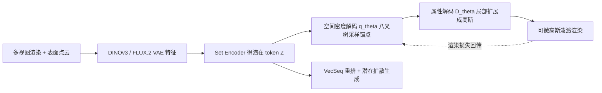

## 一句话总结

提出 Density-Sampled Gaussians（DeG）表示：把 3D 高斯的中心当作从一个可学习的八叉树概率密度中"采样"出来的点，从而用可微分的方式取代 3DGS 里手工的稠密化/剪枝，并配合 VecSeq 重排索引机制训练潜在扩散模型，实现高质量、可变数量的单图到 3D 生成。

## 研究背景

- 领域现状：3D 高斯泼溅（3DGS）凭借高画质和实时渲染成为 3D 生成的热门表示，生成式管线普遍走"编码成潜在 token → 潜在扩散"的路线。
- 核心痛点：3DGS 的画质很大程度来自密度控制（在复杂区域多放、简单区域少放高斯），但稠密化和剪枝是不可微、难以向量化的启发式操作，无法放进可泛化的学习框架。于是现有生成方法只能给每个体素/像素/patch 分配"固定数量"的高斯（GaussianCube、TRELLIS、pixel-aligned 等），无法按局部复杂度自适应分配，往往要堆过量高斯才能达到高保真，加重训练与渲染成本。
- 本文 idea：不再回归固定坐标，而是让解码器预测一个空间概率密度，高斯中心从中采样。这样既解耦了"基元放在哪里"和"基元长什么样"，又能在推理时通过调整采样预算，用同一个模型解码出任意数量的高斯（移动端轻量资产到高保真密集资产）。

## 方法

整体框架分两大件：一个 Density-sampled Gaussian VAE（DeG-VAE）把 3D 资产压成紧凑潜在 token，再经"学习到的空间密度"解码成可变数量的高斯，并用可微渲染损失端到端训练；一个 VecSeq 扩散 Transformer 建模这些潜在 token 的分布，条件于单张输入图像生成。

关键设计：

- 八叉树密度分解与随机采样：在稠密体素上定义密度是 $$O(N^3)$$ 的，作者用 $$L$$ 层八叉树因子化联合概率 $$q_\theta(x \mid Z) = \prod_{l=1}^{L} q_\theta(x_{0:l} \mid x_{0:l-1}, Z)$$，每层是对父节点 8 个子格的类别分布，由一个共享 Transformer 交叉注意到潜在 token 后输出 8 个 logit。通过祖先采样自顶向下走，只对活跃格计算 logit，空分支自然被剪掉。得到叶节点后在其体积内均匀去量化成连续锚点。锚点数 $$P$$ 不写死在架构里，推理时可调。

- 锚点+局部扩展的两级结构：采样得到锚点 $$P_\text{anchor}$$ 确定空间支撑后，属性解码器再预测每个高斯的不透明度、缩放、旋转、球谐系数。每个锚点 $$x_i$$ 通过学习到的偏移"分裂"出 $$K$$ 个高斯，最终得到 $$N = P \cdot K$$ 个 splat。这样大片均匀区域用少量锚点、复杂细节处密集铺设。

- 可微密度优化（render loss contribution gradient）：锚点是从 $$q_\theta$$ 采样来的，渲染损失对密度参数不可直接求导。作者用策略梯度推导，把它写成差分奖励（difference reward）形式：$$\nabla_\theta L_\text{render} = \mathbb{E}\left[\sum_{j} (L(\{x_i\}) - L(\{x_i\}_{i \neq j})) \nabla_\theta \log q_\theta(x_j)\right]$$。差分项 $$\Delta L_\text{render} = L(\{x_i\}) - L(\{x_i\}_{i \neq j})$$ 度量某个锚点对降低渲染误差的边际贡献，从而在"多放一个基元能显著降误差"的地方提高密度——这正是可微版的稠密化/剪枝。关键工程点：对逐像素 L1 项，标准 3DGS 反向光栅化已经维护了透射率和累积回传颜色，足以在同一次 CUDA 反向 pass 里以近乎零开销估出移除某基元的损失变化，再按锚点汇总回传给 $$\log q_\theta$$。训练用三阶段课程：先只用交叉熵结构初始化建粗几何壳（约 6% 训练时间），再训属性解码器锁定外观，最后全参数联合精修让贡献梯度参与密度重分配、并随机化锚点数以泛化到不同预算。

- VecSeq 规范化重排：潜在 token 是无序集合，直接喂扩散会因 $$M!$$ 种配对造成排列歧义，梯度冲突、收敛慢、生成模糊。作者把每个资产的 FPS 表面点与一组固定的 3D Sobol 低差异序列锚点做最优传输匹配 $$\pi^\star = \text{3D OT Assign}(\{p_i\}, \{s_j\})$$，据此重排 token 使第 $$j$$ 个 token 恒对应第 $$j$$ 个 Sobol 锚点的空间区域，再注入正弦位置编码。这把"无序集合生成"变成"稳定序列生成"。用单一通用模板让每个物体独立匹配，复杂度是线性 $$O(N)$$，避免了经典排列同步的 $$O(N^2)$$。

## 实验结果

在未见过的 Toys4K 上评估重建：每个物体渲 16 个视角比对 PSNR/SSIM/LPIPS。在可比高斯预算下，DeG-VAE 用更少的高斯（262K vs 基线约 310K）全面领先。

| 方法 | 高斯数 | PSNR↑ | SSIM↑ | LPIPS↓ |
|------|--------|-------|-------|--------|
| 本文 DeG-VAE | 262K | 35.89 | 0.9787 | 0.0223 |
| TRELLIS | 约 310K | 32.72 | 0.9734 | 0.0269 |
| UniLat3D | 约 310K | 32.10 | 0.9715 | 0.0307 |

其余结论用文字补充：DeG 达到与 TRELLIS 相同 LPIPS 时用不到一半的高斯；关掉贡献梯度做消融，重建质量在各预算下都下降，且低预算区间掉得最多，印证自适应分配在容量受限时最有价值。生成侧用 CLIP-I 与分布式指标（FD/KD 基于 Inception 与 DINOv2）对比 Hunyuan3D 2.1、TRELLIS-2、LGM、DiffusionGS、TRELLIS、UniLat3D，本文取得最高 CLIP-I（92.26）且多数分布指标最优。VecSeq 重排消融（同编解码权重、同 80K 步）显示加 Sobol 位置编码后 CLIP-I 从 89.39 升到 90.01、FDdinov2 从 75.08 降到 66.94。

## 亮点与局限

- 亮点：
  - 把"密度控制"从启发式操作提升为可端到端优化的概率密度，理论上给出了可微稠密化/剪枝的替代方案，且用差分奖励在 3DGS 反向 pass 里近零开销实现。
  - 单一潜码支持可变数量高斯解码，天然做出保真度与渲染/内存成本的权衡。
  - VecSeq 用最优传输把无序集合锚定到确定性 Sobol 序列，线性复杂度地解决了扩散训练的排列歧义。

- 局限：
  - 单图到 3D，背面区域推理时不可见，质量可能偏低。
  - 目前只面向 3DGS 而非网格，纹理网格解码留作未来方向。
  - 训练成本高（VAE 约 10 天、扩散约 11 天，各用 32 张 A800）。

## 延伸思考

用策略梯度/差分奖励把"离散、不可微的资源分配"塞进可微渲染管线，是个可迁移的思路——类似问题（LOD 选择、点云稀疏化、体素剪枝）或许都能借"贡献梯度在反向 pass 里顺手算出"的技巧低成本地端到端优化。VecSeq 把集合生成转成序列生成的做法，本质是给无序潜在空间引入一个共享的确定性坐标系，这与 GaussianCube 的 OT 到立方体一脉相承，但作用在潜在 token 而非基元上，值得关注它在更大规模、多类别数据上的稳定性。作者提到潜空间已同时刻画形状与纹理，若真能直接接一个纹理网格解码器，会显著拓宽这套表示的下游用途。
