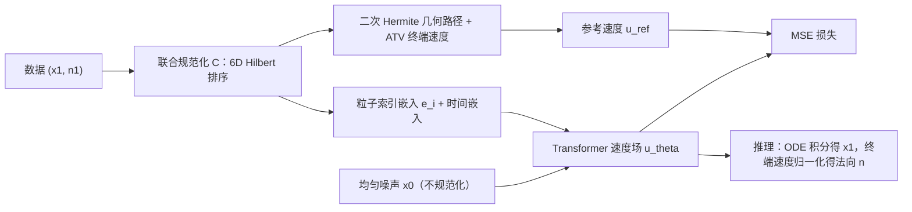

## 一句话总结

本文提出 OGPP（Orbit-Space Geometric Probability Paths），一个把"轨道空间规范化 + 粒子身份嵌入 + 几何概率路径"结合起来的粒子原生流匹配框架，让流匹配直接作用在粒子系统上，既拉直了轨迹（更少推理步就收敛），又能把表面法向作为流的终端速度顺带生成出来。

## 研究背景

- 领域现状：粒子（点集）是图形学里无处不在的表示——泊松采样、点云、拉格朗日流体/固体、群体动画都基于结构化的粒子集合。但主流生成模型（扩散、流匹配）都建立在**网格视角**上：把数据摊在固定网格（如像素点阵）上，学一个把噪声搬到数据的速度场。
- 核心痛点：把网格式流匹配硬套到粒子上会撞两堵墙。其一，粒子有**置换对称性**——重排索引不改变构型，但固定索引处的粒子在不同样本里没有一致的空间/统计角色，导致同一索引的终点被分散到整个空间，速度预测器被迫对互相冲突的目标做平均，产生噪声大、高度弯曲的逐粒子流。已有的等变流匹配（EqFM）用最优传输耦合缓解置换歧义，但计算代价高达 $$O(B^2 N^3)$$ 且仍在"匿名扁平化"表示上工作。其二，粒子**活在物理空间**里，$$t=1$$ 处的终端速度本该有几何含义（比如表面法向），而标准线性路径完全浪费了这个自由度。
- 本文 idea：既尊重轨道结构、又利用几何路径。一方面用轨道空间规范化 + 身份感知的粒子索引嵌入把混杂的粒子角色"解耦"，把噪声般的回归目标变成分离良好、易学的轨迹族；另一方面把线性插值换成终端切线对齐法向的 Hermite 几何路径，让同一个流同时生成位置和法向。

## 方法

OGPP 的整体 pipeline：从均匀噪声 $$\boldsymbol{x}_0$$ 出发，只对数据端点 $$\boldsymbol{x}_1$$（连同法向）做联合规范化排序，为每个粒子索引配一个可学习身份嵌入，再沿二次 Hermite 几何路径构造参考速度去训练一个普通 Transformer 速度场；推理时正向积分 ODE 得到位置，终端速度归一化后即法向。三个组件都统一表达为"条件概率路径的选择"。

关键设计分四点展开：

1. **轨道空间规范化（只作用在 $$X_1$$）**：对每个构型按几何准则（空间填充曲线，如 Hilbert / Morton 排序）给粒子重排索引，从每条轨道里挑一个规范代表。理论上，用全协方差分解可证明：不规范化时回归目标的条件协方差里有一项"角色歧义项" $$\mathrm{Cov}(\mathbb{E}[X_1 \mid X_t=\boldsymbol{x}, G] \mid X_t=\boldsymbol{x}) \succeq 0$$，来自随机置换 $$G$$；对 $$X_1$$ 做规范化让这一项归零，于是 $$\mathrm{tr}\,\mathrm{Cov}(Y \mid X_t=\boldsymbol{x}) \ge \mathrm{tr}\,\mathrm{Cov}(\widetilde{Y} \mid X_t=\boldsymbol{x})$$，回归更易学。规范化映射还需满足"轨道连续"（把邻近轨道映到邻近代表），从而给出 Bayes 最优速度场的局部 Lipschitz 界，鼓励更直的流。

2. **只对 $$X_1$$ 单侧规范化**：作者进一步论证**不该**同时规范化噪声端 $$X_0$$。用最近邻 Lipschitz 比 $$L_{ij}(t)$$ 分析，一旦 $$X_1$$ 被规范化后 $$\Delta^{(ij)}_1$$ 已经很小，若再规范化 $$X_0$$ 使 $$\Delta^{(ij)}_0$$ 收缩到同一量级，两者在分母里更容易近乎抵消而分子仍大，抬高 Lipschitz 比、让流更弯。实测（中点 $$t=1/2$$ 分析）也证实单侧排 $$X_1$$ 的 Lipschitz 比最低、方向抵消最少。

3. **粒子索引嵌入**：给每个索引 $$i$$ 加一个可学习身份嵌入 $$e_i$$，与坐标线性投影、时间嵌入相加后喂进 Transformer：$$\boldsymbol{h}^{(0)}_i = W_{\text{in}}\boldsymbol{x}^i_t + e_i + \phi_t(t)$$。作用类似 Transformer 里的位置编码，但这里的"位置"是规范化后的粒子索引，让不同索引各自专精到确定的速度场角色。消融显示：规范化和身份嵌入必须**配合**使用才有大收益，单用其一收益有限。

4. **几何概率路径（编码法向）**：把线性插值换成二次 Hermite 曲线 $$\gamma(t) = \boldsymbol{x}_0 + \alpha(t)(\boldsymbol{x}_1 - \boldsymbol{x}_0) + \beta(t)\boldsymbol{v}_1$$，其中 $$\alpha(t)=2t-t^2$$、$$\beta(t)=t^2-t$$，让终端切线 $$\boldsymbol{v}_1 \propto \boldsymbol{n}_1$$ 对齐表面法向。由于法向只约束方向、模长自由，作者用"弧长终端速度"（ATV）设 $$L_{\text{arc}} = D\,(1 + \lambda(1-S))$$（$$D$$ 是弦长、$$S$$ 是弦向与法向的对齐度），使沿轨迹速度尽量匀速，让均匀时间采样对应均匀弧长。理论上可证终端边际速度恰好是 $$\boldsymbol{u}^{\text{ref}}_1(\boldsymbol{x}) = \mathbb{E}[N_1 \mid X_1=\boldsymbol{x}]$$，即同一网络在 $$t<1$$ 学搬运、在 $$t=1$$ 学法向预测，法向作为流的**零成本副产物**得到，无需额外网络或后处理。位置+法向的联合规范化用 6D Hilbert 排序实现。

## 实验结果

论文在能量驱动粒子任务（蓝噪声、极小曲面、DLA、多层 Thomson 问题）和 3D 形状生成（ShapeNet 点云、单形状编码）上评测。这里选 ShapeNet 点云无条件生成作为主实验：用 1-NNA 准确率（越接近 50% 越好）在 CD 与 EMD 两个距离下评估，三个类别 airplane / chair / car。数字忠于原文（†为作者自训）。

| 方法 | 参数量(M) | 步数 | Airplane CD↓ | Airplane EMD↓ | Chair EMD↓ | Car EMD↓ |
|------|-----------|------|--------------|---------------|------------|----------|
| Original FM† | 25 | 200 | 81.98 | 66.29 | 65.03 | 60.94 |
| Minibatch OT† | 25 | 200 | 80.12 | 67.90 | 69.49 | 61.22 |
| Equivariant FM† | 25 | 200 | 91.85 | 85.93 | 70.32 | 79.69 |
| NSOT | - | 1000 | 68.64 | 61.85 | 57.63 | 53.55 |
| Ours | 26 | 200 | 69.38 | 58.77 | 58.38 | 55.39 |
| Ours (1000 步) | 26 | 1000 | 71.35 | 62.96 | 55.14 | 53.26 |
| DiT-3D (XL) | 675 | 1000 | 62.35 | 58.67 | 50.73 | 49.35 |

在流匹配类方法里，OGPP 的 EMD 全类别最优（EMD 通常比 CD 更能反映整体形状分布质量）；只用 200 步就追平了要 1000 步的 NSOT（约 5× 更少步数），airplane EMD（58.77）逼近 DiT-3D(XL) 的 58.67，而参数量少约 26×（26M vs 675M）、步数少约 5×。其余实验的关键结论：极小曲面上单步生成即达到面积误差 0.004、比基线低约两个数量级；蓝噪声 26M 模型 Pearson 相关 0.999、$$L_2$$ 误差 0.014；多层 Thomson 20 步的切向力 RMS 比 Original FM 低约一个数量级（4.99 vs 102.4）；单形状编码上，纯 3D 的几何路径法向重建质量可比需生成 6D 的方法，中位无向法向角误差 7.6°（ATV）优于 PCA 的 12.4°。

## 亮点与局限

- 亮点：
  - 把流匹配从"欧拉网格视角"重新表述为"拉格朗日粒子视角"，用轨道规范化 + 身份嵌入解耦置换歧义，有清晰的协方差/Lipschitz 理论支撑，而非纯经验 trick。
  - 几何概率路径把终端速度这一"闲置自由度"变成法向载体，位置与一致定向的法向一次流出、零额外成本，直接改善泊松重建质量。
  - 效率突出：极少推理步就收敛，小参数量匹敌超大模型；用普通 Transformer 而非置换等变架构，推理吞吐远高于 PVCNN（如 2048 点 3D 上 0.278ms/样本 vs 17ms）。
  - 提出面向能量驱动粒子系统的自指式物理/几何评价指标（蓝噪声谱、分形维数、残余库仑力、极小曲面偏差），补充了传统分布匹配指标。

- 局限：
  - 只支持**固定粒子数**，且依赖全注意力，$$O(N^2)$$ 成本限制了扩展到更大粒子系统。
  - 几何概率路径不对应 Wasserstein-2 最优传输，缺少测地性质，可能诱导略微更弯的流。
  - 规范化引入的索引结构（局部性/有序语义）目前未被显式利用，这个自由度被浪费。
  - 收益取决于数据的共有结构：在结构规整的合成基准（极小曲面）上提升巨大，在多样的真实形状（ShapeNet 各类别）上增益更温和，极端无共性时退化为标准流匹配。

## 延伸思考

- 把"终端速度承载几何属性"的思路推广开：法向只是一个例子，是否可以让终端切线同时编码曲率、颜色、材质甚至物理量，做真正的属性联合生成？这与几何分布（Geometry Distributions）那条把单形状表示为无限点分布的线索相邻，值得对照。
- 规范化作为"隐式信息通道"是作者点名的未来方向——若让索引顺序对齐任务语义（如时间顺序、拓扑序），就能不额外增加生成维度地编码信号，这对时序/关节体粒子生成很有想象空间。
- 单侧规范化 + 身份嵌入的组合，本质上是在"对称性约束"和"可学习性"之间找折中；相比 EqFM 的严格等变，OGPP 选择打破匿名性换取更直的流，这个 tradeoff 的边界（何时等变更好、何时规范化更好）值得进一步厘清。
- 变粒子数 + 稀疏/层级注意力（受物理近程相互作用启发）是把该框架推向大规模流体/群体仿真的关键一步，也是与传统拉格朗日物理求解器融合的接口。
