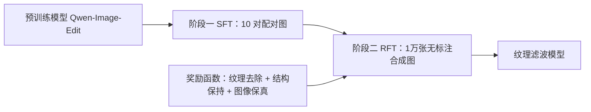

## 一句话总结

把纹理滤波（在保留图像结构的前提下抹去纹理）重新表述为一个图像生成问题，通过"少量有监督微调 + 大规模强化微调"两阶段策略去调教一个预训练生成模型，得到性能与泛化能力都明显更强的纹理滤波器。

## 研究背景

- 领域现状：纹理滤波是计算摄影与图像处理里的老问题，目标是平滑掉纹理、保住结构，可用于细节增强、图像抽象化、去半调等。方法大体分为局部滤波、全局优化、以及学习类三条路线。
- 核心痛点：现有方法有两大短板。一是泛化性差——缺乏大规模训练集，学习类方法难以应对没见过的纹理，而传统非学习方法又要针对每张图繁琐调参；二是有效性受限——多数方法依赖局部图像统计或很强的图像假设，一旦图像超出其表达能力就明显失效。作者认为这些问题的根子在于对"结构 vs 纹理"的表征能力不足。
- 本文 idea：借力近年生成模型强大的图像先验来补上这块表征能力。但直接拿现成生成模型（Nano Banana、GPT-4o、Flux.1-Kontext、Qwen-Image-Edit）套同一句提示词做纹理滤波，结果虽有潜力却在颜色和结构保真上不达标——因为模型并没有被专门训练去对齐纹理滤波这个任务。于是作者提出把纹理滤波当成图像生成任务，去微调一个开源预训练生成模型。

## 方法

整体框架：以开源图像编辑模型 Qwen-Image-Edit 为底座，用两阶段策略微调。第一阶段用极少量配对图做有监督微调（SFT），给出一个稳定的纹理滤波起点；第二阶段在大规模无标注数据上做强化微调（RFT），由一个能量化"纹理去除"和"结构保持"质量的奖励函数来引导，把性能推上去。

关键设计：

1. 有监督微调（SFT）作为热身。只用 10 张输入图及其滤波结果（结果由已有方法生成，作者发现换任意来源的滤波结果都能用）做 LoRA 微调，采用 flow matching 目标学习速度场。作者实验表明 10 对图就足以提供可行的初始化，加大到 100、1000 对提升也很有限——真正决定性能的是后续的 RFT。SFT 的意义在于减少 RFT 阶段采样到"结构糟糕"结果的概率，对结构保持很关键。flow matching 目标形如 $$x_t = (1-t)x_0 + t x_1$$，损失为 $$\mathcal{L}_{FM}(\theta) = \mathbb{E}\left[ \lVert v - v_\theta(x_t, t, c) \rVert_2^2 \right]$$，其中 $$x_0$$ 是目标滤波图、$$x_1$$ 是高斯噪声、$$c$$ 是输入图与提示词。

2. 奖励函数：把"好不好"量化出来。灵感来自一个观察——不断做高斯金字塔构建时纹理会逐层被消去，最粗那层几乎无纹理却概括了结构。由此得到两条线索：结果若仍含纹理，它与自身最粗金字塔层的相似度会偏低，反之则高，所以这个相似度可衡量纹理去除；而结果与原图各自最粗层之间的相似度，则可衡量结构保持。纹理去除奖励 $$\mathcal{R}_{texture} = \mathrm{SSIM}\!\left(I_{res}, \phi_{sr}(G^N_{res})\right)$$，其中 $$G^N_{res}$$ 是结果的最粗高斯金字塔层，$$\phi_{sr}$$ 是一个冻结的超分模型（用来把低分辨率的最粗层上采样回原分辨率，作者验证超分上采样明显优于朴素上采样和联合双边上采样）。结构保持奖励用 L1 而非 SSIM：$$\mathcal{R}_{structure} = 1 - \lVert G^N_{src} - G^N_{res} \rVert_1$$（SSIM 对极低分辨率图区分度不够，易导致结构残缺）。再加图像保真奖励 $$\mathcal{R}_{fidelity} = 1 - \lVert I_{src} - I_{res} \rVert_2$$ 保证颜色和结构与输入一致。总奖励 $$\mathcal{R}_{total} = \lambda_1 \mathcal{R}_{texture} + \lambda_2 \mathcal{R}_{structure} + \lambda_3 \mathcal{R}_{fidelity}$$，经验取 0.2、0.6、0.2。

3. 大规模无标注数据合成 + 策略优化。为覆盖多样纹理，用文生图模型生成 1 万张 512×512 图像，提示词含 texture、mosaic、cross-stitch、brick、lego、jigsaw、pattern、pebble 等关键词。策略优化方面，因为算奖励要跑耗时的迭代扩散采样，作者沿用直接在前向扩散过程上做 flow-matching 式策略优化的做法，可搭配 DPM-Solver 等高阶求解器快速采样。对每张训练图采样 12 个滤波结果，算归一化奖励，鼓励高奖励策略、抑制低奖励策略，通过隐式的正/负策略组合（由超参 $$\beta$$ 加权）来更新。

## 实验结果

在合成配对数据集（500 对，结构图混合纹理得到，含 GT）上用 PSNR 和 SSIM 评测；真实数据集（从 Flickr 爬取后人工精选的 2000 张）无 GT，只做定性对比。下表为合成数据集上与主要基线及关键消融的定量对比：

| 配置 | PSNR↑ | SSIM↑ |
|------|-------|-------|
| RTV [2012] | 25.57 | 0.840 |
| PTF [2023] | 26.23 | 0.846 |
| SSTF [2025] | 25.71 | 0.838 |
| 本文（完整方法） | 29.06 | 0.895 |
| 本文 仅 SFT | 24.75 | 0.830 |
| 本文 仅 RFT | 27.89 | 0.862 |
| 本文 去掉纹理去除奖励 | 24.37 | 0.848 |
| 本文 去掉结构保持奖励 | 27.52 | 0.865 |

完整方法在 PSNR/SSIM 上全面领先所有对比方法。消融显示：SFT 与 RFT 缺一不可（单独任一都明显掉点）；去掉纹理去除奖励会让模型走捷径直接输出原图，去掉结构保持奖励则结构扭曲。其它分析：把底座换成 Flux.1-Kontext 也能得到相当结果，说明框架可迁移；SFT 配对图从 10 增到 1000 提升甚微；提高纹理去除权重会增强去纹理效果，但设为 1 时模型会退化成输出空白图这种局部最优。运行时上，单张 A800 用 4 步扩散处理 512×512 约 1.2 秒、1024×1024 约 3 秒，比多数已有方法更快。

## 亮点与局限

- 亮点：
  - 提出首个生成式纹理滤波方法，把老问题重新表述为图像生成问题，切入角度新颖。
  - 两阶段策略很省数据——仅 10 对配对图即可起步，主要靠无标注数据的强化微调发力，泛化性强。
  - 奖励函数设计巧妙：用高斯金字塔最粗层的相似度分别刻画"纹理去除"和"结构保持"，无需 GT 即可量化滤波质量。
  - 框架不绑定特定底座，换用其它开源生成模型同样有效。

- 局限：
  - 会把局部的颜色不一致也当作纹理误抹掉，以求得尽可能平滑的高奖励结果（论文给出了失败案例）。
  - 效率仍不够高，作者把提速（如 DMD 蒸馏、缓存加速）列为未来工作。
  - 真实数据集缺乏 GT，只能定性比较，客观性有限。

## 延伸思考

- 用"下游可量化的代理指标"充当强化学习奖励、绕开对配对标注的依赖，这套路径对其它缺标注的底层视觉任务（去噪、去反射、内在图像分解等）可能同样适用。
- 奖励里"最粗金字塔层相似度"本质是一种自监督的结构/纹理分离度量，把它单独拿出来作为评价指标或损失也许有独立价值。
- 方法把预训练生成先验当作"表征能力补充"，这与近年不少"微调基础模型解决专门任务"的工作思路一致；值得追问的是在更极端或强规律纹理（如密集重复图案）下，生成先验会不会反过来幻觉出并不存在的结构。
