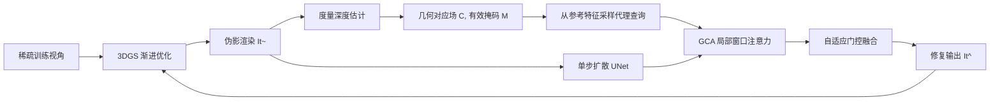

## 一句话总结

GeoQuery 用几何对应关系构造"代理查询"替换被伪影污染的渲染查询，让扩散模型在跨视角注意力中把特征检索牢牢锚定到物理几何上，从而在稀疏视角 3DGS 重建的去伪影任务中显著提升质量。

## 研究背景

- 领域现状：3D Gaussian Splatting（3DGS）已成为实时高保真重建与新视角合成的主流范式。在稀疏视角下，越来越多方法采用"渲染—修复"（render and refine）流程，用图像/视频扩散模型修复渲染中的伪影，再把修复后的图像当作伪观测反哺 3DGS 优化。
- 核心痛点：这类扩散修复方法普遍靠多视角自注意力从参考图检索信息——把目标视角和参考视角特征拼接，让含噪的目标 token 去参考 token 里找上下文。但当 3DGS 渲染被严重伪影（漂浮物、结构畸变）污染时，从渲染中导出的查询特征本身就是坏的。作者称之为"查询污染"（Query Contamination）：被污染的查询会检索到语义相似但几何无关的参考纹理，反而强化伪影，形成恶性循环。
- 本文 idea：既然从坏渲染里提的查询不可信，那就绕开它。利用估计深度图和相机位姿建立几何对应场，从"干净"的参考特征空间里采样出与目标位置几何对齐的 token，作为"代理查询"（Proxy Query）来发起注意力，并把检索限制在对应点周围的局部窗口内，抑制虚假的长程匹配。

## 方法

整体框架：GeoQuery 嵌入在一个渐进式 3DGS 修复流程中。每一步 3DGS 产出一张伪影渲染 $$\tilde{I}_t$$，系统选取最近的训练视角作为参考 $$I_r$$，估计度量深度构造几何对应场，然后在单步扩散去噪的 UNet 中并行地跑一支"几何引导跨视角注意力"（GCA）分支，把几何证据自适应地融回扩散主干，输出修复图 $$\hat{I}_t$$ 作为后续 3DGS 优化的伪观测。

关键设计：

1. 几何对应场构造。给定参考视角深度 $$D_r$$、相机内参 $$K$$ 与外参 $$T$$，把参考像素反投影成 3D 点再投影到目标视角：$$u_t = \pi\!\left(K_t T_t T_r^{-1}\, x\right)$$。通过前向 splatting 参考坐标图和全一掩码到目标相机，得到稠密对应场 $$C_{t\to r}$$（把每个目标像素映射到其同源参考像素）和二值有效掩码 $$M_{t\to r}$$（记录可见性）。度量深度由离线多视角立体（MVSFormer++）或 Depth Anything v3 提供，保证尺度一致。

2. 几何索引的代理查询。GCA 的核心是绕过被污染特征，直接从干净参考特征空间检索"几何索引代理特征" $$F_{r\to t}$$。把对应场和掩码下采样到各 UNet 块的特征分辨率后，用双线性采样同源 token：$$F_{r\to t}(u_t) = M_{t\to r}(u_t) \odot \mathrm{Sample}\!\left(F_r, C_{t\to r}(u_t)\right)$$。用 $$F_{r\to t}$$ 充当查询 $$Q$$，保证注意力由干净参考内容主导，从源头切断伪影传播。

3. 局部窗口跨视角注意力。为把检索约束在几何对应附近，GCA 只在以 $$C_{t\to r}(u_t)$$ 为中心的 $$k\times k$$ 局部邻域 $$\Omega$$ 内采样 key/value：$$F^t_{\text{geo}}(u_t) = \sum_{\Delta\in\Omega}\mathrm{Softmax}_{\Delta}\!\left(\frac{\langle Q(u_t), K_\Delta(u_t)\rangle}{\sqrt{d}}\right) V_\Delta(u_t)$$。这既减少虚假长程匹配，又把跨视角注意力复杂度从 $$O(N^2)$$ 降到 $$O(N k^2)$$，对高分辨率更实用。实验里 $$k=3$$ 的中等窗口 FID 最优。

4. 自适应门控融合。预测一张空间门控图 $$w = \sigma\!\left(\mathrm{MLP}([F_t, F^t_{\text{geo}}])\right)$$，按位置融合两支特征：$$F_t(u_t) \leftarrow (1 - w(u_t))\odot F_t(u_t) + w(u_t)\odot F^t_{\text{geo}}(u_t)$$。当参考投影无效或被遮挡时，有效掩码会关闭局部检索，融合自动退回全局分支做语义补全——从而在对应关系弱或缺失时仍保持稳定。训练目标为像素 $$\ell_2$$ 重建损失、LPIPS 感知损失与 Gram 风格损失的加权和。

## 实验结果

主实验为 DL3DV-Benchmark 测试集上的 2D 渲染去伪影对比。GeoQuery 相对最强的扩散基线 DIFIX3D+ 在所有指标上都更优，PSNR 提升约 1.09 dB，FID 降低 2.63。

| 方法 | PSNR↑ | SSIM↑ | LPIPS↓ | FID↓ |
|------|-------|-------|--------|------|
| DIFIX3D+ 无参考 | 18.26 | 0.493 | 0.388 | 21.04 |
| DIFIX3D+ | 18.79 | 0.529 | 0.348 | 12.83 |
| GeoQuery | 19.88 | 0.566 | 0.314 | 10.20 |

其余实验用文字补充：在 Mip-NeRF360 与 DL3DV-Benchmark 的 3/6/9 视角稀疏重建中，GeoQuery 的 PSNR/SSIM 普遍领先，尤以最难的 3 视角提升最大，能避免基线出现的几何崩塌。按误差阈值分区的分析显示，DIFIX3D+ 会损伤低误差区域（PSNR 下降 0.75），而 GeoQuery 在低误差区（提升 0.37）与高误差区（提升 4.03）都有改善，直接印证了对"查询污染"的缓解。消融实验证实：把渲染查询换成代理查询带来主要增益，GCA 局部窗口优于标准极线注意力，$$k=3$$ 为最佳窗口。单张 A100 上 1237×822 分辨率约 1.2 秒/图、峰值显存 21.13 GB。

## 亮点与局限

- 亮点：
  - 精准诊断了扩散修复流程里"查询污染"这一反馈闭环问题，并给出针对性解法。
  - 用几何对应把注意力查询从"不可信的渲染特征"换成"干净参考特征"，思路清晰、可解释性强。
  - 局部窗口把跨视角注意力从二次复杂度降到线性，兼顾精度与效率。
  - 作为即插即用模块，可无缝集成进现有扩散重建流程。

- 局限：
  - 依赖显式几何对应，在无纹理或高光区域深度估计失败时会退化。
  - 极端视角差异导致对应缺失时，修复质量完全取决于扩散模型本身的生成能力。

## 延伸思考

GeoQuery 与 DIFIX3D+ 一脉相承，把"图像扩散去伪影 + 周期性蒸馏回 3DGS"的范式补上了几何这一环，本质是"几何先验约束生成先验"的又一例证。相比走视频扩散路线的 3DGS-Enhancer、GenFusion、GSFixer，它用单步图像扩散加显式对应场，成本更低。值得追问的是：代理查询的质量高度绑定深度估计的可靠性，若换用更强或自带不确定性的深度模型，能否让门控融合更"知道何时该信几何"？作者也指出未来可换更强扩散模型来提升对应缺失区域的生成上限。
