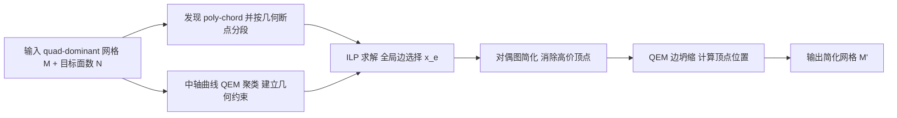

## 一句话总结

把四边形主导网格（quad-dominant mesh）的减面问题，从传统的"逐次贪心边坍缩"改写成一次性求解的**全局整数线性规划（ILP）边选择问题**，在硬性拓扑约束与软性几何约束下同时保住四边形结构、边流（edge flow）连续性和几何精度。

## 研究背景

- 领域现状：网格简化是实时渲染中生成 LOD（细节层次）的核心环节。工业界标准是 Garland 与 Heckbert 的 QEM（二次误差度量），以及 Unreal Engine、Simplygon 等工具，它们擅长在坍缩边时最小化几何偏差。
- 核心痛点：美术师手工建的模型几乎都是四边形主导网格，具有整齐的边环（edge loop）与连贯边流，这对后续的局部重拓扑、UV 展开、贴图、骨骼动画、物理仿真都至关重要。但现有方法存在一个根本性的"二选一"困境：
  - QEM 这类**局部贪心**方法只看几何误差，视野短浅（myopic），会把结构化四边形布局打成不规则三角形，破坏长程边环、产生难以修复的奇异点；
  - poly-chord（多边链）移除法把四边形拓扑当成刚性连续条带整条删除，虽保住全局结构，却有严重的"锁死"（locking）问题——为简化平坦区而删一整条长链，会在远处高曲率区域引起不可接受的畸变。
- 本文 idea：既然四边形拓扑本质是**全局**性质，就不该用局部序列决策去逼近。作者把减面重构成单次全局求解：每条边是一个"保留/坍缩"的二值决策变量，拓扑连续性作为硬约束、几何保真作为软惩罚，让结构要求只在几何上确有必要时才被放松。

## 方法

整体框架：给定输入四边形主导网格与目标面数，先在对偶空间发现所有 poly-chord 并在几何上有意义的断点处分段，同时用 QEM 对"中轴曲线"做边聚类以建立几何约束；把拓扑约束（硬）与几何相似性约束（软）统一进一个 ILP，求出全局最优的边保留子集；再经对偶图简化消除高价顶点，最后做一次 QEM 边坍缩计算顶点位置并解决退化。

关键设计分为四点：

1) ILP 建模与目标函数。为每条边引入二值变量 $$x_e \in \{0,1\}$$、每个面引入 $$x_f \in \{0,1\}$$，1 表示保留。简化后估计面数 $$N' \approx \lvert F_{\text{tri}} \rvert + 2\lvert F_{\text{quad}} \rvert$$（把每个四边形当两个三角形计）。为避免"精确等于目标面数"与拓扑约束冲突导致 ILP 不可行，用松弛参数把面数约束放宽为 $$(1-\epsilon_n)N \le N' \le (1+\epsilon_n)N$$（取 $$\epsilon_n=0.03$$ 最佳）。此外用边-面一致性约束保证被保留的面恰好有 3 或 4 条边界边，杜绝退化面。目标函数由三项组成：目标面数精度项、几何相似性惩罚项（系数 $$\lambda_{\text{geo}}$$）、以及负的边重要性项（系数 $$\lambda_{\text{edge}}$$，鼓励保留几何误差大的高频特征边）。

2) 部分 poly-chord 分段（本文核心创新一）。一整条 poly-chord 常有自交等复杂结构，要么整条保留要么整条删除的刚性约束会造成不可行或过度简化。作者按三条准则在几何断点插入分割：相邻面二面角超过阈值 $$\epsilon_\theta$$（一般取 $$\pi/3$$）、bi-normal 变化超过阈值、或顶点被同一 poly-chord 重复访问（自交）。分段后只要求**同一段内的对置四边形边（opposing quad edges）保留状态一致**，即 $$x_e = x_{e'}\ \forall e,e' \in P_{\text{seg}}$$，从而让求解器能灵活坍缩冗余段、只保留对全局边流关键的段。

3) 几何相似性软约束（本文核心创新二）。目标是在高曲率区保留足够多的"环向边"（loopy edge）。做法巧妙：并不用 QEM 直接生成最终几何，而是借 QEM 的**坍缩历史当作边聚类算子**。从 poly-chord 抽出中轴曲线，按 Knodt 的逐边加权二次误差 $$Q(e_i) = w_n \cdot Q(v_i^0, n_f(e_i)) + w_f \cdot Q(v_i^0, \frac{v_i^0 - v_i^1}{\lVert v_i^0 - v_i^1 \rVert_2} \times n_f(e_i))$$（第一项罚偏离曲面、第二项罚沿流向的面内畸变，取 $$w_f=0.01$$）贪心聚类。每个聚类代表一处显著特征，要求其中至少保留一条边。为避免硬约束造成不可行，用连续辅助变量 $$x_{\mathcal{C}(e_i)} \in [0,1]$$ 编码"该聚类是否被全部丢弃"，一旦全丢就在目标里触发高罚。对不含 poly-chord 的三角面区域，用 BFS 建连通边集并做类似的"交错聚类激活"约束：若某聚类有边被丢弃，则相邻聚类必须整体保留。

4) 后处理两步走。ILP 只管选保留哪些原始边，对对偶图结构无感知，可能产生对偶"超级面"（super-face，对应原始网格中的高价顶点）。先做对偶图简化：识别边界超过 6 条边的对偶面，迭代地移除悬挂顶点、并从最高价顶点用最短路径把超级面切分（切分时强烈偏好沿同一 poly-chord 走），直到无超级面。再做 QEM 边坍缩：用 Union-Find 把相连坍缩边归为连通分量各并为一个顶点，位置通过最小化累积二次误差求得，并可施加无自交、有界 Hausdorff 距离等约束，同时采用 Knodt 的逐顶点权重防止体积收缩、保锐利特征。

## 实验结果

在 50 个来自 Sketchfab 的复杂四边形主导模型上，与单边坍缩法 Single [Knodt 2025] 和 MeshLab 的 QEM 减面对比，分别减到 80%/60%/40%/20%。用 C++ 与 Google OR-Tools 的 CP-SAT 求解，i7-9700 8 核 CPU。评价指标含 QPR（Quad Preservation Ratio，越接近 1 越好）、PCCD（Poly-Chord Chamfer Distance，衡量边流保持）、Chamfer 与 Hausdorff 距离。

下表为不同简化比例下的平均指标对比。QPR 与 PCCD 对 MeshLab 不适用，因其输出纯三角网格、无四边形结构（记为 ×）。

| 比例 | 指标 | Ours | Single | MeshLab |
|------|------|------|--------|---------|
| 80% | QPR↑ / PCCD↓ | 0.9941 / 2.596e-4 | 0.9920 / 4.157e-4 | × / × |
| 60% | QPR↑ / PCCD↓ | 0.9859 / 5.671e-4 | 0.9749 / 6.956e-4 | × / × |
| 40% | QPR↑ / PCCD↓ | 0.9716 / 1.030e-3 | 0.9332 / 1.219e-3 | × / × |
| 20% | QPR↑ / PCCD↓ | 0.9281 / 2.185e-3 | 0.7917 / 2.554e-3 | × / × |

本文在所有比例上 QPR 与 PCCD 均最优，且优势随简化加剧而拉大（20% 时 QPR 0.928 对 Single 的 0.792）。几何精度方面 MeshLab 因纯几何驱动而 Chamfer/Hausdorff 最优，本文与之保持竞争力。动画实验显示：把网格减到 20% 后跑一段复杂动画，本文在绝大多数帧的几何距离更低、形变伪影更少，印证了边流保持对蒙皮动画的实际价值。消融实验（40% 级）表明：去掉 poly-chord 一致性约束会严重破坏四边形结构（QPR 掉到 0.854、Hausdorff 恶化到 2.04e-2）；去掉分段虽保留更多四边形（QPR 0.997）却因过约束导致过度简化、几何变差；去掉几何相似性约束同样引起大范围过度简化。

关于运行时间：ILP 求解阶段占主导，稳定跑满 180 秒时间上限，其余阶段均在 12 秒内完成；在该预算下求解器给出高质量可行解，但不保证可证明最优。

## 亮点与局限

- 亮点：
  - 用一次全局 ILP 统一了"拓扑硬约束 + 几何软约束"，避开了局部贪心的短视与刚性 poly-chord 移除的锁死，两全其美。
  - 部分 poly-chord 分段是化刚为柔的关键设计——在几何断点处切段，让求解器能局部坍缩而不破坏全局流。
  - 巧用 QEM 坍缩历史当"聚类算子"来生成几何约束，而非直接产出几何，思路新颖。
  - 提出 PCCD 这一衡量边流/poly-chord 保持的拓扑感知指标，并在动画场景验证了实际收益。
- 局限：
  - ILP 求解稳定跑满 180 秒时间上限且不保证最优，可扩展性受限，作者也把"面向大资产的可扩展优化"列为未来工作。
  - 对面数低、三角形占比高的模型（如 Demon Mask），poly-chord 被碎成短段、求解器灵活度下降，20% 激进简化下细长结构（如角、獠牙）出现明显几何退化（Hausdorff 离群）。
  - 未与专门针对纯四边形网格的简化法直接对比（因其无法处理数据集中的复杂 quad-dominant 拓扑、且缺可靠开源实现）。

## 延伸思考

- 把拓扑保持写成离散优化的思路，与四边形布局/奇异点放置中已有的 ILP 工作（如混合整数四边形化、奇异点结构简化）一脉相承，本文首次把它用到"已有四边形主导曲面的减面"这一具体问题上。
- 180 秒时间墙是主要瓶颈。是否可用列生成、分块求解、或把部分软约束交给学习模型预测来给 ILP 提供热启动，从而扩展到更大资产，值得追问。
- 方法依赖 poly-chord 与边流的良好定义，对三角形占比高的"弱四边形"网格效果下滑；结合数据驱动的 cross field / 方向场（近年 CrossGen 等）先补全结构再做全局减面，或许能缓解碎段问题。
- PCCD 作为边流保持度量有潜力成为四边形简化领域的通用评测项，可进一步与下游动画/仿真的稳定性指标建立更直接的关联。
