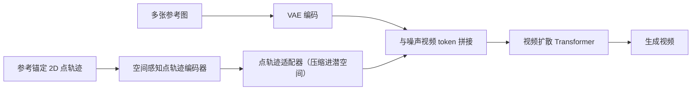

## 一句话总结

用"锚定到参考图的点轨迹"作为统一的时空控制信号，让一个视频扩散模型同时具备精确的运动控制和多参考图合成能力，服务于电影制作中"什么元素出现、如何运动"的可控生成需求。

## 研究背景

- 领域现状：大规模视频生成基础模型（如 Wan、CogVideoX 等）已经能产出接近电影质感的画面，但仅靠文本提示无法满足创作者对"画面里出现什么、如何运动"的精确控制。为此出现了两条控制路线：点轨迹驱动的图生视频，以及参考图/个性化驱动的视频生成。
- 核心痛点：这两条路线各管一摊、彼此割裂。点轨迹类方法把可控内容锚定在第一帧，隐含假设所有可控元素在开头就已出现，难以处理中途进出场景的角色、道具或背景；而多参考图类方法能注入外观，却缺乏对"参考内容如何在时空上落位、如何跨帧运动"的精细控制。
- 本文 idea：把点轨迹当作统一运动控制与参考图合成的时空锚点。作者把传统"只在视频帧内定义 2D 流动"的点轨迹，扩展为"参考图锚定的点轨迹"——显式地在生成帧与多张参考图之间建立点对应。这样每条轨迹不仅指定某元素怎么动，还指定它对应参考图上的哪个部位，从而在单一框架里同时实现合成与运动控制。

## 方法

整体框架是在开源视频潜空间扩散 Transformer（Wan 2.1/2.2）之上，接收多张参考图和"参考锚定点轨迹"两类条件：参考图经 VAE 编码后与噪声视频 token 拼接注入外观，点轨迹则先经过一个"空间感知点轨迹编码器"变成嵌入、再由一个轻量适配器压缩进 patch 化潜空间与视频 token 融合，最后由部分微调的扩散 Transformer 去噪生成视频。

关键设计分三点：

1. **参考锚定点轨迹（新的条件范式）**：每条点轨迹在生成视频各帧和参考图上都存储 2D 像素坐标 $$(x, y) \in [1, W] \times [1, H]$$，从而在生成帧与参考图之间建立显式点对应。不可见或被过滤（遮挡、离画、低置信、天空区域）的坐标留空。框架同时支持稀疏轨迹（提供软性运动引导，让模型据邻近线索推断合理运动）和稠密轨迹（强制空间对齐，精确把参考物体放到指定区域与帧）。只出现在生成帧的轨迹充当纯运动约束，只出现在参考帧的轨迹被丢弃。

2. **空间感知点轨迹嵌入**：先前工作用随机初始化的嵌入区分不同轨迹，但这种空间不相关的标识在"生成帧与参考图时空不连续"的场景下很难让模型把同一轨迹的点关联起来，导致收敛慢、泛化差（MotionV2V 据称最多只能处理约 25 条轨迹）。本文只对生成帧坐标（附加帧索引 $$(i, x_i, y_i)$$）做正弦编码 + 共享坐标 MLP，再沿帧做 max-pool，得到单个嵌入。这样嵌入既是每条轨迹的唯一标识，又让"嵌入相似度直接与空间邻近度相关"，即使原始坐标不连续，模型也能借空间线索把参考图与生成帧的点关联起来。

3. **轻量点轨迹适配器**：潜空间相对像素空间做了 $$16 \times 16$$ 空间、$$4\times$$ 时间的下采样，而点轨迹定义在高分辨率像素空间。适配器把视频切成 $$4 \times 16 \times 16$$ 时空块（对应一个潜 token），收集落入块内的所有点轨迹嵌入；借鉴 Point Transformer 的网格池化用 max-pool 聚合，但在池化前把每个嵌入与其块内相对位置 $$(f', x', y')$$ 拼接并过 MLP，从而在压缩的同时保留细粒度位置、避免朴素子采样丢失运动细节。输出与视频 token 通道拼接后再过 MLP 恢复维度。

此外，为缓解"缺少带精确真值点轨迹的视频数据"这一训练难题，作者采用混合数据策略：合成动态场景（PointOdyssey，取网格顶点轨迹）+ 静态场景（DL3DV、TartanAir，用真值深度与相机算精确轨迹）+ 真实动态视频（OpenVidHD、MiraData、OpenHumanVid，用现成跟踪器标注）。合成与静态数据提供精确轨迹以学准运动，真实视频提供多样、真实感的视频先验；配合迭代式轨迹加密、参考图增强（随机缩放裁剪平移，防止学到"复制粘贴"捷径）与三类轨迹丢弃增强提升鲁棒性。

## 实验结果

在 DAVIS 2017（77 段视频，含多样相机/物体运动与遮挡）上与开源 SOTA 比较，评测分视觉保真（FID、FVD）、重建精度（LPIPS、PSNR、SSIM）与运动保真（EPE，用 CoTracker3 估计轨迹与输入轨迹的 L2 端点误差）三类。下表取"稠密轨迹"设置的主对比（轨迹可在任意帧起止），本文各骨干均全面领先：

| 方法 | 骨干 | FID ↓ | FVD ↓ | PSNR ↑ | EPE ↓ |
|------|------|-------|-------|--------|-------|
| ATI | Wan2.1 14B | 41.69 | 504.9 | 13.93 | 16.20 |
| Wan-Move | Wan2.1 14B | 40.47 | 485.7 | 13.93 | 12.27 |
| GWTF | CogVideoX 5B | 44.53 | 530.3 | 14.22 | 14.71 |
| Go-with-the-Track | Wan2.1 14B | 29.56 | 341.5 | 16.49 | 7.958 |
| Go-with-the-Track | Wan2.2 14B | 28.00 | 322.8 | 16.86 | 7.709 |

在中等密度、稀疏轨迹（均可见于第一帧、对基线更公平）设置下同样领先，运动保真优势尤其明显。作者把优势归因于基线普遍通过 VAE 或朴素子采样压缩轨迹、丢失细粒度运动细节，而本文适配器保留了这些细节。消融显示：空间感知嵌入相比随机嵌入在运动可控性和视觉保真上都有明显提升；适配器中"max-pool + 相对位置拼接"优于随机采样、纯 max-pool 和注意力池化；去掉静态与合成数据只用真实视频训练会使 EPE 和重建精度明显下降。多参考图消融表明参考图越多质量越好（四帧均匀采样最佳），且参考帧即使不与目标帧空间对齐也能稳健利用。45 人用户研究中，本文在运动跟随、主体保持、整体质量三项的偏好率（约 44%~46%）均是次优方法的两倍以上。

## 亮点与局限

- 亮点：
  - 用"参考锚定点轨迹"这一简洁范式把运动控制与多参考合成统一到单一模型，直击电影制作中外观一致性 + 时空可控的真实需求。
  - 空间感知嵌入把"空间邻近度"编码进标识，解决了大规模（多达约 15,000 条）时空不连续轨迹的关联难题；轻量适配器在压缩进潜空间时保留运动细节。
  - 混合真实/静态/合成数据的训练策略降低了对噪声点跟踪器标注的依赖，兼顾精确运动与真实感先验。
  - 应用面广：视频重风格化、网格/关键点驱动合成、静态与动态场景的相机控制等多种任务用同一框架完成。
- 局限：
  - 性能依赖点轨迹质量，快速运动或错误的可见性估计会引入时序伪影。
  - 轨迹的空间分辨率限制了对精细接触或细微运动的精度上限。
  - 输出质量受限于底层视频扩散模型本身的能力。

## 延伸思考

这篇工作把"点轨迹"从单纯的运动信号升格为跨参考图与生成帧的通用对应载体，思路上与把稀疏对应作为强条件的一类方法（如基于 3D 点轨迹的相机/运动编辑）相通，区别在于它进一步耦合了多参考图的外观注入。值得追问的方向包括：把 2D 参考锚定轨迹扩展到 3D，是否能更好地消解相机与物体运动的歧义并提升遮挡下的稳健性；空间感知嵌入 + 相对位置池化这套"把像素级稀疏条件压进压缩潜空间"的适配器设计，能否迁移到其它稠密条件（如法线、深度、分割）的注入；以及在轨迹稀疏或含噪时，如何进一步降低对现成跟踪器质量的依赖。
