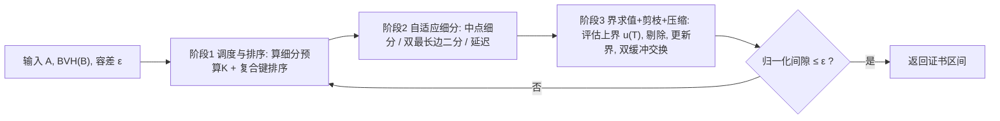

## 一句话总结

把 CPU 上串行、依赖优先队列递归的"带证书"分支定界 Hausdorff 距离算法，重构成一条适配 GPU 的排序波前流水线，在保持区间可证明与容差终止的前提下，把百万面片网格间的有向 Hausdorff 距离计算做到毫秒级，相较 CPU 最新方法取得数百倍吞吐加速。

## 研究背景

- 领域现状：有向 Hausdorff 距离（HD）度量两个网格间的最大几何偏差，是网格简化、制造公差验证等对"最坏情况有保证"的场景的基础操作。采样法（如 Metro、MESH）快但只给下界、无法证明漏掉了什么；高精度做法依赖分支定界（B&B），维护一个包含真值的全局区间 $$[\underline{h}, \overline{h}]$$，不断细分曲面子域直到归一化间隙 $$(\overline{h}-\underline{h})/d_A$$ 小于用户容差（$$d_A$$ 是源网格包围盒对角线长）。
- 核心痛点：CPU 的 B&B 在"近零距离"配置（两网格几乎重合，$$h(A,B)\approx 0$$）下会退化——局部上界几乎不超过全局下界，剪枝失效，被迫深度细分，活跃子域指数膨胀，运行时间从秒级涨到分钟级。而现有 B&B 结构极不适配 GPU：优先队列驱动的递归带来严重的线程束发散、指针追逐依赖和频繁全局同步；近零场景下活跃集还会爆内存。于是 GPU 方法往往退回采样近似，或只支持参数曲面，丢掉了非结构三角网格上的显式界追踪。
- 本文 idea：作者的关键观察是——HD 分支定界的计算核心不是优先队列，而是海量的局部界求值与细分。因此用一个"排序波前"（breadth-first、双缓冲工作表）批量处理空间相干的活跃集，把界更新、剪枝、细分融合到批并行 kernel 里；再辅以针对细长三角形的固定基数细分、保精度的三角形局部坐标系、以及应对显存压力的资源感知延迟机制。

## 方法

整体框架：给定网格 $$A$$、$$B$$，先在 CPU 上为 $$B$$ 构建扁平化无指针的 BVH 并传到显存；初始工作表 $$\mathcal{W}$$ 装入 $$A$$ 的全部三角形。之后进入波前循环，每轮由三阶段批并行 kernel 组成，主机端在轮间回读全局界与活跃集计数、判断是否满足 $$(\overline{h}-\underline{h})/d_A \le \varepsilon$$，未满足则重启下一轮波前。

关键设计：

1. 排序波前 B&B（消除优先队列与递归）。用双缓冲的 Structure-of-Arrays 工作表取代优先队列递归。每轮开始时按一个 32 位复合键排序：最高位是延迟标志，次高位是细分模式（中点 vs 细长），低 30 位是三角形质心的 Morton 码量化。这样同一线程束里的线程处理空间邻近、细分逻辑相同的图元，最大化执行相干、抑制线程束发散，同时提高 L2 命中率。

2. 固定基数自适应细分。标准中点细分（1→4）会继承父三角形的长宽比，对细长三角形（面积小、周长大）上界收紧极慢。作者用一个轻量质量度量 $$q(T) = 2\,\mathrm{Area}(T)/l_{\max}^2 = h_\perp / l_{\max}$$（最长边上的高与最长边之比）识别细长三角形，阈值 $$q(T) < 0.06$$ 的走"双最长边二分"（DLB）：沿最长边二分，再对两个子三角形各沿其最长边二分，得到 4 个孙三角形。关键在于无论走哪条路都恰好输出 4 个图元，这种固定基数让内存管理可预测（常量步长写出偏移），无需 per-parent 原子计数或变长分配，便于无原子的流压缩。

3. 发散感知的级联界求值。作者复用 CPU 最新方法（Sacht 和 Jacobson 2024）的四个上界 $$u_1 \ldots u_4$$，但把求值拆成两相以适配 SIMT：相 I 是"线程束一致"的廉价筛选，先算无需额外全局访存的 $$u_1, u_2$$ 算术筛，再算 $$u_3$$ 的部分求值 $$h_a$$（点到三角形距离、不构造平分面），凡 $$\min(u_1,u_2) < \underline{h}$$ 或 $$h_a < \underline{h}$$ 立即剔除；相 II 才让少量幸存者进入含复杂几何分类、天然发散的 $$u_3, u_4$$。配合逐线程无同步的提前退出（$$u_{\mathrm{curr}} < \underline{h}$$ 即停），并借空间排序让整束线程尽量同时满足剔除条件而集体退休。

4. 资源感知的显存调控。GPU 上 BFS 的风险是波前无界增长（近零场景尤甚）。每轮按剩余显存算细分预算 $$K$$，对活跃集上界做并行基数排序取第 $$K$$ 名作为阈值 $$\tau$$：界紧的图元（$$u(T)\le\tau$$，很可能很快被剔除）立即细分，界松的昂贵图元（$$u(T)>\tau$$）标记为延迟、跳过细分直接压缩进输出缓冲。延迟率随显存压力自适应——顺畅时接近零，触顶时可延迟绝大多数。这实质上把遍历从纯 BFS 变为压力下的资源约束最佳优先搜索，既防分配失败又保证前进。此外所有几何谓词和界计算都在"三角形局部坐标系"（把原点平移到父三角形首顶点，等距变换保距）里做，缓解 FP32 在大世界坐标下的抵消误差。

## 实验结果

在 Thingi10K 派生的两个大规模基准（TetWild 共 9836 对、Decimation 共 9971 对，合计约 1.98 万对）上，与 CPU 最新方法（级联上界，FP64）和一个"直接并行移植但无本文优化"的 Baseline GPU 对比；GPU 全部用 FP32，容差 $$\varepsilon = 10^{-6}$$。下表为主实验：不同 GPU 相对 CPU-SOTA 的中位运行时与吞吐加速（Mean-Ratio× 为总时间之比）。

| 基准 / GPU | 中位时间 (ms) | 吞吐加速 Mean-Ratio× | p99× |
|------|------|------|------|
| TetWild, RTX 3060 | 7.82 | 527.91 | 2279 |
| TetWild, RTX 4070 | 5.89 | 750.24 | 3698 |
| TetWild, RTX 5090 | 5.82 | 835.63 | 5931 |
| Decimation, RTX 5090 | 4.44 | 709.30 | 4370 |

作为对照，TetWild 上 CPU-SOTA 中位耗时 2134.52 ms，Decimation 上为 229.46 ms（该基准 CPU 中位更快，因为多数是平凡样例、GPU 有 kernel 启动开销，但近零样例逼出深度细分时 GPU 优势与尾部延迟改善显著）。

数值一致性方面：FP32 GPU 与 FP64 CPU 最终证书上界的归一化偏差，均值在 TetWild 为 2.54e-7、Decimation 为 1.73e-7；超过 99.9% 的样例偏差低于 0.01%，最坏个例分别为 0.11% 和 1.4%。

消融显示各组件贡献：去掉空间排序在 Decimation 上带来 1.55× 变慢；关闭 packet 遍历约 1.46–1.49× 变慢；混合细分对平均吞吐几乎无损但显著改善 p99 尾部（细长三角形是硬样例的瓶颈）；关闭延迟机制（无界 BFS）在 8GB 卡上分别产生 110、203 次 OOM，而"最小-$$u$$-优先"相比"最大-$$u$$-优先"把 Decimation 的 OOM 从 54 降到 4。相对 Baseline GPU，本文平均快 5.9×（TetWild）/ 5.4×（Decimation），病态样例上最高约 140×。

## 亮点与局限

- 亮点：
  - 把"带证书"的分支定界成功搬上 GPU，同时保住显式区间界与容差终止语义，而非退回采样近似——这是与既有 GPU 工作的关键区别。
  - 排序波前 + 双缓冲工作表 + 固定基数细分的组合，系统性地对抗了 SIMT 上的线程束发散、负载不均与显存爆炸三大难题。
  - 把百万面片、近零距离这一最难场景压进毫秒级，让 Hausdorff 距离首次具备进入交互式/延迟敏感管线的可能。
  - FP32 下通过三角形局部坐标系等保守手段，仍与 FP64 参考高度一致（99.9% 样例 <0.01%）。

- 局限：
  - 迭代调度依赖主机端轮间收敛判断，"走走停停"的同步开销使 GPU 无法被连续计算流完全喂饱。
  - 为提吞吐，工作表显式存完整顶点坐标（每三角 9 个 float），限制了消费级显卡上可解问题规模；更紧凑的表示（只存父索引与细分码）是尚未攻克的工程挑战。
  - 极端长宽比或近退化输入仍可能需要混合精度（FP64）才能严格保证证书，隐含吞吐与数值鲁棒性的权衡。

## 延伸思考

- 本文是同组 gDist（SIGGRAPH Asia 2024，GPU 上网格间距离计算）在"带证书 Hausdorff"方向上的自然延续，直接以 Sacht 和 Jacobson 2024 的级联上界为 CPU 基线并将其重构上 GPU，属于"把成熟串行几何算法系统性 GPU 化"的范式，方法论上可迁移到其他优先队列驱动的 B&B 几何查询。
- 作者列出的未来方向很有针对性：用 CUDA Graphs 做全设备驻留控制流以消除 CPU–GPU 同步；用隐式波前编码（路径/码而非显式几何）突破显存瓶颈；用前向界热启动反向，加速对称 Hausdorff；以及向动态/可变形网格扩展（增量 BVH refit 摊销）。
- 值得追问的是"证书"与"跨平台一致"的边界：论文明确区分内部区间保证与 FP32/FP64 实现间偏差，最坏个例仍到 1.4%——在真正安全攸关的公差验证场景，是否需要可切换的混合精度路径来把最坏情况也纳入证书，是落地时的关键取舍。
