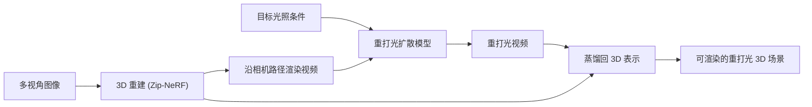

## 一句话总结

把一个视频到视频的重打光扩散模型的输出"蒸馏"回 3D 场景表示，从而实现对整个房间级 3D 重建场景的可控重打光，绕开了传统逆向渲染的病态求解。

## 研究背景

- 领域现状：给 3D 场景重打光是图形学的长期难题。传统做法先用逆向渲染把场景外观分解成材质、几何、光照，再在新光照下重渲染；近年也出现了直接用生成式图像/视频扩散模型做重打光的方法。
- 核心痛点：逆向渲染本质是病态问题，往往依赖朗伯反射、全局方向光、凸几何等简化假设，牺牲真实感、难以泛化到复杂真实场景。而已有的生成式方法要么只能做 2D 图像/视频重打光（无法用于新视角合成），要么只能对单个孤立物体（由环境贴图照明）重打光——没有能真正处理房间级 3D 场景的方案。房间级场景恰恰充满复杂的遮挡、互反射等全局光照效应，最难处理。
- 本文 idea：不去硬解逆向渲染。先微调一个预训练视频扩散模型，让它能在给定目标光照条件与源视频时做时序一致的视频到视频重打光；再用它去重打光从 3D 重建渲染出的视频序列；最后把这些重打光后的 2D 视频蒸馏回一个高保真的 3D 场景表示，得到一个"内容不变、光照改变"的新 3D 场景。

## 方法

整体框架分三步：先从多视角输入图像重建一个 3D 场景表示；然后沿选定相机路径渲染出一段视频，连同目标光照一起送入视频到视频重打光扩散模型，生成同一相机路径下的重打光视频；最后把重打光视频"蒸馏"回 3D 表示，得到可从任意新视角渲染的重打光 3D 场景。

关键设计：

1. **光照条件的表达**。室内光照被分成两类。对于直接可见的光源（吊灯、台灯等），提供一段逐像素标注的"可见光照视频" $$M$$，它与输入视频 $$I$$ 相机与内容对齐；某像素取 RGB 值 $$c$$ 表示该处光源应有强度/色调 $$c$$，取特殊值 $$(-1,-1,-1)$$ 表示该处不做编辑。设一个"不编辑"的特殊值很关键，否则就必须在每个像素上都精确给定 $$c$$。对于不可见的外部光源（例如透过窗户照进来的阳光），假设由太阳主导，只用一个标量表示太阳强度，经傅里叶特征升维、浅层 MLP 得到方向光照嵌入 $$d$$，喂入模型的交叉注意力层。

2. **视频条件的拼接方式**。作者对比了几种把条件注入扩散模型的策略：LightLab 沿通道维拼接输入图与光照条件，实验中视频质量不佳；UniRelight 沿时间维拼接、且所有视频共用相同位置编码。本文也沿时间维拼接输入视频、光照条件视频与待去噪的输出视频，但改用旋转位置编码（RoPE），使不同视频获得不同的位置编码、并支持完整的自注意力，实验证明效果更优。

3. **偏向高噪声的训练采样**。基座是 Wan 2.2 TI2V-5B。训练时时间步 $$t$$ 从一个偏向高噪声的分布中采样：

$$p(t) = \begin{cases} \rho/\tau & 0 \le t \le \tau \\ (1-\rho)/(1-\tau) & \tau < t \le 1 \end{cases}$$

取 $$\tau=0.4$$、$$\rho=0.85$$，即 85% 的训练步落在噪声最大的 40% 时间步上。原因是可信的重打光需要全局推理来保证整场景光照一致，而这种低频结构主要在高噪声阶段建立；低噪声阶段只负责细化高频细节，而在本任务中内容与纹理已由输入视频给定，细化相对轻松。训练目标是标准的流匹配去噪 $$L(\theta) = \lVert \hat{z}_t - f_{\text{noise}}(z,t) \rVert_2^2$$。

4. **重建与 3D 蒸馏**。可用 NeRF 或 3D Gaussian Splatting 从多视角图像重建；由于方法只依赖从 3D 模型渲染出的视频（而非原始多视角图像），也可直接作用于已有的 3D 重建。渲染时用宽视场的鱼眼相机沿椭圆路径走，以在扩散模型有限帧数下尽量覆盖场景。得到重打光视频后，通过微调 3D 模型去匹配重打光视频完成蒸馏。正文结果用 Zip-NeRF 做重建与蒸馏（质量高），但方法不绑定具体辐射场技术，也可换成实时的 3D Gaussian Splatting。

**训练数据**：用 Infinigen 构建大规模合成室内数据集，300+ 场景、每场景 30 种光照、9000+ 场景-光照组合、共 108000 段各 81 帧的视频，用 Blender Cycles 以 720×1280 渲染。采用"一次只开一盏灯"（OLAT）的方式：为每个相机 $$\pi$$ 渲染 $$L+1$$ 张基图 $$\{I^\pi_\ell\}$$，之后可用线性组合合成任意目标光照

$$I^\pi_{\text{target}} = \gamma\left(e \cdot \sum_{\ell=0}^{L} c_\ell I^\pi_\ell\right)$$

其中 $$c_\ell \in [0,1]^3$$ 是第 $$\ell$$ 个光源强度，$$e$$ 为曝光，$$\gamma$$ 为 sRGB 色调映射。训练时随机决定每盏灯开关（至少一盏开），开着的灯 80% 取 2500K–10500K 黑体辐射色、20% 取 HSV 随机色。相机用 180° 视场等立体角鱼眼，每条椭圆路径 90 个均匀相机。

## 实验结果

在与 Infinigen 训练分布一致的留出合成场景上做逐帧定量评测，与能重打光 3D 场景的 DiffusionRenderer、单图重打光的 LightLab、文本驱动的 Light-A-Video 对比（"输入视频"行是输入与重打光目标之间的参考指标）：

| 方法 | PSNR ↑ | SSIM ↑ | LPIPS ↓ |
|------|--------|--------|---------|
| 本文 | 24.77 | 0.741 | 0.130 |
| DiffusionRenderer | 15.17 | 0.553 | 0.668 |
| LightLab | 11.95 | 0.699 | 0.281 |
| Light-A-Video | 10.88 | 0.525 | 0.663 |
| 输入视频（参考） | 13.11 | 0.679 | 0.252 |

本文在三项指标上均明显领先。在真实场景（Eyeful Tower 数据集）上做的人类偏好用户研究中，评测帧间一致性、物体身份保持、与光照描述的相似度三项，本文相对 LightLab、DiffusionRenderer 的综合胜率约 79%，其中光照相似度达 88%；即便对比高质量但不遵守目标光照的原始输入视频也有 68.5% 胜率。消融实验表明：把时序拼接+RoPE 的条件方式换成通道维拼接会大幅掉点（PSNR 24.77→17.06），去掉高噪声训练偏置也会退化（SSIM 0.741→0.637）。

## 亮点与局限

- 亮点：
  - 据作者所知是首个对房间级 3D 场景做可控重打光的生成式框架，支持对每个光源单独控制强度与颜色（开关灯、改色、消除透窗外部光等），并保持多视角/时序一致。
  - 用"生成视频→蒸馏回 3D"绕开了病态的逆向渲染，无需分解材质/几何/光照，也不需要深度、法线、材质等 G-buffer 辅助数据。
  - 只在合成数据上训练却能泛化到真实场景，甚至能处理训练集中没见过的光源形状（如大矩形吊灯、插入新的"霓虹"光源），并合理再现投影阴影、反射、互反射等全局光照效应。
  - 视频重打光组件可独立使用，无需 3D 重建即可对真实视频重打光。

- 局限：
  - 泛化能力受训练时光源资产多样性限制，对非纯发光型光源等情形表现可能受限。
  - 依赖输入视频对场景的充分覆盖，覆盖不足时（如发光球背面）会出现伪影。

## 延伸思考

这条"用生成模型的 2D/视频输出去监督/蒸馏 3D 表示"的路线，与作者团队此前在物体级重光照（Generative Multiview Relighting、ROGR 等）上的工作一脉相承，本文把它从孤立物体推进到房间级场景，关键在于用视频扩散模型天然携带的时序一致性来支撑多视角一致的蒸馏。值得追问的方向包括：目标光照仍以"逐像素可见光视频 + 太阳标量"来指定，能否升级到更物理、可编辑的光源参数化（位置、方向性、面光源）；蒸馏阶段依赖重打光视频的一致性，当扩散模型输出出现帧间抖动时 3D 蒸馏如何鲁棒；以及把 Zip-NeRF 换成 3D Gaussian Splatting 后在实时编辑场景下的质量-速度权衡。
