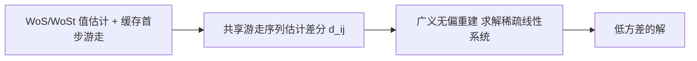

## 一句话总结

把渲染里的"梯度域"思想搬进无网格蒙特卡洛 PDE 求解器：不再只估计每个查询点的解，而是同时估计相邻点之间解的差值，再用无偏重建把两类估计融合，从而在相同采样预算下显著降噪、加速收敛。

## 研究背景

- 领域现状：Walk on Spheres（WoS）与 Walk on Stars（WoSt）等无网格蒙特卡洛方法能在几何极其复杂的域上求解泊松方程，无需划分网格，靠类似光线追踪的随机游走来估计解。围绕它的降方差已有不少工作，如边界值缓存（BVC）、均值缓存（MVC）、谐波缓存（HC）、离心 WoS（OC）等。
- 核心痛点：现有无网格方法都只在"原始域"里工作——只估计单点解 $$u(x)$$，方差高、收敛慢；已有的降方差手段大多依赖局部信息复用或估计器重构，在强源项、狭窄几何特征、或查询点稀疏/局限于小区域时效果都会退化。
- 本文 idea：借鉴梯度域渲染（GDPT）的思路——除了估计原始量，还估计相邻量之间的差分，再从两者联合重建出全局一致的信号。作者据此为泊松问题构造了一个直接针对"两个查询点解之差" $$u(x_j) - u(x_i)$$ 的蒙特卡洛估计器，并把渲染里的无偏重建方法迁移过来。

## 方法

整体框架是一条三阶段流水线：先用标准 WoS/WoSt 估计每个评估点的初始解，并缓存游走序列的关键信息；再利用共享游走序列估计相邻点之间的解差值；最后用广义无偏重建把值估计与差分估计融合成低方差的最终解。

关键设计：

1. **带缓存的值估计**：对每个评估点 $$x_i$$ 采样 $$M$$ 条独立 WoS 游走并取平均作为初值 $$\hat{u}_i$$。关键改动是只缓存每条游走"第一步"的必要信息——以 $$x_i$$ 为心的最大内切球 $$B_i$$、球面上采到的首个边界点 $$z^{(1)}_i$$、该点的解估计 $$\hat{u}(z^{(1)}_i)$$，以及首个内部点及其源项贡献。存这几项就够后续差分复用，不必保留完整游走，开销很小。含 Neumann 边界时首步仍用 WoS 建内切球以兼容缓存，之后切到 WoSt 加速收敛。

2. **共享游走的差分估计**：WoS 积分公式在球心不等于查询点时依然成立。于是对落在同一球 $$B$$ 内的两点 $$x_i, x_j$$，让它们复用同一条游走序列（同一个 $$z$$ 及其后续所有递归点），差分估计写成
$$\hat{d}_{ij} = \frac{\hat{u}(z)\,(P_B(x_j,z) - P_B(x_i,z))}{p(z)} + \frac{f(y)\,(G_B(x_j,y) - G_B(x_i,y))}{q(y)}$$
共享采样让两点估计强相关，公共噪声相互抵消，方差大幅下降。实践中直接复用值估计阶段缓存的球 $$B_i$$——邻点 $$x_j$$ 大概率也落在 $$B_i$$ 内，于是无需为每对点另找公共球。

3. **对称性强制**：$$x_j \in B_i$$ 不一定意味着 $$x_i \in B_j$$，且估计也未必满足 $$\hat{d}_{ij} = -\hat{d}_{ji}$$。作者按情况处理：两点互在对方球内时取 $$\hat{d}_{ij} = \tfrac{1}{2}(\hat{d}_{ij} - \hat{d}_{ji})$$；只有一侧成立就用有效那侧并令另一侧取负；两侧都不成立（极少）则从邻接关系 $$\mathcal{N}$$ 中丢弃该边。这样得到一致的反对称差分集合。

4. **广义无偏重建**：把每个点的最终解写成所有值估计与差分估计的线性组合
$$\tilde{u}_p = \sum_{i=1}^{N} \alpha^{(p)}_i \hat{u}_i + \sum_{(i,j)\in\mathcal{N}} \beta^{(p)}_{ij} \hat{d}_{ij}$$
并对权重施加无偏性约束，在该约束下最小化方差，等价于求解稀疏线性系统 $$(S F^{-1} S^\top)\tilde{I} = S F^{-1} c$$（$$S$$ 编码无偏约束，$$F$$ 是含方差估计的对角阵），用共轭梯度法求解，无需显式算出每个权重。方差未知，用样本方差近似并做空间滤波：规则网格上对值用 $$7\times7$$ 窗口高斯滤波、对差分做方向性滤波，非规则点则用 kNN 邻域。该重建不在原始估计器之外引入额外偏差。作者默认采用效率更高的单缓冲变体（经验偏差极小），需要严格无偏时可切换到双缓冲变体。

## 实验结果

在 Zombie 库上用 CPU 实现，评估点默认取 3D 几何某切片上的 $$512\times512$$ 点，参考解用 65536 条游走生成。下面这组等时对比（约 10 秒预算）是主实验，展示本文与各降方差基线在 MSE 上的差距（数值取自论文两个代表场景）：

| 方法 | 场景1 MSE↓ | 场景3 MSE↓ |
|------|-----------|-----------|
| WoSt | 1.10e-03 | 2.29e-04 |
| MVC | 7.49e-04 | 4.17e-05 |
| BVC | 8.66e-05 | 2.29e-03 |
| Off-Centered WoS | 3.71e-04 | 3.51e-05 |
| Harmonic Caching | 4.72e-05 | 1.36e-05 |
| 本文（单缓冲） | 1.23e-05 | 7.44e-06 |

本文在各场景中一致取得最低误差。在专门挑选的挑战性场景（强源项主导的 Nefertiti、带内部空腔的齿轮、查询点局限于扳手头部的小区域）里同样领先：这些设定会削弱随机游走复用与缓存的效果，而本文靠额外的低方差差分估计和重建阶段的信息复用保持鲁棒。

其余结论用文字补充：运行时分解显示差分估计与重建两个后处理阶段只占总时间的小部分，且随游走数 $$M$$ 增大占比趋于可忽略，总耗时由值估计主导；消融实验表明 $$3\times3$$ 邻域最优、CG 容差取 $$10^{-14}$$、广义无偏重建优于经典泊松（L2）重建；方法也适用于不规则评估点（顶点用 kNN 或网格邻接定义邻居关系），收敛曲线上本文两个变体都比基线更快、单缓冲通常误差最低。

## 亮点与局限

- 亮点：
  - 首次把梯度域渲染的"差分估计 + 无偏重建"范式引入无网格蒙特卡洛 PDE 求解，思路新颖且自洽。
  - 差分估计通过复用已缓存的首步游走实现，几乎零额外采样开销，后处理成本在高采样时可忽略。
  - 不局限于渲染那种稠密 2D 图像格点，可定义在任意评估点集合上（切片、局部感兴趣区域、网格顶点），邻接关系可用固定窗口、网格连通性或 kNN，通用性强。
  - 重建不在底层估计器之外引入额外偏差；需要严格无偏时可切双缓冲变体。

- 局限：
  - 底层用 WoSt 做点估计，在 Neumann 边界附近方差较高，当评估点贴近此类边界时会拖累整体效率。
  - 默认的单缓冲变体严格意义上有偏（虽经验偏差很小），追求严格无偏需付出双缓冲的更高方差与计算成本。
  - 差分估计只复用了缓存的共享游走，未采用更激进的逐对耦合，留有进一步降方差的空间。
  - 实验均在 CPU 上、以泊松方程为主，未涉及 GPU 加速或更广的 PDE 类型。

## 延伸思考

方法把渲染社区成熟的梯度域重建（尤其作者组自己的广义无偏重建工作）直接迁移到 PDE 求解，体现了"渲染即积分估计"与"PDE 即积分方程"之间的深层同构——两边都是从带噪的原始量与差分量里重建全局一致的场。作者指出的两个方向都值得追问：一是用神经引导缓解 Neumann 边界附近的高方差；二是把共享游走序列嵌入 ReSTIR 式的时空重采样管线以更高效地复用信息。此外，把差分估计从"共享游走"升级为"逐对相关耦合"（类似渲染里的 shift mapping），以及推广到更一般的椭圆/抛物型 PDE，都是自然的下一步。
