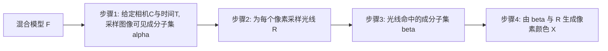

## 一句话总结

把 4D 高斯泼溅重新表述成一个概率图模型 GraphiXS，用统一的生成过程显式建模"数据不确定性"（缺相机、缺帧、相机不同步、相机故障等），从而在数据稀疏或被污染的场景下比现有 4DGS 方法更鲁棒。

## 研究背景

- 领域现状：高斯泼溅（GS）已经是三维重建与神经渲染的主流范式，研究主要沿三条线推进——扩展表示（换用不同基元）、改进优化策略、加速推理与扩大规模，并衍生出新视角合成、SLAM、几何重建等应用。在动态场景（4DGS）里，主流做法是学习高斯基元的运动/形变，或者构建更高维的基元再对时间维做边缘化。
- 核心痛点：几乎所有方法都显式或隐式地假设"数据充足且高质量"——足够多、覆盖全角度的相机，加上良好的标定与同步。现实里这个假设太苛刻：出于安全、场地、成本等限制，采集往往只有少量视角、低帧率、相机不同步甚至中途故障。已有考虑不确定性的工作大多只针对某一种具体场景（在线学习、动静分离、稀疏视角重建），缺一个能统一容纳多种数据不确定性的框架。
- 本文 idea：把 4DGS 的整个渲染流程看成一个多步生成过程，为每一步引入随机性，构造一个概率图模型。所有可学习参数（如基元位置）都当作隐变量，用最大后验（MAP）来推断；并且不再只把图像当观测，而是把相机位姿 $$C$$ 和帧时间 $$T$$ 也当作随机变量的采样，这样就能自然地把它们的不确定性纳入模型。

## 方法

整体框架：GraphiXS 把 4DGS 表示为一个（未归一化的）混合模型 $$F = \sum_{i=1}^{N} \delta_{\theta_i}$$，其中每个"成分"（component）是一个由参数 $$\theta_i$$ 决定的分布——可以是高斯、Student's-t 等，所以论文用中性词"成分"而不是"高斯"。成分的生成与成像被拆成四步条件概率，串起来就是从混合模型到像素颜色的完整生成过程。

关键设计：

- 四步生成过程与似然分解。联合似然按图模型因子化为 $$P(X \mid \bullet) = P(X \mid \beta, R)\, P(\beta \mid \alpha, R)\, P(R \mid C, T)\, P(\alpha \mid \delta_\theta, C, T)$$。其中前三项（栅格化、逐像素求交、逐像素光线投射）本质上由光线传输决定、是确定性的，沿用 3DGS 的做法实现；随机性只注入在需要的环节。由于确定性的栅格化本身不是一个分布、无法直接做 MAP，作者改用一个基于能量的分布，把重建损失（$$L_1$$ 与 D-SSIM）以及对不透明度、协方差的正则项写进 $$L_{\text{img}}$$，鼓励用尽量少、尽量"尖锐"的成分去拟合图像。
- 成分置信度 $$P(\alpha \mid \delta_\theta, C, T)$$。这是把"数据不确定性"引入的核心。它定义为某个成分对所有相机、所有时刻、所有像素的软可见度，再对全体成分归一化。一个成分若方差小且对很多像素可见，则置信度高。最大化这一项等价于把高置信度的成分放在"多个相机、多个时刻共同可见"的重叠区域——一旦某相机或某帧缺失，这些放对位置的成分仍能对缺失视角/时刻做出合理的"猜测"，因此天然对稀疏视角和缺帧鲁棒。
- 高阶运动先验。成分的位置 $$\mu(t)$$ 被建模为布朗运动 $$\frac{d\mu}{dt} = f(\mu, t) + \mathcal{N}(0, \epsilon^2 I)$$，离散化后用速度、加速度、jerk、snap 四阶导数展开 $$f(\mu, t)\,\Delta t$$，以刻画任意、甚至不连续、不平滑的运动，这对低帧率下恢复快速运动尤为关键。此外还设计了若干先验：对基础不透明度施加先验抑制过大的不透明度；对协方差施加先验、偏好成分间形状差异小；对动力学变量施加先验、并用成分体积 $$\sqrt{\lvert \det(\Sigma_p) \rvert}$$ 加权，让越大的成分运动越慢越平滑（大成分往往是静态背景）。
- 优化。整体目标是最小化 $$L_{\text{full}} = L_{\text{img}} + L_\alpha + L_\theta$$，即负对数后验。采用随机梯度哈密顿蒙特卡洛（SGHMC）注入动量与受控随机性，并为 GraphiXS 设计了成分增删采样与初始化策略。

值得强调的是，作者指出原始 3DGS 只是 GraphiXS 的一个特例——去掉时间 $$T$$、把成分固定为高斯、后两步退化为确定的求交与栅格化。因此 GraphiXS 既能用不同基元实例化（论文给出 Student's-t 版 GraphiTS 与近似高斯版 GraphiGS），也能用来"升级"已有的确定性 4DGS 方法，把它们改造成能容纳数据不确定性的概率版本。

## 实验结果

数据集用 Neural 3D Video（N3DV）和 Google Immersive（GI）；指标为 PSNR、DSSIM、LPIPS。基线包括 4DGS-1、4DGS-2、Ex4DGS、FreeTimeGS（FTGS），均从头训练、跑三次取平均。作者设计了多档不确定性设置：标准设置、稀疏视角、稀疏帧、相机不同步、故障相机。

在"标准设置"（几乎无数据不确定性）下的主对比如下，可见即便数据充足，显式建模不确定性仍能进一步提升重建质量，且在相机更稀疏的 GI 数据集上优势更明显：

| 方法 | N3DV PSNR↑ | N3DV LPIPS↓ | GI PSNR↑ | GI LPIPS↓ |
|------|------------|-------------|----------|-----------|
| 4DGS-1 | 31.18 | 0.051 | 26.76 | 0.153 |
| 4DGS-2 | 30.52 | 0.060 | 23.99 | 0.290 |
| Ex4DGS | 31.71 | 0.050 | 20.39 | 0.190 |
| FTGS | 31.55 | 0.047 | 28.01 | 0.073 |
| Ours GraphiGS | 31.78 | 0.044 | 28.84 | 0.064 |
| Ours GraphiTS | 32.02 | 0.043 | 29.08 | 0.056 |

其余设置的结论用文字概述：在稀疏视角（随机去掉 10%/30%/50% 训练相机）下，GraphiXS 在 9 组实验里 8 组最优、1 组次优，缺相机越多，它受影响越小。在稀疏帧（训练帧率降到 20/10 FPS、仍按 30 FPS 评测）与相机不同步（部分相机降到 20 FPS）两种设置下，GraphiXS 整体最优，且几乎不随稀疏程度退化。在故障相机（综合各类不确定性，时空稀疏度约 13%/37%/84%）里，最极端的 Faulty Cam 3 下多数基线大幅崩坏（4DGS-2 的 PSNR 掉到约 14.9），GraphiXS 仍保持最高 PSNR。"升级"实验表明把 FTGS 用 GraphiXS 概率化后，在标准与故障相机设置下均有提升。消融显示：去掉高阶动力学、去掉成分置信度都会变差，而去掉整体随机性（确定性变体）性能显著下滑，验证了概率化框架本身的价值。

## 亮点与局限

- 亮点：
  - 把 4DGS 统一到一个概率图模型下，第一次系统性地把多种数据不确定性（缺视角、缺帧、不同步、故障）holistically 纳入同一框架，视角与不确定性都当随机变量处理。
  - 框架通用：可用不同基元（高斯、Student's-t）实例化，也能"升级"现有确定性 4DGS 方法，通用性有实验支撑。
  - 即使在数据充足的标准设置下也能提升质量，且数据越稀疏/被污染优势越大，鲁棒性说服力强。
- 局限：
  - 假设成分是由一组通用参数刻画的概率分布，因此不适合升级采用几何基元等自由形式表示的方法。
  - 用的是 MAP 而非完整贝叶斯推断，没有学到 $$\theta$$ 的后验分布，作者也承认这对本质随机的 4DGS 而言并非最理想。
  - 对相机位姿 $$C$$ 和时间 $$T$$ 采用无信息先验，尚未纳入相机位姿先验 $$P(C)$$。

## 延伸思考

- 把渲染流程"生成过程化"再逐步注入随机性，是一条很有迁移潜力的思路：同样的图模型视角或许能推广到静态稀疏视角重建、单目动态重建，甚至带曝光/快门时间不确定性的物理成像建模（论文相关工作已提到光子积分时间的时间不确定性）。
- 论文把原始 3DGS 明确刻画为自身特例，这种"用概率框架统一并泛化已有确定性方法"的叙事，值得在其它 GS 变体（几何基元、2DGS 等）上追问：哪些能被纳入、哪些因基元形式受限而不能。
- 后续若补上完整贝叶斯后验与相机位姿先验，可能进一步改善极端稀疏（如 Faulty Cam 3）下的表现，也更契合作者对"4DGS 本质随机"的判断。
