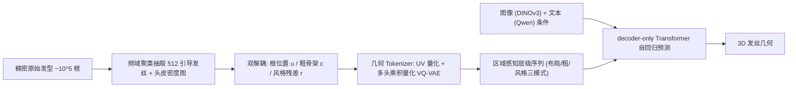

## 一句话总结

HairGPT 把发丝当作"语言"，用一套"双解耦"表示把 3D 发型拆成头皮空间布局与逐发丝几何，再交给一个多模态自回归 Transformer（VLM）在图像/文本条件下逐 token 生成，实现可控、可组合编辑、且能覆盖复杂拓扑与风格化域的高保真发型合成。

## 研究背景

- 领域现状：现有生成式发型方法多把头发当成"2D 纹理合成"问题——把 3D 发丝几何投影成以头皮 UV 参数化的隐式纹理图，再用 2D 扩散在连续几何场上去噪（如 DiffLocks、HAAR）。视觉上不错，也有基于自回归的探索（如面向二次元发卡的 CHARM）。
- 核心痛点：把整个发型压成一张单一的隐式场，会把"全局拓扑"和"局部纹理"纠缠在一起，导致区域化、可组合的编辑很脆弱——比如想只改卷曲程度而不动整体轮廓、或只调刘海不动头顶，几乎做不到。这与人类发型师"按解剖区域、由粗到细逐步造型"的直觉存在语义鸿沟。
- 本文 idea：回到"发丝"这个基本生成单元，把发型合成重述为一个双解耦的自回归序列建模问题：沿头皮做空间解耦（把头皮分成语义区域），沿发丝做结构解耦（粗骨架 + 风格残差），再用几何 tokenizer 把发丝离散成"几何词表"，让 Transformer 像写句子一样、条件于已生成几何逐步"造型"。

## 方法

整体框架：先从稠密原始发型（约 $$10^5$$ 根）中抽取稀疏的 512 根引导发丝（guide strands）和一张头皮密度图，作为紧凑结构骨架；每根引导发丝被"双解耦"为空间根位置、低频粗骨架、高频风格残差；这些成分再被离散成 token，按"区域感知 + 分阶段"的层级序列排布，最后由 decoder-only 的多模态 Transformer 在图像与文本条件下自回归预测。

关键设计：

1. 双解耦发型参数化（是什么/为什么/怎么做）。空间上依据 Hairmony 分类法把头皮分成 $$M=8$$ 个语义区域（Front / Top / Crown / Nape 及左右 Side、Temple），并定义头皮密度图 $$D$$ 独立描述发根分布；结构上把每根发丝写成三元组 $$s=(u,c,r)$$，其中 $$u$$ 是根位置、$$c$$ 是低频粗骨架、$$r$$ 是高频风格残差，最终 $$s=c+r$$。这样做的目的是让"发根放哪里"和"发丝长什么样"彼此独立，从而支持区域化、可组合的编辑。粗几何通过对段方向向量做 DCT、只保留前 $$K_{\text{geo}}=4$$ 个系数再逆变换得到；风格残差在沿骨架用平行传输构建的局部正交标架 $$F_j$$ 里、并用局部尺度 $$\sigma_j$$ 归一化后表示为 $$r_j=\tfrac{1}{\sigma_j}F_j^{\top}(p_j-\hat p_j)$$，做到尺度与旋转不变，使"风格词"可跨发丝复用，且整个参数化是可逆（bijective）的。

2. 稀疏引导发丝抽取。为让 $$10^5$$ 量级、且无天然顺序的原始发丝可被序列建模，先在频域做聚类：对每根发丝减去根位置后取 DCT（相较 DFT 能避免开曲线首尾不连续带来的振铃），保留前 8 个系数作为低通形状描述子，再 k-means 聚成 $$N_{\text{guide}}=512$$ 类，取每类质心作为引导发丝；同时把所有发根投影到头皮 UV 得到密度图。

3. 解耦式几何 Tokenization。根 UV 坐标离散到 $$256\times256$$ 网格得一对 $$(u,v)$$ token；粗骨架 $$c$$ 与风格残差 $$r$$ 各训练一个采用四头乘积量化（product quantization）的 VQ-VAE，各产 4 个 token——每根发丝只用 8 个离散 token，这对把数百根引导发丝的自回归序列长度压到可训练至关重要；密度图 $$D$$ 用一个标准 2D VQ-VAE 压成 $$32\times32$$ 隐图再量化成 1024 个密度 token 作为全局结构条件。几何 tokenizer 先在合成数据（DiffLocks、Perm）上预训练并在 LLM 训练阶段冻结。

4. 统一多模态自回归 VLM 与分阶段生成。以预训练 Qwen 为骨干，把 UV / 粗 / 风格 / 密度所有离散成分并入统一词表 $$V$$；图像走冻结的 DINOv3 抽 patch 特征经投影器接入，文本保留 Qwen 词嵌入。序列按区域顺序组织，每根发丝进一步拆成布局、粗、风格三种"模式"子序列（$$\tau^{\text{lay}},\tau^{\text{coa}},\tau^{\text{sty}}$$），并用分隔符 token 界定任务；训练时每条序列只由单一模式构成（mode-specific sampling），避免跨阶段耦合与误差累积。损失是带类别权重的 next-token 预测，并用冗余掩码把重复出现的空间锚点 $$(u_k,v_k)$$ 从梯度中排除。文本标注则靠 LoRA 微调的 Qwen2.5-VL-7B 按 Hairmony 分类法产出全局 + 逐区域的层级描述；整套数据引擎最终汇集约 12 万条 (图像, 文本, 几何) 对齐三元组。

## 实验结果

主实验为 DiffLocks 评测集上的几何重建质量对比（相对 GT 发丝），HairGPT 在 Chamfer 距离、DCT-FID、Recall 与 F-score 上整体优于扩散基线 DiffLocks，Precision 略低：

| 方法 | CD ↓ ($$\times10^{-3}$$) | DCT-FID ↓ ($$\times10^{-3}$$) | Precision ↑ | Recall ↑ | F-score ↑ |
|------|------|------|------|------|------|
| HairGPT | 6.31 | 8.80 | 0.824 | 0.833 | 0.828 |
| DiffLocks | 7.83 | 9.97 | 0.839 | 0.809 | 0.824 |

其余结果与消融用文字概述：图像条件下的 CLIP 相似度上，HairGPT 得 0.592，优于 DiffLocks（0.577）与 HairStep（0.537），作者也指出 CLIP 偏重局部纹理、可能低估其全局拓扑优势。定性上，本方法能生成发髻、马尾等复杂拓扑与紧密卷曲的 afro 发型，而 HairStep 丢失局部细节、DiffLocks 难处理复杂拓扑。消融显示：多头乘积量化相较单头显著降低位置/方向误差并提升码本利用率（约 99%）；去掉粗-风格解耦会明显加大方向误差与位置漂移，且无法还原高频卷曲；把所有 token 直接拼成单条长流（Interleaving）或不做分阶段训练（约 1 万 token 的长序列）会因自回归漂移与长程依赖瓶颈导致几何"坍塌"。应用上支持二次元跨域适配、与人脸合成模型联合生成写实 avatar，以及通过改密度图/区域文本做灵活的多模态编辑。

## 亮点与局限

- 亮点：
  - 把"发丝即语言"的自回归范式做到写实 3D 发型，双解耦（空间区域 + 粗/风格）表示天然支持区域化、可组合的编辑，契合发型师"由粗到细"的造型逻辑。
  - 多头乘积量化让每根发丝仅需 8 个 token，配合分模式序列与分阶段训练，把数百根引导发丝的长序列自回归建模变得可行且稳定。
  - 统一图像/文本/几何的多模态框架，借力预训练 VLM 的语言先验，兼顾语义可控与结构一致，并能迁移到风格化域。

- 局限：
  - 数据引擎依赖微调 VLM 做自动语义标注，标签在细微区域属性、模糊边界与稀有发型上仍不及专家标注。
  - 每根发丝仅 8 token 的紧凑表示牺牲了部分局部保真度，极高曲率或不规则纹理可能被平滑。
  - 只生成引导发丝，稠密头发靠简单插值得到，最终视觉质量受插值算法影响；自回归推理需 30–60 秒，慢于扩散类方法。

## 延伸思考

- 该工作把 MeshGPT / PolyGen 式"几何即语言"的思路迁移到发丝这一细长开曲线基元上，"频域聚类 + 局部标架归一化残差 + 乘积量化"这套压缩管线，对其它高基数、无天然顺序的曲线/纤维类几何（如布料纱线、血管、植被）可能同样适用。
- 引导发丝 + 下游稠密化的两阶段思路，若把当前"简单插值"替换为专门的稠密发丝细化模型（例如条件扩散或神经上采样），有望在保留可控性的同时补回被平滑掉的高频细节。
- 自回归 30–60 秒的推理开销是交互式创作的瓶颈，值得关注并行/投机解码或"布局-粗-风格"分阶段缓存等加速手段，以及把可逆参数化用于"重建-编辑-再生成"的闭环工作流。
