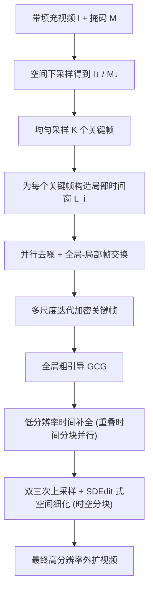

## 一句话总结

HL-OutPaint 提出一个"由粗到精"的两阶段视频外扩框架：先用时空双重压缩构造一个全局粗引导（GCG）来锚定整段视频的结构与运动，再借助基于分块扩散的高分辨率细化生成细节，从而在大幅空间外扩且长序列的场景下同时保持空间与时间的一致性。

## 研究背景

视频外扩（video outpainting）指在视频原有空间边界之外合成合理的画面内容，用于把固定长宽比的视频适配到不同显示设备，或服务于重构图、稳定、为叠加元素预留空间等编辑任务。随着视频消费终端日益多样，高质量的灵活空间扩展成为现代视频制作流程中的关键需求。要做好这件事，生成内容必须在时间和空间上都保持连贯。

已有方法大多只解决问题的一个维度。Infinite-Canvas 用基于分块（patch/tile）的策略支持大幅空间外扩，但其局部生成策略限制了全局连贯性，容易产生重复或不一致的结构；M3DDM 面向长序列，通过对帧下采样构造精简片段、用关键帧作为长期引导，但当输入含快速运动时，关键帧之间的时间间隔过大，常导致时间不一致。此外，自回归式的长视频生成范式因训练与推理分布不匹配而容易累积误差，随时间推移画质逐步劣化。因此，同时满足"大幅空间外扩"与"长序列"这两个维度的统一方案仍是空白。

作者据此提出 HL-OutPaint，主张用统一框架同时处理长时长与大空间扩展比。其核心贡献有三：提出面向真实世界高分辨率、长序列视频的统一外扩框架；提出全局-局部帧交换（global-local frame swapping）机制，把稀疏关键帧与其局部时间窗耦合，兼顾长程结构一致性与短程时间连贯性；通过大量实验验证在多种需要大空间扩展与长程时间一致性的场景下达到领先水平。

## 方法

### 整体框架

给定一段原始视频，先在其空间边界外补零得到带填充视频 $$\boldsymbol{I}$$ 与掩码 $$\boldsymbol{M}$$（掩码中 1 表示待外扩区域、0 表示已观测区域），外扩目标是合成填充区域内容得到扩展视频 $$\hat{\boldsymbol{I}} = P(\boldsymbol{I}, \boldsymbol{M})$$。整个流程由两个阶段构成：先构造全局粗引导（GCG），再在其引导下做高分辨率外扩。

### GCG 构造与全局-局部帧交换

第一阶段把带填充视频与掩码下采样到扩散骨干支持的分辨率，得到 $$\boldsymbol{I}^{\downarrow}$$ 与 $$\boldsymbol{M}^{\downarrow}$$，再均匀采样 $$K$$ 个关键帧（$$K$$ 为模型单次前向可处理的最大帧数），构成关键帧集合 $$\mathcal{G} = \{\boldsymbol{I}^{\downarrow}_{k}\}_{k \in \mathcal{K}}$$。关键帧充当锚点捕捉全局结构，但激进的时间下采样会丢掉细粒度时间动态。为此，为每个关键帧 $$\boldsymbol{I}^{\downarrow}_{k_i}$$ 构造一个局部时间窗 $$\mathcal{L}_i$$：窗内以小步长 $$\delta$$ 在 $$k_i$$ 附近采样 $$K$$ 帧，保留关键帧本身无法捕捉的短程时间线索。局部窗不作为最终输出，而是作为把细粒度时间信息注入关键帧的辅助轨迹。

去噪时，对关键帧集合与各局部窗分别用高斯噪声初始化，再用扩散算子 $$\boldsymbol{z}_{t-1} = D(\boldsymbol{z}_{t}; V, M)$$ 并行去噪，让关键帧专注全局结构、局部窗专注短程动态。若两者独立去噪则会相互脱节，因此引入全局-局部帧交换：在早期去噪步骤中，每次迭代后把关键帧集合中每一帧的潜在表示替换为其对应局部窗内同一帧的潜在表示。这样全局结构与局部细粒度线索得以双向共享，并在后续去噪步骤中传播，最终得到既全局稳定又局部对齐的关键帧集合 $$\boldsymbol{I}_{GCG} = \{\hat{\boldsymbol{I}}^{\downarrow}_{k_i}\}_{k_i \in \mathcal{K}}$$。

对极长视频，初始关键帧过于稀疏、时间覆盖不足，作者采用多尺度迭代加密：先对均匀采样的关键帧执行一次 GCG 构造，再在相邻关键帧的时间中点插入新关键帧形成更密集集合，并以已构造的引导作为初始化重复该过程。对已构造好的关键帧，将其掩码整帧置 1，使新插入帧依据已有帧被外扩、而已有帧保持不变。迭代持续到相邻关键帧的时间间距低于阈值 $$\tau$$ 为止，从而兼顾全局时间结构与细粒度时间连续性。

由于该阶段需要模型在相邻条件帧时间间隔很大时仍能合成外扩内容，作者在模仿"关键帧-窗"结构的训练对上微调一个基于 DiT 的视频扩散模型，使其能在大时间间隔下可靠合成缺失区域。

### GCG 引导的视频外扩

第二阶段在 $$\boldsymbol{I}_{GCG}$$ 引导下由粗到精生成最终结果。先做低分辨率时间补全：构造一个低分辨率视频，凡是有引导帧处就用对应引导帧替换，其余保持原样：

$$
(\bar{\boldsymbol{I}}^{\downarrow}_{f}, \bar{\boldsymbol{M}}^{\downarrow}_{f}) =
\begin{cases}
(\hat{\boldsymbol{I}}^{\downarrow}_{k_i}, 1) & \text{if } f = k_i,\ k_i \in \mathcal{K} \\
(\boldsymbol{I}^{\downarrow}_{f}, \boldsymbol{M}^{\downarrow}_{f}) & \text{otherwise}
\end{cases}
$$

由于视频长度 $$F$$ 超过模型可处理的最大序列长度，作者把视频切成重叠的时间分块并行采样，并在每个扩散步后混合重叠潜在区域以保证分块间平滑过渡，得到时间补全后的低分辨率视频 $$\hat{\boldsymbol{I}}^{\downarrow}$$。

随后做空间细化恢复高分辨率细节：先用双三次插值把 $$\hat{\boldsymbol{I}}^{\downarrow}$$ 上采样到原始分辨率得到中间视频 $$\tilde{\boldsymbol{I}}$$，再以 SDEdit 的方式注入适量高斯噪声并从中间扩散步开始去噪，去噪时以带填充输入视频 $$\boldsymbol{I}$$ 和掩码 $$\boldsymbol{M}$$ 为条件，确保合成区域与已观测内容一致。因分辨率与长度超过模型容量，这里采用重叠的时空分块策略，每块独立处理并在每次去噪迭代混合相邻块的重叠区域，从而在块边界维持时空一致。值得注意的是，两个阶段所用的扩散算子面对不同时间采样密度：GCG 构造处理稀疏帧，而 GCG 引导外扩依赖原帧率的稠密帧，因此第二阶段单独在全帧率训练对上微调一个扩散算子。

### 实现要点

作者基于领先的视频扩散模型 Wan2.2-14B-I2V，用 LoRA（学习率 $$1 \times 10^{-4}$$、秩 128）分别为 GCG 构造与 GCG 引导外扩训练两个模块；训练数据来自 OpenVid-1M 与 REDS，统一重采样到 $$768 \times 768$$、49 帧，训练时把输入视频与二值掩码沿通道维拼接到噪声潜在上。两个 LoRA 采用不同采样策略：GCG 构造随机采样大间隔帧以模拟稀疏关键帧外扩，GCG 引导外扩用标准稠密采样。步长 $$\delta$$ 依运动程度设置（静态视频取 5、动态视频取 1），多尺度阈值 $$\tau$$ 设为 20。

## 实验结果

作者在 DAVIS、DAVIS-20、YouTube-VOS、Long-Video 与 Short-Form 五个数据集上评估，覆盖短视频（平均 68 帧）到长视频（平均 481 帧）、以及从 $$512 \times 512$$ 到 $$1920 \times 1080$$ 的多种空间外扩比例，指标包括 PSNR、SSIM、FVD、主体一致性（SC）、背景一致性（BC）与美学质量（AQ）。下表为主要定量对比，HL-OutPaint 在大多数指标上取得最优或次优，尤其在长序列与大幅外扩场景优势明显。

| 数据集 (外扩) | 方法 | PSNR ↑ | SSIM ↑ | FVD ↓ | SC ↑ | BC ↑ | AQ ↑ |
| --- | --- | --- | --- | --- | --- | --- | --- |
| DAVIS (512→1280×720) | M3DDM | 15.07 | 0.618 | 514.2 | 0.851 | 0.902 | 0.466 |
| DAVIS | Infinite-Canvas | 15.85 | 0.590 | 281.8 | 0.872 | 0.909 | 0.489 |
| DAVIS | VACE | 16.63 | 0.618 | 177.0 | 0.889 | 0.915 | 0.499 |
| DAVIS | HL-OutPaint | 16.87 | 0.619 | 202.4 | 0.890 | 0.910 | 0.502 |
| DAVIS-20 (512→1920×1080) | VACE | 14.89 | 0.591 | 620.0 | 0.875 | 0.897 | 0.528 |
| DAVIS-20 | HL-OutPaint | 15.32 | 0.620 | 564.6 | 0.877 | 0.901 | 0.520 |
| YouTube-VOS (256→512) | Infinite-Canvas | 16.71 | 0.592 | 1401.0 | 0.840 | 0.908 | 0.422 |
| YouTube-VOS | HL-OutPaint | 22.15 | 0.821 | 634.0 | 0.862 | 0.923 | 0.523 |
| Long-Video (512→1280×720) | VACE | 15.84 | 0.620 | 131.7 | 0.888 | 0.912 | 0.536 |
| Long-Video | HL-OutPaint | 16.60 | 0.633 | 133.2 | 0.889 | 0.912 | 0.555 |
| Short-Form (416×720→1280×720) | VACE | - | - | - | 0.900 | 0.911 | 0.550 |
| Short-Form | HL-OutPaint | - | - | - | 0.920 | 0.930 | 0.574 |

定性对比显示，MOTIA 与 M3DDM 在大空间外扩下多数出现严重伪影；Infinite-Canvas 与 VACE 单帧看似合理，但长序列中难以维持时间一致，例如火车经过站台先遮挡再重现同一区域时，二者在遮挡前后画面外观不一致，而 HL-OutPaint 能保持长程一致。

消融方面，全局-局部帧交换在 Long-Video 上带来全指标提升（如 PSNR 16.21→16.60、FVD 141.8→133.2），其作用在于当稀疏关键帧本身缺乏某结构（如被裁切的交通标志）的观测时，模型不再凭空幻想任意形状，而是从邻近帧的清晰观测继承正确结构线索，消除时间不一致。GCG 的时空压缩分析表明：只做空间压缩会因时间分块间缺乏信息交换导致物体（如球门柱）逐渐消失；只做时间压缩会因空间分块独立生成产生严重重复伪影；时空联合压缩最稳定连贯。空间细化则把双三次上采样后模糊的画面恢复出更锐利自然的人脸轮廓、文字字形与草地/毛发等复杂纹理。

## 亮点与局限

亮点在于：把"全局结构建模"与"细粒度合成"解耦，用时空双重压缩的 GCG 让扩散模型能在其注意力跨度内整体优化全序列，为大空间扩展与长序列建立一致的结构基座；全局-局部帧交换以一个简洁的潜在替换操作，把局部窗的短程时间线索注入稀疏关键帧，兼得长程结构与短程连贯；多尺度迭代加密进一步应对极长视频的覆盖不足；相比自回归范式，先建全局引导再并行生成所有帧，从机制上规避了误差累积。

局限在于：因所有帧联合、单次推理生成，方法不适合实时应用；在极端情形下会失效——极大空间扩展（如 $$512 \times 512$$ 到 $$5760 \times 5760$$）需把输入重度下采样到如 $$768 \times 768$$ 来构造 GCG，导致高频信息严重丢失，外扩区域仅依赖 GCG，上采样与细化都难以恢复，结果偏平滑或模糊；对极长视频，关键帧与局部窗也可能无法完整覆盖整段序列，难以维持时间一致。作者指出这类极端情况在实际外扩场景中较少遇到。

## 延伸思考

这项工作体现了"由粗到精 + 分而治之"的经典范式在长序列生成上的一次务实落地：扩散模型的注意力跨度与显存决定了它无法一次吞下高分辨率长视频，于是把问题拆成"先在压缩空间求全局一致的骨架、再在原分辨率补细节"。真正的巧思在于全局-局部帧交换——它没有引入新网络或复杂损失，而是在去噪轨迹层面做潜在表示的双向交换，用极低成本解决了"稀疏关键帧看不见、局部窗看得见"的信息错配问题，这类"在采样过程中耦合多条轨迹"的思路对其它需要兼顾全局与局部的生成任务（如全景生成、超长音频/动作合成）都有借鉴意义。

另一个值得关注的取舍是全局引导的分辨率上限直接决定了外扩区域的细节天花板：原始区域可靠强条件在细化阶段找回细节，外扩区域却只能仰仗被压缩过的 GCG。这说明"压缩表示"既是效率来源也是质量瓶颈，如何让引导表示在保持全局可优化性的同时携带更多可恢复的高频信息（例如引入频域或结构先验、或让细化阶段具备一定的生成式补全能力而非纯上采样），可能是这条技术路线继续突破的关键。
