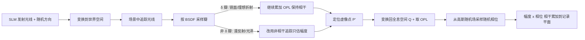

## 一句话总结

把物理精确的路径追踪和波动光学传播统一到同一个蒙特卡洛框架里，直接从 3D 场景渲染出携带完整相位信息的复振幅波场，从而生成能忠实还原反射、折射、视点相关高光与自然离焦的相位全息图。

## 研究背景

- 领域现状：全息显示（holographic display）用空间光调制器（SLM）调制相干光波，重建出接近真实物体发出的波前，是 VR/AR 追求"感知真实感"的有力路线。计算机生成全息（CGH）算法负责从 3D 场景算出全息面上的波场，再编码成纯相位全息图。
- 核心痛点：现有 CGH 范式普遍把"辐射度估计"和"波传播"两步拆开——先在离散化的几何图元（点云、多边形、分层 RGBD 图像、光场、2D 高斯）上预渲染辐射度，再做数值衍射传播到全息面。这种分离带来两个问题：一是离散化本身损失精度，难以正确表达深度连续性、视点连续性以及玻璃/镜面这类基于物理的材质行为；二是像点云需要密集采样、分层/多边形方法的耗时随层数或面片数线性增长，难以扩展到复杂场景。此外，直接把波传播硬塞进路径追踪又因多次反弹加高波采样率而计算量爆炸。
- 本文 idea：以 Rayleigh–Sommerfeld（RS）衍射积分为根基，用蒙特卡洛路径追踪**同时**求解渲染方程和 RS 积分，绕开预定义的离散图元，直接得到复振幅波场。关键在于把光照分解为相干分量（用 RS 积分传播、保留相位）和非相干分量（用普通路径追踪只估幅度），并通过路径复用与环境光缓存把计算压到可用的量级。

## 方法

整体框架：从 SLM（记录平面）上一点发出一条带随机初始方向的光线，变换到世界空间后在场景中追踪；击中面片时按其 BSDF 概率采样一个反射/折射瓣，据此判断是走相干还是非相干路径，最终把每条光线携带的幅度与相位相干地累加回记录平面，得到 RS 积分的蒙特卡洛解。整个流程被拆成 9 个阶段（采样与追踪、投影变换、BSDF 评估、随机相位采样、复振幅累加）。

关键设计：

1. **波面片（Wave Facet）——扩展微表面模型带上相位**。传统微表面 BSDF 只描述非相干辐照度（强度），本文把它扩展成同时携带相位的"波面片"。当相干平面波束打到面片，散射场被拆成相干与非相干两部分：镜面反射/理想折射这类 $$\delta$$ 瓣保持波前相位一致，需要继续累加光程 OPL 以保留正确深度与多视一致性；漫反射/光泽这类非 $$\delta$$ 瓣则因随机散射导致光程随机化，本文对其施加随机相位扰动使出射场去相关，之后只记录光线携带的幅度（平均辐射度的平方根），不再累加相位。这样把"要不要继续追相位"变成由材质类型自动决定的开关。

2. **波路径追踪与空间变换**。全息重建发生在全息空间，因此所有衍射累加都要在全息空间做；而路径追踪在世界空间进行以获得正确的光传输。两者用一个复合变换 $$x_{holo} = T x_{world}$$ 联系起来，其中 $$T = (P_{holo}V_{holo}M_{holo})^{-1} P_{world}V_{world}M_{world}$$。光线首次击中非 $$\delta$$ 面片处定义为实像点 $$P$$，其后累加的幅度归到 $$P$$；根据 $$\delta$$ 瓣累积的光程 $$d_{OPL}$$ 算出用于感知的虚像点 $$P' = O + d_{OPL} v$$，再变换到全息空间得到 $$Q = T P'$$，赋予幅度和相位后传播回记录平面。所有采样光线在记录平面上求和即为 RS 积分的解。

3. **多帧波场渲染与路径复用**。为了模拟非相干光下的自然离焦，本文用时间复用（多帧随机相位叠加）逼近人眼在几十毫秒内对相干起伏的积分平均。对每一帧在全息面上预计算一个带限高斯随机场（GRF）：把能量限制在全息可记录的角谱通带 $$\Omega_f$$ 内（最大入射角 $$\theta_{max} = \arcsin[\lambda/(2d)]$$），相位取该随机场的辐角。关键在于只有随机相位 $$\phi_{Q,m}$$ 依赖帧号 $$m$$，几何、幅度、OPL 都在各帧间共享，因此同一批光线路径能被所有时间复用帧复用，多帧几乎零额外开销。第 $$m$$ 帧的累加为 $$U_m \leftarrow U_m + A_Q \exp[i(\tfrac{2\pi}{\lambda} d_{OPL,Q} + \phi_{Q,m})]$$。

4. **加速采样：环境光缓存 + 两阶段波记录平面**。直接从场景渲染到远处的全息面收敛很慢——采样复杂度约随传播距离的四次方增长。本文一方面用纹理烘焙缓存视角无关的环境光照（"fast"变体），光线击中环境光瓣时直接查表取强度以降低幅度方差；另一方面借鉴波记录平面（WRP）思想采用两阶段策略：先把光线转成波场记录在离最远场景点仅 5 mm 的 WRP 上，再用角谱法（ASM）从 WRP 传播到 85 mm 外的全息面。由于 WRP 上的像素数与每像素采样数都远小于远处全息面，ASM 开销可忽略，整体采样需求大幅下降。

## 实验结果

在 Mitsuba 自带并经 Blender 编辑的复杂场景上，与主流 CGH 框架做仿真渲染对比（红/绿/蓝波长 640.0/516.5/455.4 nm，像素间距 8 μm，传播距离 80 mm）。以 Mitsuba3 路径追踪为真值（GT），本文方法在任意视点、任意重聚焦距离和不同瞳孔尺寸下都能贴近 GT，给出平滑的聚焦过渡并正确重建透镜/镜面成像；"fast"变体保持相同焦点线索、速度快于基线，仅有轻微细节与色彩偏移。

下表为不同 CGH 框架在计算效率与视觉保真度上的定性能力对比（源自论文的方法能力总表）：

| 方法 | 高效多帧 | 反射/折射 | 复杂材质/全局光照 | 视点相关 | 深度连续 | 自然离焦 |
|------|------|------|------|------|------|------|
| 点云 | 支持 | 不支持 | 部分 | 支持 | 支持 | 不支持 |
| 多边形 | 不支持 | 部分 | 部分 | 支持 | 支持 | 支持 |
| CNN + RGBD | 部分 | 不支持 | 部分 | 不支持 | 不支持 | 不支持 |
| SGD + 焦栈 | 部分 | 部分 | 部分 | 不支持 | 部分 | 支持 |
| SGD + 光场 | 部分 | 部分 | 部分 | 支持 | 部分 | 支持 |
| 高斯波泼溅 | 不支持 | 不支持 | 部分 | 支持 | 支持 | 不支持 |
| 本文（路径追踪） | 支持 | 支持 | 支持 | 支持 | 支持 | 支持 |

其余结果用文字概述：RGBD 因深度层不连续在离焦区出现噪声；焦栈改善了离焦一致性但聚焦细节变软；光场质量最高但仍有过拟合预设视点/瞳孔的伪影；高斯波泼溅与网格方法都难以重建镜面成像（镜中缺失物体）。方法对场景图元数量呈次线性扩展，成功在多达约两百万几何元素的场景上仿真。实验方面，作者搭建了纯相位 SLM + 光纤耦合 RGB 激光的原型，采用在复振幅域监督的 SGD 相位编码，并引入相移不变的尺度因子处理全局/局部相位歧义；实拍焦栈显示本文比焦栈基线有更锐利的聚焦细节和更自然的离焦。

## 亮点与局限

- 亮点：
  - 把辐射度渲染与波场记录两步真正统一在一个物理精确的路径追踪框架里，绕开离散几何图元的近似，天然支持反射/折射/视点相关高光/全局光照等复杂视觉线索。
  - 相干/非相干分解 + 环境光缓存 + 两阶段 WRP 采样带来约一个数量级的收敛加速；随机相位只依赖帧号，使多帧时间复用几乎零额外开销。
  - 对场景图元数呈次线性扩展，可处理百万级几何元素的复杂 PBR 场景，仿真质量对标 Mitsuba；并有真实光学原型验证。

- 局限：
  - 运行时仍受波传播固有采样成本限制，未达实时，作者指出可用神经网络学习/推断传播过程进一步加速。
  - 重建与真值在亮度（动态范围）和颜色细节上存在轻微差异，"fast"变体尤为明显。
  - 二值化的 $$\delta$$/非 $$\delta$$ 处理会对仍保有成像能力的低粗糙度光泽材质引入误差；单一波记录平面会对贴近它的物体造成色偏。
  - 实拍对比度偏低，主要因随机相位全息对 SLM 像素间串扰更敏感，且受 SLM 有限 étendue 与光路残差制约。

## 延伸思考

这项工作把图形学里成熟的路径追踪机器直接搬进 CGH，等于给全息渲染接上了整套现代 PBR 生态（Disney BSDF、Mitsuba、微结构 BxDF 在原理上都兼容），思路上比"先渲染再传播"的流水线更统一，也更容易借力已有渲染加速技术。值得追问的方向：一是能否用神经算子或可微渲染把昂贵的波采样"学"出来，逼近实时；二是随机相位带来的散斑与串扰敏感性如何通过 camera-in-the-loop 标定、串扰感知优化或更高分辨率光子学 SLM 缓解；三是"粗糙度感知的相干建模"和"多记录平面"能否消除当前 $$\delta$$/非 $$\delta$$ 硬切换和单 WRP 的色偏。与高斯波泼溅（GWS）这类走"快而近似"路线的并发工作相比，本文选择了"准而可扩展"的另一端，两条路线未来可能在质量-速度权衡上互相借鉴。
