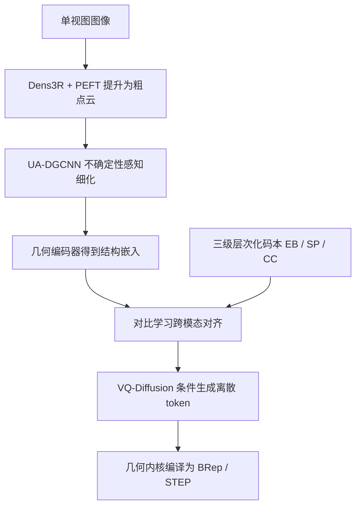

## 一句话总结

Img2CADSeq 通过"三级层次化码本 + 点云中介 + 对比对齐 + 向量量化扩散"的多阶段流水线，把单视图图像直接重建为拓扑合法、可编辑的标准 STEP 文件，在机械零件生成上超越现有方法。

## 研究背景

单视图三维生成近年进展显著，但 NeRF、高斯泼溅这类方法产出的是隐式场或无结构点云，缺乏工业设计与制造所需的曲线曲面拓扑，无法编辑也不符合工程标准。

边界表示（BRep）是 CAD 的标准格式，能用精确参数化几何与拓扑描述物体，但从单张图像重建高质量 BRep 非常困难：

- BRep 依赖几何实体间复杂的拓扑关系，与神经网络偏好的张量格式不兼容。
- 已有工作把 BRep 编码为构造操作序列，但序列往往过长且无结构，深度模型难以学习。
- 合成数据集（如 ShapeNet）缺乏可制造形状与真实感渲染，存在明显的域间隙（sim-to-real gap）。
- 依赖二维先验（法线图、SVG）推断三维的方法会丢失深度与拓扑，重建病态且易产生幻觉。

本文要回答的核心问题是：如何生成既视觉一致、又可编辑且符合工程标准的三维数据。

## 方法

Img2CADSeq 把病态的单视图重建拆成三个阶段，逐步消解几何歧义。

**层次化序列编码。** 借鉴设计师"先整体轮廓、后局部细节"的重要性优先原则，将 CAD 操作序列量化到三层码本，各层用独立的 VQ-VAE 学习离散潜码：

- Extrude-Block（EB）：全局语义，把建模操作抽象为参数化基元。原始特征拼接草图平面法向、原点、拉伸深度与布尔类型（New/Join/Cut）的独热编码，经 MLP 投影到潜空间：

$$\boldsymbol{e}_{eb} = \mathrm{MLP}_{global}\left(\boldsymbol{n}_{sketch} \oplus \boldsymbol{p}_{origin} \oplus h_{ext} \oplus \boldsymbol{b}_{type}\right)$$

- Sketch-Patch（SP）：拓扑布局，为下层建立空间锚点。用一个兼顾面积、对角线尺度与位置惩罚的分数对环排序，让主导轮廓排在前面。
- Curve-Cluster（CC）：局部几何，抛弃绝对坐标改用局部 Frenet 框架编码。第 $i$ 个基元用弦长、相对切向偏差、曲率、残差偏移与类型独热向量组成八维特征：

$$\boldsymbol{e}^{cc}_{i} = \mathrm{MLP}_{curve}(\boldsymbol{f}_i), \quad \boldsymbol{f}_i = [l_i, \Delta\theta_i, \kappa_i, \delta x_i, \delta y_i] \oplus \boldsymbol{t}_i$$

聚焦相对几何而非绝对坐标，既压缩序列长度又隐式保持拓扑合法性。总损失结合重建、量化与闭环正则：

$$\mathcal{L} = \mathcal{L}_{recon} + \mathcal{L}_{vq} + \lambda_{cls}\mathcal{L}_{closure}$$

其中闭环正则专门约束 CC 层相对路径重建的累积欧氏误差，抑制开环伪影。

**几何感知特征提取。** 用 Dens3R 把单视图提升为初始粗点云，仅对 Query、Value 线性层做参数高效微调（PEFT）以贴合刚性工业先验。再用不确定性感知 DGCNN（UA-DGCNN）预测每点的几何重要性分数，通过启发式重采样构造混合分布——显著项用玻尔兹曼分布近乎确定性地保留尖锐特征，覆盖项做均匀采样避免平面区域空洞：

$$p(p_i) = \lambda \cdot \frac{e^{\beta s_i}}{\sum_k e^{\beta s_k}} + (1 - \lambda) \cdot \frac{1}{N}$$

**跨模态对齐与生成。** 用因果 Transformer 编码 CAD 序列得到全局嵌入 $\boldsymbol{z}_S$，与点云嵌入 $\boldsymbol{z}_P$ 通过对称 InfoNCE 对比损失对齐到共享流形：

$$\mathcal{L}_{NCE} = -\frac{1}{B}\sum_{i=1}^{B} \log \frac{\exp(\mathrm{sim}(\boldsymbol{z}_{S,i}, \boldsymbol{z}_{P,i})/\tau)}{\sum_{k=1}^{2B} \mathbb{I}[k \neq i]\exp(\mathrm{sim}(\boldsymbol{z}_{S,i}, \boldsymbol{z}_{feat,k})/\tau)}$$

对齐后的条件 $\boldsymbol{c} = \boldsymbol{z}_P$ 注入采用吸收态转移的 VQ-Diffusion：前向过程逐步把 token 替换为 mask，反向过程在结构条件引导下恢复干净拓扑，最后由几何内核编译成水密 BRep。

## 实验结果

主战场是单视图图像条件生成。用 Chamfer 距离（CD）衡量几何精度、悬挂面比例（HF）衡量结构完整性、分割精度（Seg Acc）衡量基元分割质量。Img2CADSeq 在三项指标上全面领先。

| Method | CD ↓ | HF ↓ | Seg Acc ↑ |
| --- | --- | --- | --- |
| TripoSR | 9.68 | 32.7 | 40.4% |
| HoLa | 1.82 | 3.3 | 90.6% |
| CADDreamer | 1.36 | 2.4 | 96.1% |
| Img2CAD | 1.37 | 3.0 | 86.3% |
| Wonder3D | 14.26 | 47.2 | 32.4% |
| Ours | 1.21 | 2.2 | 97.2% |

在干净点云条件生成上取得最低 Acc Err（6.49）与 Comp Err（4.91）以及最高精度/召回；在无条件生成上取得最低 MMD（0.958）、最高覆盖率（80.17%）与最低 JSD（0.839），验证了框架的通用性与鲁棒性。

## 亮点与局限

亮点：

- 层次化三级码本按"轮廓到细节"逻辑解耦全局结构与局部几何，用相对坐标压缩序列并隐式保证拓扑合法，无需 LLM 的高昂算力。
- 用点云作为中介比二维法线图或 SVG 更能保留空间结构，配合对比学习把图像特征直接映射到 CAD 序列空间。
- 提出 CAD-220K（ABC 子集，22 万模型）与 PrintCAD（2000+ 真实拍摄的 3D 打印件）两个数据集，显式弥合 sim-to-real 间隙。
- 直接输出可在商业 CAD 软件中使用的标准 STEP 文件，而非惰性网格。

局限：

- 复杂装配体的长序列会累积误差，难以维持严格对称与同轴等全局约束。
- 单视图歧义下模型会依据先验"幻想"遮挡区域，虽拓扑水密却可能物理上不可制造。
- 点云代理分辨率有限（4096 点），启发式重采样会抹平螺纹、微小倒角等精细制造细节。

## 延伸思考

这项工作的价值在于把"生成好看的三维"和"生成能用的工程数据"这两个长期割裂的目标拉到一起，路线选择也很务实：不迷信端到端，而是用点云中介 + 对比对齐把病态问题分段消解。层次化码本的思路值得借鉴——把领域先验（设计师的轮廓优先习惯）直接编码进表示结构，比单纯堆模型容量更能提升可学习性。

作者已指出的全局约束缺失是当前扩散式 CAD 生成的共性难题：局部 token 生成天然缺乏对称性、同轴度这类跨基元的硬约束，如何在扩散框架里注入可微的几何约束会是后续关键。多视图或 VLM 多模态条件、以及中间阶段的交互式编辑，都是缓解单视图歧义的自然方向。
