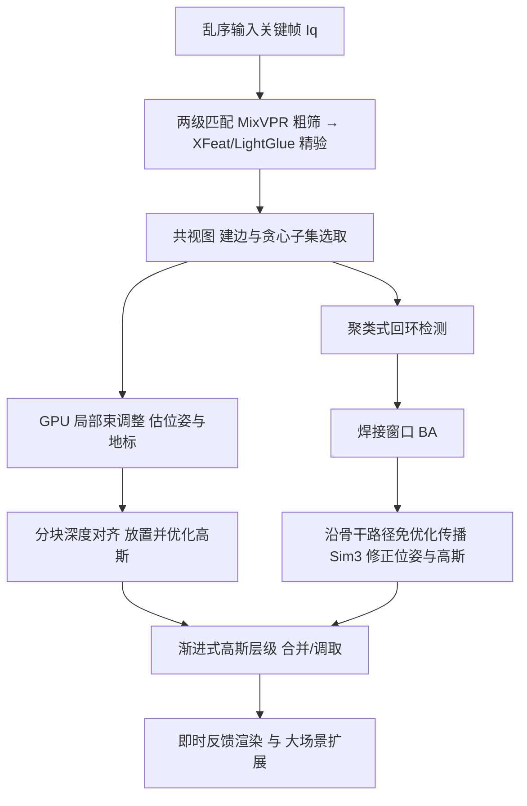

## 一句话总结

面向"随手乱序拍摄"的真实场景采集，本文提出首个能在拍摄过程中即时反馈、又保证全局一致性的 3DGS 重建系统：无需预先给定相机位姿，边拍边估位姿、边建高斯、边做回环闭合，还能扩展到上千张图的大场景。

## 研究背景

- 领域现状：3D Gaussian Splatting（3DGS）已成为真实场景重建与实时渲染的主流方案，但绝大多数工作假设相机位姿已由 Structure from Motion（SfM，如 COLMAP）离线算好，必须等所有图像采集完毕后才能处理，计算开销大、没有即时反馈。
- 核心痛点：为覆盖整个场景，用户拍摄时往往会突然转身、走回头路，形成"乱序"图像序列。现有的即时反馈方案大多脱胎于视觉 SLAM，假设图像按时间顺序到来（新帧只和前几帧匹配），无法处理这种乱序采集；即便是支持回环闭合的方法，也依赖时间戳来判断回环，且难以在扩大束调整窗口时兼顾交互性。大场景（上千张图）会进一步放大这些问题并撑爆显存。
- 本文 idea：把 SLAM 里用于回环检测的工具（视觉位置识别、共视图）"改造"来服务于乱序的辐射场采集，配合 GPU 加速的局部束调整、基于聚类的回环检测、免优化的位姿/高斯传播修正，以及一个轻量的渐进式高斯层级结构，从而实现"即时反馈 + 全局一致 + 可扩展到大场景"三者兼得。

## 方法

整体框架：系统逐帧处理输入关键帧。对每个新来的关键帧，先在全部历史关键帧里快速找到重叠视角完成匹配与位姿估计，再做局部束调整并反投影生成新的高斯基元；当检测到用户回到已拍过的区域时触发回环闭合、把两段轨迹"焊接"到同一空间并把修正传播出去；大场景则靠渐进式层级结构控制显存与渲染开销。

关键设计：

1. 快速乱序匹配（两级级联）。乱序拍摄意味着新帧可能要和任意历史帧匹配，穷举太贵。作者用一个"速度/质量级联"：先用视觉位置识别模型 MixVPR 为每张图提取 4096 维全局描述子，用余弦相似度快速取回最相似的 $$K=20$$ 帧；再用轻量局部特征 XFeat 暴力匹配按内点数筛到 $$K'=5$$ 帧；最后用 LightGlue 做精确匹配，经 RANSAC 后内点超过 $$\tau_m=500$$ 才判定为有效配对。三级从快到慢、逐级缩小候选集，既保证即时反馈的速度，又能挑出最相关的关键帧（对有序序列也有增益）。

2. 加权共视图与强连通子集选取。系统维护一张共视图：节点是关键帧，验证通过的配对之间连边，边权取内点数的倒数 $$w_{ij}=\frac{1}{\#\text{inliers}(i,j)}$$（内点越多、连接越强、权重越小）。需要为局部束调整或回环两侧挑关键帧时，从起始帧出发做贪心遍历，每步把对当前活跃集合连通度最大的节点加入：$$S_{t+1}=S_t \cup \lbrace \arg\max_{I_i} c(I_i, S_t)\rbrace$$，直到取够所需的 $$N$$ 帧。由于每个节点连接数不多（约 10），该贪心非常高效。

3. GPU 高效局部束调整与高斯放置。乱序问题更难，局部 BA 需要选 $$N=20$$ 帧（常常跨越很久之前），远多于以往方法的时间窗口。为让 GPU BA 可扩展，作者固定采样 $$K=10000$$ 个地标、按共视关系限定每个地标被固定子集观测，并用稠密 Schur 补公式配合自研 CUDA 核，相比现有 CPU/GPU 优化器取得约 5 倍加速。放置高斯时不再对整图用单一深度尺度/偏移，而是把图像切块、逐块估计尺度与偏移再线性上采样，得到更精细的深度校正，从而放出更准的高斯位置；随后用可微渲染器训练 30 次迭代。

4. 聚类式回环检测与免优化传播。乱序场景没有时间戳可用来判回环。作者取 $$2K'$$ 个最佳匹配，将它们分成两个聚类 $$C_1, C_2$$，用连通度最远的两帧初始化；若两聚类在共视图上相隔超过 $$\tau_{lc}=5$$ 跳且较小聚类含超过 $$\tau_v=2$$ 对配对，则判定发生回环。检测到后在"焊接窗口"内做 BA 把两段对齐；再用免优化的方式传播修正——在自由聚类里估计锚点关键帧的刚体变换并结合尺度变化得到相似变换 $$S_\Delta \in Sim(3)$$，沿 Dijkstra 算出的骨干路径按测地距离比例分配（旋转用 6D 表示插值、尺度用对数插值），最后把每个高斯按其生成关键帧的同一 Sim(3) 变换一并更新。相比传统的迭代式位姿图优化，这种图遍历传播避免了对全部位姿反复求解。

5. 渐进式高斯层级。大场景若保留全部关键帧和高斯会迅速撑爆显存。作者按屏幕投影尺寸建层级：每加一帧就计算各高斯的屏幕尺寸 $$S_i$$，把小于 $$\tau_l=0.5$$ 像素的亚像素高斯用 KL 散度按 4 个一组合并成父节点（且仅当超过 20% 高斯满足条件时才触发以避免过频合并），叶子小高斯离线卸载到 CPU 内存腾出显存。渲染/优化时按需在层级中上下调取，用双缓冲避免卡顿，中间节点在优化中被自动训练、无需显式后处理。

## 实验结果

在有序场景的无位姿（pose-free）新视角合成对比中，本文方法在质量与速度上取得很好的平衡：多数场景质量领先，且重建时间远低于同类离线/慢速方法。下面摘取有序数据集主实验（时间为 时:分:秒），"G+T3DGS" 是 GLOMAP+Taming3DGS 的离线参考：

| 方法 | 数据集 | PSNR↑ | SSIM↑ | LPIPS↓ | 时间↓ |
|------|--------|-------|-------|--------|-------|
| On-The-Fly NVS | MipNeRF360 | 24.31 | 0.775 | 0.300 | 0:01:02 |
| LongSplat | MipNeRF360 | 23.63 | 0.657 | 0.415 | 2:25:26 |
| 本文 | MipNeRF360 | 26.29 | 0.839 | 0.241 | 0:01:17 |
| G+T3DGS 参考 | MipNeRF360 | 27.52 | 0.866 | 0.226 | 0:08:50 |
| 本文 | StaticHikes | 22.12 | 0.696 | 0.289 | 0:02:14 |
| LongSplat | StaticHikes | 20.05 | 0.461 | 0.481 | 22:40:56 |

其余实验用文字概述：在乱序数据集（MipNeRF360、Tanks and Temples、Deep Blending）上，其他 pose-free 方法均失败，本文虽略逊于 3DGS@7k 的离线质量，但总计算时间约低 6 倍且质量足够可用。在大场景（SmallCity、Wayve、CityWalk）上，本文在多数评测质量领先，且时间从数小时降到数分钟。位姿估计精度（绝对/相对误差）在宽基线场景表现突出、在小基线基准上与专用 SLAM 相当。消融显示 MixVPR 与关键帧选取对质量影响最大；打乱输入顺序仅带来轻微质量下降（PSNR 26.29→25.73）。层级结构让 CityWalk 得以完整处理（无层级时约 20% 帧即 24GB 显存 OOM）。

## 亮点与局限

- 亮点：
  - 首个面向乱序采集、同时具备即时反馈与全局一致性的 3DGS 重建方案，填补了"SfM 离线"与"顺序式 SLAM"之间的空白。
  - 巧妙复用 SLAM 的成熟工具（视觉位置识别、共视图、回环闭合）到辐射场即时采集，工程思路清晰。
  - 免优化的图传播式回环修正 + 渐进式高斯层级，兼顾了交互延迟与大场景可扩展性（可处理上千张图，显存受控）。
- 局限：
  - 相比离线方法仍有小幅质量差距（用质量换数量级的速度）。
  - 纯旋转无法三角化，这是与 COLMAP、ORB-SLAM 等共有的固有限制。
  - 图传播虽不劣于全局位姿图优化，但仍达不到全局 BA（如 GLOMAP）的精度上限。

## 延伸思考

这项工作把"边拍边重建"的交互式采集推向了更真实的乱序场景，对 VR/AR 现场扫描、内容创作的实时预览很有价值。它高度依赖若干预训练模型（MixVPR、XFeat、LightGlue、Depth Anything 3）的鲁棒性，这些前端一旦在弱纹理或剧烈光照变化下失效，整条位姿链路都会受影响，值得进一步探究其失败边界。另一个自然的方向是把免优化的图传播与轻量全局 BA 结合，在不牺牲太多交互性的前提下逼近离线质量；以及探索该层级结构与已有大规模 3DGS 层级（如 H3DGS）在渲染质量上的进一步对齐。
