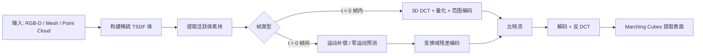

## 一句话总结

把动态 3D 几何当成"视频"来压：以 TSDF 隐式体作为编码域，借用经典 2D 视频编码的两板斧——分块 DCT 做空间编码、运动补偿做帧间预测——实现无需训练、实时（30 FPS）、GPU 加速的 4D 几何编解码。

## 研究背景

- 领域现状：消费级深度相机、VR 头显和高保真重建算法（NeRF、3D Gaussian Splatting、神经隐式面等）的成熟，让大规模动态 3D 场景可被捕获、重建、播放，产业焦点正从静态模型转向动态体积视频（volumetric video）。
- 核心痛点：动态 4D 几何的传输与存储成了瓶颈。现有做法要么把动态序列当成一帧帧独立静态帧处理（如 Google Draco），浪费了帧间时序冗余；要么像 MPEG 的 V-PCC / V-DMC 那样虽有时序压缩，但依赖 patch/atlas 生成、basemesh 拟合、非刚性配准等昂贵预处理，编码动辄几十秒到上百秒，难以低延迟实时流式传输。同时很多体积融合与稠密 RGB-D 重建系统内部本就以体素场维护几何，而现有编解码器几乎都为显式表面设计，不匹配这种"重建原生"表示。
- 本文 idea：直接在 TSDF（截断有符号距离场）这个"重建原生"域上做压缩。TSDF 有三个好处让它天然适合套用视频编码范式:定义了固定空间域（时序预测可表达为同一空间位置随时间的更新，对连通性/采样变化鲁棒）、截断带内是局部光滑标量信号（量化稳定、局部相关性强，适合分块变换编码）、规则网格可切成定长体素块并行处理。于是作者用数据无关的 3D DCT 替代需要训练的 KLT/神经变换，再配一套轻量运动补偿，得到训练-free 的实时 4D 编解码器。

## 方法

整体框架：每帧几何统一映射为稀疏 TSDF 体，切成 $$8\times8\times8$$ 的体素块，只对靠近表面的"活跃块"编码。首帧（$$t=0$$）用逐块 3D DCT + 量化 + 熵编码做帧内编码；后续帧相对前一帧只编码变换域残差，并辅以逐块刚性运动补偿对齐。解码端镜像执行，维护参考 TSDF 状态，最后用 Marching Cubes 提取显式表面。

关键设计:

1. **几何到 TSDF 的统一转换**：编解码器同时接受深度图和显式几何两类输入，都映射到同一体素网格。深度图走标准投影式 TSDF 融合（KinectFusion 那套，多视角加权平均）；显式网格走最近三角形有符号距离——水密网格用最近三角形法向定符号 $$s(\mathbf{p}) = \mathrm{sign}\big((\mathbf{p}-\Pi_{\tau^\star}(\mathbf{p}))^\top \mathbf{n}_{\tau^\star}\big)\, d(\mathbf{p})$$；非水密扫描网格则用无符号距离偏移兜底 $$s(\mathbf{p}) = d(\mathbf{p}) - \delta$$（$$\delta$$ 约 1–2 个体素），得到一层薄壳零等值面，无需水密或一致定向。所有值截断到带宽 $$\mu$$ 内，只有观测到且 $$\lvert s(\mathbf{p})\rvert \le \mu$$ 的体素才算活跃。

2. **帧内分块变换编码**：对每个活跃块做 3D DCT，把 TSDF 从空间域变到频域。因截断带内信号光滑，能量集中在低频，于是按固定扫描序（按索引和即到 DC 的曼哈顿距离排序）只保留前 $$K$$ 个低频系数。作者论证 DCT 对相关信号的能量压缩接近最优的数据相关 KLT：实验里在实用工作区间 $$K\in[27,64]$$，跨场景 KLT 只略优于固定 DCT，不值得为它承担训练和传参开销。系数用固定步长量化（DC 用 $$\Delta_{DC}$$、AC 用可调 $$\Delta_{AC}$$ 做率失真权衡），再按 DCT 索引把所有块的同频系数分组成 $$K$$ 条流分别做无损范围编码——因不同频率统计特性不同，分流能让概率模型更贴合、降低码率。

3. **帧间时序编码（零运动预测 + 变换域残差）**：先发一帧帧内帧初始化解码端参考，之后每帧复用上一重建帧作为"零运动预测器"，只编码块级残差。残差在 DCT 空间计算：$$\Delta \mathbf{c}^{(b)}_t = \mathbf{c}^{(b)}_t - \tilde{\mathbf{c}}^{(b)}_{t-1}$$，新激活块参考为 0、消失块则置 0 视作移除。为防编解码漂移，编码端用重建残差做闭环参考更新 $$\tilde{\mathbf{c}}^{(b)}_t = \tilde{\mathbf{c}}^{(b)}_{t-1} + Q^{-1}(Q(\Delta \mathbf{c}^{(b)}_t))$$。熵编码改用自适应范围编码器——编解码双方从同一初始模型出发、在线更新符号频率，免去传输显式直方图的元数据开销。

4. **逐块运动补偿**：场景运动会让零等值面相对体素网格偏移、产生昂贵残差。作者不做全局非刚性追踪（实时负担不起），而是对每块独立估一个局部 6-DoF 刚性变换。做法是反向 warp 目标块的体素中心采样位置到上一重建 TSDF，在拼接的 $$3\times3\times3$$ 邻域上三线性插值（保证 warp 到块边界外也能采到值），用阻尼 Gauss-Newton 最小化残差平方 $$\arg\min_{\mathbf{t},\mathbf{r}} \sum_{i\in\Omega} \varepsilon_i(\mathbf{r},\mathbf{t})^2$$ 估计旋转平移，每步限幅（平移 1 体素、旋转 5°）防发散，邻域不完整或可靠样本太少就退回零运动。运动向量作为边信息传给解码端复现同样的预测。

## 实验结果

在 6 段动态人体序列（V-SENSE + Owlii）和 2 部 Blender 影片大场景（10–20 米，约 200 万面）上，与 Draco、MPEG G-PCC / V-PCC / V-DMC、Tang et al. 2018（TSDF 帧内 KLT）对比，只算几何码率、用对称 Chamfer 距离与 D1/D2 PSNR 衡量失真。核心结论：等失真下人体序列约省 35% 码率，大场景因时序一致性更强最高可达 12× 码率削减，且编解码比 V-PCC/V-DMC 快约两个数量级。

下表为 V-SENSE 人体序列（约 40 万面）的运行时/显存主实验（每帧）:

| 方法 | 编码延迟 | 解码延迟 | 编码显存 | 备注 |
|------|---------|---------|---------|------|
| 本文 | 30 ms | 21 ms | 6 GB | 实时 30 FPS，稀疏哈希换吞吐 |
| Tang et al. 2018 | 22 ms | 15 ms | 6 GB | TSDF 帧内 KLT，无时序 |
| Draco | 60 ms | 30 ms | 14.3 MB | 逐帧独立，无时序 |
| MPEG G-PCC | 1.2 s | 420 ms | 100 MB | 点云编码 |
| MPEG V-PCC | 110 s | 660 ms | 600 MB | atlas 预处理，极慢 |
| MPEG V-DMC | 15.6 s | 330 ms | 0.9 GB | basemesh 拟合 |

运动预测消融很有意思：零运动预测相比纯帧内就带来大幅提升，说明时序冗余主要靠"复用上一帧"就能吃掉；运动补偿进一步改善但边际有限。在 $$K=48$$ 时，3-DoF（仅平移）运动补偿总码率降 27%、运动向量只占 9%；6-DoF 反而只降 25% 却花 22% 在运动向量上——更强的预测被更高的运动边信息开销抵消，所以 3-DoF 常给出最佳率失真折中。大场景中 V-PCC/V-DMC 因 atlas 参数化随场景变大退化、模板追踪在大环境中脆弱而直接失效（重建无效被略去），本文的分块变换编码不依赖二者故保持稳定。

## 亮点与局限

- 亮点：
  - 思路"复古"却有效——不追神经网络，把成熟的 2D 视频编码范式（DCT + 运动补偿）迁移到 TSDF 隐式体，训练-free、跨场景通用、无需传输/预计算变换参数。
  - 选对编码域：TSDF 的固定空间域 + 局部光滑 + 规则网格，天然规避了显式几何编码所需的对应估计、atlas、basemesh 拟合等全局昂贵预处理，运行时随表面积而非体积扩展。
  - 真正实时且工程扎实：约 3 万行 C++/CUDA、开源、编解码延迟毫秒级，大场景下相较 MPEG 管线快两个数量级。
  - 消融给出反直觉洞见：零运动预测已吃掉大部分时序冗余，6-DoF 未必优于 3-DoF，运动向量开销是关键权衡点。
- 局限：
  - 只压几何，不压纹理/外观（需另走常规视频流投影贴图），且投影贴图实验假设静态环绕相机、限于物体尺度。
  - 依赖 TSDF 转换，非无损：不保留网格连通性、纹理坐标、绑定等属性，可能平滑细节或合并邻近接触面，不适合需保拓扑/参数化的作者创作资产。
  - 大场景（约 200 万面）下靠稀疏哈希维护 TSDF 工作集，显存需求较高（约 23 GB）。
  - 运动模型是逐块局部刚性，真实运动常为非刚性，对快速大形变的建模能力受限。

## 延伸思考

- 与 Tang et al. 2018/2020 的对比是一条清晰主线：从数据相关 KLT / 神经变换退回到数据无关 DCT，用"少量重建质量损失"换"零训练开销 + 跨场景泛化 + 实时性"，这是典型的工程务实取舍，值得在其他"神经 vs 经典"压缩场景里借鉴。
- 编码域的选择往往比编码算法本身更决定成败——把几何搬到 TSDF 这个规则、光滑、可并行的域上，才让经典视频编码工具"开箱即用"。这提示对 3D Gaussian Splatting、神经场等新表示做流式压缩时，先找一个时序稳定的编码域可能是关键。
- 作者列的未来方向（分层/自适应块结构、学习型残差编码器、外观压缩、长程时序变换）都很自然；尤其把自适应块结构和长程时序依赖引入，有望进一步逼近 2D 视频编码里 GOP/B 帧那套更成熟的时序建模。
