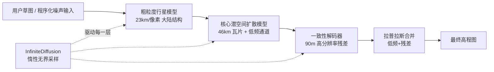

## 一句话总结

提出免训练的 InfiniteDiffusion 算法，把扩散采样改造成"惰性、无界、可随机访问且种子一致"的过程，并据此构建 Terrain Diffusion——首个既有扩散模型高保真度、又保留程序化噪声（如 Perlin）核心特性的地形生成器，能在消费级 GPU 上实时流式生成整颗行星。

## 研究背景

- 领域现状：近四十年来，程序化世界生成依赖 Perlin/Simplex 这类程序化噪声函数。它们有三个不可替代的特性——无缝无限延展、种子一致性（同一 seed 必得同一世界）、常数时间随机访问（不存储数据即可查询任意位置）。而扩散模型近年在图像合成上带来惊人的真实度与可控性。
- 核心痛点：程序化噪声虽快且无限，但缺乏真实地理的多尺度层级结构（大陆、山脉、河谷），看起来"像"但不"真"；扩散模型虽保真，却基本局限在有限画布上。已有的无限/大尺度生成工作（如自回归的逐块生成、Perlin 核混合的扩散分块）往往会丢掉种子一致性或随机访问能力，或让结构重新退化回噪声主导。
- 本文 idea：把 MultiDiffusion 推广到无限域，使其能在无限图像上"按需只算被查询区域"，从而同时拿回噪声的三大特性和扩散的高保真度；再叠加分层模型与专门的高程编码，做成实用的实时地形生成框架。

## 方法

整体框架：方法分两层。底层 InfiniteDiffusion 是通用算法，把 MultiDiffusion 从有限画布推广到无限域，通过"只评估与查询区域相交的窗口 + 缓存窗口贡献 + 截断扩散步数 $$T$$"三招让无限生成变得可计算。上层 Terrain Diffusion 用一个由粗到细的扩散模型层级栈，配合有符号平方根变换与拉普拉斯编码稳定训练，把真实地球高程数据学成一个"程序化噪声式"接口。

关键设计：

1. **从 MultiDiffusion 到 InfiniteDiffusion（是什么/为什么/怎么做）**。MultiDiffusion 通过对重叠窗口的预测做加权平均来拼出比训练分辨率更大的图，但要求所有窗口落在有限画布内。本文把图像空间重定义为无界的 $$\mathrm{J}=\mathbb{R}^{\mathbb{Z}\times\mathbb{Z}\times C}$$，窗口索引取自可数无限集。直接求和不可行，于是定义映射 $$\kappa(R)$$ 给出与查询区域 $$R$$ 相交的（有限个）窗口，更新式只对这些窗口求值：只算你要看的地方，实现"惰性生成"。

2. **可计算的递归查询 + 稀疏无限张量**。查询 $$J_t[R]$$ 需要更上一步 $$J_{t+1}$$ 中更大的区域，朴素递归会指数爆炸。作者为每个时刻维护两个稀疏无限张量：分子 $$A_t$$（累加 $$W_i \otimes \Phi$$）与分母 $$B_t$$（累加权重 $$W_i$$），并记录已处理窗口集合 $$P_t$$；查询时只处理未处理过的窗口，结果为 $$J_t[R]=A_t[R]/B_t[R]$$。逐窗口存储天然支持 LRU 缓存与常数内存，作者还开源了配套的 Infinite Tensor 框架。

3. **截断步数 $$T$$ 让无限生成变实用**。把 $$\Phi$$ 重新定义为"任意去噪函数"（比如一个少步一致性模型或一段标准扩散步序列），而非单个原子扩散步，从而把外层融合步数 $$T$$ 与内部扩散调度解耦。实验发现 $$T=2$$ 就几乎饱和质量。由此可证明三条性质：种子一致性、常数时间随机访问（$$\lvert \kappa(R) \rvert \le M$$ 时查询为 $$O(1)$$）、以及窗口更新可并行。

4. **地形专用的稳定化与分层建模**。用有符号平方根变换 $$z \mapsto \mathrm{sign}(z)\sqrt{\lvert z \rvert}$$ 压缩高差、均衡各瓦片方差；用拉普拉斯编码把高程拆成低频分量与残差（残差幅度小 30 倍以上），并通过"解码→再下采样模糊→重提取干净低频 $$\hat{L}$$"消除低频误差，最终用 $$\hat{L}+H$$ 合成。模型层级用共享 EDM2 骨干：粗行星模型定大陆结构、核心潜空间模型出 46km 瓦片、一致性解码器扩成高分辨率高程；除粗模型外全部蒸馏为连续时间一致性模型以实现实时。

## 实验结果

主实验（表 2）在验证集 984×984 中心裁剪上，对比不同拼接策略的 FID-50k，考察 InfiniteDiffusion 相对朴素拼接与 Perlin 混合的增益，以及不同融合步数 $$T$$ 与非拼接基线的差距：

| 方法 | 是否蒸馏 | FID ↓ |
|------|----------|-------|
| Perlin 混合 | 是 | 186.70 |
| 朴素拼接 | 是 | 74.44 |
| 朴素 InfiniteDiffusion（$$T=0$$） | 是 | 27.61 |
| InfiniteDiffusion（$$T=1$$） | 是 | 19.78 |
| InfiniteDiffusion（$$T=2$$） | 是 | 14.78 |
| 非拼接（一致性模型） | 是 | 12.72 |
| 非拼接（扩散模型，理论上界） | 否 | 8.11 |

Perlin 混合的 FID 高达 186.70，说明程序化混合无法逼近真实地形的统计分布；而 $$T=2$$ 的 InfiniteDiffusion（14.78）几乎追平非拼接一致性模型基线（12.72），说明拼接到无限世界几乎不损失质量。

其余实验以文字补充：在文生图模型 Stable Diffusion 上验证截断步数时，$$T=2$$ 的 FID（5.83）已逼近满步 MultiDiffusion（5.75）。延迟方面，在单张 RTX 3090 Ti 上，$$T=2$$ 配置首瓦片时间约 1.72s、次瓦片约 0.66s；即使按轨道速度（约 7700 m/s）飞越，生成仍比穿越快 9 倍。作者还把系统接进 Minecraft 引擎替换原生世界生成器，实时流式生成可自由漫游的地形。拉普拉斯去噪把核心模型 FID 从 21.51 降到 8.11、一致性模型从 75.15 降到 12.72；线性权重窗相比常数权重把 FID 从 19.32 降到 14.78。

## 亮点与局限

- 亮点：
  - 免训练地把 MultiDiffusion 推广到无限域，一次性把程序化噪声的"无限延展 / 种子一致 / 常数时间随机访问"三大特性带给扩散模型，并给出形式化证明。
  - 关键洞察"把 $$\Phi$$ 当作任意去噪函数、用截断 $$T$$ 解耦融合步数与扩散调度"直接把无限生成从理论不可行拉到实用（$$T=2$$ 即可）。
  - 工程完整度高：全球高程数据集构建、拉普拉斯稳定化、分层模型 + 一致性蒸馏、开源无限张量框架、Minecraft 实机集成，形成端到端可实时探索的方案。

- 局限：
  - 对更模糊的提示，$$T=2$$ 仍可能出现伪影，需要更多融合步（如 $$T=5$$）来解决，但会增加首瓦片开销、限制两步模型的使用。
  - 生成以窗口为单位，对远小于窗口的散点查询若未命中缓存则低效，导致依赖长程 biome 搜索的 Minecraft 功能（如 /locate biome、探险地图）无法支持。
  - 最粗层级的训练数据获取仍是难题；作者提出用合成数据蒸馏其他模型或模拟作为可能出路。

## 延伸思考

- InfiniteDiffusion 本质是一个"无界化算子"，理论上不局限于地形——它适用于任意像素/体素扩散模型，值得迁移到无限纹理、体数据、乃至 3D/4D 场景的流式生成。
- "把复杂物理模拟蒸馏成可随机访问的程序化近似"是很有想象力的方向：如果侵蚀、水文、气候模拟都能被这样"过程化"，游戏与仿真可以在保留真实感的同时拿回噪声函数式的即时可查询性。
- 与自回归世界生成（逐块条件）相比，本文用共享全局上下文 + 顺序无关的融合换来了种子一致性和随机访问，这对多人协同、断点续玩、可复现世界等场景是实打实的系统级优势，是超越单纯 FID 指标的价值点。
