## 一句话总结

给定两张图片，Inspiration Seeds 用一个前馈模型自动生成多种"非字面"的视觉组合，把两张图潜在的视觉关联揉进一个连贯的新形象，从而支持创意早期那种说不清、只靠视觉直觉的探索式构思，而不需要用户写文字提示。

## 研究背景

- 领域现状：文生图 / 图像编辑模型（FLUX、Nano Banana 等）已经很强，但它们几乎都为"执行一条写清楚的文字指令"而优化，天然服务于想法已经成形、能被语言描述之后的阶段。
- 核心痛点：设计的最早期是模糊、直觉、以视觉为主的——设计师从松散关联的参考图里捕捉意想不到的联系来激发灵感。现有模型在这一阶段几乎无用：即使提示它"要有创意"，也倾向于产出琐碎的组合（比如把耳环换成一片叶子这种直接插入/替换），无法揭示深层的视觉联系。想要非平凡结果就得反复调提示词，这与非语言、流动的视觉探索背道而驰。
- 本文 idea：把生成模型当作"视觉探索工具"而非"最终产图工具"。模型输出不是终点，而是能激发新想法的中间表征。关键难点是缺少训练数据（两个视觉概念 + 一个非显而易见组合的三元组），作者反其道而行：从视觉丰富的图像出发，把它拆解成两个组成性视觉方面，原图即天然的"组合真值"，从而自动构造监督。

## 方法

整体框架分两步。先构造"分解 → 反演"的训练数据：用现成文生图模型生成一批视觉信息丰富的图像作为图池，再用一个基于 CLIP 稀疏自编码器的分解流程把每张图 $$I_{comb}$$ 拆成两个互补的视觉方面 $$I_A$$、$$I_B$$，得到三元组 $$(I_A, I_B, I_{comb})$$。随后微调一个图像条件生成模型学习"逆过程"——给两张图，产出融合两者的组合图。

```mermaid
flowchart LR
  A["图池: 文生图生成视觉丰富图像"] --> B["CLIP 编码 e_comb"]
  B --> C["SAE 编码 -> 163k 稀疏特征, 取 top-k=32"]
  C --> D["解码回 CLIP 空间, k-means k=2 聚成两簇"]
  D --> E["簇心之差得编辑方向 v(A->B)"]
  E --> F["沿正负方向移动 e_comb, Kandinsky 解码出 I_A / I_B"]
  F --> G["三元组 (I_A, I_B, I_comb)"]
  G --> H["LoRA 微调 FLUX.1 Kontext 学逆映射"]
  H --> I["推理: 给两图, 变随机种子产多种组合"]
```

关键设计：

1. **图池构造（让图"可分解"）**：普通单物体照片虽有颜色、姿态差异，却很少同时含多个可独立分离的视觉理念。作者用两类提示补足：一是模板化提示，显式指定材质、颜色、形状、语境等多个视觉属性，产出可靠可分解的"多属性图"；二是刻意模糊的提示（如"一个从未存在过的地方"），再用 Gemini 扩写成多种视觉解读，得到语义相关但视觉多样、更难被平凡分解的图像。

2. **CLIP SAE 分解（本文核心）**：把分解表述为 CLIP 潜空间里的受控编辑，编辑方向直接从每张图的视觉内容里推导，不依赖预设属性或文字。做法是先用 CLIP 得到 1280 维嵌入 $$e_{comb}$$，经稀疏自编码器编码到 16.3 万维稀疏空间；取激活最高的 top-k（$$k=32$$）特征各自解码回 CLIP 空间，得到一组向量，用 $$k$$-means（$$k=2$$）聚成两簇（并保留各簇中离簇心最近的 50% 以提升一致性）。编辑方向取两簇质心之差：

$$v_{A\to B} = e_B - e_A$$

再沿正负方向移动原嵌入得到两个编辑后嵌入：

$$e_{comb\to A} = e_{comb} - \lambda v_{A\to B}, \quad e_{comb\to B} = e_{comb} + \lambda v_{A\to B}$$

最后用支持 CLIP 嵌入条件的 Kandinsky 模型把 $$e_{comb\to A}$$、$$e_{comb\to B}$$ 解码成图像 $$I_A$$、$$I_B$$。数据集构造用 $$\lambda=1$$，此时两个视觉方面既分离良好又保持图像质量。这一分解纯视觉、无需文字标注，一次前向即可完成，可规模化。相比 InspirationTree 的隐式分解（依赖文本反演、每概念需多图、上小时优化且不稳定），本文保留"隐式分解"思想却去掉了昂贵不稳的优化。

3. **训练与推理**：最终合成图池 2085 张，产出 2085 个三元组。用 LoRA（秩 32）微调 FLUX.1 Kontext。输入两图各缩放到 512×512，分别放在 1024×1024 画布的左上与右下、其余留白，模型学习据此生成 $$I_{comb}$$。为避免文字偏置，训练与推理用固定提示"把左上元素与右下元素结合成一个受两者启发的单一物体"，用 Ostris AI-Toolkit 训 15k 步。推理时给任意两图，仅靠变随机种子就能产出多种组合，各自浮现不同的视觉关联。

## 实验结果

作者提出用"描述复杂度"作为评价指标：琐碎组合几句话就能说清（"把物体 A 放进场景 B"），非平凡组合则需要更长描述——这与 Kolmogorov 复杂度以及"言语描述长度追踪视觉刺激信息复杂度"的研究相呼应。用 Gemini 2.5 Flash 描述"如何从两张源图重建输出图"，以词数作为组合复杂度代理，同时统计输出被判为复制 / 插入 / 拆分（并排）等琐碎模式的比例。在 41 张图、99 对跨类别配对上与主流图像条件模型对比：

$$\text{Method} \times \text{Metric}$$

| 方法 | 描述词数↑ | 复制↓ | 插入↓ | 拆分↓ |
|------|-----------|-------|-------|-------|
| FLUX.1 Kontext | 23.5 ± 21.4 | 2.8% | 0.3% | 85.4% |
| Qwen-Image | 37.4 ± 19.2 | 16.2% | 18.9% | 10.6% |
| Nano Banana | 42.9 ± 15.6 | 9.1% | 19.7% | 0.3% |
| 本文 | 54.8 ± 12.5 | 2.3% | 0.0% | 1.5% |

本文的输出需要最长描述，且几乎不落入复制 / 插入 / 拆分这些可被简单操作还原的类别；FLUX 多退化成并排拆分，Qwen 与 Nano Banana 常止步于插入。35 人用户研究进一步验证描述长度是组合复杂度的有效代理：被判为"近重复 / 元素插入"的图描述最短（约 24.5、36.9 词），"纹理/结构迁移""其他关系"则更长（约 49.9、53.2 词）。

分解质量方面，作者用 DreamSim 衡量：好的分解应让两个分量都与原图相关（调和均值高）但彼此不同（互相相似度低）。本文取得最高调和均值 0.53，两分量与原图相似度均衡（0.55 / 0.56），而 T2I / I2I 基线往往一个分量像、另一个无关。

## 亮点与局限

- 亮点：
  - 视角新颖——把生成模型从"执行"重定位为"探索/构思"，正对创意早期的空白。
  - 用 CLIP SAE 把"隐式分解"做成一次前馈、纯视觉、可规模化的数据生成，绕开了 InspirationTree 那套昂贵不稳的逐概念优化。
  - 提出"描述复杂度"这一贴合任务本质的评价指标，并用用户研究佐证其合理性，因为传统感知相似度指标反而会奖励"照抄输入"的琐碎输出。
  - 变换随机种子即可产出多样组合，天然契合"浏览可选项、从中分支"的探索式画布工作流。

- 局限：
  - 存在失败模式——某个输入主导构图、某输入的空间结构跨种子持续存在、或组合退化为琐碎插入。
  - 目前只支持两张输入图，难以反映设计师同时参考多个素材的实际情形。
  - 用户对组合过程可控性有限，缺少"各输入吸收多少"的连续控制。
  - 每张图生成约需 30 秒，离实时交互还有距离。

## 延伸思考

方法把机制可解释性（CLIP 稀疏自编码器提取单义视觉特征）迁移到了内容生成的数据工程上，是"可解释性 → 生成可控性"的一个有意思的连接点。若把编辑方向 $$v_{A\to B}$$ 暴露为可调旋钮，或许能补上"连续控制各输入占比"的局限；扩展到多输入则需要重新设计画布布局与条件方式。描述复杂度指标本身也值得追问：它奖励"更长描述"，但更长是否总等于"更好/更有启发"？在越界到"不相关"之前，复杂度与可用性之间可能存在一个甜区，如何刻画这个边界是后续评价体系可以深入的方向。
