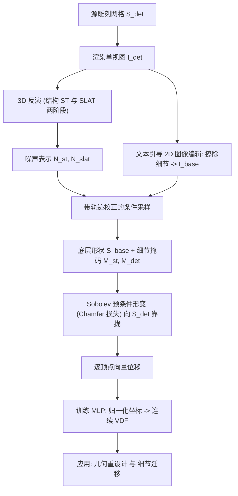

## 一句话总结

InvSculpt 把"雕刻建模"反过来做：给定一个雕刻好的高精度网格，自动把它拆解成一个保持原始身份的底层基础形状，加上一组可复用、可迁移的几何细节（以向量位移场 VDF 表示），让非专业用户也能继承专业雕刻师的劳动成果，做几何重设计与细节迁移。

## 研究背景

雕刻建模是专业 3D 内容创作流程的基石：艺术家用各种雕刻笔刷在基础网格上层层叠加精细几何细节，做出高保真模型。但这项工作门槛极高，既要有形状设计与细粒度雕琢的艺术功底，又极其耗时，普通用户难以企及，也难以规模化。

这引出了一个"逆雕刻建模"问题：能否把一个雕刻好的高分辨率网格分解成底层基础形状与可复用的几何细节？如果能，非专业用户就可以复用专业资产里凝结的雕刻劳动，实现几何重设计、快速原型、把细节迁移到新基础形状上批量造资产。

作者指出这个问题至今没被解决，且难度是根本性而非增量式的，源于三个内在挑战：

- 雕刻细节与底层形状本质上耦合，无法单靠几何特征轻易分离。
- 要得到一个既去掉细节、又不失真地保持原网格身份的基础形状本身就很难。
- 几何细节无法用传统的单向位移图忠实表示，也难以精确抽取。

已有的几何处理方法（网格去噪、细节迁移）缺乏语义感知，处理不了大尺度雕刻结构；生成式 3D 编辑方法又不是为"分离细节与基础几何"设计的，给不出一个既忠于原资产、又能跨形状迁移的表示。

## 方法

### 整体框架

InvSculpt 的目标是把雕刻网格 $$S_{det}$$ 分解为底层形状 $$S_{base}$$ 与可迁移细节（表示为向量位移场 VDF）。流程分两大部分：底层形状估计（3D 反演 + 轨迹校正）与向量位移场抽取。它把 2D 文本引导图像编辑模型的语义先验，嵌入到一个原生 3D 整流流模型中来完成可靠分解。

### 底层形状估计：3D 反演 + 轨迹校正

底层形状估计基于一个 3D 整流流模型（TRELLIS），它用多视图图像特征构造结构化潜表示：一组锚定在与物体表面相交的活跃体素 $$p_i$$ 上的局部潜码 $$\{(z_i, p_i)\}_{i=1}^{L}$$。推理时先在结构（ST）阶段预测 $$64^3$$ 网格上的体素占用，再在稀疏潜（SLAT）阶段恢复精细几何与纹理。

给定源网格 $$S_{det}$$，先渲染成单视图 $$I_{det}$$，然后在 ST 与 SLAT 两个阶段做基于泰勒改进（RF-Solver）的反演，把源网格映射到对应噪声表示 $$N_{st}$$ 与 $$N_{slat}$$。反演沿整流流轨迹从 $$s_T$$ 反向积分到 $$s_0$$，其单步更新为：

$$x_{t-\Delta} = x_t + \Delta f_\theta(x_t, t, c) + \frac{1}{2}\Delta^2 \partial_t f_\theta(x_t, t, c)$$

两阶段都采用无分类器引导（CFG）：

$$f_{cfg} = (1+\omega) f_\theta(\text{cond}) - \omega f_\theta(\text{uncond})$$

其中在 $$t \in [0, 0.5]$$ 设 $$\omega = 0$$ 以稳定早期反演并保留语义锐度，其余时刻设 $$\omega = -1$$。后期的无条件反演为后续轨迹校正铺路——让采样过程能沿反演路径回溯。

采样阶段用文本引导 2D 图像编辑模型（如"擦除犄角与伤疤的雕刻细节、保留整体平滑结构"）把 $$I_{det}$$ 里的细节去掉，得到编辑图 $$I_{base}$$，用它来语义引导整个形状的细节去除。

关键观察：整流流模型的采样轨迹相对笔直，因此初始速度方向至关重要。若一上来就做条件采样，早期时刻轨迹会大幅偏离反演路径，最终收敛到由 $$I_{base}$$ 诱导的模式，导致身份漂移与结构退化。为此作者提出简单有效的轨迹校正：在早期时刻 $$t \in [t_b, 1]$$ 先设 $$\omega = -1$$ 做无条件采样，强迫轨迹沿反演路径退回源网格模式，之后再切换到条件采样。实验中取 $$t_b = 0.8$$ 即可稳定校正收敛行为。随后把 $$N_{slat}$$ 的潜特征通过 $$n$$ 近邻（$$n=3$$）查询聚合投影到基础结构上，送入稀疏解码器重建出底层形状 $$S_{base}$$，它既满足 $$I_{base}$$ 指定的去除意图，又忠实保留了源网格身份。

### 向量位移场（VDF）抽取

先在细节去除的两个阶段抽取两个互补的 3D 掩码。结构级掩码从第一阶段的体素占用得到，捕捉大尺度几何变化：

$$M_{st}(p) = \mathbb{I}(\lvert O_{src}(p) - O_{base}(p)\rvert > \tau_{st})$$

其中 $$O_{src}$$ 与 $$O_{base}$$ 是去除前后的体素占用值，$$\tau_{st}$$ 设为一个体素差。细节级软掩码在第二阶段用潜码间的余弦相似度计算，识别精细表面变化：

$$M_{det}(p) = 1 - \frac{\langle z_{src}(p), z_{base}(p)\rangle}{\lVert z_{src}(p)\rVert_2 \, \lVert z_{base}(p)\rVert_2}$$

其中 $$z_{src}(p)$$ 来自 DINOv2 编码器在 $$S_{det}$$ 上的稠密多视图视觉特征，$$z_{base}(p)$$ 是去除细节后稀疏流模型生成的潜码。两者相加 $$M_{final}(p) = M_{st}(p) + M_{det}(p)$$ 得到更精确的细节定位。

拿到 $$S_{base}$$ 后，按 Sobolev 预条件梯度下降做形变（在不丢细节的前提下得到更平滑形变）。用网格拉普拉斯 $$L$$ 对基础网格重参数化，形变更新为：

$$\boldsymbol{v} \leftarrow \boldsymbol{v} - \eta (I + \lambda L)^{-1} \frac{\partial \mathcal{L}_{CD}}{\partial \boldsymbol{v}}$$

其中 $$\mathcal{L}_{CD}$$ 是在采样点与法向上、在形变网格与 $$S_{det}$$ 之间计算的 Chamfer 距离损失，$$\lambda$$ 控制梯度在整个域上的扩散范围，全程设为 15。作者先做全局形变得到与 $$S_{base}$$ 拓扑一致的中间网格 $$\hat{S}_{det}$$，再把体素级掩码投影到顶点得到顶点级掩码，指导第二次形变，使基础网格只在含可迁移细节的区域形变，从而抑制冗余噪声。最后取 $$S_{base}$$ 与形变结果的逐顶点差得到向量位移。

再训练一个神经网络：输入归一化到 $$[0, 1]$$ 的 $$S_{base}$$ 坐标，用 MSE 损失监督预测逐顶点位移，把离散位移抬升为连续的 VDF，从而借助 3D 形状对应把细节迁移到任意分辨率的网格。

## 实验结果

作者用 20 个雕刻网格做分解评测。定量上从两方面衡量底层形状：用与真值（雕刻前的源网格）间的平均 Chamfer 距离衡量几何结构保真度；用 2D 编辑器产出的去细节图与各方法分解形状的 24 视图渲染之间的 CLIP 分数衡量身份一致性。对比了 EditP23（多视图编辑 + 2D 抬升）、Trellis 与 Hunyuan3D（图像直接生成 3D）、以及 VoxHammer（掩码辅助原生 3D 编辑，为公平起见人工标注了去除区域掩码）。

| 方法 | Chamfer 距离↓ | CLIP 分数↑ |
| --- | --- | --- |
| Hunyuan3D | 0.0727 | 0.9433 |
| TRELLIS | 0.0557 | 0.9371 |
| EditP23 | 0.1262 | 0.8919 |
| VoxHammer | 0.0488 | 0.9534 |
| Ours | **0.0334** | **0.9901** |

InvSculpt 在两项指标上都显著领先：单图直接生成往往身份漂移，VoxHammer 通过反演注入源网格几何、但细节去除本质是全局编辑难以用掩码指定，即便人工标了多个掩码仍会去除不彻底、身份偏移。

此外 25 人的用户研究（1–5 分，各评 12 组结果）也显示强烈偏好本方法：底层形状保真度上 Ours 得 4.71，远高于 Trellis(3.29)、Hunyuan3D(2.94)、VoxHammer(2.38)、EditP23(1.57)；细节抽取质量上 Ours 得 4.37，高于 Trellis(2.81)、Hunyuan3D(2.46)、Phidias(1.72)。

消融方面：轨迹校正在 CFG 强度 1/3/5 下都能一致收敛到既保身份又达成去除效果的模式（用 PCA 可视化的轨迹显示标准采样早期即漂移，校正后既跟随图像引导又保住源网格身份）；去掉轨迹校正后再抽细节，VDF 精度显著退化；引入细节掩码能抑制细节区域外的冗余位移噪声，得到更准的 VDF 与更高质量迁移。作者还展示了轨迹校正对训练-free 生成任务的泛化：给定 A-pose 人体作源网格反演、任意姿态的人像作输入图，可生成与源网格姿态朝向对齐、又忠于输入外观的网格。

## 亮点与局限

亮点：

- 首次系统性提出并求解"逆雕刻建模"问题：把雕刻网格分解为底层形状 + 可迁移细节，让非专家复用专业雕刻资产。
- 轨迹校正策略：在 3D 整流流模型反演后的采样中，用早期无条件采样把轨迹拉回反演路径，再切条件采样，稳健实现"保身份的全局细节去除"，破解了原生 3D 编辑难以做全局去除又不改身份的困境。
- 用定义在底层形状表面的向量位移场作为无损、可迁移的几何细节表示，突破单向位移图的表达力限制；配合预训练 3D 形状对应模型可把鱼鳞、石裂等细粒度纹理乃至犄角等大尺度结构迁移到同类目标模型。
- 支持几何重设计：VDF 的拓扑无关特性允许对基础模型做大幅形变（如把怪兽头整体变瘦）后，用形变前的归一化坐标查询位移自动重贴细节，避免直接编辑高分辨率网格的操作困难与细节丢失。

局限：

- 底层形状的保真度受限于 3D 生成模型的生成先验与 3D VAE 的重建能力。
- 细节迁移质量受限于预训练语义模型给出的 3D 形状对应，语义特征不准会导致迁移效果欠佳。
- 作者计划未来用该框架生成配对的雕刻网格与基础网格数据集，用于训练更高效的端到端细节去除模型。

## 延伸思考

这篇工作最有意思的地方，是把"编辑"重新理解为"在生成模型的采样轨迹上做手术"。整流流的轨迹近乎直线，意味着终点由起始方向几乎决定——作者据此发现标准条件采样一开始就跑偏，于是用一段无条件采样把轨迹"锚"回源网格模式再施加引导。这种对采样轨迹几何的洞察，本质上是把可控生成从"改目标函数/加掩码"转向"控制求解路径"，对其他基于反演的编辑任务（图像、视频、3D）都有借鉴价值，尤其是那些"全局改变却要保身份"的难题。

另一个值得琢磨的是表示选择：用定义在恢复出的底层形状表面上的向量位移场，而非单向位移图或隐式场，兼顾了无损与可迁移。它把"细节"从具体网格拓扑中解耦出来，变成可查询的连续场，于是细节迁移退化为"建立形状对应 + 查场"。这提示几何细节或许可以像纹理贴图那样被资产化、被复用。当然，整个流程仍串接了 2D 编辑器、3D 生成先验、形状对应模型等多个预训练组件，误差会逐级传递，作者提到的"用本框架自产配对数据训端到端模型"确实是把这条流水线收敛成单一可控系统的自然下一步。
