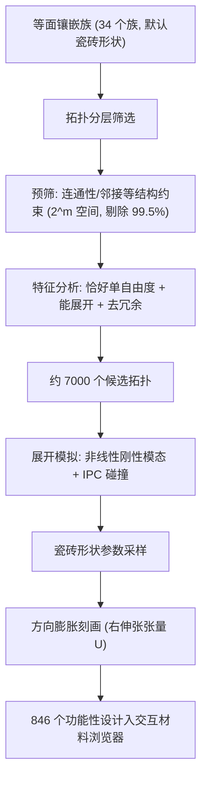

## 一句话总结
本文提出一套计算框架，在等面（isohedral）周期镶嵌的设计空间里自动搜索"刚性可展开"的 Kirigami 薄片——那些只靠铰接旋转与平移、几乎不发生弹性变形就能大幅膨胀展开的结构，并用 3D 打印样件验证。

## 研究背景
- 领域现状：Kirigami（在薄片上切割，使其通过协调旋转获得柔顺机构行为）已成为设计机械超材料的热门途径，在医疗、机器人、建筑、航天等领域都有应用。已有工作大多在固定拓扑（如基于四边形网格、预设四杆连接）上做几何优化，或走完全自由的自由形式优化但失去了镶嵌的规整性。
- 核心痛点：切割图案与展开行为之间的关系高度非线性、极其复杂；给定目标力学行为反过来找合适的 Kirigami 图案既困难又费力。同时，展开轨迹的鲁棒求解本身就很难——现有展开算法常常在轨迹中途"卡死"，无法把结构完全打开。
- 本文 idea：把设计空间限定在等面镶嵌这一类"由同一种多边形瓷砖经旋转平移拼成的周期图案"上（共 93 个族，本文探索了其中 34 个），把问题表述为"离散的铰接拓扑 + 连续的瓷砖形状参数"的混合优化问题；借助连杆（linkage）理论与约束 Hessian 的特征结构做可动性分析，再把非线性柔顺模态扩展到多体系统上，鲁棒地算出完整展开轨迹。

## 方法
整体框架：把 Kirigami 薄片建模为由销钉铰（pin joint）连接的刚性瓷砖二维装配体；先在默认瓷砖形状下枚举并筛选出"恰好单自由度"的有效连接拓扑，再对每个有效拓扑采样瓷砖形状参数，用扩展的非线性刚性模态算法模拟展开轨迹，最后按方向膨胀行为归类入库。

关键设计：

- 运动学模型与可动性分析。每个瓷砖 $$T_i$$ 有三个自由度 $$q_i=(p_i,\theta_i)$$（平移加平面内转角）。销钉铰要求相邻瓷砖上的两点重合，形成约束 $$c(q)=0$$，用罚能量 $$E_{\text{joints}}(q)=\tfrac{1}{2}c(q)^T c(q)$$ 表达。首阶可行的运动方向 $$v$$ 必须落在约束雅可比零空间里，即 $$Jv=0$$；等价地对 $$H=J^T J$$（即约束能量的 Hessian）做特征分解。固定一个瓷砖消除刚体运动后，$$H$$ 剩余零特征值的个数就是运动学可动度——本文只要"恰好一个零特征值"的自展开设计，对应特征向量给出首阶展开方向。

- 非线性刚性模态展开。由于约束非线性，直接沿特征向量走一步会破坏铰接约束并产生穿插。本文把展开表述为一系列无约束最小化：给定满足约束的当前状态 $$q_i$$，要求下一步位移在特征向量上的投影长度等于目标步长 $$\beta$$，用罚项 $$E_{\text{step}}(q)=\tfrac{1}{2}\big((q-q_i)^T v_i-\beta\big)^2$$ 表达，再联合最小化 $$q_{i+1}=\arg\min_q E_{\text{joints}}(q)+E_{\text{coll}}(q)+w\,E_{\text{step}}(q)$$。其中 $$E_{\text{coll}}$$ 是基于 IPC 的对数障碍势保证无碰撞，权重取很小的 $$w=10^{-4}$$ 以优先满足约束。相比 Duenser 等人的原始柔顺模态（沿初始特征向量走、遇到点积消失就卡住），本文在每一步重新计算特征向量、并用自适应步长（二分 $$\beta$$）越过运动"转折点"，从而能一路展开到接触受限的物理极限。

- 拓扑分层筛选。每条边有"不连 / 连左端点 / 连右端点"三种选择，$$m$$ 条边就有 $$3^m$$ 种配置（单元胞最多 16 条边），无法暴力枚举。关键洞察是：大部分筛选可以在"只决定某条边是否放铰、暂不决定放哪端"的 $$2^m$$ 缩减空间里完成——用四条结构性检查（每块瓷砖至少两个直连邻居、瓷砖路径连通、单元胞间连通、不存在三块互连的刚性三角）在 20ms 内剔除 99.5% 的拓扑；再展开到具体铰配置做特征分析（恰好单自由度、能真正张开、去掉运动等价的冗余配置），进一步剔除 99.8%。

- 力学行为刻画。用宏观变形梯度 $$[u\ w]=F[\bar u\ \bar w]$$ 把闭合态镶嵌向量映射到展开态，对 $$F=RU$$ 做极分解取右伸张张量 $$U$$；沿单位方向 $$d$$ 的方向膨胀为 $$\varepsilon(\theta)=d^T(U-I)d$$。三重旋转对称的设计呈现各向同性膨胀（理想拉胀/auxetic 行为），其他设计则呈现强正交各向异性（一个方向大幅膨胀、另一方向压缩）。作者还用"无弦诱导环（chordless cycle）"检测把每个设计的运动等价为若干平面连杆（4 杆、5 杆、6 杆乃至 8/10 杆）来分类其运动学多样性。

## 实验结果
主实验是展开算法的对比：在同一个 Kirigami 设计上，用归一化展开参数 $$t$$（0 为初始、1 为物理展开极限）衡量各方法能把结构打开到什么程度。只有本文方法能到达完全展开。

| 展开算法 | 达到的展开参数 $$t$$ | 说明 |
|------|------|------|
| 弹簧牵拉法 (Liu 2022a) | 0.11 | 用弹簧拉选定元件张开，很快失效 |
| 非线性柔顺模态 (Duenser 2022) | 0.78 | 沿初始特征向量走，转折点处受限 |
| 本文方法 | 1.00 | 唯一到达接触受限的物理展开极限 |

其他结果用文字概述：整个探索流程在 34 个等面族上运行，经分层筛选与形状采样最终得到 846 个功能性设计（共采样 2787 个图案）；完整数据库从零生成约需 8 小时，单条展开轨迹平均 1.40 秒（每帧 0.03 秒，最长约 6.5 秒）。绝大多数图案由度数为 3 的瓷砖构成，也发现了度 3 与度 6 交错的六边形图案等特殊拓扑。作者对若干设计做了 3D 打印验证：用聚丙烯薄片状铰接替代理想销钉铰，样件基本能复现模拟的展开行为。

## 亮点与局限
- 亮点：
  - 把"离散拓扑 + 连续形状"的混合设计空间系统化，借助连杆理论与约束 Hessian 特征结构做严格的单自由度可动性判据，思路干净。
  - 展开模拟算法（每步重算特征向量 + 自适应步长 + IPC 碰撞）显著优于已有方法，能鲁棒地跑完大转角、强非线性的完整展开轨迹。
  - 分层筛选把 $$3^m$$ 的组合爆炸压到可计算规模（预筛 20ms 剔除 99.5%），配套交互式材料浏览器让设计空间可探索。
  - 有 3D 打印实物验证，从虚拟设计到真实结构闭环。

- 局限：
  - 拓扑筛选用的是各族的默认瓷砖形状，无法完全排除"几何影响雅可比谱与零特征值个数"的情形，形状感知的穷举拓扑探索仍待解决。
  - 只覆盖周期性、同一种瓷砖形状的镶嵌；分级图案、非周期材料、非全等瓷砖会让单元胞变大、拓扑数量迅速爆炸，成为瓶颈。
  - 本质是"枚举 + 筛选"的正向探索，不是真正的逆向设计（给定目标行为直接求解）；作者只提出"全局枚举筛选 + 局部几何优化"两阶段策略作为方向。
  - 打印样件用弹性薄片铰替代理想销钉铰，对需要极大转角（如带第二闭合态的六边形图案）的设计难以完全展开。

## 延伸思考
- 本文核心是在一个高度结构化的参数化图案空间里做"可动性判据 + 鲁棒非线性轨迹求解"，这套"特征结构分析 + 非线性模态延拓 + 障碍法碰撞"的组合，对其他可展开/折叠结构（origami、可重构桁架、软体机器人蒙皮）都可能迁移。
- 与作者同组的 Modal Folding、Nonlinear Compliant Modes 一脉相承，都是把线性模态推广到有限变形；把这类方法与可微仿真结合，或许能把当前"枚举 + 局部优化"升级为端到端的逆向设计。
- 一个值得追问的点：文中提到接触"原则上可以提供达到单自由度所需的约束"，但数据集里没观察到——若主动把滑动/刚性接触纳入设计变量，可能解锁一类靠接触定义运动的新 Kirigami 机构；再叠加可变形瓷砖或铰，则通向多稳态（multistable）Kirigami。
