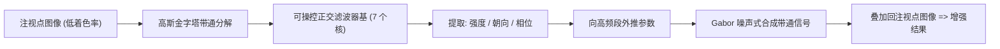

## 一句话总结

这篇论文提出一种低成本的注视点渲染增强方法：只从已渲染的注视点（低分辨率）图像中提取局部强度、朝向和相位统计量，并把它们外推到被丢弃的高频段，再合成一个叠加信号补回细节，其中"相位跨空间与跨频率对齐"是让边缘和线条结构保持连贯的关键，从而在感知上等价于全分辨率图像的前提下把着色率再压低约 4 倍。

## 研究背景

- 领域现状：宽视场的 VR/AR 显示需要高空间与时间分辨率，但渲染代价高昂。注视点渲染（foveated rendering）利用人眼在周边视觉对高频空间细节不敏感的特性，降低周边区域的着色分辨率或几何复杂度，已成为主流的感知优化手段。它本质上是一类"生成周边元视觉像（peripheral metamer）"的技术——即物理上不同、但人眼无法分辨的图像。
- 核心痛点：到底什么才是"好的周边元视觉像"仍不清楚。既有增强方法主要恢复对比度（Patney 等）或特定频率与朝向的噪声（Tariq 等），能补回一些纹理感，但无法正确重建图像边缘。而边缘来自"相位在空间与频率上的相关性"，是即便在远周边视觉中也依然重要的统计量，此前工作恰恰忽略了它。关键约束在于：实时渲染时拿不到 ground-truth，所有增强参数只能从已渲染的注视点图像自身推断。
- 本文 idea：仅以注视点图像为输入，从被保留的低频段估计局部强度、朝向、相位三类统计量，利用"相位关系在跨频率与跨空间上保持一致"的假设，把这些统计量外推到缺失的高频段，再据此合成带通信号叠加回原图，尤其强调相位对齐对重建连贯结构（线、边）的作用。

## 方法

整体框架分两大阶段：先"提取与外推统计量"，从注视点图像可靠的低频段里估出强度、朝向、相位三个参数场，并向更高频段外推；再"合成缺失频率内容"，用一套可操控（steerable）的正交滤波器基，按外推出的参数生成带通信号叠加到输入上。整套分析与合成都基于同一组滤波器基，保证一致性；且只在亮度通道上处理（YCbCr 解相关），因为人眼对色度细节敏感度远低于亮度。

关键设计：

- **统一的可操控正交滤波框架**：三个参数各有难点，若各用一套算子（拉普拉斯金字塔估强度、梯度估朝向等）会导致管线割裂。而相位估计本质上需要正交（quadrature）滤波响应，因此作者采用 Freeman 与 Adelson 的可操控正交滤波器基：3 个奇对称核 $$G$$（高斯的方向二阶导）加 4 个偶对称核 $$H$$（$$G$$ 的 Hilbert 变换近似），共 7 个基响应。任意旋转角 $$\theta$$ 下的核响应都能由这 7 个基确定性地线性合成，分析与合成复用同一套基，保证一致性。图像先做高斯金字塔带通分解，让固定空间尺寸的滤波器在各层等价于不同频段。

- **朝向估计**：每像素只保留一个主朝向，因为跨尺度合成相位一致结构时需要唯一的参考朝向，且在所考虑的分辨率与离心率下，感知相关结构通常由单一朝向主导。通过找使响应能量 $$E(\theta) = [G_\theta]^2 + [H_\theta]^2$$ 最大的角度得到，可写成 $$\theta = 0.5 \arg(C_2, C_3)$$。外推时把朝向表示为复数的相位，对实部虚部分别双线性上采样再取相位，保证跨尺度的圆周插值正确。

- **相对相位与跨尺度相位对齐（核心）**：确定主朝向后，取局部操控响应对 $$(G_\theta, H_\theta)$$，局部相位为 $$\phi = \arg(G_\theta, H_\theta)$$。更重要的是跨尺度相位相关——偶对称响应跨尺度对齐得到线状结构，奇对称对齐得到阶跃边缘。借鉴 Portilla 与 Simoncelli 的纹理合成，计算相邻粗（$$c$$）中（$$m$$）尺度间的相对相位 $$\Phi(m,c) = \hat{c}\cdot m^{*}$$，其中 $$\hat{c} = c^2 / \lvert c \rvert$$。$$\arg(\Phi)$$ 为 $$\pm \pi/2$$ 表示边、为 $$0$$ 或 $$\pm\pi$$ 表示线。再把这一跨尺度行为外推到更细层 $$f$$：$$\arg(f) = 2\arg(m) - \arg(\Phi)$$。这样可把"结构性相位关系"与"空间频率内容"分离，从而在上采样后的相位场上重新施加不变的结构关系。

- **局部与全局强度**：强度场控制合成带通内容的局部能量，要求平坦区域（如天空）增强后仍平坦。跨多尺度外推时若直接把低频能量搬到高频会造成高频过表达、功率谱失真。作者利用自然图像功率谱斜率约为 2 的规律，从保留频段估当前图像斜率，逐层引入全局强度调整 $$a_\sigma$$，得到 $$\sigma = a_\sigma \lvert (G_\theta, H_\theta) \rvert$$。

- **合成与加速**：缺失频率内容按改进的 Gabor 噪声流程合成——生成脉冲图，每个脉冲用一个按参数操控、相移、调强的核卷积，核定义为 $$K = [\cos(\phi) G_\theta - \sin(\phi) H_\theta] \cdot \sigma$$。注意参数必须作用在整个核上而非逐像素相移已算好的响应图，否则会引入目标频段之外的频率。运行时不做真实卷积：把脉冲拆成若干互不重叠的子图，各子图与 7 个基核各预卷积一次并存下，运行时按脉冲位置线性组合这 7 张预卷积图即可，可在 GPU 上并行，非常快。方法核受限于最高 0.25 cycles/pixel，最高频带不重建。由于滤波操作不引入不连续，只要内容平滑变化，合成噪声也平滑，天然具备时间稳定性。

## 实验结果

作者做了两项实验。校准研究（Calibration Study）在 55 寸 OLED、143cm 视距、Tobii 眼动仪与下巴托固定的条件下，用 2AFC 让 11 名被试判断哪张是全分辨率参考图，控制"增强方法 × 着色率 × 离心率"三个自变量，用心理测量函数拟合 75% 可分辨阈值。核心结论是：逐步恢复更多参数，可容忍的注视点强度递增；在当前核选择下，Phase Aligned 相比纯 Foveated 提升 +129%，即便叠加对比度增强也有 +57% 提升，并在直接对比中超过 Tariq 等的框架 39%。

下表为校准研究中不同增强方法带来的可容忍注视点强度提升幅度（相对基线）：

| 增强方法 | 恢复的统计量 | 相对提升 |
|------|------|------|
| Foveated | 无（原始降着色率输入） | 基线 |
| Intensity Adjusted | 强度 $$\sigma$$ | 中等 |
| Oriented | 强度 + 朝向 $$\theta$$ | 较小额外增益 |
| Phase Aligned（本文） | 强度 + 朝向 + 相位 | +129% vs. Foveated |
| Phase Aligned + 对比度增强 | 全套 + CE | +57%，比 Tariq 等高 39% |

验证实验（Validation Study）让 15 名被试在自由观看下，就 6 个场景 ×（有/无对比度增强）共 12 对比较本文（Phase Aligned）与 Tariq 等方法哪个更接近参考。结果本文在 83% 的比较中被偏好（$$p = 0.035$$）；无对比度增强时偏好率高达 91%（$$p < 0.001$$）；即便在 Tariq 方法专门调优过的对比度增强条件下，本文仍达到 75% 偏好率。作者指出其评测使用了超出 Tariq 等原设定范围的更强注视点强度，本文在非对比度增强设定下对此专门做了调优，因而优势尤为明显。

## 亮点与局限

- 亮点：
  - 首次把"相位跨空间与跨频率对齐"引入注视点渲染的增强合成，抓住了此前方法忽视的边缘/线条连贯性这一关键感知统计量。
  - 完全仅依赖注视点图像自身推断参数，不需要 ground-truth，契合实时渲染约束。
  - 分析与合成共用一套可操控正交滤波器基，加上"预卷积 + 运行时线性组合"的加速，使合成可在 GPU 上高效并行、天然时间稳定。
  - 用复杂自然刺激（而非简单视觉科学刺激）做校准，阈值可直接用于真实场景；两项感知实验都给出显著结果。
- 局限：
  - 只在离散金字塔层上操作，渲染/合成的频率分界被量化到整个频带，无法连续控制精细权衡。
  - 相位跨多尺度外推时边缘会"增殖"，出现多条相邻线而非单条清晰边界——结构语义保留但定位不精确。
  - 受核选择约束：为计算效率核在空间上很小、频率由金字塔决定，限制了频率分辨率与频谱位置的精细控制；当前核朝向选择性偏弱，使朝向恢复的感知收益有限。

## 延伸思考

- 本文与 Tariq 等（噪声增强）、Patney 等（对比度增强）是同一条"低成本增强注视点渲染"路线的递进，差别在于把恢复的图像统计量从对比度/朝向扩展到相位。一个自然的追问是：把本文的相位对齐合成与对比度增强真正联合优化，能否在对比度增强设定下也拿到非增强设定那样的大幅优势？
- "双线/边缘增殖"问题源于相位与强度场跨尺度上采样时局部性的丧失。是否可用连续频率控制、或更强各向异性、空间更局部化的核来缓解，是值得探索的方向。作者也提出一个更根本的开放问题：为高效合成这类视觉元视觉像，输入中究竟哪些信息是真正必要的。
- 方法只在亮度通道处理并舍弃最高频带，对含高频彩色纹理或强调色度细节的内容效果如何、以及在真实交互式渲染管线（而非预生成刺激）中的端到端开销，都还有待进一步验证。
