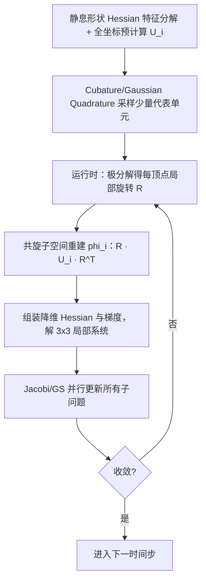

## 一句话总结

本文提出一个 GPU 并行弹性体仿真算法：通过为每个局部子问题预计算一个"材料感知"的子空间来抑制 **overshoot（过冲）**，使得像 Jacobi/Gauss-Seidel 一样高度并行的迭代能达到接近全局 Newton 法的二阶收敛，比现有 GPU 方法快 50 到 100 倍。

## 研究背景

- 领域现状：GPU 弹性仿真普遍把全局能量最小化拆成大量小的局部子问题，用 Jacobi 或 Gauss-Seidel（GS）并行松弛来解，代表工作有 VBD（每个顶点一个子问题）、2nd Stencil Descent（每个单元一个子问题）、XPBD、投影动力学（PD）等。
- 核心痛点：并行性与收敛性长期被视为一对矛盾。子问题越小越并行、但耦合越弱、收敛越慢；子问题越大收敛越好、但局部求解越贵。作者指出真正的元凶是 **overshoot**：局部求解器只看局部能量、不知道全局，把局部能量"用力过猛"地降下去，反而抬高了模型其他区域的能量，拖垮了全局收敛。这个问题在刚性材料上尤其严重（DOF 耦合更强），也是现有并行方法偏爱软材料、小时间步的根因。
- 本文 idea：既然过冲源于"局部看不到全局"，那就给每个局部子问题补上全局信息——预计算一个能预测"局部扰动如何影响全局能量变化"的子空间函数 $$\phi_i$$，让局部解在数学上等价于对全局 Newton 解的投影，从而获得二阶收敛，同时保持 Jacobi/GS 的并行性。

## 方法

整体框架：把每步隐式积分写成变分优化 $$\arg\min_{\boldsymbol{x}} E(\boldsymbol{x})$$，其中 $$E = I + \Psi$$（惯性项 + 弹性项）。并行方法把 $$E$$ 拆成子问题 $$E_i(\boldsymbol{x}_i)$$。作者的核心是：把局部子问题改写成同时考虑局部能量与补集能量 $$E_{Ci} = E - E_i$$，借助一个映射 $$\boldsymbol{\delta x} = \phi_i(\boldsymbol{\delta x}_i)$$ 描述局部扰动对全局的影响，再证明只要 $$\phi_i$$ 取得当，局部解 $$\boldsymbol{\delta x}_i$$ 就精确等于全局 Newton 解的对应分量 $$\boldsymbol{S}_i \boldsymbol{\delta x}^\ast$$。整条链路的难点在于让 $$\phi_i$$ 可预计算、可 GPU 并行。

关键设计：

1. **局部扰动子空间与二阶最优性**。在当前 Newton 线性化下，对某个局部 DOF 施加单位扰动、固定其余局部 DOF，观察补集 DOF 的响应，得到基矩阵 $$\boldsymbol{U}_{Ci} = -\bar{\boldsymbol{H}}_{Ci,Ci}^{-1} \bar{\boldsymbol{H}}_{i,Ci}^{\top}$$，于是 $$\phi_i(\boldsymbol{\delta x}_i) = [\boldsymbol{I};\, \boldsymbol{U}_{Ci}]\,\boldsymbol{\delta x}_i$$。论文通过对全局 Newton 系统做 Schur 消元证明：用这个子空间解出的 $$\boldsymbol{\delta x}_i$$ 与全局 Newton 解在数学上完全一致，因此是"二阶最优"的。直观上，降维 Hessian 充当一个"阻尼器"，阻止局部解冲到局部极小值而过冲。

2. **共旋子空间（Co-rotated Subspace），让 $$\phi_i$$ 可复用**。$$\phi_i$$ 依赖随形变而变的当前 Hessian，逐帧重建不现实。作者的观察是：真正需要的只是让 $$E_{Ci}(\tilde{\phi}_i)$$ 估得准，不必让 $$\tilde{\phi}_i$$ 精确等于 $$\phi_i$$。于是在每个顶点嵌入一个共旋局部坐标系，运行时对形变梯度做极分解得到局部旋转 $$\boldsymbol{R}^k$$，把子空间"旋回"静息姿态：$$\tilde{\phi}_i^k = \boldsymbol{R}^k \bar{\boldsymbol{U}}_i \boldsymbol{R}_i^{k\top} \boldsymbol{\delta x}_i^k$$。这样最贵的 $$\bar{\boldsymbol{U}}_i$$ 只依赖静息形状 Hessian $$\bar{\boldsymbol{H}}$$，可离线预计算。

3. **Cubature / Gaussian Quadrature 采样降低组装成本**。降维 Hessian 和梯度需要遍历所有补集 DOF 投影，复杂度 $$O(N \cdot N_i^2)$$、不可承受。作者沿用 Cubature 思想（论文题目中的 Gaussian Quadrature 即此类正交采样）：只挑一小撮代表性采样单元（每个子问题约 4 到 6 个）配非负权重，用非负最小二乘（NNLS）训练权重来逼近降维量。由于子空间描述的是"扰动 $$\boldsymbol{\delta x}$$"而非大形变，训练姿态直接取静息 Hessian 的低频特征向量即可，采样极稀疏仍有效，残差可控在 1% 以内。

4. **全坐标预计算，把预处理从"天"降到"分钟"**。逐子问题分解 $$\bar{\boldsymbol{H}}_{Ci,Ci}$$（近乎全尺寸矩阵）对大模型要跑几天。作者改用带 Lagrange 乘子的全坐标约束表述：$$\bar{\boldsymbol{H}} \bar{\boldsymbol{u}}_{i,j} = 0$$ 且 $$\boldsymbol{S}_i \bar{\boldsymbol{u}}_{i,j} = \boldsymbol{e}_j$$。它的左上块 $$\bar{\boldsymbol{H}}$$ 对所有子问题不变，只需分解一次，之后用块矩阵求逆和 Schur 补 $$\bar{\boldsymbol{U}}_i = -\bar{\boldsymbol{H}}^{-1} \boldsymbol{S}_i^{\top} \bar{\boldsymbol{G}}_i$$ 复用因子，预计算加速约三个数量级（天到几十分钟）。

此外，方法与 IPC（增量势接触）等把碰撞写成无约束势能的方案天然兼容：接触把两个物体双向耦合，通过近似假设接触点邻域扰动一致来扩展 $$\phi_i$$。

## 实验结果

在弹性梁"过冲"实验中，作者直接测量局部解 $$\boldsymbol{x}_i$$ 与全局 Newton 参考解投影 $$\boldsymbol{S}_i \boldsymbol{x}^\ast$$ 的相对误差随迭代次数的变化，最能体现"过冲"这一核心问题：

| 方法 | 降到相对误差 $$1\text{E}{-}3$$ 所需迭代数 | 说明 |
|------|------|------|
| 本文 | 约 3 次 | 呈现强二阶收敛 |
| 2nd Stencil Descent | 明显多于本文 | 子问题更大、收敛较好但每步更贵 |
| VBD / PD / XPBD | 超过 500 次 | 20 次迭代后几乎无进展，过冲严重 |

综合各场景，本文比 XPBD/PD/VBD/2nd SD 快 50 倍以上。其余大量实验以文字给出：在 100 万顶点 Armadillo 大形变中比 2nd SD 快约 30 倍、比 VBD 快 40 倍；把材料刚度提高 20 倍后 VBD 一万次迭代都不收敛，本文快 137 倍。与投影 Newton 相比（六个 Armadillo、600 万单元），本文约快 8000 倍。"纸牌屋"、"SIGGRAPH 字母"等刚软混合场景里 VBD 与 2nd SD 常常无法收敛，而本文对刚度变化几乎不敏感（软/硬字母分别 27/34 次迭代）。10 万单元的龙可实时仿真、超过 120 FPS。方法还扩展到 IPC 接触、以及 2M 三角形的布料/薄壳仿真。

## 亮点与局限

- 亮点：
  - 从"overshoot"这一被忽视的数值现象切入，给出了简洁而有理论保证的解释与解法——证明了带全局感知子空间的局部解等价于全局 Newton 解的投影，把"并行"与"二阶收敛"这对老矛盾真正拉近。
  - 共旋子空间 + 稀疏 Cubature + 全坐标预计算三招组合，把理论上昂贵的方案落到可预计算、GPU 高度并行、每次迭代仅解 3×3 系统的实用形态。
  - 对刚性材料和刚软混合场景鲁棒，这是多数并行方法的老大难；实验规模覆盖百万到千万级单元，加速比可观。
- 局限：
  - 预计算（局部子空间构建 + Cubature 训练）仍然偏慢，带来实际使用上的不便。
  - 二阶收敛依赖二次近似成立；当出现 IPC 障碍势等强非线性、$$\lVert \boldsymbol{\delta x}^k \rVert^3$$ 不可忽略时不再二次收敛，需要线搜索（可并行）。
  - 算法本身加速后，碰撞检测反而成了新瓶颈。

## 延伸思考

- 论文题目的 "Training-free" 与 "Gaussian Quadrature" 强调了相对早期 Cubature 需要重训练的负担，本文用静息 Hessian 低频特征向量作训练姿态、稀疏采样即可，弱化了训练成本；把它理解为一种"材料感知的插值/形函数"很有启发——相比 RBF、Green 坐标等几何插值，$$\phi_i$$ 能反映材料刚度带来的扰动传播差异。
- 作者指出该框架是通用并行优化过程，理论上可迁移到布料、杆、MPM、流体等；难点仍是为不同问题找到可预计算的 $$\phi$$。作者也提出数据驱动/深度学习或许能为不同问题自动学出这个子空间，这是一个自然的后续方向。
- 值得追问：预计算成本对"频繁变化拓扑/切割/断裂"场景是否成为硬伤（静息 Hessian 会失效）；以及在极端非线性接触下线搜索开销对整体加速比的实际侵蚀有多大。
