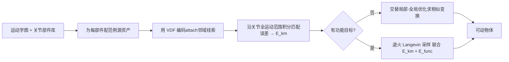

## 一句话总结

给定一张抽象的运动学图（哪些部件通过什么关节相连）和一个关节部件库，本文用一套优化框架自动为每个复用部件求解相似变换（旋转/平移/缩放），把它们拼装成一个既满足运动学结构、又能达成任务功能的可动 3D 物体——把"拼装模型玩具零件"（kitbashing）的做法从静态形状推广到了可动物体。

## 研究背景

- 领域现状：为交互式虚拟环境创建可动 3D 资产（能开的门、能转的轮子、可摆姿的角色）需要同时满足几何、关节铰接和控制 schema 三方面耦合约束。运动学图（节点是刚性部件、边是关节）是这类 schema 的结构核心，且常以抽象形式给出——只规定部件间"谁连谁"，不给出精确的 3D 位置、朝向和尺度。这种抽象让同一套连接结构能复用到几何差异巨大的资产族上。
- 核心痛点：把抽象运动学图落地成完整可动物体，往往靠繁重的手工建模或针对特定 schema 的专用工具。已有生成式方法（如基于图去噪扩散生成部件与关节参数的 CAGE、NAP）依赖在规模有限的数据集上训练神经网络，难以泛化到训练分布之外的配置；另一些方法则假设输入部件已经摆放正确，无法处理"部件排布未知"的情形。
- 本文 idea：把几何落地建模成一个基于范例的类比问题——每个被复用的子部件都配一个"源资产"，示范它原本如何attach到父部件上。父部件在子部件周围的几何（插槽、凹陷、间隙区）编码了可迁移的attach线索。用向量距离场（VDF）捕捉这种局部attach上下文，并沿关节的整个运动范围积分匹配误差，得到一个"运动学感知"的attach能量，偏好那些在整个铰接过程中都能保持范例局部邻域的摆放。

## 方法

整体框架：输入是一张运动学图和一组来自范例资产的关节部件（每个部件带静止姿态网格、子侧关节参数、以及它原始父部件的几何）。方法为每个部件 $$k$$ 求解一个保朝向的相似变换 $$P_k = (R_k, d_k, s_k)$$，把部件放进共享世界坐标系；核心驱动力是运动学感知的 VDF attach能量 $$E^{km}$$，当需要满足任务级功能时再叠加一个黑盒功能项 $$E^{func}$$，用退火 Langevin 采样联合优化。

关键设计：

1. **向量距离场attach能量（运动学感知）**：给定源网格 $$M_s$$ 和参考网格 $$M_t$$，VDF 为 $$M_s$$ 上每个顶点赋一个指向 $$M_t$$ 最近点的向量。对每个"部件-父部件"对，在关节参数范围内均匀采样 $$N$$ 个铰接姿态 $$\theta_i$$，比较"变换后部件与新父部件之间的 VDF"和"源对里观测到的 VDF"，能量写作 $$E^{km}_k = \sum_{i=1}^{N} \lVert s_k R_k u(A^{(i)}_k; M_k) - u(\tilde{A}^{(i)}_k(P); M^{new}_k) \rVert^2$$。沿整个姿态范围求和是关键：它要求attach不仅在单一姿态、而是在整个铰接周期都与范例的功能邻域对齐。相比经典 ICP 直接把最近点吸到接触面（会忽略铰接所需的间隙、导致碰撞），VDF 天生尊重部件与父件之间的 clearance。

2. **交替局部-全局优化**：直接对积分了所有姿态的 $$E^{km}$$ 上二阶方法很贵。借鉴 Projective Dynamics 的思路，为每个姿态 $$i$$ 引入一个辅助变换 $$Q_i$$，并把它绑到部件共享的相似变换 $$P_k$$ 上。局部步 $$\min_{Q_i} \sum_i (E^{km}_{k,i} + \frac{\rho}{2}\lVert \mathrm{Log}(Q_i^{-1} P_k) \rVert^2)$$ 各姿态独立、可并行求解；全局步 $$P_k = \mathrm{Exp}(\frac{1}{N}\sum_i \mathrm{Log}\, Q_i)$$ 把各 $$Q_i$$ 在李代数上求平均再映回 $$\mathrm{Sim}(3)$$ 流形。用测地距离代替欧氏罚项以尊重 $$\mathrm{Sim}(3)$$ 的非欧结构。这一解耦大幅提速：门的例子里从 163 秒降到 19 秒。

3. **黑盒功能目标 + 退火 Langevin 采样**：任务级目标（末端可达性、轨迹跟踪、碰撞/扫掠体积惩罚、打包约束）通常经由不可微的黑盒过程（逆运动学求解、碰撞查询）评估。因此对联合目标 $$\min_P E^{km}(\tilde{S}(P)) + \lambda E^{func}(\tilde{S}(P))$$ 采用退火 Langevin 采样做无梯度优化。此处 $$E^{km}$$ 充当强几何先验，把全局搜索约束在几何上合理的attach区域内——对高自由度装配尤其关键：只靠 $$E^{func}$$ 驱动往往得到彼此断开的散件。

4. **运动学图编辑与再定向**：当给定连接结构不适配新场景/任务时，允许对图做离散改写（局部改父子结构或关节位置选择），对每个提案跑一次短的内层优化并按功能目标打分，选最优者迭代。由此支持把单头台灯改造成多头设计、或让柜门在杂乱场景中无碰撞开合等再定向能力。

## 实验结果

在 PartNet-Mobility 的 Table 与 Storage Furniture 测试划分上，与四个共享相同输入的公开基线比较，指标覆盖几何（Rooted 连通性、Stable 直立稳定性）、运动学（COV 覆盖率、MMD 最小匹配距离）和功能（AOR 兄弟部件平均体积重叠）三个维度。本文方法在全部指标上最优：

| 方法 | Rooted↑ | COV↑ | MMD↓ | Stable↑ | AOR↓ |
|------|---------|------|------|---------|------|
| 4-PCS | 95.4% | 56.9% | 0.092 | 81.5% | 16.4% |
| Part Slot Machine | 98.5% | 63.1% | 0.083 | 84.6% | 10.7% |
| NAP | 96.9% | 69.2% | 0.072 | 92.3% | 3.5% |
| CAGE | 100% | 73.8% | 0.051 | 90.7% | 1.1% |
| Ours | 100% | 83.1% | 0.038 | 96.9% | 0.1% |

此外方法还能作为图像生成式方法的轻量后处理：对 SINGAPO、FreeArt3D 等单图生成的、存在错位/错误attach的可动物体，通过检索合适部件并重新实例化attach，可修复出干净的门/抽屉对齐。消融也验证了：去掉运动学维度（只对单姿态优化）会让门朝向错误；去掉 $$E^{km}$$ 先验，Langevin 虽能满足到达目标却生成几何上不成型的装配。

## 亮点与局限

- 亮点：
  - 用"范例类比 + VDF"把attach线索形式化，并沿整个关节运动范围积分，使摆放在整个铰接周期都保持合理，天生尊重间隙、避免碰撞（相比 ICP）。
  - 接受黑盒、不可微的功能目标，通过 Langevin 采样统一处理可达性、轨迹跟踪、打包等异构任务，比需要精心设计可微前向模型的传统机构优化更灵活可扩展。
  - "一次性"从单个范例细化，无需训练大数据集，可泛化到训练分布外配置，并能给现有生成模型做后处理修复。
  - 交替局部-全局优化在 $$\mathrm{Sim}(3)$$ 上做李代数平均，把多姿态积分带来的开销并行化，显著提速。

- 局限：
  - 定位为离线优化框架而非实时系统；退火 Langevin 收敛需大量迭代，运行时随图复杂度和采样姿态数线性增长。
  - 碰撞项是软惩罚，不提供无碰撞硬保证，可能漏掉未采样姿态处的罕见碰撞。
  - attach先验本质上是范例驱动的：当目标父件缺少与源部件兼容的邻域、或部件库缺少比例合适的候选时会失败。
  - 目前不能从零提出全新的运动学图或高层任务规范。

## 延伸思考

- 方法把"局部attach邻域的可迁移性"作为核心假设，这与静态形状的 mix-and-match 合成（如通过对称/接触关系保功能）一脉相承，但引入了"时间维度"（沿关节运动积分），是把静态部件组合思想推向可动物体的自然一步。
- 论文提到几个有价值的方向：借助语言引导的物体-物体对齐（如 Copy-Transform-Paste）在运动学精修前先提出/排序候选attach；用并行回火（parallel tempering）管理多条不同温度的 Langevin 链以加速收敛；集成显式的可动碰撞检测与消解来提供无碰撞硬保证。
- 作为生成式流水线的后处理模块颇具实用价值——生成模型负责"大致形状与语义"，本框架负责"精确attach与可动一致性"，二者互补，值得在更多 image-to-3D / text-to-3D 可动生成上验证。
