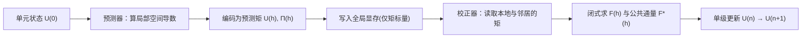

## 一句话总结

KPM-FR 把气体动理学格式（GKS）的通量重构思想搬进高阶通量重构（FR）框架，用一套"预测-校正"流程让动理学演化完全发生在紧凑的矩空间里，从而在单张消费级 GPU 上同时做到高保真、高吞吐、低显存的流体仿真。

## 研究背景

- 领域现状：高保真、大吞吐、小显存这三个目标长期是流体仿真的核心矛盾，业界只能针对不同应用做专用求解器来折中取舍。格子玻尔兹曼方法（LBM）凭借局部的流式-碰撞过程实现极低数值耗散，善于保留涡结构，但要存完整分布函数（3D 的 D3Q27 每格点存 27 个），显存开销巨大。矩表示 LBM（MR-LBM）改存宏观矩来省显存，却要在流式时把分布函数重构回来，反而带来额外耗散和片上内存瓶颈。与 LBM 并行发展的气体动理学格式（GKS）用界面通量重构、无需存分布函数，但其解析形式复杂、算力密集，且传统二阶有限体积离散耗散偏高。
- 核心痛点：现有动理学求解器都在"显存开销 vs 解的保真度"之间被迫折中；GKS 类方法要么保留原始高成本通量、要么用多级时间推进拉长墙钟时间、要么解耦黏性处理又引回辅助梯度通信开销，三者无法同时优化。
- 本文 idea：放弃 LBM 的格子流式范式，回到 GKS 的"以通量为中心"哲学（把动理学演化与速度空间存储解耦），并把动理学通量重新表述进高阶 FR 框架。关键创新是一条"编码-传输-解码"管线：动理学演化只在紧凑的矩空间进行，跨单元只交换少量矩标量，再配合面向硬件的两核融合实现，逼近 GPU 带宽上限。

## 方法

### 整体框架

KPM-FR 求解由玻尔兹曼-BGK 方程取矩得到的守恒律 $$\frac{\partial \boldsymbol{U}}{\partial t} + \nabla \cdot \boldsymbol{F} = 0$$，其中 $$\boldsymbol{U} = (\rho, \rho\boldsymbol{u})$$ 是宏观守恒量，通量张量 $$\boldsymbol{F}$$ 在单一动理学表达式里同时包含无黏与黏性贡献。空间上用高阶 FR 离散：每个单元内用 $$K$$ 个 Gauss-Lobatto 解点表示一个 $$K-1$$ 次多项式，单元之间只通过界面上的公共通量 $$\boldsymbol{F}^*$$ 耦合。时间上用单级中点更新替代多级 Runge-Kutta，把每步的跨单元数据交换减半。核心难题是"如何高效算出动理学导出的宏观通量"，作者用一套围绕"预测矩"的预测-校正循环来解决。

### 关键设计

1. **矩空间的预测-校正编码（省带宽的核心）**。直接算公共通量需要邻居单元的梯度 $$\nabla g$$，在 3D 里相当于每解点 16 个标量，跨单元传输代价高。作者利用动理学的"演化形式-状态形式"等价：半时步分布函数既可写成依赖本地梯度的演化形式 $$A f_s(h) + B g(h)$$，也可写成只依赖宏观量与非平衡偏差的状态形式 $$g(h) + f^{\text{neq}}(h)$$。对低马赫等温流，$$f^{\text{neq}}$$ 的全部通量相关信息由一个对称的黏性应力张量 $$\boldsymbol{\Pi}$$（Grad 闭合）编码，无迹后只剩 5 个独立分量。于是预测器每解点只需产出 9 个标量（4 个守恒量 + 5 个应力分量），跨界面只传这些"预测矩"，把梯度通信降到物理必需的最小量。

2. **无求积的闭式通量求值**。LBM 常用 Gauss-Hermite 求积把矩积分写成 $$N_q$$ 点加权求和，会带来严重的寄存器压力与算力浪费。作者指出平衡态矩 $$m_{abc} = \langle \xi_x^a \xi_y^b \xi_z^c\, g \rangle$$ 都有闭式表达；通过对梯度项做前向差分线性化（引入平移平衡态 $$\boldsymbol{U}^{\triangle}_d = \boldsymbol{U} - u_c h\, \nabla_d \boldsymbol{U}$$），预测矩、单元内通量、乃至最棘手的半程积分公共通量，全部化为已知平衡态矩的线性组合，只用基本算术即可求出，彻底去掉了循环展开和特殊函数求值。

3. **面向 IO 的两核融合 GPU 实现**。现代 GPU 带宽跟不上算力，张量积 FR 若用通用 GEMM 核会把梯度等大中间数组写回全局显存而受限。KPM-FR 把每个阶段（预测器/校正器）压成单次核启动，微分、通量求值、split-form、修正全在片上（寄存器/共享内存/L2）完成，只有预测矩 $$\boldsymbol{U}(h)$$ 和 $$\boldsymbol{\Pi}(h)$$ 经全局显存在两核间传递。每个 3D 单元分配 $$K^2$$ 线程、每线程处理长度 $$K$$ 的一维切片，配合 SoAoS 布局做合并访存，用共享内存做维度转置实现方向分裂。应力 $$\boldsymbol{\Pi}$$ 用 FP16 存、FP32 算的混合精度进一步压访存，使每解点每步只需约 25 次有效访存、约 42 字节存储。

4. **工程鲁棒性处理**。针对欠分辨高雷诺数流，作者补了三个轻量修正：split-form 通量抑制非线性混叠；与耗散型 KFVS 通量按可调参数 $$\lambda$$ 混合以调节数值耗散（推荐 $$\lambda = 0.5$$）；切向输运修正把切向分量当被动标量处理，充当隐式大涡模拟并压制伪振荡。固体边界则用浸没边界的体积强迫与界面处的鬼点状态两种方式处理。

## 实验结果

方法在一系列基准上验证。绕球流动的时均阻力系数与实验关联式及直接数值模拟（DNS）参考数据对比，在 $$Re = 100$$ 到 $$1000$$ 范围内最大相对误差均低于 3%，验证了浸没边界法在中等雷诺数外流中的积分量预测精度：

| $$Re$$ | 每直径解点数 $$N_d$$ | 本文 $$C_d$$ | 实验 | DNS | 最大误差 |
|--------|--------|--------|--------|--------|--------|
| 100 | 27 | 1.0802 | 1.1024 | 1.09 | 2.01% |
| 300 | 40 | 0.6550 | 0.6708 | 0.66 | 2.36% |
| 1000 | 54 | 0.4787 | 0.4663 | 0.48 | 2.66% |

其余实验用文字概述：2D Taylor-Green 涡验证了空间高阶收敛，$$K = 2,3,4$$ 拟合阶数约为 2.15 / 3.17 / 4.96，其中 $$K = 4$$ 出现超收敛。3D Taylor-Green 涡（$$Re = 1600$$，$$256^3$$）中，KPM-FR-K5/K6 的能量耗散率和拟涡能耗散率都紧贴谱方法 DNS 参考，有效黏性几乎无偏差地回收到理论值 $$\nu = 6.25\times 10^{-4}$$；C17-LBM 略有正偏，HOME-LBM 即使在 $$512^3$$（8 倍解点）仍显著高估、耗散更强。在保真度-效率的 Pareto 前沿上，KPM-FR-K6 以更低成本达到更低耗散误差，优于 PyFR 与各 LBM 基线。显存方面，KPM-FR 每点约 42 字节，显存需求降到图形学标准 LBM 实现的 18%、CFD 原位流式实现的 34%、MR-LBM 的 53%，相比传统高保真 LBM 每点显存减少五倍以上。吞吐上，RTX 4090 单卡完整时间步超过 80 亿解点更新每秒，RTX PRO 6000 上对 18.7 亿解点的曼哈顿城市尺度风场维持超过 100 亿解点每秒、5.5 小时完成 200 秒物理时间。作者还展示了跳环涡、机动战机涡系、在 RTX 5090 上仿真 RTX 5090 自吸气流、以及旋转多孔有机体的实时仿真等复杂场景。

## 亮点与局限

- 亮点：
  - 用"矩空间演化 + 预测-校正"把 GKS 的通量重构塞进高阶 FR，同时化解了 GKS 的解析复杂度、FR 黏性通量的辅助梯度通信、以及 LBM 的分布函数存储三大痛点，真正在一个框架里同时优化保真度、吞吐、显存。
  - 数学紧凑性（矩编码 + 闭式无求积通量）与硬件设计（两核融合、片上驻留、混合精度）目标一致，都指向"最小传输载荷"，实现近乎带宽饱和（>80% memcpy 利用率）。
  - 单张消费级/工作站 GPU 就能跑十亿量级解点的湍流，且用 Roofline 分析而非单纯加速比来论证优势，说服力更强。

- 局限：
  - 动理学演化截断到 NS 层，仅适用 $$\tau \ll \Delta t$$ 的连续流区；形式时间精度限于二阶（连续极限 $$\tau \to 0$$ 时恢复）。
  - 显式 FR 受 CFL 时间步约束，单位物理时间所需步数多于 LBM（靠更高单步吞吐与分辨效率来补偿）。
  - 优化实现针对均匀张量积网格；高雷诺数下解析关键流动特征仍需足够局部加密或近壁建模，体贴合网格与多分辨率加密尚有未解挑战。

## 延伸思考

这项工作把"算法架构贴合硬件"的思路演绎得很彻底：真正的性能来源不是某个孤立的数学技巧，而是数学紧凑性与显存带宽约束在"最小载荷"上的收敛。它给图形学流体求解器一个启示——高阶方法的分辨效率（少点达到同等保真）配上紧凑显存，能把 $$O(N^4)$$ 的 3D 非定常成本大幅压下来。值得追问的方向包括：向可压缩流、热模型、自适应分辨率的扩展如何在保持两核融合结构的同时放宽当前的控制方程与分辨率限制；以及这套"预测矩"编码范式能否迁移到其他单元类型、控制方程乃至其它数值格式族。对做实时仿真或强化学习环境的人来说，其实时湍流生成能力也很有想象空间。
