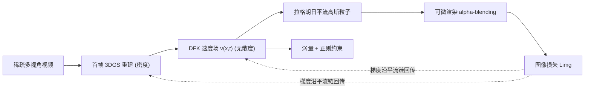

## 一句话总结

从稀疏多视角视频中重建 3D 流体速度场时，用"无散度核（DFK）"参数化速度、以拉格朗日方式平流 3D 高斯粒子，从而在构造上同时保证不可压缩性与长程输运一致性，并配合滑动窗口优化实现可行的训练。

## 研究背景

- 领域现状：从稀疏 2D 视频反推 3D 流体（如烟雾）的速度场，是计算机视觉与图形学的重要问题，可用于特效、气动分析、高保真预报等。近年的思路从欧拉视角的神经场（PINF、HyFluid）发展到轨迹表示（PICT）、显式平流初始体积（GlobalTransport），再到基于 3DGS 的拉格朗日重建（FluidNexus）。
- 核心痛点：这是一个高度病态的反问题，成功重建需要同时满足两个条件——"输运一致性"（速度场平流密度要复现观测到的时序演化）和"物理有效性"（满足不可压缩、动量守恒等流体定律）。现有方法大多用软惩罚（PINN 式损失）来近似这些约束，导致收敛困难、精度受损。尤其是没有严格施加无散度条件时，重建会用虚假的源/汇来解释密度变化，而非真实的物质输运，破坏速度恢复与物理可解释性。欧拉方法缺乏长程时序对应，短程平流监督易陷入局部极小；FluidNexus 虽是拉格朗日，但用贪心的逐帧速度估计，丢弃了来自未来帧的长程梯度。
- 本文 idea：提出一个"构造上"就满足两约束的统一重建框架。用无散度核（DFK）表示速度场，天然保证不可压缩，无需软惩罚；用被该速度场从首帧平流而来的 3D 高斯粒子表示动态烟雾，天然获得长程输运一致性。为让这个强耦合系统可高效优化，提出滑动窗口方案，把梯度传播限制在有效时间窗内。

## 方法

整体框架：给定稀疏多视角烟雾视频，目标是联合恢复演化的烟雾与驱动它的速度场。方法用混合表示——3DGS 表示密度、DFK 表示速度；高斯粒子不是自由变量，而是被 DFK 速度场平流的"被动示踪子"，其任意时刻的位置由首帧状态经拉格朗日平流算子决定。图像重建损失的梯度沿平流链回传，联合优化首帧高斯属性与时变速度场。

关键设计：

1. 无散度核（DFK）速度参数化。把速度场写成一组矩阵值核 $$\boldsymbol{\psi}_i$$ 的线性组合 $$v(x)=\sum_i \boldsymbol{\psi}_i(x)\,\boldsymbol{\omega}_i$$，其中核由标量径向基函数经二阶微分算子 $$\boldsymbol{\psi}_i(x)=(-I\nabla\cdot\nabla+\nabla\nabla^\top)\phi_i(x)$$ 导出（径向基取 Wendland $$C^4$$ 连续分片多项式）。由构造可证：无论权重 $$\boldsymbol{\omega}_i$$ 取何值，所得速度场的散度恒为零。这就把"不可压缩"从一个需要优化的软目标变成了硬性保证，避免了非物理的密度幻觉，同时具备紧支撑、正定、二阶可微等利于稀疏粒子平流的性质。

2. 平流高斯的烟雾建模。时刻 $$t$$ 的烟雾表示为一组 3D 高斯 $$G_t$$。每个高斯的位置不作为自由变量优化，而由平流方程 $$\tfrac{d\boldsymbol{\mu}_i}{dt}=v(\boldsymbol{\mu}_i,t)$$、$$\boldsymbol{\mu}_i^t=A_{0\to t}(\boldsymbol{\mu}_i^0,v)$$ 决定。这让烟雾运动被平流过程显式约束，在重建烟雾与底层流动之间建立可微、物理接地的联系。

3. 滑动窗口优化。完整依赖链的优化虽提供强全局约束，但计算不可行，于是分两阶段。预热阶段：先用标准 3DGS 重建首帧作初值，然后在窗口 $$[0,w]$$ 内以首帧为锚，锚帧的内在属性（如不透明度）可训练，后续帧的高斯位置由平流算子导出并继承锚帧属性；采用渐进策略从短时域逐步扩展到 $$w$$。滑动阶段：窗口从 $$[s-1,s-1+w]$$ 平移到 $$[s,s+w]$$，前一窗口已充分优化的帧被固定以截断计算图；新锚帧 $$s$$ 的位置不直接优化，而是约束为用 $$v_{s-1}$$ 从 $$s-1$$ 平流的结果，使位置梯度进一步回流去优化 $$v_{s-1}$$，保证跨窗口轨迹物理连续。聚合窗口梯度时用时间折扣因子 $$\gamma\in(0,1)$$：$$L_{\text{total}}=\sum_j \gamma^j L_{\text{img}}(t+j)$$，默认 $$\gamma=0.9$$，抑制长程依赖带来的噪声。此外在指定入流区注入新高斯以建模连续烟雾发射。

4. 优化目标。图像重建损失 $$L_{\text{img}}=(1-\lambda_{\text{ssim}})L_1+\lambda_{\text{ssim}}L_{\text{D-SSIM}}$$（$$\lambda_{\text{ssim}}=0.2$$），并加各向异性正则 $$L_{\text{aniso}}$$ 防止过细粒子。物理约束方面：空区域速度稀疏正则 $$L_{\text{reg}}=\sum_x \lVert v(x)\rVert_1$$ 鼓励无烟处速度为零；由于场解析不可压缩，直接用涡量输运方程残差 $$L_{\text{vor}}=\lVert \tfrac{\partial \boldsymbol{\omega}}{\partial t}+(v\cdot\nabla)\boldsymbol{\omega}-(\boldsymbol{\omega}\cdot\nabla)v\rVert_1$$（$$\boldsymbol{\omega}=\nabla\times v$$）施加动量守恒。总损失为各项加权和。

## 实验结果

在 ScalarSyn（合成，带真值速度）与 ScalarReal（真实采集）上评测输运一致性（重模拟 PSNR/SSIM/LPIPS）与物理有效性（散度 Div、速度误差 MSE-v、方向一致性 Cos-v）。方法在两个数据集上全面领先基线，尤其散度比基线低若干数量级。

| 方法 | PSNR↑ | SSIM↑ | LPIPS↓ | Div↓ | MSE-v↓ | Cos-v↑ |
|------|-------|-------|--------|------|--------|--------|
| PINF | 30.06 | 0.9225 | 0.0828 | 0.00402 | 0.1465 | 0.0389 |
| PICT | 31.00 | 0.8998 | 0.1000 | 0.00238 | 0.1166 | 0.0647 |
| HyFluid | 32.41 | 0.9340 | 0.0854 | 0.3268 | 0.4033 | 0.1367 |
| FluidNexus | 31.93 | 0.9501 | 0.1087 | 0.01774 | 0.1430 | 0.0536 |
| 本文 | 46.50 | 0.9930 | 0.0258 | 0.000099 | 0.1116 | 0.2731 |

上表为 ScalarSyn 上的对比。其余实验用文字补充：在 ScalarReal 上本文同样取得最高 PSNR（40.00）与最低散度（0.000008）。新引入的 Suzanne（长序列 + 复杂障碍）、Sphere（边界交互）、Biplume（高湍流）场景中，本文在训练视图与新测试视图重模拟上普遍优于 PINF/PICT/FluidNexus，其中 FluidNexus 因大量硬编码先验在 Suzanne 上速度场几乎坍缩为零。消融显示：把折扣因子从 $$\gamma=0.9$$ 降到 $$\gamma=0.1$$（近似短视优化）会使 PSNR/SSIM/LPIPS 全面退化，验证了长程梯度传播的必要性；去掉 $$L_{\text{reg}}$$ 与 $$L_{\text{vor}}$$ 会抬高速度 MSE，说明物理正则对速度精度有正面作用。

## 亮点与局限

- 亮点：
  - 把两个核心约束都做成"构造保证"而非软惩罚——DFK 硬性保证无散度，拉格朗日平流保证长程输运一致，避免了 PINN 式软约束的收敛与精度问题。
  - 滑动窗口 + 时间折扣因子在"利用未来帧长程梯度"和"训练可行性"之间取得平衡，可扩展到任意长度序列。
  - 速度场散度比基线低数量级，重模拟指标（尤其合成集 PSNR 46.50）大幅领先，兼顾视觉保真与物理准确。

- 局限：
  - 高斯表示对训练视图有过拟合倾向，新测试视图上 LPIPS 略高，高频纹理细节在未见视角会受损。
  - 需要指定入流区来建模连续烟雾发射，属于场景相关的先验设置。
  - 涡量输运仍是软约束（只有无散度是硬保证），完整 Navier-Stokes 动量守恒依赖该软项。

## 延伸思考

该工作把"表示层的物理硬约束"（无散度核）与"显式拉格朗日轨迹"结合，思路可迁移到其他需要物理一致性的动态重建（如烟、火、可压缩流的变体或带障碍的复杂边界）。相较于 FluidNexus 的贪心逐帧估计，滑动窗口的长程梯度是其性能提升的关键，值得追问的是窗口大小 $$w$$、折扣因子 $$\gamma$$ 与序列湍流强度之间的关系是否存在自适应策略。另一个方向是缓解新视角下的过拟合——可结合更强的多视角一致性正则或 2D 先验来改善不可见视角的高频细节。
