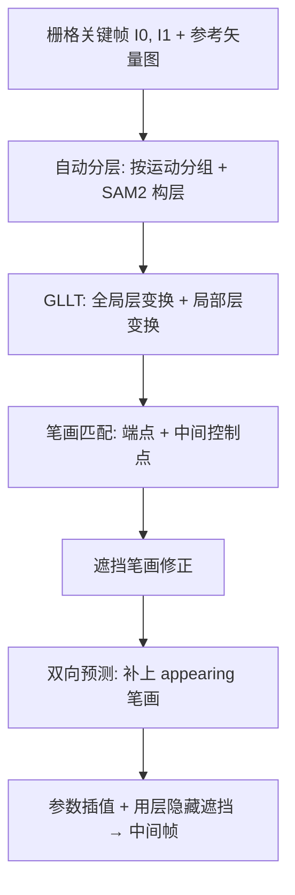

## 一句话总结

面向 2D 动画中间帧生成，提出一个"遮挡感知"的矢量笔画对应与自动补间框架：通过自动分层显式预测被遮挡的笔画、并在补间过程中用层来隐藏遮挡，免去动画师逐帧手动描线和逐帧隐藏遮挡笔画的繁琐劳动。

## 研究背景

- 领域现状：矢量补间（inbetweening）的核心是在两张关键帧之间为每根笔画建立一一对应，然后对控制点做参数插值得到中间帧。近期的 JoSTC 已能自动完成笔画描摹与对应匹配，让这条路线走向自动化。
- 核心痛点：一旦画面出现**遮挡**，问题就变难。被遮挡的笔画在关键帧里根本看不见，动画师必须在关键帧中把它们显式画出来，插值之后再用交互工具逐帧手动隐藏。这个过程极其耗时，中间帧越多越痛苦。而 JoSTC 依赖每根笔画在两帧里都有"可见对应物"来做变换对齐，遇到遮挡就失效；基于光流/图像配准的栅格方法在 2.5D 遮挡下会破线、拓扑扭曲；视频扩散模型虽画质好但会幻觉、且插值不平滑。
- 本文 idea：用**自动分层**当作贯穿始终的抓手——分层既能在对应阶段为看不见的遮挡笔画"指路"（用整层的可见对应物做引导来推断被遮挡笔画的位置），又能在补间阶段用层的堆叠关系自动隐藏遮挡笔画。

## 方法

整体框架：输入两张连续的栅格关键帧 $$I_0$$、$$I_1$$ 以及参考帧的矢量图 $$\vec{I}_0$$，输出两张带一一对应关系（含可见与遮挡笔画）的分层矢量图，再对对应笔画做参数插值生成中间帧。笔画层级上，一根 stroke 是一条三次贝塞尔曲线，若干相连的 stroke 组成 stroke chain。核心的矢量笔画对应模型 $$\Phi$$ 内部串起三步：自动分层 → 全局-局部层变换（GLLT）→ 笔画匹配。

关键设计：

1. **自动分层（Automatic Layering）**：先用光流估计每条 stroke chain 的运动（对像素位移取平均），再用 Mean Shift 聚类（无需预设组数）按运动把笔画分组——运动相似的组可以帮助推断被遮挡笔画的可能位置。随后借助 SAM 2 把两张关键帧当成两帧视频做跟踪来生成层掩码：一种以每组的线条掩码为提示（擅长抓孤立笔画但抓不到内部区域），另一种以包围盒为提示、在深度图上跟踪（擅长内部区域但对孤立笔画差），两者按像素相加取长补短。堆叠顺序则用一个朴素但稳健的启发式——按层包围盒面积排序（深度估计模型对线稿不够鲁棒），并允许手动修正。

2. **全局-局部层变换 GLLT**：这是预测遮挡笔画的关键。思路是"整层一起变换"——用整层在两帧间的**可见对应物**作引导，即便某些笔画被遮挡也能被层的整体运动"带"到大致位置。全局层变换先用光流做平移，再用一个轻量 VGG16 式网络预测一组仿射参数 $$\theta_g=(t^g_x,t^g_y,s^g_x,s^g_y,\alpha_g,\beta^g_x,\beta^g_y)$$（平移/缩放/旋转/剪切），组合成 $$A^g_\theta$$ 变换目标窗口，用 Spatial Transformer 的可微采样裁出对齐后的目标块。但整层一个全局变换难以覆盖层内非均匀形变，于是再叠一层**局部层变换**：把窗口从"层视角"切换到更小的"笔画视角"，用同结构网络预测 $$\theta_l$$ 做进一步对齐。由粗到细的两级变换还能应对较大的非刚性运动和拓扑变化（但要求图结构大致不变以保证一一对应，且因为在 2D 空间执行，主要适用于 2D 平面运动）。训练时无真值变换参数，改用在线稿数据上微调的 VGG16 感知损失（取 relu5_1 特征）度量对齐后两块的结构相似度。

3. **笔画匹配 + 遮挡笔画修正**：在 GLLT 对齐好的局部块里，先做端点匹配（网络输出目标块内相对坐标 $$P^e=(p^e_x,p^e_y)$$，用 L1 距离监督 $$L_{ep}=\lVert P^e-\hat{P}^e\rVert_1$$），再基于预测端点匹配两个中间控制点。由于层变换可逆，块内坐标可映射回原图。对于因拓扑混淆而预测失败的遮挡笔画（如被手指挡住的眼球被误沿手指的线描出、严重扭曲），引入**遮挡笔画修正**：把预测变换施加到目标层掩码上，判断该笔画是否大部分落在层区域外；若在外则判定为被遮挡，直接复用参考笔画的端点与控制点参数以保持形状。

4. **双向预测 + 补间隐藏遮挡**：遮挡还会带来目标帧里"新出现"的笔画（appearing strokes），它们没有矢量输入可匹配。作者观察到这些笔画反过来从目标帧到参考帧就变成了"消失"笔画，于是把同一个对应模型对称地跑一遍：先正向 $$\Phi(I_0,\vec{I}_0,I_1)\to\vec{I}_1$$，手动补上缺失笔画得到 $$\vec{I}'_1$$，再反向 $$\Phi(I_1,\vec{I}'_1,I_0)\to\vec{I}'_0$$，合并后在两张关键帧上都建立了含遮挡笔画的一一对应。最后对对应点做线性插值得到"所有笔画都可见"的原始中间帧，再用 SAM 2 为每个中间帧预测层掩码、按堆叠顺序聚合成遮挡掩码 $$M^k_t=\bigcup_{i=k+1}^{K}\hat{M}^i_t$$ 来隐藏被遮挡笔画，得到最终中间帧。

数据方面：现有 2D 动画数据集（如 JoSTC 的合成集）不含遮挡笔画的矢量参数与对应，作者据此设计了一套自动算法，从 Creative Sketch 数据集出发，经"整图/部件/笔画链"多级随机形变生成配对目标帧，再按语义部件预定义的深度顺序做自遮挡生成。最终合成 17k+ 对关键帧（含 6.7 万+ 笔画，约 10% 为遮挡笔画），首次为遮挡笔画提供矢量参数与对应真值。

## 实验结果

在自建合成测试集上，对可见笔画与遮挡笔画分别评估。可见笔画用端点误差 EPE、IoU、准确率 ACC；遮挡笔画因端点可能不达真值位置而弃用 EPE，只在可见部分算 IoU 并相应重定义 ACC。LayerInbetween 在所有指标上大幅领先各基线，尤其在遮挡笔画上优势明显：

| 方法 | 可见 EPE↓ | 可见 IoU↑ | 可见 ACC↑ | 遮挡 IoU↑ | 遮挡 ACC↑ |
|------|-----------|-----------|-----------|-----------|-----------|
| Optical Flow | 8.57 | 53.80 | 58.88 | 32.00 | 31.86 |
| Registration | 16.56 | 54.17 | 54.42 | 32.38 | 34.24 |
| JoSTC | 12.71 | 59.72 | 59.43 | 30.43 | 31.91 |
| LayerInbetween | 7.48 | 70.03 | 71.90 | 42.84 | 46.98 |

其余结论用文字补充：

- **补间对比**：相较 JoSTC、AnimeInbet、TPS-Inbetween、骨架驱动方法，以及视频生成方法（RIFE、ToonCrafter、AniSora、LayerAnimate），本方法线条清晰、插值平滑、遮挡解决更好；视频扩散模型常出现幻觉，且中间帧 $$I_{0.5}$$ 往往过于贴近某一端关键帧而非平滑过渡。
- **用户研究**：25 份有效问卷、5 分制，在"视觉质量"与"过渡平滑度"两项上本方法均分最高（4.26 / 4.13），显著优于各基线。
- **运行时**：单张 RTX 6000 生成 17 帧，多数情况快于 ToonCrafter/AniSora（约 1 分钟），运行时随笔画数与层数变化而与输入分辨率无关。
- **泛化与消融**：虽只在干净单角色线稿上训练，却能泛化到粗糙草图、多角色、复杂场景、抽象儿童画与多关键帧序列。GLLT 消融显示"全局+局部"组合在全部端点（EPE$$_p$$=7.01）与遮挡端点上均最优，只用局部变换反而更差。

## 亮点与局限

- 亮点：
  - 把"自动分层"同时用作遮挡笔画的位置引导和补间阶段的遮挡隐藏，思路统一而巧妙；显式预测遮挡笔画而非仅判可见性。
  - GLLT 的粗到细层级变换用"整层可见对应物"绕开了"遮挡笔画无可见对应"的死结，还顺带增强了对大运动/拓扑变化的鲁棒性。
  - 双向预测优雅地把 appearing 与 disappearing 笔画统一处理；矢量表示带来远超栅格视频生成的可编辑性（拖控制点即可改中间帧）。
  - 贡献了首个含遮挡笔画矢量参数与对应的合成数据集。
- 局限：
  - 缺乏语义理解，走路循环中左右腿交替这类"视觉相似但语义不同"的情况会匹配错。
  - 依赖 2D 光流与 2D 空间变换，难处理 3D 运动（如转头导致的眼睛遮挡）。
  - 面对两层以上的多重遮挡性能下降；极度粗糙、含大片深色区域的草图会让光流失败、分组出错。
  - 堆叠顺序用面积启发式，且不支持补间过程中堆叠顺序发生改变的场景。

## 延伸思考

- 本文与 JoSTC 是同一脉络（同一批作者），可视为把"联合描摹与对应"从无遮挡推进到遮挡场景的一步；SAM 2、深度估计、光流等基础模型被当作现成模块拼接使用，是近年图形学"传统几何 pipeline + 视觉基础模型"融合的典型样式。
- 作者多次点名视频扩散模型（ToonCrafter/AniSora/LayerAnimate）的幻觉与不可控，同时把"未来把矢量框架与栅格 VDM 结合"作为解决 3D 运动、多层遮挡的方向——一个值得追问的点是：矢量的精确可控与生成模型的强先验如何在保证一一对应的前提下融合，避免生成端重新引入拓扑破坏。
- 对遮挡笔画位置的推断本质上是"用层的可见运动去外推不可见部分"，这套"用可观测代理量引导不可观测量"的思路，或许能迁移到其他有遮挡/缺失的矢量或结构化预测任务。
