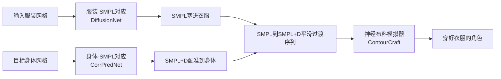

## 一句话总结

提出 LUIVITON——一套全自动 3D 虚拟试衣系统，用 SMPL 作为中介代理，把"任意衣服穿到任意姿态humanoid角色上"这一难题拆解成两个对应关系问题，再通过配准与模拟驱动的贴合，生成物理合理的多层复杂服装穿着效果。

## 研究背景

- 领域现状：3D 服装资产越来越多，但要把一件衣服复用到一个新角色身上仍然很贵。手工工具（Marvelous Designer、Maya）强大却费人力；基于学习的 draping 方法大多以 SMPL 为中心，难以处理风格化角色、大姿态变化和多层/非流形资产；服装重定向方法则通常假设有一个已穿衣的源 avatar、兼容的骨架或预先建立的稠密对应。
- 核心痛点：真实复用场景里，往往只有一件任意拓扑的服装网格和一个任意姿态的 humanoid 身体，没有可靠配对或对应关系。问题的本质是"大姿态变化 + 部分覆盖"下的对应关系瓶颈：衣服只覆盖身体的一部分，拓扑千差万别（分层、开口、非流形），而目标角色又有极端比例和姿态，直接做"服装到目标身体"的对齐是病态且易错的。
- 本文 idea：不直接对齐服装和目标身体，而是引入 SMPL 参数化人体作为中间桥梁，把穿衣分解成两个各有难点的对应任务——服装到 SMPL（部分到完整对齐）与身体到 SMPL（大姿态/形状变化与风格化），分别用最适合各自几何与外观特性的方法求解，再配合配准和模拟驱动的贴合完成穿衣。

## 方法

整体框架分三个阶段：先在服装/身体与 SMPL 之间预测稠密对应；再用这些对应把 SMPL 塞进衣服、把 SMPL+D（带位移）配准到目标身体；最后通过 SMPL→SMPL+D 的平滑形状与姿态过渡驱动布料模拟器，让衣服逐步贴合到目标身体上。

关键设计：

1. **服装-SMPL 对应（几何驱动）**：这是一个"部分到完整"的匹配问题——衣服只覆盖身体的一部分。作者用改造过的 DiffusionNet 学习一个映射 $$g: \mathbb{R}^3 \to \mathbb{R}^2$$，把每个服装顶点映射到 SMPL 的 UV 坐标空间，从而在 UV 空间建立对应。训练用自建数据集（300 件带 SMPL UV 标注的服装），损失是预测 UV 与真值 UV 的距离 $$L_{dif} = \sum_{i=1}^{N} \lVert x_i - g(X_i) \rVert$$。选 DiffusionNet 是因为它在表面学习和部分到完整对应上很有效，且对非流形网格与拓扑变化鲁棒。

2. **身体-SMPL 对应（语义驱动 + 去噪）**：目标身体有极端比例和姿态，几何特征失效，于是转用语义特征。CorrPredNet 把多视角深度图送进同步多视角扩散模型 SyncMVD（用固定文本提示生成一致的多视角纹理）和 DINOv2，抽取稠密逐像素语义特征；扩散特征跨去噪步做加权融合（偏向噪声较大的步以捕捉全局语义），再和 DINOv2 特征聚合。2D 特征按已知相机参数反投影到 3D，用余弦相似度建立 SMPL 与目标身体的对应。为解决四肢常见的左右歧义，引入一个基于能量的迭代噪声过滤器：对每个顶点在其 $$K$$ 环邻域内用 SVD 求最优旋转，用局部形变能量 $$E_i = \sum_{j \in \mathcal{N}_i} \lVert q_j - R_i p_j \rVert^2$$ 衡量错位，动态阈值筛掉高能量（不可靠）对应，邻域随迭代扩大，最多四次迭代。

3. **身体/服装配准**：用上述对应把两个 SMPL 代理拼起来。服装侧优化 SMPL 参数 $$(\theta_c, \beta_c)$$ 把 SMPL 塞进衣服里，损失含服装-SMPL 对齐项、形状/姿态正则、拉普拉斯平滑和穿透惩罚。身体侧优化 SMPL+D 参数 $$(\theta_b, \beta_b, d, s)$$，其中 $$d$$ 是逐顶点位移、$$s \in \mathbb{R}^3$$ 是沿 $$x,y,z$$ 轴的各向异性缩放——缩放对适配极端比例角色至关重要，光靠微小位移不够。

4. **模拟驱动的贴合**：SMPL 是 SMPL+D 的特例，于是构造一段 $$T$$ 帧的过渡序列，用调度标量 $$\alpha_t \in [0,1]$$ 平滑插值形状、位移与缩放，姿态用四元数 slerp 插值。把这段身体运动序列和服装喂给神经布料模拟器 ContourCraft，它预测逐顶点加速度并显式建模布-身、布-布碰撞，适合多层多件服装，且只要有网格连接性就不要求流形表面。取最后一帧作为穿好的结果。渐进过渡避免了"突然换身体"导致的严重穿插与求解器不稳定。此外用户可对服装 rest 配置做各向异性缩放来调整整体尺码，复用已有对应与配准，每次调整约 15 秒。

## 实验结果

在 Cloth3D 测试集上与 DrapeNet、ISP 对比整体 draping 性能（100 组上衣-裤子 × 4 种姿态；为公平比较，这里去掉了身体侧对应与配准，直接用 SMPL 参数输入）。指标为 Chamfer Distance、Point-to-Mesh、Interpenetration Ratio，本文在几乎所有项上大幅领先：

| 方法 | 上衣 CD↓ | 上衣 IR(%)↓ | 裤子 CD↓ | 裤子 IR(%)↓ |
|------|---------|------------|---------|------------|
| DrapeNet | 0.0101 | 1.58 | 0.0013 | 4.12 |
| ISP | 0.0034 | 13.02 | 0.0081 | 22.20 |
| 本文 | 0.0008 | 0.56 | 0.0006 | 0.20 |

其他实验用文字概述：服装-SMPL 对应在 GarmentCode 100 对样本上，本文相比训练无关的 CorrPredNet 基线把 MGE 从 0.229 降到 0.0499，配准后零穿透率从 5% 提升到 59%（真值对应为 65%），已逼近真值质量。身体-SMPL 对应在自建的 8 个风格化角色基准上，本文 MEE/MGE 优于 GeomFmaps、ULRSSM、DiffusionNet、Diff3f 等，是最好的 Diff3f 之外再显著提升。身体-SMPL+D 配准的 Chamfer Distance 也最低（1.19×10⁻⁴，NICP 为 13.05×10⁻⁴），噪声过滤器进一步提升精度。整套系统在 RTX 4090 上约 4.5 分钟穿好一个角色。

## 亮点与局限

- 亮点：
  - 用 SMPL 中介 + "分而治之"两类对应，优雅绕开了服装与任意姿态身体直接对齐的病态问题，做到无需骨架、无需已穿衣源 avatar、无需预设稠密对应的全自动穿衣。
  - 针对两个子问题分别用几何驱动（DiffusionNet UV 回归）与语义驱动（扩散 + DINOv2 特征 + 能量去噪）的不同策略，设计动机清晰。
  - 泛化性强：能处理非流形、多层复杂服装拓扑，并适配人、机器人、卡通、生物等各类 humanoid，指标上相比多个 SOTA 大幅领先。
- 局限：
  - 依赖 SMPL 代理，只适用于足够"类人"的形状；高度非人形（石灯笼、飞机）会导致 SMPL 配准混乱而失败。
  - 布料模拟继承了底层神经模拟器 ContourCraft 的局限，难处理硬材质（如盔甲）和不连通部件（纽扣、拉链）；长而垂坠的服装在固定过渡调度下可能未达静态平衡，需额外静态帧。
  - 目前只支持 A/T 静止姿态的服装输入（对应模块只在此类数据上训练）；各向异性缩放不适合裁剪缝制工作流；不兼容需要无交叉初始化的严格物理求解器（如 IPC）。

## 延伸思考

论文把"服装到角色"的困难对应显式分解为两条更可控的路径，本质上是用参数化人体模型作为共享隐空间来降低问题维度，这个思路对其他"跨拓扑资产迁移"任务（如纹理、绑定、动画重定向）也有借鉴意义。作者也指出一个自举方向：用当前 SMPL 中介框架大规模生成配对数据，进而训练"任意服装到任意角色"的直接映射，摆脱对 SMPL 代理的依赖。此外，把缝纫图案作为 rest-shape 约束引入模拟、以及可选的顶点 pin 约束（保持艺术家意图，如兜帽竖起），都是提升物理真实性与可控性的自然扩展。整体上可视为面向"可扩展的生成式服装数字化与编辑"的一步。
