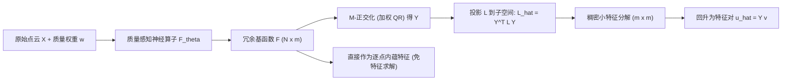

## 一句话总结

本文提出 NEO（Neural Eigenspace Operator），一个前馈神经框架，直接从原始点云一次性预测拉普拉斯-贝尔特拉米算子（LBO）的低频不变子空间，再经轻量的 Rayleigh–Ritz 精化恢复特征对，从而以近线性时间大幅加速传统迭代特征求解，并对采样密度、分辨率和离散化方式具备强零样本泛化能力。

## 研究背景

- 领域现状：LBO 的低频特征函数是 3D 形状的内蕴谱表示，类似欧氏域上的傅里叶基，广泛用于谱网格处理、物理仿真、函数映射（functional maps）与几何深度学习。实际计算归结为求解一个稀疏的广义特征值问题（GEVP）。
- 核心痛点：提取前 $$k$$ 个低频模态是主要计算瓶颈。基于 Krylov 子空间的经典求解器（如 ARPACK 的隐式重启 Lanczos）是逐实例迭代的——分辨率变化、重采样或形变都要重算，规模一大成本高到只能离线预处理，无法跨形状集合摊销。
- 直接回归特征向量为什么不行：特征函数本身是病态的。每个模态只定义到一个全局符号（sign flip）；重复或近重复特征值对应的特征空间允许任意正交基旋转与模态混合。让网络直接回归离散特征向量，等于逼它记忆训练数据里任意的基选择，训练不稳、泛化差。
- 本文 idea：单个特征函数虽有歧义，但它们张成的低频不变子空间是唯一且良定义的。于是把学习目标从"回归单个特征函数"改为"预测一组张成目标子空间的函数"，从根源上绕开歧义。

## 方法

### 整体框架

NEO 输入原始点云 $$X=\{x_i\}_{i=1}^N$$ 及每点的质量权重 $$w$$（对角质量矩阵 $$M=\mathrm{diag}(w)$$），用一个质量感知神经算子 $$\mathcal{F}_\theta$$ 一次前馈输出 $$m$$ 个原始基函数 $$F\in\mathbb{R}^{N\times m}$$，其张成用来覆盖目标子空间 $$\mathcal{S}_k$$。这里刻意取冗余维度 $$m>k$$ 作为松弛，让预测子空间在有重复/邻近特征值时也能稳健覆盖，而不必在网络内部去解决歧义。需要显式特征对时，再在该子空间内做 Rayleigh–Ritz 精化。

### 关键设计

- **离散谱问题与目标**：给定稀疏对称半正定拉普拉斯矩阵 $$L$$ 和对角质量矩阵 $$M$$，离散 GEVP 为 $$Lu_i=\lambda_i M u_i$$，且 $$u_i^\top M u_j=\delta_{ij}$$。目标是用一次前馈替代求解前 $$k$$ 个模态。这里 $$w_i>0$$ 近似 $$x_i$$ 处的局部面积测度，诱导离散内积 $$\langle u,v\rangle_M=u^\top M v$$。

- **Rayleigh–Ritz 精化**：先把原始场 $$F$$ 转成 $$M$$-正交基 $$Y$$ 而不改变张成——由于 $$M$$ 对角，令 $$Z=\sqrt{M}F$$ 做欧氏 QR 分解 $$Z=QR$$，取 $$Y=M^{-1/2}Q$$，则 $$Y^\top M Y=I_m$$。再把 LBO 投影到 $$m$$ 维子空间得稠密小矩阵 $$\hat{L}=Y^\top L Y$$，解稠密特征问题 $$\hat{L}v_i=\hat{\lambda}_i v_i$$，回升 $$\hat{u}_i=Yv_i$$，取最小的 $$k$$ 个 Ritz 对。整体把大规模稀疏 GEVP 换成：一次前馈 + $$M$$-正交化 $$O(Nm^2)$$ + 稀疏稠密投影 $$O(\mathrm{nnz}(L)\,m^2)$$ + 稠密特征分解 $$O(m^3)$$，在 $$L$$ 稀疏度正比于 $$N$$ 时总成本随 $$N$$ 线性增长。

- **旋转不变的子空间损失**：核心创新之一。对某个真值特征向量 $$u_j$$，其未被预测子空间捕获的能量为残差 $$r_j=\lVert u_j-P_Y u_j\rVert_M^2=1-\lVert Y^\top M u_j\rVert_2^2$$，其中投影算子 $$P_Y=YY^\top M$$。聚合所有 $$k$$ 个模态得 span 损失

$$
\mathcal{L}_{\mathrm{span}}=1-\frac{1}{k}\lVert Y^\top M U_k\rVert_F^2 .
$$

该损失对任意正交基变换 $$U_k\mapsto U_k R,\ R\in O(k)$$ 不变，从而直接吸收了符号翻转与（近）简并子空间内旋转的歧义。为防止冗余基坍缩成低秩，加一个弱正交正则 $$\mathcal{L}_{\mathrm{ortho}}=\lVert F^\top M F-I_m\rVert_F^2$$，总损失 $$\mathcal{L}_{\mathrm{total}}=\mathcal{L}_{\mathrm{span}}+\alpha\mathcal{L}_{\mathrm{ortho}}$$，全程固定 $$\alpha=10^{-3}$$。

- **质量感知神经算子（另一核心创新）**：骨干采用带隐空间瓶颈的 Transformer（改自低秩空间注意力 LRSA），点嵌入经交叉注意力软聚合到少量隐 token、处理后再广播回所有点，实现近线性的全局交互。标准交叉注意力隐式假设采样均匀，会高估稠密区域。作者把点质量以对数偏置注入下投影阶段的注意力 logits：

$$
\alpha'_{ij}=\mathrm{softmax}\!\left(\frac{q_i k_j^\top}{\sqrt{d_h}}+\log w_j\right)=\frac{\kappa(q_i,k_j)\,w_j}{\sum_{n=1}^N \kappa(q_i,k_n)\,w_n}.
$$

因为 $$\exp(s+\log w_j)=\exp(s)\,w_j$$，质量项作为乘性求积权重出现在核函数外，使聚合等价于流形上按面积测度加权的连续积分逼近。该修正对 $$w$$ 全局缩放不变，且当权重恒定时精确退化为标准注意力；只作用于下投影（点到隐 token 的聚合阶段），上投影不注入质量。

## 实验结果

在 ShapeNetCore（约 5.1 万模型，9:1 划分）上仅用低分辨率点云（$$N_{\mathrm{train}}=2048$$）训练，目标 $$k=96$$、冗余 $$m=192$$，用 robust_laplacian 构造算子、ARPACK 生成真值。主结论是：NEO 保持与迭代求解器相当的精度，同时在高分辨率上取得数量级加速。下面以不同分辨率下恢复前 $$k=96$$ 个低频特征对的墙钟时间为主表：

| 分辨率 $$N$$ | SLEPc | ARPACK | Spectra | NEO（本文） |
|---|---|---|---|---|
| 32k | 2.32s | 2.01s | 2.51s | 31ms |
| 512k | 63.7s | 45.8s | 60.9s | 0.52s |

其余关键数字：

- **精度**：ShapeNet 测试集 span 损失约 $$3.7\times10^{-3}$$，特征向量 MSE 约 $$3.0\times10^{-2}$$，特征值相对误差约 $$3.5\times10^{-2}$$；换半精度（FP16）或跨数据集到 Thingi10k 几乎不掉点。
- **冗余作用**：$$m=k$$（无冗余）时 span 损失高达 $$5.69\times10^{-2}$$；提到 $$m=192$$ 降到 $$3.59\times10^{-3}$$，仅 8.7ms，是精度与延迟的折中默认值。
- **分辨率零样本**：仅在 2k 点上训练，测到 512k 点仍 span 损失 $$7.41\times10^{-3}$$；在 512k 上相对 ARPACK 加速约 88.2 倍（FP16），拟合出 NEO 近线性 $$t\propto N$$，而 ARPACK 为超线性 $$t\propto N^{1.16}$$。
- **采样鲁棒性**：强非均匀采样下，去掉质量注入的变体 span 损失崩到 $$4.04\times10^{-1}$$，质量感知版仅 $$2.63\times10^{-3}$$。
- **离散化迁移**：零样本迁到网格 cotangent 与 $$k$$-NN 拉普拉斯，span 损失仍在低 $$10^{-3}$$ 量级。
- **下游应用**：函数映射在 FAUST 上平均测地误差从 0.438 升到 0.543 仍可用；用预测子空间做两级预条件加速热法测地距离的 Poisson 步，迭代数约降 3 倍；把原始基 $$F$$ 直接当冻结特征，SHREC-11 上简单 PointNet 达到 100%（10-shot），超过更重的 Point Transformer。

## 亮点与局限

- 亮点：
  - 把病态的特征向量回归，重构为"不变子空间预测 + Rayleigh–Ritz 精化"，用旋转不变的 span 损失从根本上消解符号翻转与简并旋转歧义，思路干净且有理论支撑（$$\mathcal{L}_{\mathrm{span}}=0$$ 即 $$\mathrm{span}(U_k)\subseteq\mathrm{span}(Y)$$）。
  - 质量感知注意力用一行对数偏置就把离散注意力对齐到连续测度加权积分，使模型对非均匀采样、分辨率、离散化方式都鲁棒，实现"只训 2k、推到百万点"的零样本迁移。
  - 近线性推理，512k 点上比 ARPACK 快约 88 倍；且预测的原始基可免特征求解直接当内蕴点特征，赋能分类/分割等下游学习。
- 局限：
  - 作者明确定位为加速器而非精度替代品——面向推理速度、非机器精度，不用于替代精确数值求解器。
  - 高频模态与未见过的薄结构上性能会退化（论文展示了失败案例，高模态 MSE 明显升高）。
  - 依赖已有的离散拉普拉斯与质量矩阵构造（本文实验中不计入 $$(L,M)$$ 组装时间），谱精度上函数映射的测地误差也确有上升。

## 延伸思考

- 该框架体现了"用前馈网络摊销逐实例数值求解"的范式（类比文中提到的 RenderFormer、VGGT），谱几何只是一个落点；同样思路可推广到其他需要反复求解的几何/物理算子。
- 作者提出的未来方向很务实：与其把网络当求解器替代品，不如用预测子空间去预条件迭代求解器，既借神经先验加速又保留数值精度收敛保证——本文热法测地的两级预条件已是雏形。
- 引入 $$SE(3)$$-等变可能进一步提升对姿态变化的稳健性，尤其在函数映射等对齐敏感的任务上。
- "预测子空间张成而非单个向量"这一去歧义思路，对所有存在符号/旋转不确定性的谱学习问题（如声学模态、图谱嵌入、正定算子谱）都有借鉴价值。
