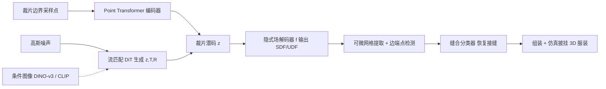

## 一句话总结

把服装裁片（sewing pattern）用连续的隐式距离场表示，在其潜空间上训练流匹配（flow matching）生成模型，并配一个缝合关系预测模块，从而统一地支持裁片生成、单图裁片估计、裁片补全与跨体型重适配。

## 研究背景

- 领域现状：缝纫裁片是服装建模的基础表示——它把 3D 服装描述为一组带缝合规则的 2D 裁片，在时尚设计、制造和物理仿真里都要用。近年学习类方法从"模板+参数"发展到"向量/token 序列"（用 RNN 或 Transformer/大模型自回归地生成裁片边）。
- 核心痛点：裁片在几何和拓扑上差异极大（裁片数、边数、缝合配置都不固定）。模板法拓扑固定、覆盖窄；向量/token 化的自回归生成容易误差累积、产出不合理裁片，而且离散、不可微，难以当作连续先验用于优化和反问题。已有的隐式方法（ISP）虽然连续可微，却依赖一致的缝边标注与对齐，每种拓扑要单独训模型，扩展性差。
- 本文 idea：用两个连续场统一表示任意形状、任意边数的裁片——一个有符号距离场（SDF）描述裁片边界内部区域，一个无符号距离场（UDF）标记边的端点位置；用 VAE 把这些隐式场编码进一个结构化潜空间，再在潜空间里用流匹配学习"裁片组合"的分布，最后用一个缝合预测模块从提取出的边段恢复缝合关系。

## 方法

整体框架分四步：先为单个裁片学一个隐式场潜空间（VAE 编码 + 可微网格提取）；再在这个潜空间上用流匹配模型学整套裁片的联合分布（可选图像条件）；然后把生成的裁片放进 3D 并用分类器恢复缝合关系；最后组装、仿真披挂成 3D 服装。

关键设计：

1. 单裁片的隐式表示。定义隐式函数 $$(d_c, d_p) = f(\boldsymbol{x}, \boldsymbol{z})$$：$$d_c$$ 是到闭合裁片边界的有符号距离（负为内、正为外），零水平集就是裁片轮廓；$$d_p$$ 是到所有边端点集合的无符号距离，$$d_p = \min_{o \in O} \lVert \boldsymbol{x} - o \rVert_2$$，其零根给出边端点，用来把轮廓切成逐段的边。这样一个潜码 $$\boldsymbol{z}$$ 就能连续、可微地表示任意形状、任意边数的裁片。

2. 结构化潜空间的学习。用 VAE 策略：Point Transformer 作编码器，把沿裁片边界采样的点映射为紧凑潜码 $$\boldsymbol{z}$$；MLP 作解码器实现 $$f$$。训练损失为 $$L = L_{sdf} + L_{udf} + \lambda_{KL} L_{KL}$$，其中 SDF/UDF 项各自含一个 Eikonal 梯度约束 $$(\lVert \nabla d \rVert_2 - 1)^2$$。相比 ISP 用无编码器的 auto-decoding，作者用编码器换来更结构化、几何更连贯的潜空间，也提升了图像估计任务的表现。推理时按 SDF 零水平集投影顶点提取网格，用 UDF 在密集网格上找零根、梯度下降后 DBSCAN 聚类得到边端点，再把端点匹配回边界环切成边段；整个网格化过程用等值面梯度公式 $$\frac{\partial \boldsymbol{v}}{\partial \boldsymbol{z}} = -\nabla d_c(\boldsymbol{v}, \boldsymbol{z}) \frac{\partial d_c}{\partial \boldsymbol{z}}(\boldsymbol{v}, \boldsymbol{z})$$ 恢复可微性。

3. 学习裁片组合的流匹配。每个裁片拼成特征向量 $$\tilde{\boldsymbol{z}} = [\boldsymbol{z}, T, R]$$，其中 $$T \in \mathbb{R}^3$$ 是平移、$$R \in SO(3)$$ 是四元数表示的旋转，指定裁片从局部 2D 坐标放到 3D 身体坐标的方式。整套裁片就是一组 token $$\tilde{Z} = \{\tilde{\boldsymbol{z}}_1, \dots, \tilde{\boldsymbol{z}}_{N_p}\}$$，用 Diffusion Transformer（DiT）学把高斯噪声输运到 $$\tilde{Z}$$ 分布的速度场，自注意力捕捉裁片间相关性。关键是去掉位置编码使模型对裁片顺序无关，这样补全任务里用户可任意顺序给部分裁片。训练目标为 $$L = \mathbb{E}_{X_0 \sim \mathcal{N}, t \sim \mathcal{U}} \lVert V_t - U_\theta(X_t, t) \rVert^2$$。

4. 缝合关系恢复。把生成裁片解码成网格并按 $$T, R$$ 摆到 T-pose 的 SMPL 参考体坐标系里，抽出边段后为每条边采点、经 Point Transformer 加自注意力得到边描述子 $$\boldsymbol{f}_e$$。用分类器头 $$H_{sew}$$ 判断某边是否为缝边；对候选边对用特征解耦算互补性 logit $$\boldsymbol{f}_c^{i,j} = G_{prime}(\boldsymbol{f}_e^i)^\top \cdot A \cdot G_{dual}(\boldsymbol{f}_e^j)$$，经 sigmoid 判断是否成缝。由于裁片边可能多对多缝合，而仿真需要一对一，作者按分数长度插入顶点细分边、把多对多传播成一对一。

图像条件估计则把流匹配扩成图像条件生成：用 DINO-v3 取像素级 patch token 与噪声潜 token 拼接过自注意力，用 CLIP 视觉编码器取语义嵌入经交叉注意力注入，目标改为条件形式 $$L = \mathbb{E} \lVert V_t - U_\theta(X_t, t, \boldsymbol{f}_I^p, \boldsymbol{f}_I^s) \rVert^2$$。

## 实验结果

在 Sewfactory 与 GCD 两个数据集上做图像到裁片的估计，与 Sewformer、AIpparel 两个 SOTA 比较。裁片质量上本方法在 IoU、平移误差、裁片数/边数准确率与披挂成功率（DSR）上普遍占优；旋转误差略高，但作者指出旋转只用于摆放、对披挂不敏感，实际无明显影响。

| 数据集 / 方法 | IoU ↑ | Trans L2 ↓ | #Edge ↑ | DSR ↑ |
|---|---|---|---|---|
| Sewfactory / Sewformer | 0.821 | 0.367 | 97.35% | 63.1% |
| Sewfactory / Ours | 0.847 | 0.296 | 98.63% | 81.0% |
| GCD / AIpparel | 0.834 | 1.783 | 86.53% | 62.6% |
| GCD / Ours | 0.892 | 1.274 | 93.26% | 69.0% |

缝合预测上优势更明显：Sewfactory 上 F1 从 Sewformer 的 0.956 提到 0.993，GCD 上 F1 从 AIpparel 的 0.821 提到 0.981。裁片重适配实验里，在潜空间优化的三角形质量为 0.875，明显优于直接优化边控制点的 0.781，说明潜空间约束能避免直接优化控制点常见的畸变。补全实验则显示给不同数量裁片都能补出合理完整裁片并恢复布局与缝合、成功披挂。

## 亮点与局限

- 亮点：
  - 用 SDF+UDF 两场统一表示任意裁片数、边数、缝合配置，突破了 ISP"每种拓扑单独建模"的限制；表示连续可微，可当先验用于优化与反问题。
  - 一套框架同时打通生成、图像估计、补全、跨体型重适配，此前工作没有联合演示过。
  - 顺序无关的 DiT 设计天然适配"用户任意顺序给部分裁片"的补全场景；缝合预测同时用局部几何和全局空间上下文，缝合指标大幅领先。
- 局限：
  - 表示对裁片几何可微，但拓扑仍离散，无法在不同裁片数/拓扑之间做可微优化。
  - 只建模外轮廓，不处理内部缝边、口袋、装饰等内部结构。
  - 作为数据驱动生成模型，分布外采样可能幻化出无效裁片；缝合分类器不完美，误差会向后传播。
  - 单图估计本身歧义大，遮挡与视角会导致裁片数/结构错误；主要在合成数据上训练，真实图像上可能退化。

## 延伸思考

这项工作把"隐式场 + 潜空间生成"这套在 3D 形状建模里成熟的范式迁移到了 2D 裁片域，核心贡献其实是找到了一个既连续可微、又能容纳任意拓扑的裁片表示，从而让流匹配这类连续生成模型能直接上场，并顺带解锁了基于可微仿真的重适配。与自回归 token 化路线（AIpparel 等）相比，它规避了误差累积，但代价是拓扑仍需离散处理——"可微拓扑"正是作者点名的下一步。值得追问的是：潜空间对训练分布外的服装（如非常规结构、内部缝边）泛化到什么程度，以及在真实照片而非合成渲染上的表现，这两点决定它能否真正进入数字时装的实际设计流程。
